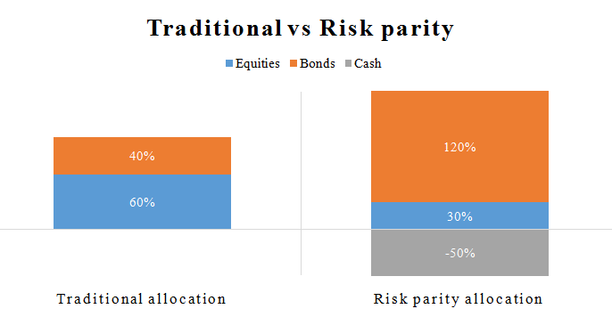

Risk parity strategies have become pivotal in modern portfolio management, particularly through their synergy with algorithmic trading. These strategies emphasize balancing risk across diverse asset classes rather than focusing on capital allocation. The primary aim is to allocate risk equally, thereby promoting diversification and reducing concentration risk. This approach contrasts with traditional models like the capital asset pricing model (CAPM) and modern portfolio theory (MPT), which may emphasize capital allocation based on expected returns or market capitalization.

Advancements in technology and enhanced risk management understanding have made risk parity a sophisticated alternative to conventional methods. Algorithmic trading plays a crucial role in implementing these strategies due to its ability to automate and optimize trades in response to changing market conditions. Algorithms can continuously monitor and adjust portfolios, ensuring that the desired risk balance is maintained even as market dynamics fluctuate.



These methods enable efficient computation and execution of complex portfolio adjustments without human intervention, thus minimizing the risk of emotional biases adversely affecting investment decisions. In this context, Python emerges as a preferred language due to its robust libraries and tools suited for developing algorithms to manage risk parity strategies.

This article will explore the intricacies of risk parity strategies, with a focus on their application in algorithmic trading to enhance portfolio diversification and stability. By understanding the mathematical frameworks and real-world applications, readers will appreciate the benefits and challenges that accompany these strategies. There is a growing need for sophisticated risk management techniques, and risk parity strategies represent a key component of innovation in this field, especially as financial markets become more complex and competitive.

## Table of Contents

## Understanding Risk Parity

Risk parity is a concept in portfolio management aimed at achieving an equal contribution to overall risk from each asset class within a portfolio. This method primarily uses volatility as the key measure of risk, distinguishing it from traditional strategies that often focus on capital allocation based on market-value weights or anticipated returns. These conventional methods frequently result in imbalanced risk distribution, as they do not account for the varying risk profiles inherent in different asset classes.

In contrast, risk parity seeks to homogenize the risk contributions from each asset, thereby fostering superior diversification. By ensuring that each asset class contributes equally to the portfolio's overall risk, this approach has the potential to enhance risk-adjusted returns. This focus on risk contribution rather than capital allocation means that risk parity strategies can mitigate the impact of errors in predicting expected returns, as they do not rely heavily on such forecasts.

A fundamental component of risk parity is risk budgeting, where the portfolio is structured with specific risk targets for each asset class. This involves continually adjusting the allocations to maintain equal risk contributions, a process known as rebalancing. For example, in a risk parity portfolio composed of equities, bonds, and commodities, the high [volatility](/wiki/volatility-trading-strategies) of commodities might be balanced by a greater allocation to the relatively stable bond market.

Mathematically, consider a portfolio consisting of $n$ asset classes, each with risk contribution $RC_i$. Risk parity can be achieved by equalizing these contributions as follows:

$$
RC_i = w_i \times \sigma_i = \frac{1}{n} \sum_{j=1}^{n} w_j \times \sigma_j
$$

where $w_i$ is the weight of asset $i$ in the portfolio, and $\sigma_i$ is its volatility. Through this formulation, any disproportionate influence of a single asset on the portfolio's total risk can be minimized, ensuring a more balanced risk exposure.

Ultimately, risk parity's emphasis on equal risk distribution represents a sophisticated approach to managing portfolios. By focusing on volatility and avoiding reliance on expected returns, risk parity strategies address some of the limitations inherent in conventional portfolio management techniques, facilitating more robust performance in diverse market conditions.

## Components of a Risk Parity Portfolio

A risk parity portfolio is designed to achieve balanced risk exposure across various asset classes. Unlike traditional portfolios that may allocate capital based on market capitalization or expected returns, risk parity portfolios prioritize equalizing the risk contribution of each asset class. This equalization is primarily measured through volatility, providing a more stable portfolio structure.

The composition of a risk parity portfolio typically includes a diverse array of asset classes such as equities, fixed income, commodities, and alternative investments. Equities provide growth potential but tend to [carry](/wiki/carry-trading) higher volatility, while fixed-income assets offer stability and income with generally lower volatility. Commodities can serve as a hedge against inflation and add diversification, while alternative investments like real estate or hedge funds introduce unique risks and potential returns.

To achieve the desired risk distribution across these varied asset classes, strategies may employ leverage and short selling. Leverage allows the portfolio to increase exposure to lower-risk assets, thus ensuring that each asset contributes equally to the overall risk. Short selling can help adjust exposures to over-represented risks, aligning with the portfolio's risk parity objectives. The use of leverage is typically expressed through the formula:

$$

\text{Portfolio Risk} = \sum_{i=1}^{n} \left( \text{Volatility}_i \times \text{Weights}_i \times \text{Leverage}_i \right)
$$

where $\text{Volatility}_i$ is the volatility of asset $i$, $\text{Weights}_i$ is the weight of asset $i$ in the portfolio, and $\text{Leverage}_i$ is the leverage applied to asset $i$.

Real-world implementations, such as those employed by AQR Capital Management, illustrate the practical application of these principles. AQR's approach to risk parity involves managing diverse asset classes to maintain balanced risk exposure. This is often achieved through sophisticated quantitative models and strategies that constantly monitor and adjust the portfolio's allocation.

In risk parity strategies, the continual assessment and dynamic adjustment of asset weights ensure that the portfolio remains aligned with its risk parity objectives despite market fluctuations. By leveraging technology and quantitative methods, these portfolios aim to provide better risk-adjusted returns and increased diversification compared to traditional capital allocation methods.

## Algorithmic Trading and Risk Parity

Algorithmic trading is integral to the implementation of risk parity strategies, offering tools for the precise and continuous management of portfolio risk. Algorithms facilitate the automation of rebalancing processes, ensuring that portfolios are adjusted in a timely manner to reflect market fluctuations. This automation is achieved through the utilization of programming languages like Python, known for its robust libraries and frameworks, which streamline the deployment of risk parity strategies.

Python, in particular, offers libraries such as NumPy, pandas, and matplotlib that are essential for data analysis and visualization, enabling the development of sophisticated algorithms. These libraries allow for efficient manipulation of large datasets, which is crucial for the real-time processing demands of [algorithmic trading](/wiki/algorithmic-trading). Additionally, libraries like scipy and statsmodels provide statistical tools that are beneficial for modeling and assessing risk levels within portfolios.

By eliminating human biases, automation enables more objective decision-making. For example, consider a simple Python function to calculate the risk contribution of each asset in a portfolio based on its volatility:

```python
import numpy as np

def risk_contribution(weights, cov_matrix):
    portfolio_var = np.dot(weights.T, np.dot(cov_matrix, weights))
    marginal_contrib = np.dot(cov_matrix, weights)
    risk_contrib = marginal_contrib * weights / portfolio_var
    return risk_contrib

# Example covariance matrix
cov_matrix = np.array([[0.1, 0.02], [0.02, 0.08]])

# Example weights
weights = np.array([0.6, 0.4])

risk_contrib = risk_contribution(weights, cov_matrix)
print("Risk Contribution of each asset:", risk_contrib)
```

In this example, the function calculates each asset's contribution to the total portfolio risk, a fundamental component in risk parity strategies. Such automation, driven by algorithmic trading, ensures that portfolios are efficiently managed, even under complex and volatile market conditions.

As markets evolve, algorithmic trading systems can rapidly adapt to shifts, maintaining the desired risk exposure. Automation reduces the likelihood of operational errors that are common with manual trading, thus enhancing the reliability and effectiveness of implementing risk parity strategies. This synergy between algorithmic trading and risk parity not only optimizes performance but also provides the agility needed to navigate unpredictable market environments.

## Evaluating Risk Parity Strategies

Evaluating risk parity strategies focuses on assessing their performance and robustness under various market conditions. Central to this evaluation is [backtesting](/wiki/backtesting), which involves the simulation of a portfolio's performance using historical data. The primary goal is to understand how the strategy would have performed in the past and to infer how it might behave in the future. The following techniques are integral to this process:

1. **Walk-Forward Analysis**: This dynamic method provides a realistic assessment of a strategy's performance. By continually updating the model with new data, it mimics real-world application, allowing for the examination of the strategy over incremental time periods. This involves partitioning historical data into segments: a training set to optimize the model and a testing set to evaluate its performance. Repeating this process across the entire dataset offers insights into the strategy's adaptability to market changes.

   Example in Python:
   ```python
   import pandas as pd
   from sklearn.model_selection import TimeSeriesSplit

   # Assume 'data' is a DataFrame with historical returns
   tscv = TimeSeriesSplit(n_splits=5)
   for train_index, test_index in tscv.split(data):
       train, test = data.iloc[train_index], data.iloc[test_index]
       # Fit your model on `train` and test on `test`
   ```

2. **Resampling**: This technique involves repeatedly drawing samples from the dataset to understand the strategy’s performance distribution. It helps in estimating the mean and variance of returns, while also identifying potential outliers.

3. **Monte Carlo Simulations**: These simulations involve generating a large number of possible outcomes based on different random inputs. For risk parity strategies, this enables the testing of various scenarios and the assessment of potential risks under different market conditions. By projecting numerous paths for asset returns, these simulations help gauge the strategy's expected performance and risk under uncertainty.

4. **Time-Series Bootstrapping**: This method involves creating multiple samples from the time series data by resampling with replacement. It preserves the serial correlation inherent in financial time series, offering a realistic view of potential outcomes. Bootstrapping allows for the identification of variations that might not be evident through theoretical models alone.

5. **Model Validation**: Ensuring that risk parity models are reliable requires thorough validation techniques. This includes testing for out-of-sample performance, where the model is evaluated on unseen data to ensure that it does not overfit and remains robust against sudden market shifts.

By employing these evaluation techniques, investors can better understand the nuances of risk parity strategies, gaining insights into expected returns and associated risks. These tools form a comprehensive framework for testing and refining strategies, allowing for improved decision-making in investment management.

## Conclusion

Risk parity represents a significant advancement in portfolio management by focusing on the distribution of risk rather than the allocation of capital. This approach marks a departure from traditional strategies that often emphasize market value weighting or expected returns, leading to a more balanced and diversified portfolio composition. By equalizing the risk contribution across various asset classes, risk parity strategies aim to enhance portfolio stability and improve risk-adjusted returns.

The integration of algorithmic trading into risk parity strategies offers a dynamic method for managing risk, especially under conditions of market uncertainty. Algorithms facilitate the automation of portfolio rebalancing, ensuring that risk levels across asset classes are maintained even as market conditions fluctuate. This automation reduces the human biases associated with manual trading and leverages the speed and accuracy of computational models to optimize portfolio performance. 

In recent years, the synergy between risk parity strategies and modern technologies, such as [machine learning](/wiki/machine-learning) and [artificial intelligence](/wiki/ai-artificial-intelligence), has been transformative for financial markets. These technological advancements provide powerful tools for data analysis and prediction, enabling the development of more sophisticated algorithms that can adapt to complex and rapidly changing financial environments. The combination of machine learning models with risk parity frameworks allows for enhanced decision-making processes, potentially leading to improved returns and risk management.

As the complexity of global markets continues to grow, investors are increasingly seeking innovative approaches to navigate these challenges. Risk parity, complemented by algorithmic trading and advanced technologies, is poised to remain a key driver of innovation and performance optimization. By prioritizing risk management and embracing technological advancements, this strategy delivers a robust framework for portfolio management that is well-equipped to handle future uncertainties in financial markets.

## References & Further Reading

[1]: Asness, C. S., Frazzini, A., & Pedersen, L. H. (2012). ["Leverage aversion and risk parity."](https://pages.stern.nyu.edu/~lpederse/papers/LeverageAversionRP.pdf) Financial Analysts Journal, 68(1), 47-59.

[2]: Maillard, S., Roncalli, T., & Teiletche, J. (2010). ["The Properties of Equally Weighted Risk Contribution Portfolios."](https://www.semanticscholar.org/paper/The-properties-of-equally-weighted-risk-portfolios-Teiletche-Roncalli/14cdd2a70ca7889acc71ce4dd1609eaf010b8dbb) Journal of Portfolio Management, 36(4), 60-70.

[3]: Chaves, D. B., Hsu, J. C., Li, F., & Shakernia, O. (2011). ["Risk parity portfolio vs. other asset allocation heuristic portfolios."](https://www.semanticscholar.org/paper/Risk-Parity-Portfolio-vs.-Other-Asset-Allocation-Chaves-Hsu/094d24b924caa659442065401999d7a77e06953e) Journal of Investing, 20(1), 108-118.

[4]: Roncalli, T. (2013). ["Introduction to Risk Parity and Budgeting."](https://arxiv.org/abs/1403.1889) Chapman and Hall/CRC Financial Mathematics Series.

[5]: Lopez de Prado, M. (2018). ["Advances in Financial Machine Learning."](https://www.amazon.com/Advances-Financial-Machine-Learning-Marcos/dp/1119482089) Wiley.

[6]: Chan, E. P. (2008). ["Quantitative Trading: How to Build Your Own Algorithmic Trading Business."](https://github.com/egorpe/EPChan-QuantitativeTrading/blob/master/example7_6.m) Wiley Trading.

[7]: Goltz, F., & Martellini, L. (2013). ["Dynamic risk parity: a new 'risk-based' investment approach for asset allocation."](https://onlinelibrary.wiley.com/doi/10.1002/9781118182635.efm0005) Journal of Portfolio Management, 39(2), 68-81.