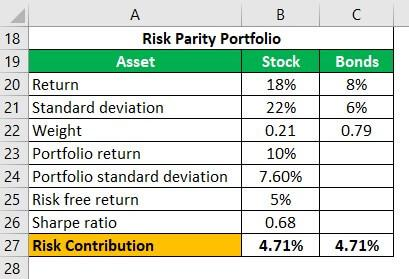

## Table of Contents

## What is risk parity?

Risk parity is a way of investing money that tries to balance the risk across different types of investments. Instead of putting more money into stocks because they might grow faster, risk parity focuses on how risky each investment is. The goal is to make sure that each part of your investment portfolio contributes an equal amount of risk. This way, if one type of investment does poorly, it won't hurt your overall portfolio too much.

In traditional investing, people might put most of their money into stocks because they can offer higher returns. But stocks are also riskier. Risk parity, on the other hand, might suggest using more bonds or other less risky investments to balance things out. By doing this, risk parity aims to create a more stable portfolio that can handle ups and downs in the market better. It's like spreading your eggs across many baskets, so if one basket falls, you don't lose everything.

## How does risk parity differ from traditional portfolio allocation methods?

Risk parity and traditional portfolio allocation methods have different ways of deciding how to spread money across investments. In traditional methods, people often put more money into stocks because they think stocks will grow faster and give them more money back. They might use a rule like the "60/40" split, where 60% of the money goes into stocks and 40% into bonds. The focus here is on how much money each investment might make, not how risky it is.

On the other hand, risk parity looks at how risky each investment is, not just how much money it might make. Instead of putting more money into stocks just because they could grow faster, risk parity tries to balance the risk across all investments. This means that even if stocks are expected to grow a lot, risk parity might suggest putting more money into bonds or other less risky investments to keep the overall risk level even. The goal is to make the portfolio more stable and less likely to lose a lot of money if one type of investment does badly.

## What are the key principles behind risk parity?

Risk parity is all about balancing the risk in your investment portfolio. Instead of focusing on how much money each investment might make, risk parity looks at how risky each investment is. The main idea is to make sure that each part of your portfolio contributes the same amount of risk. This way, if one type of investment does badly, it won't hurt your whole portfolio too much. It's like spreading your bets so that no single bet can make you lose everything.

To do this, risk parity often suggests using more of less risky investments like bonds, even if they don't grow as fast as stocks. By balancing the risk, you can create a more stable portfolio that can handle ups and downs in the market better. This approach is different from traditional ways of investing, where people might put most of their money into stocks because they think stocks will make them more money. Risk parity tries to find a middle ground where the portfolio is safer but can still grow over time.

## Can you explain the concept of equal risk contribution in risk parity?

Equal risk contribution is a key idea in risk parity. It means that each part of your investment portfolio should add the same amount of risk. Instead of worrying about how much money each investment might make, you focus on making sure that no single investment makes your portfolio too risky. Imagine you have different types of investments, like stocks and bonds. In risk parity, you would adjust how much money you put into each type so that the risk from stocks is the same as the risk from bonds.

This way, if one type of investment does badly, it won't hurt your whole portfolio too much. For example, if stocks go down a lot, but you have balanced the risk with bonds, the overall impact on your portfolio will be smaller. By spreading the risk evenly, you create a more stable investment plan. This approach helps you handle ups and downs in the market better, making your investments safer over time.

## What types of assets are typically included in a risk parity portfolio?

A risk parity portfolio usually includes a mix of different types of assets to balance the risk. The most common assets are stocks, bonds, and commodities. Stocks are shares in companies and can grow a lot but are also very risky. Bonds are loans to companies or governments and are less risky than stocks but don't grow as fast. Commodities are things like gold or oil that people can buy and sell, and they can help protect against inflation.

Sometimes, risk parity portfolios also include other types of investments like real estate or currencies. Real estate can provide steady income and help diversify the portfolio. Currencies can be used to hedge against changes in the value of money. The idea is to spread the risk across all these different assets so that no single type of investment can hurt the portfolio too much. By balancing the risk, the portfolio can handle ups and downs in the market better.

## How is leverage used in risk parity strategies?

In risk parity strategies, leverage is often used to increase the overall return of the portfolio without changing the balance of risk. Since risk parity aims to spread risk evenly across different types of investments, it might mean putting a lot of money into less risky assets like bonds. But because bonds don't grow as fast as stocks, using leverage can help boost the returns. Leverage is like borrowing money to invest more than you actually have. By doing this, you can make the portfolio grow faster, even though it's still balanced in terms of risk.

However, using leverage also means taking on more risk. If the investments don't do well, the losses can be bigger because of the borrowed money. So, it's important to use leverage carefully in risk parity strategies. The goal is to find a good balance where the portfolio can still grow, but the extra risk from leverage doesn't make the whole plan too dangerous. By using leverage wisely, risk parity can help create a more stable and potentially more profitable investment approach.

## What are the historical performance metrics of risk parity portfolios compared to traditional portfolios?

Historically, risk parity portfolios have shown different performance compared to traditional portfolios, especially during different market conditions. During periods of high market volatility or when stocks do badly, risk parity portfolios often do better than traditional portfolios. This is because risk parity spreads risk evenly across different types of investments, so a big drop in stocks doesn't hurt the whole portfolio as much. For example, during the financial crisis of 2008, many risk parity portfolios lost less money than traditional stock-heavy portfolios because they had more bonds and other less risky assets.

However, in times when the stock market is doing really well, traditional portfolios can outperform risk parity portfolios. This is because traditional portfolios usually have a lot more money in stocks, which can grow faster than bonds or other assets. Over the long term, studies show that risk parity portfolios can offer similar or sometimes better risk-adjusted returns than traditional portfolios. This means that for the level of risk you're taking, risk parity might give you a better balance between risk and reward.

## How do you construct a risk parity portfolio?

To build a risk parity portfolio, you start by figuring out how risky each type of investment is. This means looking at things like stocks, bonds, and commodities, and seeing how much they might go up or down. Once you know the risk of each investment, you adjust how much money you put into each one so that the risk from each part of your portfolio is the same. For example, if stocks are much riskier than bonds, you might put more money into bonds to balance things out. The goal is to make sure that no single investment can hurt your whole portfolio too much if it does badly.

After setting up the basic mix of investments, you might also use something called leverage to make your portfolio grow faster. Leverage is like borrowing money to invest more than you have. By using leverage, you can put more money into less risky assets like bonds, which can help boost your returns without changing the balance of risk. But you have to be careful with leverage because it can also make your losses bigger if things don't go well. By carefully balancing the risk and using leverage wisely, you can create a risk parity portfolio that's more stable and can handle ups and downs in the market better.

## What are the common challenges and criticisms of implementing a risk parity strategy?

One common challenge of implementing a risk parity strategy is figuring out how to measure risk accurately. Risk can be hard to predict, and different ways of measuring it can give different results. This makes it tricky to balance the risk across different investments. Another challenge is using leverage. While leverage can help boost returns, it also makes the portfolio riskier. If the investments don't do well, the losses can be bigger because of the borrowed money. So, it's important to use leverage carefully and keep an eye on how much risk you're taking.

Critics of risk parity often say that it might not work well in all market conditions. For example, when the stock market is doing really well, a risk parity portfolio might not grow as fast as a traditional portfolio because it has less money in stocks. Some people also worry that risk parity relies too much on past data to predict future risk, which might not always be accurate. Despite these criticisms, many investors still use risk parity because it can help create a more stable portfolio that can handle ups and downs in the market better.

## How does risk parity handle different market conditions, such as bull and bear markets?

Risk parity portfolios are designed to handle different market conditions better than traditional portfolios. In a bull market, when stocks are going up a lot, risk parity might not grow as fast as a traditional portfolio because it has less money in stocks. But this also means that if the market suddenly drops, a risk parity portfolio won't lose as much money. By balancing the risk across different types of investments like stocks, bonds, and commodities, risk parity tries to make the portfolio more stable no matter what the market is doing.

In a bear market, when stocks are going down, risk parity portfolios often do better than traditional portfolios. This is because they have more money in less risky investments like bonds, which don't go down as much when the stock market crashes. By spreading the risk evenly, risk parity helps protect your money during tough times. While it might not make as much money during good times, it can help you lose less during bad times, making your overall investment plan safer and more reliable.

## What advanced mathematical models are used in optimizing risk parity portfolios?

To optimize risk parity portfolios, people often use advanced math models like the "risk budgeting" approach. This method looks at how much risk each investment adds to the whole portfolio and tries to make sure that each part adds the same amount of risk. It uses something called "covariance" to see how different investments move together. By understanding these relationships, the model can figure out the best way to spread money across different investments to keep the risk balanced. This helps make the portfolio more stable and able to handle ups and downs in the market better.

Another common model is the "inverse volatility weighting" method. This approach puts more money into investments that are less risky, based on how much they go up and down. By doing this, it tries to make sure that the overall risk of the portfolio stays even. These models often use complex math to find the right balance, but the main idea is simple: spread the risk so that no single investment can hurt the whole portfolio too much. By using these advanced models, investors can create a risk parity portfolio that's more likely to do well in different market conditions.

## How can risk parity be integrated with other investment strategies like factor investing?

Risk parity can be combined with factor investing to create a more balanced and potentially more rewarding investment approach. Factor investing is about choosing investments based on certain characteristics, like how big a company is or how much its stock price goes up and down. By adding risk parity to factor investing, you can spread the risk evenly across different factors. This means that if one factor does badly, it won't hurt your whole portfolio too much. For example, if you're investing in factors like value and momentum, risk parity can help make sure that both factors contribute the same amount of risk to your portfolio.

To do this, you would first identify the factors you want to invest in and then use risk parity to balance the risk across these factors. This might mean using more of a less risky factor to balance out a riskier one. By combining the two strategies, you can create a portfolio that not only takes advantage of different investment factors but also stays stable during ups and downs in the market. This way, you get the benefits of factor investing while keeping the overall risk of your portfolio under control.

## What is Understanding Risk Parity?

Risk parity is an investment strategy that focuses on the equitable distribution of risk, as opposed to equal allocation of capital across different asset classes. Traditional investment methods often allocate capital based on fixed percentages, which may inadvertently expose portfolios to unequal levels of risk. In contrast, risk parity seeks to balance the risk contributions of each asset within a portfolio.

This approach was conceived as a means to improve diversification and stabilize returns. By distributing risk uniformly, risk parity aims to mitigate the impact of highly volatile assets on the overall performance of a portfolio. The underlying principle is that each asset class will contribute equally to the portfolio's overall risk, measured commonly by [volatility](/wiki/volatility-trading-strategies).

A key element of understanding risk parity is its potential to reduce portfolio volatility. A portfolio that assigns the same risk level to defensive assets like bonds as to more volatile assets like stocks tends to be more stable over time. This, in turn, enhances the portfolio's resilience.

Mathematically, the risk contribution of an asset $i$ can be expressed in terms of its weight $w_i$ in the portfolio and the portfolio's overall risk, usually expressed through standard deviation or other risk measures. The risk contribution formula is given by:

$$
RC_i = w_i \times \text{Cov}(r_i, R_p) 
$$

where $RC_i$ is the risk contribution of asset $i$, $\text{Cov}(r_i, R_p)$ is the covariance between the asset's returns $r_i$ and the portfolio returns $R_p$.

By adjusting the asset weights $w_i$ such that each asset's risk contribution $RC_i$ is equal, the total portfolio risk can be balanced. This requires continuous monitoring and rebalancing to ensure the risk parity condition is maintained as market conditions change.

Adopting a risk parity strategy in [algorithmic trading](/wiki/algorithmic-trading) involves utilizing sophisticated data analysis tools to calculate and adjust these weights dynamically. This methodology not only enhances diversification but also aims to systematically manage investment risks, offering a robust framework for achieving long-term portfolio stability and performance.

## What is the Theoretical Foundation?

Risk parity's theoretical foundation primarily hinges on the concept of risk budgeting and the critical role of volatility in portfolio allocation. This approach allocates portfolio risk rather than capital among different asset classes, aiming for a more consistent distribution of risk. This involves a thorough assessment of volatility and correlations among assets, which are mathematical representations of how much an asset's price is expected to fluctuate over time and how assets move in relation to each other, respectively.

### Risk Budgeting

Risk budgeting is a core principle that focuses on distributing the total risk of a portfolio across various assets. It involves setting a 'risk budget' for each asset or asset class, which dictates how much portfolio volatility each component can contribute. The objective is to equalize risk contributions, meaning assets with higher volatility will be allocated smaller portions of the capital. Mathematically, this can be represented as:

$$
\text{RC}_i = w_i \times \sigma_i \times \rho_{i,P}
$$

where:
- $\text{RC}_i$ is the risk contribution of asset $i$,
- $w_i$ is the weight of asset $i$ in the portfolio,
- $\sigma_i$ is the volatility of asset $i$,
- $\rho_{i,P}$ is the correlation of asset $i$ with the portfolio.

This formula ensures that each asset contributes equally to the portfolio's total risk.

### Role of Volatility

Volatility plays a pivotal role in the risk parity framework, as it is used both as a measure and a determinant of risk allocation. The volatility of each asset influences its position within the portfolio; assets with higher volatility receive a smaller allocation to ensure that no single asset overly dominates the portfolio's risk profile. By equalizing the risk contributions, the portfolio aims to achieve more stable and predictable returns, enhancing its resilience to market changes.

### Mathematical Models

Mathematical models are integral to computing risk budgets and asset correlations, which are necessary for sound portfolio design. Techniques such as mean-variance optimization have been traditionally employed, but risk parity shifts the focus to volatility equality. For assets $A$ and $B$, achieving risk parity means aligning their risk contributions:

$$
\frac{w_A \times \sigma_A}{w_B \times \sigma_B} = 1
$$

This equation signifies that the ratio of weighted volatilities should be equal to one, indicating equal risk contributions.

### Strategic Insight

A mathematical analysis of risk parity reveals its strategic depth by illustrating how portfolios can maintain stability across different economic scenarios. Such systems provide insights into managing risk amid uncertainty, leveraging quantitative techniques to recalibrate asset allocation dynamically as market conditions evolve.

In summary, the theoretical underpinnings of risk parity emphasize balancing risk returns through rigorous mathematical frameworks, focusing on volatility and correlations to achieve stable portfolios. This provides algorithmic trading strategies a robust mechanism to manage portfolio risk effectively.

## References & Further Reading

[1]: Asness, C. S., & Liew, J. M. (2014). ["The Great Divide over Market Efficiency."](https://www.institutionalinvestor.com/article/2bsua0s5hy3qit9bkdfk0/portfolio/the-great-divide-over-market-efficiency) Financial Analysts Journal.

[2]: Roncalli, T. (2013). ["Introduction to Risk Parity and Budgeting."](https://papers.ssrn.com/sol3/papers.cfm?abstract_id=2272973) CRC Press.

[3]: Lo, A. W. (2012). ["Adaptive Markets: Financial Evolution at the Speed of Thought."](https://www.jstor.org/stable/j.ctvc77k3n) Princeton University Press.

[4]: Maillard, S., Roncalli, T., & Teïletche, J. (2010). ["The Properties of Equally Weighted Risk Contribution Portfolios."](https://www.semanticscholar.org/paper/The-properties-of-equally-weighted-risk-portfolios-Teiletche-Roncalli/14cdd2a70ca7889acc71ce4dd1609eaf010b8dbb) The Journal of Portfolio Management.

[5]: ["Risk Parity Fundamentals"](https://www.taylorfrancis.com/books/mono/10.1201/b21089/risk-parity-fundamentals-edward-qian) by Andrew Ayer and Jean-Michel Turner, AllAboutAlpha.