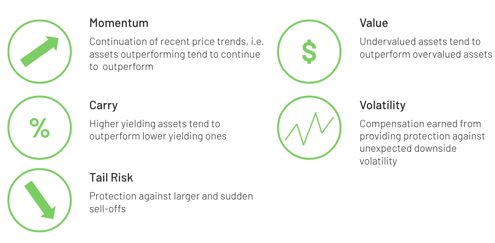

## Table of Contents

## What are risk premia strategies?

Risk premia strategies are investment approaches that aim to earn returns by taking on specific types of risks. These strategies focus on capturing the extra returns, or "premia," that investors expect for bearing risks that cannot be easily diversified away. Common risk premia include those related to equity, size, value, momentum, and carry. Investors using these strategies often construct portfolios that tilt towards assets with higher expected returns due to these risk factors.

For example, an equity risk premium strategy might involve investing more in stocks than in safer assets like bonds, expecting higher returns over time despite the increased risk. A value risk premium strategy, on the other hand, would involve buying stocks that are considered undervalued compared to their intrinsic worth, hoping that their prices will eventually rise to reflect their true value. By understanding and targeting these risk premia, investors can potentially enhance their portfolio returns, though they must also be prepared for the possibility of increased volatility and losses.

## How do risk premia strategies differ from traditional investment strategies?

Risk premia strategies are different from traditional investment strategies because they focus on specific types of risks to earn extra returns. Traditional strategies often look at overall market performance or broad asset classes like stocks and bonds. They might aim to beat the market by picking the right stocks or timing the market well. On the other hand, risk premia strategies zoom in on particular risk factors, like value or momentum, and try to earn returns by tilting a portfolio towards assets that have these characteristics.

For example, a traditional investor might buy a mix of stocks and bonds to get a balanced return over time. They might not pay much attention to why certain stocks are expected to do well. In contrast, someone using a risk premia strategy might specifically choose stocks that are undervalued or have strong recent performance, expecting these stocks to offer higher returns because of the extra risks they carry. This approach can lead to different portfolio constructions and potentially different levels of risk and return compared to traditional methods.

## What are the common types of risk premia?

Risk premia are extra returns that investors expect for taking on certain risks. Common types of risk premia include equity risk premium, size risk premium, value risk premium, momentum risk premium, and carry risk premium. The equity risk premium is the extra return investors expect from stocks compared to safer investments like bonds. The size risk premium is based on the idea that smaller companies might offer higher returns because they are riskier than larger companies. The value risk premium comes from investing in stocks that seem undervalued compared to what they're really worth, expecting their prices to go up over time.

The momentum risk premium focuses on buying assets that have been doing well recently and selling those that have been doing poorly, expecting the trends to continue. The carry risk premium involves taking advantage of the difference between the returns of holding an asset and the cost of financing it. For example, in currency markets, investors might borrow in a currency with low interest rates and invest in a currency with high interest rates, hoping to profit from the difference. Each type of risk premium has its own set of risks and potential rewards, and investors use these strategies to try to boost their returns by carefully managing these specific risks.

## Can you explain how equity risk premia work?

Equity risk premia is the extra return that investors expect to get from stocks compared to safer investments like bonds. When you put your money into stocks, you're taking on more risk because stock prices can go up and down a lot more than bond prices. But because of this risk, investors expect to earn more money over time. This extra expected return is called the equity risk premium. It's like a reward for being willing to take on the ups and downs of the stock market.

To understand how it works, think about it this way: if you could get the same return from a safe investment like a bond, you wouldn't bother with the riskier stocks. But because stocks are riskier, they need to offer a higher return to make them attractive. So, over the long term, stocks are expected to give you more money than bonds, and that difference is the equity risk premium. It's not guaranteed, and it can change over time, but it's what investors hope to gain by choosing stocks over safer options.

## What role do interest rate risk premia play in investment?

Interest rate risk premia are the extra returns that investors expect to earn when they take on the risk that interest rates might change. When you invest in bonds, you get regular payments, but if interest rates go up, the value of your bonds can go down. Investors want more money to take this risk, so they expect a higher return, and that extra return is the interest rate risk premium. It's like a reward for being willing to deal with the uncertainty of changing interest rates.

This risk premium is important because it affects how investors choose between different investments. If the interest rate risk premium is high, it might make bonds more attractive even though they're riskier. On the other hand, if the premium is low, investors might look for other places to put their money where they can get a better reward for the risk they're taking. Understanding the interest rate risk premium helps investors make smarter choices about where to invest their money.

## How are commodity risk premia utilized in portfolio management?

Commodity risk premia are the extra returns that investors expect when they invest in commodities like oil, gold, or wheat. These returns come from taking on the risks that come with commodities, like price changes due to supply and demand. In portfolio management, investors use commodity risk premia to try to make their portfolios better. They might add commodities to their mix of investments to get these extra returns, hoping that the gains from commodities will help balance out losses from other parts of their portfolio.

For example, if an investor thinks that the price of oil is going to go up because of high demand, they might buy oil futures. They're expecting to earn a commodity risk premium because they're taking on the risk that the price might not go up as expected. By including commodities in their portfolio, investors can spread their risks around and maybe get higher returns overall. This way, they're not putting all their eggs in one basket, and they're using the commodity risk premia to try to make their investments stronger.

## What are the key factors that influence the size of risk premia?

The size of risk premia can be influenced by a lot of things. One big factor is how much risk people think they're taking. If an investment seems really risky, people will want a bigger reward to take that chance. Another factor is how the economy is doing. When things are going well, people might not need as big a reward to take risks, so risk premia might be smaller. But if the economy is shaky, people will want more of a reward, making risk premia larger.

Another thing that affects risk premia is how much people want to invest in certain types of assets. If everyone wants to buy stocks, the demand can push up the prices, which might make the expected extra return, or risk premium, smaller. On the other hand, if no one wants to buy a certain type of investment, the risk premium might be bigger because fewer people are willing to take the risk. Also, things like interest rates and inflation can change how big the risk premia are. If interest rates go up, the cost of borrowing money goes up, which can make people want bigger rewards for taking risks.

## How can investors measure and evaluate risk premia?

Investors can measure and evaluate risk premia by looking at the difference between the returns they get from a risky investment and a safer one. For example, if stocks are expected to give a 10% return and bonds a 5% return, the equity risk premium would be 5%. To figure this out, investors often use historical data to see what kind of extra returns they've gotten in the past for taking on certain risks. They might also use models and theories from finance, like the Capital Asset Pricing Model (CAPM), to estimate what the risk premium should be based on how risky the investment is.

Evaluating risk premia also involves thinking about what's happening in the economy and the markets right now. If things are uncertain, like during a recession, investors might want a bigger reward for taking risks, so risk premia could be higher. They also look at things like interest rates and inflation, which can change how big the risk premia are. By keeping an eye on these factors, investors can get a better idea of whether the risk premia they're expecting are reasonable or if they should adjust their expectations.

## What are the potential risks and limitations of implementing risk premia strategies?

Using risk premia strategies can be risky because they focus on taking on specific kinds of risks to get extra returns. If these risks don't pay off like expected, investors could lose money. For example, if you invest in stocks hoping for a high equity risk premium but the stock market crashes, you might end up with less money than if you had invested in safer options like bonds. Also, these strategies can make your investments go up and down a lot more than usual, which can be stressful and hard to handle if you're not ready for it. 

Another limitation is that it can be tough to predict how big the risk premia will be. Things like the economy, interest rates, and what other investors are doing can change quickly, making it hard to know if the extra returns you're expecting will actually happen. If you guess wrong, your strategy might not work out. Plus, these strategies often need a lot of data and special knowledge to set up and manage, which can be a challenge for some investors.

## How do macroeconomic conditions affect risk premia?

Macroeconomic conditions, like how well the economy is doing, can really change the size of risk premia. When the economy is strong and growing, people might feel more confident and be willing to take on risks without needing a big reward. This can make risk premia smaller because investors don't need as much extra return to invest in risky things like stocks. On the other hand, if the economy is weak or going through a tough time, people get more worried and want a bigger reward to take on those same risks. So, during a recession or when things are uncertain, risk premia can get bigger because investors need more of an incentive to put their money into risky investments.

Interest rates and inflation are also big parts of the economy that can affect risk premia. When interest rates go up, borrowing money costs more, and this can make people want bigger rewards for taking risks. Higher interest rates can make risk premia larger because the cost of holding onto risky investments goes up. Inflation, or the rate at which prices go up, can also change how much extra return investors expect. If inflation is high, the value of money goes down, so investors might want a bigger risk premium to make sure their returns keep up with rising prices. All these macroeconomic factors together can make risk premia go up or down, depending on what's happening in the economy.

## What advanced techniques can be used to optimize risk premia strategies?

To optimize risk premia strategies, investors can use something called factor investing. This means they look at different things, or "factors," that can affect how well an investment does, like how big a company is, how much its stock price has been going up lately, or if it's priced lower than it should be. By figuring out which of these factors are likely to do well, investors can build a portfolio that focuses on those factors to get better returns. They might use computers and math to help them figure out the best mix of these factors, which is called quantitative analysis. This can help them make smarter choices about where to put their money to get the biggest risk premia.

Another advanced technique is called risk parity. This means spreading out the risk evenly across different parts of a portfolio. Instead of just putting most of the money into stocks because they might give bigger returns, risk parity tries to balance things so that each part of the portfolio, like stocks, bonds, and commodities, carries the same amount of risk. This can help make the whole portfolio more stable and still aim for good returns from risk premia. Using tools like risk parity can help investors manage the ups and downs of their investments better while still trying to earn those extra returns.

## How have risk premia strategies performed historically compared to other investment approaches?

Historically, risk premia strategies have had mixed results compared to other investment approaches. On one hand, these strategies can offer higher returns because they focus on taking specific risks that are expected to pay off over time. For example, investing in stocks to capture the equity risk premium has generally led to higher long-term returns than investing in safer assets like bonds. Similarly, strategies targeting value or momentum risk premia have sometimes beaten the market by focusing on undervalued stocks or those with strong recent performance. However, these strategies can also be more volatile, meaning their returns can swing up and down a lot more than simpler, broad-market approaches.

On the other hand, traditional investment strategies, like buying a mix of stocks and bonds or index funds, tend to be less risky and easier to manage. These approaches aim to match the overall market's performance rather than trying to beat it by focusing on specific risk factors. While they might not offer the same potential for high returns as risk premia strategies, they can provide more stable and predictable results. Over time, the performance of risk premia strategies can vary a lot depending on economic conditions and how well the specific risks they target pay off, making them a potentially rewarding but also more challenging choice for investors.

## How can we implement risk mitigation measures?

Implementing effective risk mitigation measures is crucial in risk premia algo trading to ensure resilience against market volatility and unforeseen events. Several strategies can be enacted to limit potential losses and enhance trading performance.

One fundamental approach is the use of stop-loss and limit orders. Stop-loss orders automatically close a position when the price moves against the trader by a pre-defined amount, thus capping the loss. Limit orders, on the other hand, are set to close a position at a desired profit level. These orders help automate the decision-making process, reducing the emotional impact on trading and preserving capital.

Diversification is another key risk mitigation strategy. By spreading investments across a variety of strategies and asset classes, traders can reduce the impact of adverse price movements in any single market. This approach utilizes the concept of correlation, where assets with low or negative correlation to each other are combined to balance overall portfolio risk. The formula for the portfolio variance $\sigma_p^2$ is:

$$
\sigma_p^2 = \sum_{i=1}^{n} \sum_{j=1}^{n} w_i w_j \sigma_i \sigma_j \rho_{ij}
$$

where $w_i$ and $w_j$ are the weights of assets $i$ and $j$, $\sigma_i$ and $\sigma_j$ are the standard deviations, and $\rho_{ij}$ is the correlation between assets $i$ and $j$.

Continuous monitoring and evaluation are essential to maintain the effectiveness of algorithmic strategies. Regularly updating trading algorithms and assumptions ensures they remain aligned with evolving market conditions. This can be achieved through techniques such as parameter optimization and performance analysis, where past and current data are examined to identify necessary algorithm adjustments. In Python, libraries like Pandas and NumPy can be utilized to analyze data trends and evaluate strategy performance.

Stress testing is a method used to assess the robustness of trading algorithms under extreme market scenarios. By simulating high-volatility environments or rare market events, traders can identify vulnerabilities in their models and implement necessary safeguards. This proactive approach helps in understanding the potential impact of unexpected market shifts and forms a part of comprehensive risk management.

Adhering to regulatory standards is imperative to avoid legal issues and maintain credibility. Traders must stay informed about the latest financial regulations and ensure their strategies comply with all relevant guidelines. This includes securities trading laws, anti-money laundering standards, and data protection regulations. Compliance not only safeguards operations from legal penalties but also enhances investor confidence.

In summary, implementing these risk mitigation measures involves automation, diversification, active monitoring, robust testing, and strict compliance. Together, these strategies create a resilient framework for managing risks associated with risk premia algo trading.

## References & Further Reading

[1]: Ang, A. (2014). ["Asset Management: A Systematic Approach to Factor Investing."](https://archive.org/details/assetmanagements0000anga) Oxford University Press.

[2]: Ilmanen, A. (2011). ["Expected Returns: An Investor's Guide to Harvesting Market Rewards."](https://www.wiley.com/en-us/Expected+Returns%3A+An+Investor%27s+Guide+to+Harvesting+Market+Rewards-p-9781119990772) Wiley Finance.

[3]: Lopez de Prado, M. (2018). ["Advances in Financial Machine Learning."](https://www.amazon.com/Advances-Financial-Machine-Learning-Marcos/dp/1119482089) Wiley.

[4]: Chan, E. P. (2009). ["Quantitative Trading: How to Build Your Own Algorithmic Trading Business."](https://github.com/justinchou/books-quantitative-trading) Wiley.

[5]: Black, F., & Scholes, M. (1973). ["The Pricing of Options and Corporate Liabilities."](https://www.cs.princeton.edu/courses/archive/fall09/cos323/papers/black_scholes73.pdf) Journal of Political Economy, 81(3), 637-654.

[6]: Aronson, D. R. (2006). ["Evidence-Based Technical Analysis: Applying the Scientific Method and Statistical Inference to Trading Signals."](https://onlinelibrary.wiley.com/doi/book/10.1002/9781118268315) Wiley.

[7]: Jansen, S. (2018). ["Machine Learning for Algorithmic Trading."](https://github.com/stefan-jansen/machine-learning-for-trading) Packt Publishing. 

[8]: Menkhoff, L., Sarno, L., Schmeling, M., & Schrimpf, A. (2012). ["Carry Trades and Global Foreign Exchange Volatility."](https://onlinelibrary.wiley.com/doi/abs/10.1111/j.1540-6261.2012.01728.x) The Journal of Finance, 67(2), 681-718. 

[9]: Jegadeesh, N., & Titman, S. (1993). ["Returns to Buying Winners and Selling Losers: Implications for Stock Market Efficiency."](https://www.bauer.uh.edu/rsusmel/phd/jegadeesh-titman93.pdf) The Journal of Finance, 48(1), 65-91.