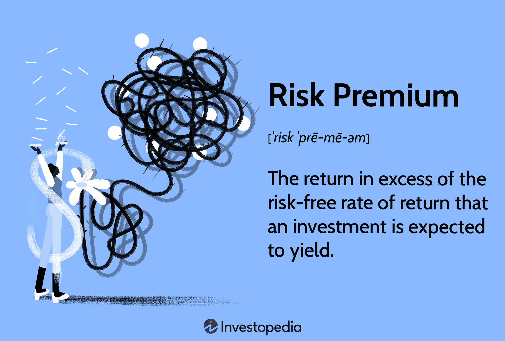

## Table of Contents

## What is a risk premium in the context of investments?

A risk premium is the extra money investors expect to earn for taking on more risk. When you invest in something like stocks, which can go up or down a lot, you might earn more than if you invest in something safer, like a savings account. The risk premium is the difference between what you might earn from the risky investment and what you would earn from the safe one.

Think of it like this: if you lend money to a friend who always pays you back on time, you might not ask for much extra. But if you lend money to someone who sometimes forgets to pay you back, you might want more money to make up for the risk. In investing, the risk premium is that extra money you want for taking a chance on something that might not work out as planned.

## How is a risk premium calculated?

Calculating a risk premium involves comparing the expected return of a risky investment to the return of a risk-free investment. The risk-free investment is usually something like a U.S. Treasury bond, which is considered very safe. To find the risk premium, you subtract the return of the risk-free investment from the expected return of the risky investment. For example, if you expect a stock to give you a 10% return and a Treasury bond gives you a 3% return, the risk premium would be 7%.

The expected return of the risky investment can be tricky to figure out because it's based on what you think might happen in the future. You might look at past performance, current market conditions, and expert predictions to come up with this number. But remember, it's still a guess. The risk premium helps you decide if the extra return you might get from the risky investment is worth the extra worry and potential loss.

## Why do investors demand a risk premium?

Investors demand a risk premium because they want to be rewarded for taking on more risk. When you put your money into something that might not work out, like a new startup or a stock that goes up and down a lot, you're taking a chance. If things go well, you could make a lot of money, but if they don't, you could lose a lot. So, to make it worth their while, investors ask for a little extra on top of what they would get from a safer investment.

This extra money, the risk premium, is like a safety net. It's the reason why someone might choose to invest in a risky stock instead of just keeping their money in a bank account. The risk premium helps balance out the possibility of losing money. If the risk premium is high enough, investors feel that the potential reward is worth the risk, and they are more likely to invest.

## What is the relationship between risk and return in investments?

In investments, risk and return are like two sides of the same coin. When you invest in something that has a higher chance of losing value, you are taking on more risk. But with that risk comes the chance to earn more money, which is called the return. Imagine choosing between a safe bet, like a savings account, and a riskier one, like stocks. The savings account might give you a small, steady return, but it's very safe. Stocks, on the other hand, can go up a lot, giving you a bigger return, but they can also go down, making you lose money.

Investors need to find a balance that works for them. If you want to earn more money, you might be willing to take on more risk. But if losing money would be a big problem for you, you might stick with safer investments, even if they don't grow as fast. This balance is personal and depends on things like how much money you have, how long you plan to invest, and how comfortable you are with the ups and downs of the market. Understanding the relationship between risk and return helps investors make smart choices about where to put their money.

## Can you explain the concept of the equity risk premium?

The equity risk premium is the extra return investors expect to get from investing in stocks instead of something super safe like a government bond. It's like a reward for choosing to put your money in the stock market, where prices can jump around a lot, instead of in a savings account or bond that gives you a small but steady return. The idea is that since stocks are riskier, investors want a bit more money to make it worth their while.

To figure out the equity risk premium, you take the expected return from stocks and subtract the return you would get from a risk-free investment, like a U.S. Treasury bond. If you think stocks will give you a 10% return and the bond gives you 3%, the equity risk premium would be 7%. This number helps investors decide if the extra return from stocks is worth the extra worry and potential loss. It's all about balancing the chance of making more money with the risk of losing some.

## How does the risk premium differ across various asset classes?

The risk premium can be different for different types of investments, or asset classes. For example, stocks usually have a higher risk premium than bonds because they can go up and down a lot more. If you invest in stocks, you might get a bigger return, but you also take on more risk. On the other hand, bonds are generally safer, so they have a smaller risk premium. People who invest in bonds are usually okay with getting a smaller return because they want their money to be safe.

Even within the same asset class, the risk premium can change. For instance, in the stock market, a big, well-known company might have a lower risk premium than a small, new company. The big company's stock might not go up as much, but it's also less likely to lose a lot of value. The small company's stock could go way up, but it's also riskier. So, the risk premium for the small company's stock would be higher to make up for that extra risk.

## What factors influence the size of the risk premium?

The size of the risk premium can change because of many things. One big thing is how much risk people think there is in the market. If people think the market is risky, they will want a bigger risk premium to make it worth their while to invest. Another thing is how the economy is doing. If the economy is doing well, people might feel safer about investing, so the risk premium might go down. But if the economy is doing badly, people will want a bigger reward for taking the risk.

Also, the type of investment matters. Stocks usually have a bigger risk premium than bonds because they can go up and down a lot more. Within stocks, a big company might have a smaller risk premium than a small, new company because it's less risky. And things like interest rates can change the risk premium too. If interest rates go up, safer investments like bonds might give you more money, so the risk premium for riskier investments needs to be bigger to make them attractive.

## How do market conditions affect risk premiums?

Market conditions play a big role in deciding how big the risk premium will be. When the market is doing well and people feel good about it, they might not need as much extra money to invest in risky things. This means the risk premium can be smaller. But if the market is shaky and people are worried, they will want a bigger reward for taking the risk. So, the risk premium goes up when the market is uncertain or doing badly.

Another thing to think about is what's happening with the economy. If the economy is growing and jobs are easy to find, people might feel more confident about investing, which can make the risk premium smaller. But if the economy is struggling, with high unemployment or other problems, people will want a bigger risk premium to make up for the extra worry. So, the health of the economy can really change how much extra money investors expect to earn from risky investments.

## What historical data supports the concept of risk premiums?

Historical data shows us that risk premiums are real and have been around for a long time. If we look at the stock market, over many years, stocks have given investors more money than safer things like government bonds. For example, from 1928 to 2020, the average return on stocks in the U.S. was about 10% a year, while the return on government bonds was around 5%. This difference, which is about 5%, is what we call the equity risk premium. It shows that investors have been rewarded for taking the risk of investing in stocks.

Another way to see the risk premium is by looking at different types of stocks. Big, well-known companies usually have smaller risk premiums than smaller, newer companies. Historical data tells us that smaller companies can grow a lot faster, but they are also riskier. Over time, small company stocks have given investors around 12% a year, compared to about 10% for big company stocks. This difference shows that investors expect more money for taking on the extra risk of investing in smaller companies.

## How can investors use risk premiums to make better investment decisions?

Investors can use risk premiums to make better choices by comparing the extra money they might get from a risky investment to what they would get from a safe one. If the risk premium is big enough, it might be worth taking the chance. For example, if a stock has a risk premium of 7% over a government bond, an investor might decide that the potential for earning more is worth the risk. By looking at risk premiums, investors can figure out if the reward for taking a risk is good enough for them.

Understanding risk premiums also helps investors balance their portfolios. If someone wants to earn more money and is okay with taking risks, they might put more money into stocks with high risk premiums. But if someone is more worried about losing money, they might choose safer investments with smaller risk premiums. By knowing how risk and return work together, investors can pick investments that fit their own comfort level with risk and their goals for earning money.

## What are the limitations and criticisms of using risk premiums in investment strategies?

Using risk premiums to guide investment choices has some problems. One big issue is that risk premiums are based on what people think will happen in the future. Since no one can really know what the future holds, these guesses can be wrong. For example, if lots of people think the stock market will do well and expect a big reward for the risk, the actual return might end up being smaller than they hoped. This means that relying too much on risk premiums can lead to disappointment if the market doesn't behave as expected.

Another criticism is that risk premiums can change a lot over time. What might seem like a good risk premium today could be different tomorrow because of changes in the economy or the market. This makes it hard to use risk premiums as a steady guide for making investment decisions. Investors need to keep checking and updating their ideas about risk premiums, which can be a lot of work and still might not help them avoid losses if the market takes a sudden turn.

## How do advanced models incorporate risk premiums into portfolio optimization?

Advanced models use risk premiums to help people decide where to put their money in a way that balances risk and reward. These models look at how much extra money different investments might give you compared to safe ones like government bonds. By figuring out these risk premiums, the models can suggest which stocks or other investments might be worth the risk. They do this by using math and computers to find the best mix of investments that could give you the most reward for the risk you're willing to take.

These models also take into account that risk premiums can change over time. They use past data and predictions about the future to guess what risk premiums might be. This helps them adjust the portfolio as the market changes. For example, if the model thinks the risk premium for stocks will go up, it might suggest putting more money into stocks. But if it thinks the risk premium will go down, it might suggest moving money into safer investments. By doing this, the model tries to keep the portfolio in the best shape to earn as much money as possible while keeping the risk under control.

## What is Understanding Risk Premiums?

Risk premiums represent the additional return an investor expects to earn from an asset over a risk-free investment, serving as compensation for assuming higher risk. In finance, risk-free investments are typically government bonds due to their stability and low likelihood of default. An investor seeking higher returns by venturing into riskier assets inevitably demands a risk premium.

The equity risk premium (ERP) specifically refers to the excess return investors anticipate from stock market investments. This excess return acts as a reward for the additional risks encountered in equity markets, such as market volatility and potential loss of principal. ERP is a pivotal metric, influencing equity valuations and investment choices.

Financial modeling heavily relies on risk premiums to forecast investment returns and assess asset pricing. Accurately estimating the risk premium is crucial for constructing reliable financial models and calculating the expected returns of an investment portfolio. The formula to determine the equity risk premium can be expressed as:

$$
\text{Equity Risk Premium} = E(R_m) - R_f
$$

where $E(R_m)$ denotes the expected market return, and $R_f$ represents the risk-free rate. This calculation underscores the importance of discerning between safe returns and those derived from riskier investment avenues.

In practice, understanding risk premiums facilitates informed decision-making, allowing investors to assess whether potential returns justify the inherent risks. This approach is instrumental for balancing portfolios and aligning them with specific investment strategies, ultimately aiding in achieving desired financial outcomes.

## What is the Role of Investment Risk?

Investment risk is a fundamental consideration in the evaluation and management of financial assets, as it encompasses the uncertainties associated with expected returns. These uncertainties can significantly influence both potential gains and potential losses. A comprehensive understanding of different types of investment risks is crucial for constructing an effective asset allocation strategy within a diversified portfolio.

One of the primary forms of investment risk is market risk, which arises from fluctuations in market prices and affects the overall value of an investment portfolio. Market risk is often influenced by macroeconomic factors such as interest rates, economic conditions, and geopolitical events. This type of risk is inherent to all market investments and cannot be completely eliminated, though it can be managed through diversification, hedging, and other risk management techniques.

Credit risk, another significant category, pertains to the possibility that a bond issuer or borrower may default on their obligations, leading to financial loss for the investor. Evaluating the creditworthiness of issuers and selecting investments with appropriate credit ratings are integral components of managing credit risk in a portfolio.

Liquidity risk is associated with the ease of converting an investment into cash without impacting its market price. Assets that are less liquid may pose challenges during times of market stress or when investors need to access cash quickly. Ensuring that a portfolio contains a mix of liquid and illiquid assets helps to mitigate this risk.

Operational risk involves potential losses arising from internal failures, such as process errors, system failures, or fraud within an organization. Effective risk management systems and robust operational controls are essential for minimizing such risks.

In a diversified portfolio, understanding these risk types aids in creating asset allocation strategies that balance potential returns against risk tolerance. For example, employing financial models such as the Capital Asset Pricing Model (CAPM) helps in quantifying risk and estimating expected returns, allowing investors to make informed decisions. The CAPM formula:

$$
E(R_i) = R_f + \beta_i (E(R_m) - R_f)
$$

where $E(R_i)$ is the expected return of the investment, $R_f$ is the risk-free rate, $\beta_i$ is the beta of the investment, and $E(R_m)$ is the expected return of the market, incorporates market risk through the beta coefficient, offering insights into the relative volatility and risk of a security compared to the overall market.

By integrating these risk metrics into their investment strategies, investors can better align their portfolios with their risk tolerance levels, enhance risk-adjusted returns, and achieve more stable long-term performance.

## How do you calculate and apply the equity risk premium?

The equity risk premium (ERP) is a critical measure in finance, representing the difference between the expected return on a market portfolio and the risk-free rate. It can be calculated using various methods, with the Capital Asset Pricing Model (CAPM) and historical data being predominant approaches.

The Capital Asset Pricing Model (CAPM) posits that the expected return on an asset is determined by its systematic risk relative to the overall market. The CAPM formula is given by:

$$

E(R_i) = R_f + \beta_i(E(R_m) - R_f)
$$

where $E(R_i)$ is the expected return of the investment, $R_f$ is the risk-free rate, $\beta_i$ is the beta of the investment, and $E(R_m)$ is the expected return of the market. The term $(E(R_m) - R_f)$ represents the equity risk premium. In this context, $\beta$ is a measure of how much risk the investment adds to a portfolio compared to the market as a whole. A beta higher than one implies higher risk and potentially higher returns.

On the other hand, historical methods involve analyzing past data to estimate the equity risk premium. This approach typically involves calculating the average historical excess returns of the stock market relative to risk-free assets, such as government bonds, over a long duration. The historical ERP is often seen as a backward-looking measure that reflects past market conditions.

Furthermore, implied methods make use of current market valuations and expected future dividends to estimate the ERP. These methods are considered forward-looking and depend heavily on assumptions about future growth rates and market conditions.

Both historical and implied methods have strategic applications in finance. Historical ERPs provide investors with a benchmark based on past market performance, which can be useful for long-term trend analysis. Implied ERPs, by reflecting current market sentiments, can lead to dynamic adjustments in investment strategies, helping investors align their portfolios with anticipated market changes.

Incorporating ERP into investment decisions requires understanding these methods' respective strengths and limitations. While historical data provides a retrospective view, it does not account for structural changes in the market. Alternatively, implied ERP captures the current market environment and expectations but can be volatile based on underlying assumptions.

Balancing these approaches enables investors to make informed decisions, assessing both the historical context and current market dynamics to effectively manage risk and optimize returns. With advancements in financial modeling and computing, investors are increasingly using sophisticated quantitative techniques to refine their ERP estimates and integrate them into comprehensive investment strategies.

## What is a real-world application of financial calculations according to the case study?

Equity risk premium (ERP) plays a crucial role in optimizing investment portfolios and managing associated risks. By quantifying the additional returns required by investors to compensate for the risks of equity investments, ERP is pivotal in formulating robust financial models that guide strategic decisions concerning asset allocations and risk management.

In practical financial applications, ERP aids in predicting market movements, which is essential for effective portfolio management. One fundamental financial model incorporating ERP is the Capital Asset Pricing Model (CAPM). This model is instrumental in determining the expected return on an asset by considering the risk-free rate, the asset's beta (β), and the equity risk premium. The formula for CAPM is as follows:

$$
\text{Expected Return} = \text{Risk-Free Rate} + \beta \times \text{Equity Risk Premium}
$$

By utilizing CAPM, investors can estimate the appropriate equity allocation that aligns with their risk tolerance and expected returns. This approach not only provides a theoretical benchmark but also enhances the precision of market predictions and portfolio diversification.

Advanced algorithms that integrate ERP offer substantial improvements in investment performance, especially in volatile markets. Such algorithms dynamically adjust investment strategies based on real-time ERP fluctuations, ensuring that portfolios are optimized for current market conditions. For example, through algorithmic trading systems, ERP can be continuously recalculated to reflect the latest market data, enabling swift adaptation to any significant market changes.

To illustrate, consider a Python implementation that uses historical market data to compute the ERP and integrate it into a portfolio optimization algorithm. By leveraging libraries such as `pandas` and `numpy`, investors can programmatically calculate ERP and make informed allocation decisions:

```python
import pandas as pd
import numpy as np

# Load historical returns data
data = pd.read_csv('market_data.csv')  # Hypothetical CSV containing asset returns

# Calculate average market return and risk-free rate
market_return = data['Market_Return'].mean()
risk_free_rate = data['Risk_Free_Rate'].mean()

# Calculate equity risk premium
equity_risk_premium = market_return - risk_free_rate

# Assuming beta has been calculated and is stored in an array
beta = np.array([1.2, 0.9, 1.5])  # Example betas for different assets

# Calculate expected returns using CAPM
expected_returns = risk_free_rate + beta * equity_risk_premium

print("Expected Returns:", expected_returns)
```

By applying this algorithm, investors can dynamically adjust their equity allocations, taking into account anticipated risks and market conditions reflected in the ERP. Such adaptive capabilities are particularly advantageous during periods of market volatility, where traditional static investment strategies may fall short.

In summary, the use of equity risk premium in algorithmic trading and portfolio optimization underscores its significance in enhancing investment performance. Through ERP-informed financial models, investors can improve their risk management practices, optimize their equity allocations, and better navigate the complexities of dynamic market environments.

## References & Further Reading

1. **"Investment Valuation: Tools and Techniques for Determining the Value of Any Asset" by Aswath Damodaran**  
   This book provides comprehensive insights into valuation methods and financial modeling, crucial for understanding risk premiums and investment strategies.

2. **"The Intelligent Investor" by Benjamin Graham**  
   A seminal work in investment, offering timeless principles on risk management and valuation, essential for grasping the broader aspects of investment risk and reward.

3. **"Quantitative Trading: How to Build Your Own Algorithmic Trading Business" by Ernest P. Chan**  
   This resource covers the essentials of algorithmic trading, from setting up a [quantitative trading](/wiki/quantitative-trading) strategy to understanding market dynamics and risk management.

4. **"A Random Walk Down Wall Street" by Burton G. Malkiel**  
   This book discusses the efficient market hypothesis, behavioral finance, and the equity risk premium, providing readers with various perspectives on investment strategies.

5. **"Financial Risk Manager Handbook" by Philippe Jorion**  
   An authoritative guide to managing financial risk, it covers the calculation and implications of risk premiums in the context of modern financial markets.

6. **"Python for Finance: Analyze Big Financial Data" by Yves Hilpisch**  
   A practical guide for implementing algorithmic trading systems using Python, focused on real-time data processing and risk metrics including equity risk premiums.

7. **"The Little Book of Common Sense Investing" by John C. Bogle**  
   An exploration of passive investment strategies that juxtaposes risk premium concepts with long-term investment returns and portfolio management.

8. **Research Article: "The Equity Risk Premium in Retrospect" by Rajnish Mehra and Edward C. Prescott**  
   Available through the National Bureau of Economic Research, this academic paper analyzes historical trends in equity risk premiums and their implications.

9. **"Machine Trading" by Ernest P. Chan**  
   This book examines advanced techniques in algorithmic trading, emphasizing the strategic use of quantitative metrics, including risk premiums, to optimize trading strategies.

10. **"Capital Markets: Institutions, Instruments, and Risk Management" by Frank J. Fabozzi**  
   A detailed examination of capital market instruments and related risk management techniques, offering foundational knowledge for understanding financial strategies and risk premiums.

These resources cover a broad spectrum of financial concepts, providing further reading for those interested in exploring finance strategies, risk premiums, and algorithmic trading in greater depth.

