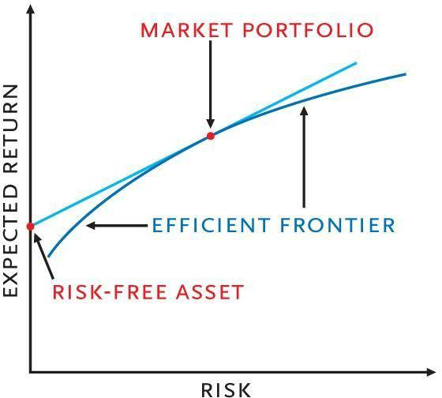

The landscape of finance is experiencing transformative shifts, with technology at its core, reshaping investment practices and financial operations. Algorithmic Trading, commonly referred to as 'Algo Trading', is a pivotal innovation in this domain. It revolutionizes decision-making processes by leveraging mathematical models and statistical analysis to execute trades with precision and speed. The essence of Algo Trading lies in its ability to systematically analyze market data, enabling traders to adopt strategies that would be impossible through manual trading alone. 

Understanding the risk-return spectrum is vital in Algo Trading, as it encapsulates the potential risks and benefits embedded within investment strategies utilized by automated trading systems. This spectrum delineates the essential balance between the expected gains from an investment and the risks involved in achieving those returns. Such an equilibrium is integral to formulating trading decisions that can navigate the complexities of financial markets, ensuring both profitability and sustainability.



The interplay between risk and return forms the foundation for informed trading decisions, a necessity for attaining favorable outcomes in an automated environment. This dynamic relationship guides traders in refining their strategies, striking a balance between aggressive gains and cautious risk management. Such a stance is crucial as traders aim to optimize their algorithms' performance, responding adeptly to ever-changing market conditions.

This article seeks to uncover the complexities of the risk-return spectrum within the context of Algo Trading. By examining the methods and management strategies that influence the success of trading algorithms, we aim to provide a comprehensive understanding of the strategic considerations involved. Further, by detailing key metrics and methodologies, this guide aspires to deepen an investor's comprehension of the opportunities and challenges inherent in Algo Trading.

## Table of Contents

## Understanding Risk and Return in Algo Trading

Risk and return are foundational concepts in finance, crucial to investments, and their significance is magnified in Algorithmic Trading (Algo Trading). Within this context, these terms significantly influence the performance of trading algorithms. 

Return in Algo Trading represents the gains or losses generated from an investment over a specified time frame. It can be evaluated through various methods, including absolute, relative, or risk-adjusted frameworks. Absolute returns focus on the total gains or losses irrespective of market conditions, while relative returns measure performance against a benchmark index or baseline. Risk-adjusted returns incorporate factors that account for the amount of risk taken to achieve those returns, thereby offering a more nuanced evaluation of performance.

Conversely, risk in Algo Trading pertains to the potential downsides or uncertainties inherent in trading activities. These include systematic risks, which affect the entire market or a broad segment; unsystematic risks, which are specific to a company or industry; and model-specific risks, which arise from the assumptions and methodologies employed by trading algorithms. Model-specific risks might include the failure to adapt to changing market conditions or the misinterpretation of complex data patterns, potentially leading to inaccurate predictions and suboptimal trading decisions.

Algorithmic strategies aim to strike a delicate balance between maximizing returns and minimizing risks. This balance is integral to defining successful trading practices within dynamic financial markets. By employing sophisticated models and continuously evaluating risk-return profiles, algorithmic traders can enhance their decision-making processes. This, in turn, allows them to optimize trading algorithms in pursuit of favorable financial outcomes, despite the complexities and uncertainties inherent in financial markets.

## Measuring Returns: Historical and Expected

Historical returns provide a retrospective insight into how an investment has performed over time, serving as a vital tool for [backtesting](/wiki/backtesting) trading strategies in Algorithmic Trading. By examining past performances, traders can establish baseline expectations and refine their strategies accordingly.

The measurement of historical returns can be carried out using several metrics, each offering a unique perspective on performance patterns:

1. **Compound Annual Growth Rate (CAGR)**: This metric indicates the mean annual growth rate of an investment over a specified period, assuming the investment had been compounded annually. It is calculated using the formula:
$$
   \text{CAGR} = \left(\frac{\text{Ending Value}}{\text{Beginning Value}}\right)^{\frac{1}{n}} - 1

$$

   where $n$ represents the number of years.

2. **Annualized Returns**: These are used to translate any duration of investment return into a yearly yield, offering a straightforward comparison method across various investments or time spans.

3. **Total Return**: This measure accounts for the overall increase in investment value, including dividends and interest, over a given period. It is expressed as a percentage of the initial investment.

Expected returns, in contrast, are inherently forward-looking, aiming to estimate potential future profits based on both historical data and predictive modeling. These projections utilize various financial models, with prominent ones including:

1. **Capital Asset Pricing Model (CAPM)**: This model describes the relationship between expected return and risk in a linear framework, positing that the expected return on an asset can be predicted by its beta (volatility in comparison to the market) relative to the expected market returns.
$$
   E(R_i) = R_f + \beta_i (E(R_m) - R_f)

$$

   where $E(R_i)$ is the expected return on the investment, $R_f$ is the risk-free rate, $\beta_i$ is the beta of the investment, and $E(R_m)$ is the expected market return.

2. **Arbitrage Pricing Theory (APT)**: Unlike CAPM, APT allows for multiple factors affecting returns, which expands beyond the single market index and captures a broader spectrum of risk factors, providing a multifactor view of expected returns.

A balanced view of both historical and expected returns enables algorithmic traders to forge stable yet ambitious trading strategies. By understanding the nuances from historical performance and forecasting future expectations, traders can optimize their algorithmic models to navigate market complexities more effectively, seeking to maximize their returns while maintaining a strategic oversight on potential risks.

## Assessing Risk in Algo Trading

Volatility, Value at Risk (VaR), and Conditional Value at Risk (CVaR) are essential metrics for evaluating risk in [algorithmic trading](/wiki/algorithmic-trading) systems, providing insight into potential market fluctuations and portfolio exposures.

Volatility serves as a quantifier of market uncertainty by measuring the extent of variation in trading values. Represented as the standard deviation of returns, it signals the degree of price variability over a specific period. High [volatility](/wiki/volatility-trading-strategies) indicates significant price swings, which could imply potential risks or opportunities within the market. Quantifying volatility is crucial for identifying the expected price range of an asset, guiding traders to make informed decisions.

The formula for volatility (σ) is:

$$
\sigma = \sqrt{\frac{\sum (R_t - \bar{R})^2}{N}}
$$

where $R_t$ is the return at time $t$, $\bar{R}$ is the average return, and $N$ is the number of observations.

Value at Risk (VaR) estimates the potential loss in an investment portfolio over a predetermined time frame under a specified confidence level, such as 95% or 99%. This metric helps traders assess the maximum expected loss they might face during normal market conditions, enabling them to gauge exposure to market risk. VaR is expressed in monetary terms or as a percentage of portfolio value.

In Python, VaR can be calculated using historical simulation:

```python
import numpy as np

def calculate_var(returns, confidence_level=0.95):
    sorted_returns = np.sort(returns)
    index = int((1 - confidence_level) * len(sorted_returns))
    return -sorted_returns[index]

# Example usage
returns = np.random.normal(0, 1, 10000)
var_95 = calculate_var(returns, 0.95)
```

Conditional Value at Risk (CVaR), or Expected Shortfall, delves deeper into risk assessment by analyzing potential losses beyond the VaR threshold, particularly in extreme adverse scenarios. CVaR provides a more comprehensive view of tail risk, addressing the limitations of VaR by estimating the average loss exceeding VaR. This makes CVaR a more robust tool for understanding risk under severe market downturns and is particularly useful for optimizing risk management strategies.

The understanding and application of these risk metrics equip algorithmic traders with the ability to navigate complex financial markets and design resilient trading strategies. By balancing the indicators of volatility, VaR, and CVaR, traders can effectively manage risk and strive for greater stability and profitability in their automated trading operations.

## Risk-Adjusted Return Metrics

Risk-adjusted return metrics provide an insightful evaluation of the performance of investment strategies relative to the risks incurred. In algorithmic trading, where precision and efficiency are paramount, these metrics are crucial for assessing the value of trading algorithms. Three prominent risk-adjusted return metrics are the Sharpe Ratio, Sortino Ratio, and Treynor Ratio.

The Sharpe Ratio measures the excess return per unit of risk, defined as:

$$
\text{Sharpe Ratio} = \frac{R_p - R_f}{\sigma_p}
$$

where $R_p$ represents the expected portfolio return, $R_f$ denotes the risk-free rate, and $\sigma_p$ corresponds to the standard deviation of the portfolio's excess return. A higher Sharpe Ratio indicates a more favorable risk-adjusted performance, helping traders distinguish strategies that potentially deliver superior returns.

The Sortino Ratio refines the Sharpe Ratio by focusing on downside risk, thereby accounting for negative volatility only. It is calculated as:

$$
\text{Sortino Ratio} = \frac{R_p - R_f}{\sigma_d}
$$

where $\sigma_d$ represents the standard deviation of the negative asset returns (downside deviation). This metric is advantageous in scenarios where negative fluctuations are of primary concern, offering traders a clearer understanding of the impact of adverse movements.

The Treynor Ratio, another vital measure, evaluates the excess return per unit of systemic risk using beta ($\beta$) instead of total risk. It is defined as:

$$
\text{Treynor Ratio} = \frac{R_p - R_f}{\beta_p}
$$

where $\beta_p$ reflects the portfolio's sensitivity to market movements. This ratio thereby concentrates on assessing the returns from risk attributed to market fluctuations alone.

Incorporating these risk-adjusted return metrics into algorithmic trading facilitates a comprehensive analysis of the risk-return efficiency of various strategies. By comparing potential positive outcomes against associated risks, traders are better equipped to optimize decision-making, selecting strategies that balance returns and the inherent risks effectively. These metrics thus serve as vital tools enabling traders to navigate complex financial environments with precision and insight.

## Risk Management Strategies

Effective risk management in algorithmic trading is essential to sustaining and enhancing trading performance. It involves employing strategies to manage potential losses while optimizing returns. Key strategies include diversification, hedging, stress testing, and leverage control.

Diversification is a fundamental strategy in managing risk, achieved by spreading investments across varied assets and trading strategies. This approach reduces the correlation between assets within a portfolio, thereby minimizing the impact of adverse price movements in any single asset. For example, an algorithmic trader may invest in both equities and bonds, alongside employing different trading strategies like [momentum](/wiki/momentum) and mean reversion, to achieve a diversified portfolio. This diversification helps reduce overall portfolio volatility and the likelihood of significant drawdowns.

Hedging serves as another strategic component of risk management. Through hedging, traders seek to offset potential losses in their investment positions by taking counterbalancing positions. Options, futures, and swaps are commonly used hedging tools that allow traders to manage specific risks like price declines. For instance, an options strategy such as a protective put can be employed where a put option is purchased to safeguard against declines in a stock's price.

Stress testing is a vital technique that simulates extreme market conditions to assess the resilience of trading strategies. This process involves subjecting the trading algorithms to hypothetical scenarios, like market crashes or volatility spikes, to understand how they would perform and what potential adjustments might be needed. Stress testing allows traders to identify vulnerabilities in their strategies and make informed adjustments to mitigate potential losses.

Leverage control is another important aspect of risk management. While leverage can amplify gains, it also increases the potential for losses. Thus, maintaining a prudent level of leverage is crucial to prevent large-scale losses, especially during volatile market periods. Algorithmic traders often set leverage limits to manage risk exposure effectively. In Python, leverage can be calculated as follows:

```python
portfolio_value = 1000000  # Example portfolio value
total_exposure = 3000000  # Example total exposure

leverage_ratio = total_exposure / portfolio_value
print("Leverage Ratio:", leverage_ratio)  # Output: Leverage Ratio: 3.0
```

A well-rounded approach to risk management involves combining these strategies, ensuring that trading systems can withstand unexpected market movements and adapt to changing market conditions. This approach allows for sustained trading performance, aligning the pursuit of returns with an acceptable risk profile. By implementing effective risk management protocols, algorithmic traders can optimize their strategies to achieve consistent and sustainable financial success.

## Real-World Applications of Algo Trading

High-Frequency Trading ([HFT](/wiki/high-frequency-trading-strategies)), quantitative funds, and robo-advisors represent significant advancements in the application of algorithmic trading in modern finance. Each of these platforms capitalizes on algorithmic strategies, designed to optimize the delicate balance between risk and return in line with prevailing market conditions and investor expectations.

High-Frequency Trading (HFT) involves executing a large number of orders at extremely high speeds, often fractions of a second. This approach leverages advanced technological systems and complex algorithms to capture profitable opportunities from minute price discrepancies. The speed and [volume](/wiki/volume-trading-strategy) of trades necessitate meticulous risk management strategies to mitigate potential losses due to the inherent market volatility and operational risks. The key risk management technique employed in HFT includes volatility-based adjustments, which enable traders to dynamically alter their positions based on real-time market fluctuations.

Quantitative funds utilize mathematical models and statistical techniques to inform investment decisions. These funds rely on vast datasets to uncover patterns and correlations that are not visible through traditional analysis. The algorithmic strategies in quantitative funds are designed to optimize asset allocation and manage risk through diversification, ensuring that the portfolio maintains stability across diverse market scenarios. The mathematical foundation of these strategies can be illustrated by employing techniques such as regression analysis, which predicts future asset performance based on historical trends.

Robo-advisors automate investment management processes for retail investors, offering personalized portfolio recommendations based on individual risk tolerance and financial goals. By utilizing algorithms to rebalance portfolios and execute trades, robo-advisors provide cost-effective and efficient financial solutions. The risk management approach includes continuous portfolio monitoring and automatic rebalancing to maintain alignment with predefined risk-return profiles.

In each application, the algorithmic strategies are meticulously calibrated to meet the specific demands of the respective trading scenarios. A sample Python code snippet might be used in a quantitative fund's algorithm to compute the expected return of a portfolio using the Capital Asset Pricing Model (CAPM):

```python
def calculate_expected_return(rf, beta, market_return):
    return rf + beta * (market_return - rf)

# Example inputs
risk_free_rate = 0.02  # 2% risk-free rate
beta = 1.5  # Portfolio's beta
market_return = 0.08  # 8% expected market return

expected_return = calculate_expected_return(risk_free_rate, beta, market_return)
print(f"Expected Return: {expected_return:.2%}")
```

In conclusion, the application of algorithmic trading in high-frequency trading, quantitative funds, and robo-advisors highlights the importance of aligning sophisticated algorithms with robust risk management practices to achieve the desired financial outcomes.

## Conclusion

The risk-return spectrum in Algorithmic Trading is a delicate equilibrium that demands continuous evaluation and strategic recalibration. To navigate the complexities of this financial landscape effectively, a robust grasp of both risk and return, along with their metrics and management strategies, is indispensable. The dynamic nature of financial markets necessitates that traders continuously refine the algorithms governing their trades to adapt to new information and shifting conditions.

Understanding risk and return goes beyond simply mastering their definitions; it involves an intricate analysis of how they interact. Risk is not just a [factor](/wiki/factor-investing) to be mitigated but a necessary component of potential returns. Thus, algorithmic strategies must be designed with a keen awareness of the balance between maximizing returns and limiting risk exposure. This harmonization can be achieved through the application of risk-adjusted metrics like the Sharpe Ratio, which helps in gauging the excess return per unit of risk taken.

Moreover, aligning strategic objectives with robust risk management practices ensures that algorithmic performance is optimized, thereby securing sustainable financial success. Diversification, hedging, and leverage control are strategies that play an essential role in managing the uncertainties inherent in trading. Utilizing these strategies alongside advanced techniques, such as stress testing and scenario analysis, traders can better foresee and mitigate the impact of unexpected market movements.

In conclusion, the true art of Algorithmic Trading lies in the ongoing pursuit of this balance. By persistently evaluating and refining their strategies, traders can harness the full potential of their algorithms, achieving not only impressive returns but also durability in the face of market volatility. The equation of sustainable success in Algo Trading is therefore written as a continuous function of adaptation, evaluation, and strategic reformation.

## References & Further Reading

[1]: ["Advances in Financial Machine Learning"](https://www.amazon.com/Advances-Financial-Machine-Learning-Marcos/dp/1119482089) by Marcos Lopez de Prado

[2]: ["Algorithmic Trading: Winning Strategies and Their Rationale"](https://www.amazon.com/Algorithmic-Trading-Winning-Strategies-Rationale/dp/1118460146) by Ernest P. Chan

[3]: Fabozzi, F. J., Focardi, S. M., & Kolm, P. N. (2010). ["Quantitative Equity Investing: Techniques and Strategies."](https://www.semanticscholar.org/paper/Quantitative-Equity-Investing%3A-Techniques-and-Fabozzi-Focardi/1c49a2a53919f7e65cb96f16691b8ff726fd3cd7) Wiley.

[4]: ["Machine Learning for Asset Managers"](https://github.com/emoen/Machine-Learning-for-Asset-Managers) by Marcos Lopez de Prado

[5]: ["Quantitative Risk Management: Concepts, Techniques, and Tools"](https://www.amazon.com/Quantitative-Risk-Management-Techniques-Princeton/dp/0691122555) by Alexander J. McNeil, Rudiger Frey, and Paul Embrechts

[6]: Poterba, J. M., & Summers, L. H. (1988). ["Mean Reversion in Stock Prices: Evidence and Implications."](https://www.sciencedirect.com/science/article/pii/0304405X88900219) Journal of Financial Economics.

[7]: ["Quantitative Finance for Dummies"](https://www.amazon.com/Quantitative-Finance-Dummies-Steve-DPhil/dp/1118769465) by Steven Collins

[8]: Hull, J. C. (2015). ["Risk Management and Financial Institutions"](https://archive.org/download/quant_books/Risk%20Management%20_%20Financial%20Institutions%20-%20J.%20C.%20Hull.pdf) Wiley Finance.