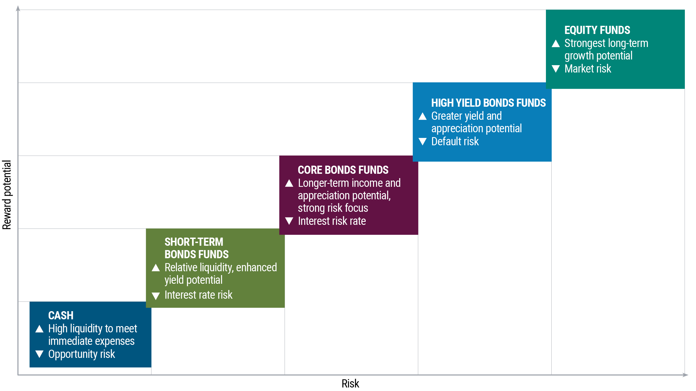

## Table of Contents

## What is the risk-return spectrum in the context of algo trading?

In algo trading, the risk-return spectrum refers to the balance between the potential profits you can make and the risks you take when using automated trading systems. When you set up an algo trading strategy, you need to decide how much risk you are willing to take. If you choose a strategy with high risk, you might have the chance to earn more money, but you also have a higher chance of losing money. On the other hand, if you pick a strategy with low risk, your potential profits might be smaller, but you are less likely to lose a lot of money.

Understanding where your algo trading strategy falls on the risk-return spectrum is important for managing your investments wisely. For example, a strategy that trades frequently and uses a lot of leverage might be on the high-risk end of the spectrum. This could lead to big gains if the market moves in your favor, but it could also result in big losses if the market goes against you. A strategy that trades less often and uses less leverage might be on the low-risk end, offering more stable but smaller returns. Knowing this helps you choose a strategy that matches your comfort with risk and your financial goals.

## How does risk and return correlate in algorithmic trading strategies?

In algorithmic trading, risk and return go hand in hand. If you want to make more money, you usually have to take bigger risks. This means that if your algo trading strategy is set up to aim for high returns, it will likely involve more risk. For example, if your strategy uses a lot of borrowed money (leverage) or trades very often, it might make big profits, but it could also lead to big losses if things don't go as planned.

On the other hand, if you prefer to keep your risks low, you'll probably see smaller returns. A strategy that trades less often and uses less leverage is safer, but it won't make as much money. It's all about finding a balance that you're comfortable with. Understanding this relationship helps you pick the right strategy for your goals and how much risk you're willing to take.

## What are the basic types of algorithmic trading strategies and their positions on the risk-return spectrum?

There are several basic types of algorithmic trading strategies, each with its own position on the risk-return spectrum. One common strategy is [trend following](/wiki/trend-following), where the algorithm tries to make money by following the direction of the market. This strategy is usually in the middle of the risk-return spectrum. It can make good profits if the market keeps moving in one direction, but it can also lose money if the market suddenly changes direction. Another strategy is mean reversion, which bets that prices will go back to their average after moving away from it. This strategy is often seen as lower risk because it doesn't rely on big market moves, but the returns might be smaller too.

Arbitrage strategies are on the lower end of the risk-return spectrum. These strategies look for price differences between markets and try to make money from those differences. They are generally safer because they don't depend on the overall direction of the market, but the profits can be small. On the other hand, high-frequency trading ([HFT](/wiki/high-frequency-trading-strategies)) strategies are on the high-risk, high-return end of the spectrum. HFT strategies trade very quickly, often in milliseconds, to take advantage of tiny price changes. They can make a lot of money, but they also need a lot of technology and can lose money just as fast if the market moves against them.

Choosing the right strategy depends on how much risk you're willing to take and what kind of returns you're looking for. If you want steady, smaller gains with less risk, you might go for mean reversion or [arbitrage](/wiki/arbitrage). If you're okay with more risk for the chance of bigger profits, trend following or high-frequency trading might be more your style.

## How can beginners assess the risk of an algo trading strategy?

Beginners can assess the risk of an algo trading strategy by first looking at how much money they could lose. This means checking the strategy's historical performance to see the biggest loss it had in the past. This is called the maximum drawdown. If the strategy lost a lot of money at some point, it might be riskier. They should also look at how often the strategy loses money. If it loses money a lot, even if the losses are small, it could still be risky.

Another way to assess risk is by looking at how much the strategy uses borrowed money, or leverage. More leverage means more risk because it can make losses bigger. Beginners should also think about how often the strategy trades. Strategies that trade a lot can be riskier because they have more chances to lose money. It's important to understand all these things to decide if a strategy is too risky or just right for them.

Lastly, beginners can use a risk-reward ratio to see if the strategy is worth the risk. This ratio compares how much money the strategy could make to how much it could lose. A good strategy should have a high risk-reward ratio, meaning the potential gains are much bigger than the potential losses. By looking at all these factors, beginners can get a good idea of how risky an algo trading strategy is and choose one that fits their comfort level with risk.

## What metrics should be used to evaluate the return of an algo trading strategy?

To evaluate the return of an algo trading strategy, you should look at the total return. This is how much money the strategy makes over time. You can see this by looking at the percentage gain from the starting amount. Another important metric is the annualized return, which shows what the strategy would earn in a year if it kept performing the same way. This helps you compare different strategies no matter how long they've been running.

Another useful metric is the Sharpe ratio. This tells you how much return you're getting for the risk you're taking. A higher Sharpe ratio means the strategy is doing a good job of making money without taking too much risk. You should also check the profit [factor](/wiki/factor-investing), which is the total money made divided by the total money lost. A profit factor above 1 means the strategy is making more than it's losing, which is good. By looking at these metrics, you can get a clear picture of how well an algo trading strategy is doing and decide if it's worth using.

## How do market conditions affect the risk-return profile of algo trading strategies?

Market conditions play a big role in how risky or rewarding an algo trading strategy can be. When the market is going up and everything is stable, strategies that follow trends or use leverage can make a lot of money. They seem less risky because the market is moving in a predictable way. But if the market suddenly changes or becomes very unpredictable, these same strategies can become very risky. They might lose a lot of money fast if they're not ready for the change. So, what looks like a good strategy in a calm market can turn into a risky one when things get shaky.

Different market conditions can also change how well certain strategies work. For example, arbitrage strategies, which look for price differences between markets, might do well in calm markets where prices are stable. But in a fast-moving or volatile market, those price differences might not last long enough to make money. On the other hand, high-frequency trading strategies might do better in volatile markets because they can take advantage of quick price changes. But they can also lose money quickly if the market moves against them. Understanding how market conditions can affect a strategy helps traders pick the right one for the current situation and manage their risks better.

## What are some advanced techniques for managing risk in algorithmic trading?

One advanced technique for managing risk in algorithmic trading is using stop-loss orders. A stop-loss order is like a safety net that automatically sells a stock or closes a trade if the price drops to a certain level. This helps limit how much money you can lose on a single trade. Another technique is diversification, which means not putting all your money into one strategy or one type of asset. By spreading your money across different strategies and markets, you can reduce the risk of losing everything if one strategy goes bad.

Another important technique is using risk management algorithms. These are special programs that keep an eye on how much risk you're taking and can change your trading strategy if things get too risky. For example, if the market starts to get very unpredictable, the algorithm might reduce how much money you're using or stop trading until things calm down. It's also smart to use backtesting and stress testing. Backtesting means running your strategy on past market data to see how it would have done. Stress testing means seeing how your strategy would handle really bad market conditions. These tests help you understand how your strategy might perform in different situations and make it safer.

## How can traders optimize their algo trading strategies for better risk-adjusted returns?

Traders can optimize their algo trading strategies for better risk-adjusted returns by fine-tuning their parameters. This means changing things like how long they hold onto a trade or how much money they use for each trade. They can also use something called optimization algorithms to find the best settings for their strategy. These algorithms test different settings and pick the ones that give the best returns for the least amount of risk. It's important for traders to keep testing and updating their strategies because what works well today might not work as well tomorrow.

Another way to optimize for better risk-adjusted returns is by using risk management tools. These tools help traders keep an eye on how much risk they're taking and make smart decisions. For example, they might use stop-loss orders to limit how much money they can lose on a single trade. They can also spread their money across different strategies and markets, which is called diversification. This way, if one strategy doesn't do well, the others might still make money. By using these tools and always looking for ways to improve, traders can make their strategies safer and more profitable over time.

## What role does portfolio diversification play in managing risk in algo trading?

Portfolio diversification is super important in managing risk when you're doing algo trading. It means you don't put all your money into one strategy or one type of investment. Instead, you spread it out. This way, if one of your strategies loses money, the others might still be making money, which helps balance things out. It's like not putting all your eggs in one basket. If you drop one basket, you still have other eggs safe in different baskets.

By diversifying, you can lower the overall risk of your trading. For example, if you have strategies that work well in different market conditions, like some that do better when the market is going up and others that do better when it's going down, you're more likely to make money no matter what the market does. This makes your trading safer and helps you get better returns for the amount of risk you're taking. So, diversification is a smart way to protect your money and keep your trading stable.

## How do high-frequency trading strategies fit into the risk-return spectrum?

High-frequency trading strategies are on the high-risk, high-return end of the risk-return spectrum. These strategies use powerful computers to buy and sell stocks very quickly, often in milliseconds. They try to make money from tiny price changes in the market. Because they trade so fast and so often, they can make a lot of money if everything goes right. But, they can also lose a lot of money just as fast if the market moves against them. So, high-frequency trading is risky because it depends a lot on technology and quick market changes.

To manage this risk, people who use high-frequency trading need special tools and systems. They use things like very fast internet connections and special software to make sure their trades happen as fast as possible. They also use risk management algorithms to keep an eye on how much risk they're taking and to make changes if things get too risky. Even with these tools, high-frequency trading is still a high-risk way to make money, but it can also lead to big returns if done right.

## What are the regulatory considerations impacting the risk-return dynamics in algo trading?

Regulations can really change how risky or rewarding algo trading is. Different countries have rules about how much money you can borrow to trade, which is called leverage. If the rules say you can't borrow a lot of money, then your strategies might be less risky because you can't lose as much. But, you might also make less money because you're not using as much leverage. Also, some places have rules about how often you can trade or how you have to report your trades. These rules can make it harder to do high-frequency trading, which is a high-risk, high-reward strategy.

Another way regulations affect algo trading is by trying to make markets fair and safe. For example, there are rules to stop people from using secret information to make money, which is called insider trading. These rules can make the market more predictable, which might make some strategies less risky. But, they can also make it harder to find good trading opportunities. So, when you're setting up an algo trading strategy, you need to think about the rules in your country and how they might change the risks and rewards of what you're doing.

## How can machine learning and AI be utilized to enhance the risk-return profile of algo trading strategies?

Machine learning and AI can really help make algo trading strategies better by finding patterns in the market that people might miss. They can look at a lot of data, like past prices, news, and even social media, to figure out what might happen next in the market. This helps traders make smarter decisions about when to buy or sell. For example, [machine learning](/wiki/machine-learning) can learn from what worked well in the past and use that to make the strategy better. It can also keep an eye on how the strategy is doing and change things if it starts to lose money. This makes the strategy safer because it can adapt to new market conditions.

AI can also help manage risk better. It can use special algorithms to see how much risk the strategy is taking and make changes if it gets too risky. For instance, if the market starts to get unpredictable, AI can decide to trade less or use less borrowed money to protect the trader's money. This way, the strategy can still try to make good returns but with less risk. By using machine learning and AI, traders can create strategies that are smarter, safer, and more likely to make money over time.

## How can we measure returns, considering both historical and expected data?

Historical returns provide a retrospective insight into how an investment has performed over time, serving as a vital tool for [backtesting](/wiki/backtesting) trading strategies in Algorithmic Trading. By examining past performances, traders can establish baseline expectations and refine their strategies accordingly.

The measurement of historical returns can be carried out using several metrics, each offering a unique perspective on performance patterns:

1. **Compound Annual Growth Rate (CAGR)**: This metric indicates the mean annual growth rate of an investment over a specified period, assuming the investment had been compounded annually. It is calculated using the formula:
$$
   \text{CAGR} = \left(\frac{\text{Ending Value}}{\text{Beginning Value}}\right)^{\frac{1}{n}} - 1

$$

   where $n$ represents the number of years.

2. **Annualized Returns**: These are used to translate any duration of investment return into a yearly yield, offering a straightforward comparison method across various investments or time spans.

3. **Total Return**: This measure accounts for the overall increase in investment value, including dividends and interest, over a given period. It is expressed as a percentage of the initial investment.

Expected returns, in contrast, are inherently forward-looking, aiming to estimate potential future profits based on both historical data and predictive modeling. These projections utilize various financial models, with prominent ones including:

1. **Capital Asset Pricing Model (CAPM)**: This model describes the relationship between expected return and risk in a linear framework, positing that the expected return on an asset can be predicted by its beta (volatility in comparison to the market) relative to the expected market returns.
$$
   E(R_i) = R_f + \beta_i (E(R_m) - R_f)

$$

   where $E(R_i)$ is the expected return on the investment, $R_f$ is the risk-free rate, $\beta_i$ is the beta of the investment, and $E(R_m)$ is the expected market return.

2. **Arbitrage Pricing Theory (APT)**: Unlike CAPM, APT allows for multiple factors affecting returns, which expands beyond the single market index and captures a broader spectrum of risk factors, providing a multifactor view of expected returns.

A balanced view of both historical and expected returns enables algorithmic traders to forge stable yet ambitious trading strategies. By understanding the nuances from historical performance and forecasting future expectations, traders can optimize their algorithmic models to navigate market complexities more effectively, seeking to maximize their returns while maintaining a strategic oversight on potential risks.

## How can we assess risk in algo trading?

Volatility, Value at Risk (VaR), and Conditional Value at Risk (CVaR) are essential metrics for evaluating risk in [algorithmic trading](/wiki/algorithmic-trading) systems, providing insight into potential market fluctuations and portfolio exposures.

Volatility serves as a quantifier of market uncertainty by measuring the extent of variation in trading values. Represented as the standard deviation of returns, it signals the degree of price variability over a specific period. High [volatility](/wiki/volatility-trading-strategies) indicates significant price swings, which could imply potential risks or opportunities within the market. Quantifying volatility is crucial for identifying the expected price range of an asset, guiding traders to make informed decisions.

The formula for volatility (σ) is:

$$
\sigma = \sqrt{\frac{\sum (R_t - \bar{R})^2}{N}}
$$

where $R_t$ is the return at time $t$, $\bar{R}$ is the average return, and $N$ is the number of observations.

Value at Risk (VaR) estimates the potential loss in an investment portfolio over a predetermined time frame under a specified confidence level, such as 95% or 99%. This metric helps traders assess the maximum expected loss they might face during normal market conditions, enabling them to gauge exposure to market risk. VaR is expressed in monetary terms or as a percentage of portfolio value.

In Python, VaR can be calculated using historical simulation:

```python
import numpy as np

def calculate_var(returns, confidence_level=0.95):
    sorted_returns = np.sort(returns)
    index = int((1 - confidence_level) * len(sorted_returns))
    return -sorted_returns[index]

# Example usage
returns = np.random.normal(0, 1, 10000)
var_95 = calculate_var(returns, 0.95)
```

Conditional Value at Risk (CVaR), or Expected Shortfall, delves deeper into risk assessment by analyzing potential losses beyond the VaR threshold, particularly in extreme adverse scenarios. CVaR provides a more comprehensive view of tail risk, addressing the limitations of VaR by estimating the average loss exceeding VaR. This makes CVaR a more robust tool for understanding risk under severe market downturns and is particularly useful for optimizing risk management strategies.

The understanding and application of these risk metrics equip algorithmic traders with the ability to navigate complex financial markets and design resilient trading strategies. By balancing the indicators of volatility, VaR, and CVaR, traders can effectively manage risk and strive for greater stability and profitability in their automated trading operations.

## What are Risk-Adjusted Return Metrics?

Risk-adjusted return metrics provide an insightful evaluation of the performance of investment strategies relative to the risks incurred. In algorithmic trading, where precision and efficiency are paramount, these metrics are crucial for assessing the value of trading algorithms. Three prominent risk-adjusted return metrics are the Sharpe Ratio, Sortino Ratio, and Treynor Ratio.

The Sharpe Ratio measures the excess return per unit of risk, defined as:

$$
\text{Sharpe Ratio} = \frac{R_p - R_f}{\sigma_p}
$$

where $R_p$ represents the expected portfolio return, $R_f$ denotes the risk-free rate, and $\sigma_p$ corresponds to the standard deviation of the portfolio's excess return. A higher Sharpe Ratio indicates a more favorable risk-adjusted performance, helping traders distinguish strategies that potentially deliver superior returns.

The Sortino Ratio refines the Sharpe Ratio by focusing on downside risk, thereby accounting for negative volatility only. It is calculated as:

$$
\text{Sortino Ratio} = \frac{R_p - R_f}{\sigma_d}
$$

where $\sigma_d$ represents the standard deviation of the negative asset returns (downside deviation). This metric is advantageous in scenarios where negative fluctuations are of primary concern, offering traders a clearer understanding of the impact of adverse movements.

The Treynor Ratio, another vital measure, evaluates the excess return per unit of systemic risk using beta ($\beta$) instead of total risk. It is defined as:

$$
\text{Treynor Ratio} = \frac{R_p - R_f}{\beta_p}
$$

where $\beta_p$ reflects the portfolio's sensitivity to market movements. This ratio thereby concentrates on assessing the returns from risk attributed to market fluctuations alone.

Incorporating these risk-adjusted return metrics into algorithmic trading facilitates a comprehensive analysis of the risk-return efficiency of various strategies. By comparing potential positive outcomes against associated risks, traders are better equipped to optimize decision-making, selecting strategies that balance returns and the inherent risks effectively. These metrics thus serve as vital tools enabling traders to navigate complex financial environments with precision and insight.

## References & Further Reading

[1]: ["Advances in Financial Machine Learning"](https://www.amazon.com/Advances-Financial-Machine-Learning-Marcos/dp/1119482089) by Marcos Lopez de Prado

[2]: ["Algorithmic Trading: Winning Strategies and Their Rationale"](https://www.amazon.com/Algorithmic-Trading-Winning-Strategies-Rationale/dp/1118460146) by Ernest P. Chan

[3]: Fabozzi, F. J., Focardi, S. M., & Kolm, P. N. (2010). ["Quantitative Equity Investing: Techniques and Strategies."](https://www.semanticscholar.org/paper/Quantitative-Equity-Investing%3A-Techniques-and-Fabozzi-Focardi/1c49a2a53919f7e65cb96f16691b8ff726fd3cd7) Wiley.

[4]: ["Machine Learning for Asset Managers"](https://github.com/emoen/Machine-Learning-for-Asset-Managers) by Marcos Lopez de Prado

[5]: ["Quantitative Risk Management: Concepts, Techniques, and Tools"](https://www.amazon.com/Quantitative-Risk-Management-Techniques-Princeton/dp/0691122555) by Alexander J. McNeil, Rudiger Frey, and Paul Embrechts

[6]: Poterba, J. M., & Summers, L. H. (1988). ["Mean Reversion in Stock Prices: Evidence and Implications."](https://www.sciencedirect.com/science/article/pii/0304405X88900219) Journal of Financial Economics.

[7]: ["Quantitative Finance for Dummies"](https://www.amazon.com/Quantitative-Finance-Dummies-Steve-DPhil/dp/1118769465) by Steven Collins

[8]: Hull, J. C. (2015). ["Risk Management and Financial Institutions"](https://archive.org/download/quant_books/Risk%20Management%20_%20Financial%20Institutions%20-%20J.%20C.%20Hull.pdf) Wiley Finance.