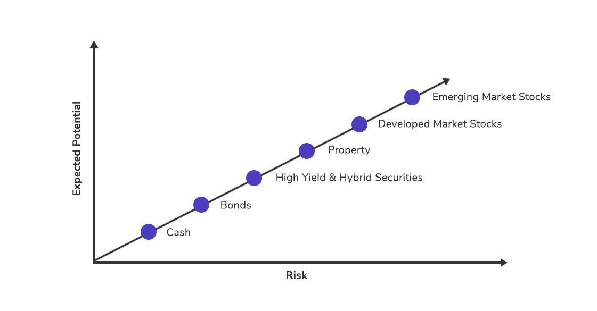

The risk-return spectrum is a foundational concept in finance, encapsulating the trade-off between the risk associated with an investment and its expected returns. In essence, it highlights the relationship where higher potential returns come with increased risk, and conversely, lower risk typically offers lesser returns. This understanding is pivotal in algorithmic trading, a field where strategies are formulated and executed by algorithms designed to capitalize on market opportunities.

In algorithmic trading, grasping the intricacies of the risk-return spectrum serves as a cornerstone for crafting strategies that balance financial gains against potential losses. Algorithms can be tailored to different points on the spectrum, from conservative approaches that prioritize stability to aggressive tactics aiming for higher returns. Each strategy's position is determined by factors such as market volatility, leverage, and the assets traded.



This article intends to explore the risk-return spectrum specifically within the context of algorithmic trading. By evaluating various strategies and methods, traders can better navigate market complexities and make informed decisions. Understanding the probability distributions of returns and employing statistical measures such as the Sharpe ratio can further refine strategy evaluation, enhancing decision-making.

Common misconceptions about algorithmic trading, particularly the overestimation of potential returns without duly considering associated risks, will also be addressed. Emphasizing the significance of risk management, the article will discuss how traders can employ techniques like diversification and stop-loss orders to mitigate risks, ensuring a balanced approach.

The fast-evolving nature of financial markets and the ongoing technological advancements mean that algorithmic trading is continually adapting. By mastering the risk-return spectrum and employing strategic risk management, traders can better position themselves for success in this dynamic landscape.

## Table of Contents

## Understanding the Risk-Return Spectrum

The risk-return spectrum is a foundational concept for investors and traders, equating higher potential returns with increased risk. Within algorithmic trading, strategies are positioned along this spectrum based on their design and execution mechanisms. Low-risk, low-return strategies typically prioritize capital preservation and steady income over time, while high-risk, high-return strategies may involve intricate maneuvers requiring substantial capital and carrying significant uncertainty.

In [algorithmic trading](/wiki/algorithmic-trading), the position of a strategy on this spectrum is influenced by several factors:

1. **Market Volatility**: Strategies must account for the inherent fluctuations in asset prices. High market volatility can increase potential returns but also heighten the risk of significant losses. For example, momentum-based strategies thrive in volatile environments, potentially occupying a high-risk, high-return position on the spectrum.

2. **Leverage**: Utilizing leverage can amplify both gains and losses. Traders employing significant leverage are generally at the higher risk end of the spectrum, as the potential for exponential losses is increased. Leverage also allows traders to engage in more complex strategies, such as pair trading or spread betting, which may offer higher returns but at greater risk.

3. **Asset Types**: Different asset classes carry varying levels of inherent risk, impacting the strategy's risk-return profile. Equities, cryptocurrencies, and commodities often exhibit higher volatility as compared to bonds or forex, which tend to provide more stable returns.

4. **Historical Performance and Future Risks**: Traders must conduct thorough backtesting and forward testing of their algorithms to understand historical performance. Using statistical models, such as Value at Risk (VaR) or the Sharpe Ratio, traders can estimate potential future risks and adjust their strategies accordingly. For instance, the Sharpe Ratio, $S = \frac{R_p - R_f}{\sigma_p}$, where $R_p$ is the return of the strategy, $R_f$ is the risk-free rate, and $\sigma_p$ is the standard deviation of the strategy's excess return, measures a strategy's risk-adjusted return and helps in positioning the strategy on the risk-return spectrum.

Examples of Algorithmic Strategies Across the Spectrum:

- **Conservative Strategies**: These might include index rebalancing and statistical arbitrage, where the focus is on capturing small inefficiencies in asset prices with minimal risk exposure. Such strategies often utilize historical price data and regression techniques to identify and exploit market opportunities.

- **Aggressive Strategies**: High-frequency trading (HFT) and event-driven strategies often sit at the high-risk, high-return end. These strategies leverage speed and advanced computational techniques to profit from rapid market changes, requiring robust infrastructure to manage the associated technological and market risks.

In positioning strategies along the risk-return spectrum, algorithmic traders must weigh these factors carefully. Balancing risk and return is central to crafting robust trading strategies capable of withstanding market vicissitudes while aiming for desired financial outcomes.

## Algorithmic Trading Strategies and Their Risks

Algorithmic trading comprises several strategies, each characterized by distinct approaches and associated risks. High-frequency trading ([HFT](/wiki/high-frequency-trading-strategies)) is one such strategy, involving rapid execution of orders to capitalize on minute price discrepancies in financial markets. While HFT can yield significant returns due to its velocity and [volume](/wiki/volume-trading-strategy) of trades, it also involves substantial technological and operational risks. The technological infrastructure must be robust, as latency or system failures could lead to substantial financial losses. Moreover, HFT is susceptible to regulatory scrutiny and market [volatility](/wiki/volatility-trading-strategies), factors that further compound its risk profile.

Trend-following strategies are another common form of algorithmic trading. These strategies attempt to capture gains through the identification and following of market trends. While trend-following can benefit from prolonged market movements, it poses risks such as whipsawing, where prices briefly reverse direction before resuming the original trend. Additionally, these strategies may struggle in sideways or choppy market conditions where clear trends are not evident.

Arbitrage strategies, which seek to exploit price differences between markets or instruments, are considered lower risk due to their nature of capitalizing on asset mispricings. However, they are not devoid of risk. Market inefficiencies can swiftly disappear, and execution risks arise if an algorithm cannot trade simultaneously across venues, potentially leading to adverse price movements.

A common theme across these strategies is the influence of market conditions, technological robustness, and execution efficiency on their risk profiles. High-frequency trading, for instance, is highly dependent on market [liquidity](/wiki/liquidity-risk-premium) and the ability to execute trades at speed. Trend-following strategies require keen market insights and timely reaction to trend shifts, while [arbitrage](/wiki/arbitrage) strategies depend heavily on the persistence of price discrepancies.

Crucially, understanding these risks is vital for effective risk management. Mapping algorithmic strategies onto the risk-return spectrum is essential for determining their appropriateness given an investor's risk tolerance. For instance, while HFT may be placed on the higher-risk end of the spectrum due to its reliance on technological sophistication and fast-moving markets, arbitrage may be situated towards the lower-risk end because of its generally conservative approach. Trend-following can vary, relying on market conditions and the trader’s ability to accurately identify trends.

Effective management of these risk factors can be achieved through strategies such as diversification, technological improvements, and constant monitoring of market conditions. By comprehensively evaluating these risks, traders can make informed decisions that align with their risk appetite and investment goals, ultimately striving to achieve a balanced risk-return profile.

## Realistic Return Expectations in Algo Trading

Setting realistic return expectations is essential for any trader involved in algorithmic trading. Although stories about stellar returns can be appealing, they often fail to account for the inherent risks associated with achieving such outcomes. In the world of algorithmic trading, where strategies are executed at an accelerated pace, balancing potential gains with an understanding of risk is crucial.

### Variability in Returns

The average return rates for algorithmic trading firms can fluctuate significantly. Factors influencing these variations include:

1. **Market Conditions**: Volatility and liquidity can greatly impact the performance of an algorithmic strategy. In high volatility markets, strategies might achieve higher returns but also experience increased risk.

2. **Trading Capital**: The amount of trading capital influences potential returns. Larger trading volumes can capture more significant price moves but also necessitate carefully managed risk to avoid substantial losses.

3. **Strategy Specifics**: Different algorithmic strategies such as market making, statistical arbitrage, or machine learning-based approaches yield disparate return profiles. Each has distinct risk-return dynamics based on the frequency of trades, holding periods, and the use of leverage.

### Industry Insights on Return Rates

Industry insights suggest that while some algorithmic strategies can achieve annual returns exceeding 10% to 20%, these numbers are not uniform across all firms or strategies. The potential for variance is high, and traders should be wary of strategies promising extraordinary returns without detailed risk assessments.

### Risk Metrics and Return Comparison

When setting expectations for returns, it is essential to consider risk-adjusted measures. One popular metric is the Sharpe Ratio, which evaluates the return of an investment compared to its risk. The Sharpe Ratio is calculated as:

$$
\text{Sharpe Ratio} = \frac{E[R] - R_f}{\sigma}
$$

where $E[R]$ is the expected return, $R_f$ is the risk-free rate, and $\sigma$ is the standard deviation of the returns.

Using the Sharpe Ratio, algorithmic traders can compare strategies on a risk-adjusted basis, enabling them to choose strategies that offer the best return for the level of risk taken. A high Sharpe Ratio indicates a greater return per unit of risk, which is desirable in managing long-term profitability and sustainability.

In conclusion, while algorithmic trading offers the potential for significant returns, they often entail considerable risk. By establishing realistic return expectations and employing tools like the Sharpe Ratio, traders can better align their strategic goals with achievable outcomes while ensuring effective risk management.

## Risk Management Techniques

Effective risk management is critical for successfully navigating the risk-return spectrum in algorithmic trading. This involves implementing strategies such as diversification, stop-loss orders, and position sizing to mitigate potential losses and optimize returns.

Diversification is a fundamental risk management technique that involves spreading investments across various assets or markets to reduce exposure to any single source of risk. By diversifying, traders can potentially minimize the impact of adverse market movements on their portfolio. For example, consider an algorithm trading equities, commodities, and foreign exchange. If one sector performs poorly, the others may perform well, thereby stabilizing overall returns.

Stop-loss orders are another essential tool. These are predefined levels at which a position is automatically closed to limit potential losses. For instance, a trader sets a stop-loss order at 5% below the purchase price. If the asset price declines to this level, the stop-loss order triggers a sell, thereby capping the loss.

Position sizing is the process of determining the amount of capital allocated to each trade, which is crucial for managing risk exposure. By using a fixed fractional approach, traders allocate a percentage of their capital to each trade, thereby limiting the potential loss to a manageable level. For instance, if a trader allocates 2% of their capital to each position, a string of losing trades will maintain a limited impact on the overall portfolio.

Algorithmic traders leverage technological tools and statistical models to monitor real-time market conditions and adjust their risk exposure accordingly. Utilization of Value at Risk (VaR) models quantifies the potential loss in value of a portfolio with a given probability over a specific horizon. Furthermore, the implementation of Monte Carlo simulations allows traders to assess the impact of risk through numerous random scenarios, thus enabling more informed decision-making.

In code, a basic example of calculating position size using the fixed fractional method can be implemented in Python:

```python
def calculate_position_size(capital, risk_per_trade, stop_loss):
    return (capital * risk_per_trade) / stop_loss

# Example usage
capital = 100000  # Total trading capital
risk_per_trade = 0.02  # 2% risk per trade
stop_loss = 500  # Stop-loss amount for a trade

position_size = calculate_position_size(capital, risk_per_trade, stop_loss)
print(f"Position size: {position_size}")
```

Achieving a balance between risk and reward requires traders to engage in meticulous planning and ongoing strategy adjustments. Incorporating a combination of these techniques allows traders to better control risks while capitalizing on potential market opportunities. Effective risk management not only safeguards investments but also enhances the stability of long-term returns in algorithmic trading.

## Future Trends in Algorithmic Trading

The future of algorithmic trading is increasingly intertwined with the advancement of [artificial intelligence](/wiki/ai-artificial-intelligence) (AI) and [machine learning](/wiki/machine-learning) (ML). These technologies are redefining the framework of algorithmic strategies, allowing for more sophisticated models that can adapt quickly to market changes. AI and ML algorithms enable traders to analyze large datasets with high efficiency, identifying patterns and insights that were previously inaccessible. These advancements offer the potential to enhance trading algorithms by refining prediction models, optimizing execution strategies, and ultimately improving the risk-return profile of investments.

The adoption of AI and ML in algorithmic trading is facilitating the development of autonomous trading systems. These systems can operate with minimal human intervention, processing real-time data to make informed trading decisions. Such systems can adjust strategies based on market sentiment analysis, which uses natural language processing (NLP) to gauge the mood of financial news and social media. This ability to incorporate qualitative data into quantitative models provides traders with a more comprehensive view of market dynamics.

Moreover, as financial markets evolve, algorithmic trading must keep pace with changes in regulations and market structures. The introduction of new regulatory frameworks often necessitates changes in trading algorithms to ensure compliance while maintaining competitive edge. For example, regulatory changes around data privacy rules could impact how traders access and utilize data for algorithm development.

Technological innovations continue to broaden the horizons of algorithmic trading. The rise of quantum computing, for instance, has the potential to revolutionize the speed and complexity of calculations in trading models. While still in developmental stages, quantum computing could significantly enhance computational capabilities, allowing for the processing of complex algorithms that traditional computers cannot handle efficiently.

The shift towards cloud computing and high-performance computing resources also supports the scalability of trading systems. Access to vast computational power enables traders to run multiple strategies simultaneously and conduct extensive [backtesting](/wiki/backtesting) to validate their effectiveness.

As these trends unfold, they present new challenges and opportunities in risk management. Traders must weigh the benefits of technological advancements against potential risks such as increased system vulnerabilities and the ethical considerations of AI-driven decision-making. The integration of these technologies necessitates robust risk management frameworks to safeguard against unforeseen market movements and technological failures.

In conclusion, the integration of AI and ML into algorithmic trading represents a pivotal shift towards more intelligent and efficient trading systems. These trends are set to reshape the risk-return dynamics as traders harness the power of technology to achieve optimal performance in increasingly complex financial environments. As these innovations continue to evolve, algorithmic trading will likely advance in sophistication, requiring continual adaptation to maintain relevance and competitive advantage.

## Conclusion

Navigating the risk-return spectrum in algorithmic trading demands a thorough comprehension of market dynamics and strategic foresight. Traders are tasked with meticulously evaluating their risk tolerance, ensuring their strategies are calibrated to realistic return expectations. The allure of significant financial gains is undeniable, yet it is invariably accompanied by increased risk levels, highlighting the critical importance of robust risk management protocols. As algorithmic trading evolves, incorporating cutting-edge technologies and sophisticated methodologies, it presents vast opportunities for those adept at balancing risk and reward. This article has endeavored to furnish a holistic overview of the risk-return spectrum in algorithmic trading, equipping traders with the knowledge required to make judicious decisions. Through strategic planning and risk assessment, traders can optimize their approaches, aligning them with both their financial goals and their risk appetites, thus navigating the complexities of algorithmic trading with confidence.

## References & Further Reading

[1]: "Advances in Financial Machine Learning" by Marcos Lopez de Prado. Available at [Amazon](https://www.amazon.com/Advances-Financial-Machine-Learning-Marcos/dp/1119482089).

[2]: "Machine Learning for Algorithmic Trading" by Stefan Jansen. Available at [Amazon](https://www.amazon.com/Machine-Learning-Algorithmic-Trading-alternative/dp/1839217715).

[3]: Bergstra, J., Bardenet, R., Bengio, Y., & Kégl, B. (2011). "Algorithms for Hyper-Parameter Optimization." Advances in Neural Information Processing Systems 24. Available online at [NIPS](https://proceedings.neurips.cc/paper/2011/file/86e8f7ab32cfd12577bc2619bc635690-Paper.pdf).

[4]: "Evidence-Based Technical Analysis: Applying the Scientific Method and Statistical Inference to Trading Signals" by David Aronson. Available at [Wiley](https://www.wiley.com/en-us/Evidence+Based+Technical+Analysis%3A+Applying+the+Scientific+Method+and+Statistical+Inference+to+Trading+Signals-p-9780470008744).

[5]: "Quantitative Trading: How to Build Your Own Algorithmic Trading Business" by Ernest P. Chan. Available at [Amazon](https://www.amazon.com/Quantitative-Trading-Build-Algorithmic-Business/dp/1119800064).

[6]: "Algorithmic Trading: Winning Strategies and Their Rationale" by Ernie Chan. Available at [Amazon](https://www.amazon.com/Algorithmic-Trading-Winning-Strategies-Rationale/dp/1118460146).

[7]: "The Science of Algorithmic Trading and Portfolio Management" by Robert Kissell. Available at [Elsevier](https://storage.sandtears.com/06_Book/The%20Science%20of%20Algorithmic%20Trading%20and%20Portfolio%20Management%2C%20Robert%20Kissell.pdf).