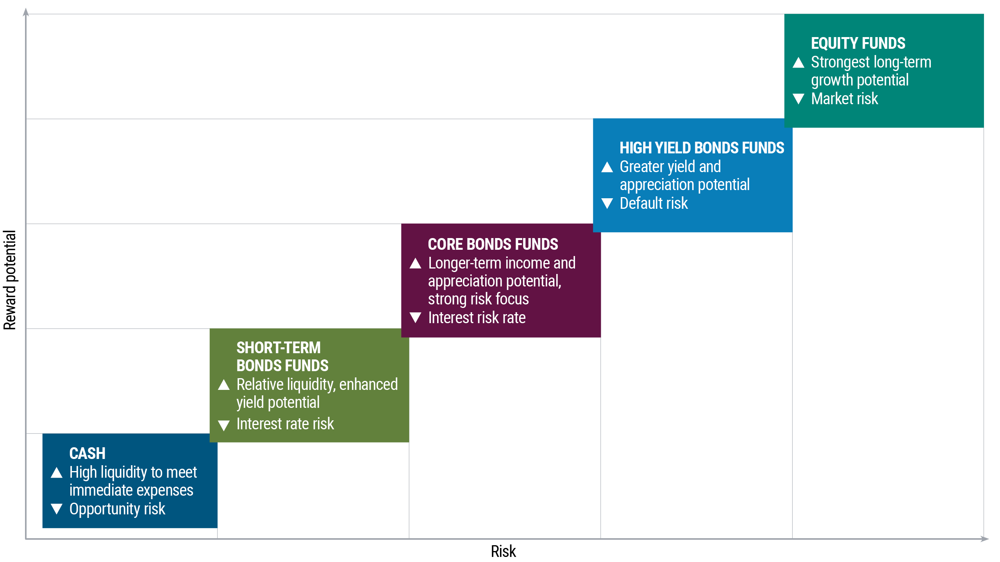

## Table of Contents

## What is the risk-return spectrum?

The risk-return spectrum is a way to understand how much risk you take when you invest your money and how much reward you might get. Imagine a line where one end is very safe, like keeping your money in a savings account, and the other end is very risky, like investing in new, untested companies. The safer your investment, the less money you might make, but you also won't lose much. On the other hand, the riskier your investment, the more money you could make, but you could also lose a lot.

This spectrum helps people decide where to put their money based on how much risk they are willing to take. For example, if you don't want to lose any money, you might choose a safe investment like a government bond. But if you are okay with the chance of losing money and want to possibly earn a lot more, you might choose to invest in stocks or even venture capital. Understanding this spectrum can help you make smarter choices about where to invest your money.

## Why is understanding the risk-return spectrum important for investors?

Understanding the risk-return spectrum is really important for investors because it helps them make smart choices about where to put their money. When you know where different investments sit on the spectrum, you can pick ones that match how much risk you're okay with taking. For example, if you don't want to lose any money, you might choose a safe investment like a savings account or a government bond. But if you're willing to take a chance and possibly lose some money, you might go for riskier options like stocks or real estate, hoping to make more money.

Also, knowing about the risk-return spectrum helps investors set realistic goals. If you understand that safer investments usually give smaller returns, you won't expect to get rich quickly from them. On the other hand, if you choose riskier investments, you'll know that while you could make a lot of money, you could also lose a lot. This understanding can help you plan better and not be surprised or disappointed by the results of your investments.

## How does risk correlate with return in investment?

In investing, risk and return go hand in hand. When you take more risk, you have the chance to earn more money. This is because riskier investments, like stocks or new businesses, can grow a lot and give you big returns. But, they can also lose value, so you might lose money too. On the other hand, if you choose safer investments, like a savings account or government bonds, you won't lose much money, but you also won't make much. These safer choices give you smaller returns because they are more predictable and stable.

Understanding how risk and return work together helps you pick the right investments for you. If you want to grow your money quickly, you might be okay with taking more risk. But if you want to keep your money safe, even if it means it grows slowly, you'll choose less risky options. Knowing this relationship can help you make better choices and set realistic goals for your investments.

## What are some examples of low-risk investments?

Low-risk investments are choices that are very safe and won't lose much of your money. One example is a savings account. When you put your money in a savings account at a bank, it's very safe because banks are protected by the government. You might not make a lot of money, but you won't lose any either. Another example is government bonds. These are loans you give to the government, and they promise to pay you back with a little bit of interest. They're safe because the government is very unlikely to not pay you back.

Another low-risk investment is certificates of deposit (CDs). CDs are like savings accounts, but you agree to leave your money in the bank for a certain time. In return, the bank gives you a bit more interest than a regular savings account. They're safe because, like savings accounts, they're protected by the government. These low-risk options are good if you want to keep your money safe and don't mind if it grows slowly.

## What are some examples of high-risk investments?

High-risk investments are choices where you can make a lot of money, but you can also lose a lot. One example is investing in stocks of small, new companies. These companies might grow a lot and make your investment worth much more, but they can also fail and make your investment worth nothing. Another example is investing in cryptocurrencies like Bitcoin. These can go up in value a lot, but they can also go down a lot, and they're not backed by anything solid like a government or a company.

Another high-risk investment is real estate in up-and-coming areas. If the area becomes popular, the value of the property can go up a lot, but if it doesn't, you might lose money. Venture capital is also very risky. This is when you invest in new businesses that are just starting out. If the business does well, you can make a lot of money, but most new businesses fail, so you can lose all your investment. These high-risk options are for people who are okay with the chance of losing money and want the chance to make a lot more.

## How can an investor assess their own risk tolerance?

To figure out your risk tolerance, you need to think about how you feel about losing money. Imagine you invest some money and it goes down a lot. Would you be really upset and want to take your money out right away? Or would you be okay with waiting to see if it goes back up? This can help you understand if you're okay with taking more risks or if you want to keep your money safe.

Another way to assess your risk tolerance is to look at your goals and how long you plan to invest. If you need your money soon, like for buying a house in a few years, you might not want to take big risks. But if you're saving for retirement and you're young, you might be okay with taking more risks because you have time for your investments to recover if they go down. Talking to a financial advisor can also help you understand your risk tolerance better and make choices that fit your comfort level.

## What role does diversification play in managing risk on the risk-return spectrum?

Diversification is like not putting all your eggs in one basket. When you spread your money across different types of investments, you can lower the risk of losing a lot of money all at once. If one investment goes down, the others might stay the same or even go up, which can help balance things out. This way, you're not relying on just one thing to do well, and it can make your overall investment safer.

Even though diversification can help manage risk, it doesn't mean you'll always make more money. It's about finding a good balance between risk and return. By having a mix of safe and risky investments, you can still aim for good returns while keeping your risk at a level you're comfortable with. This approach can help you feel more secure about your investments and make smarter choices on the risk-return spectrum.

## How do different asset classes fit into the risk-return spectrum?

Different kinds of investments, or asset classes, sit at different spots on the risk-return spectrum. Cash and cash equivalents, like savings accounts and money market funds, are on the safe end. They don't usually lose value, but they also don't grow much. You put your money in these if you want to keep it safe and don't mind if it grows slowly. Bonds, especially government bonds, are a bit riskier than cash but still pretty safe. They give you a little more return than cash, but you're lending money to the government or a company, and there's a small chance they won't pay you back.

Stocks are in the middle to high-risk part of the spectrum. When you buy stocks, you're buying a piece of a company. If the company does well, your stock can go up a lot, but if the company does badly, your stock can lose value. Real estate is also in the middle to high-risk area. Buying property can make you a lot of money if the area becomes popular, but it can also lose value if it doesn't. At the very high-risk end, you have things like cryptocurrencies and venture capital. These can make you a lot of money, but they can also lose a lot of value quickly. By understanding where different asset classes sit on the risk-return spectrum, you can pick the ones that fit how much risk you're okay with taking.

## What are the historical returns and volatility for various points on the risk-return spectrum?

Historically, cash and cash equivalents like savings accounts and money market funds have had very low returns, often just keeping up with inflation or a bit more. These are super safe, so they don't go up and down a lot, which means they have low [volatility](/wiki/volatility-trading-strategies). For example, over the long term, you might expect to earn about 1-2% a year from a savings account. Bonds, especially government bonds, have given a bit higher return, maybe around 3-5% a year, but they can still go up and down a bit more than cash. They're still pretty safe, but if interest rates change, their value can change too.

Stocks have been riskier but have also given much higher returns over the long term. On average, the stock market has returned about 7-10% a year, but it can go up and down a lot. This means stocks have high volatility. For example, during a good year, stocks might go up 20%, but in a bad year, they might drop 20% or more. Real estate can be similar to stocks in terms of returns and volatility, with average returns around 5-8% a year, but it can also go up and down a lot depending on the market. At the high-risk end, things like cryptocurrencies and venture capital can have huge swings. They might give you returns of 50% or more in a good year, but they can also lose 50% or more in a bad year, making them very volatile.

Understanding these historical returns and volatility can help you see how different investments fit into the risk-return spectrum. If you want to keep your money safe and don't mind lower returns, you might choose cash or bonds. But if you're okay with more ups and downs and want the chance to make more money, you might choose stocks, real estate, or even riskier options like cryptocurrencies. Knowing this can help you make better choices about where to put your money.

## How can the risk-return profile of an investment be quantitatively measured?

The risk-return profile of an investment can be measured using numbers like expected return and standard deviation. Expected return is a guess about how much money you might make from an investment over time. It's based on what has happened in the past and what might happen in the future. For example, if a stock has gone up by 8% a year on average in the past, you might expect it to do something similar in the future. Standard deviation tells you how much the returns of an investment can go up and down. A high standard deviation means the investment is very risky because its value can change a lot. A low standard deviation means it's safer because it doesn't change much.

Another way to measure risk is by looking at the beta of an investment, especially for stocks. Beta shows how much an investment moves compared to the overall market. If a stock has a beta of 1, it moves the same as the market. If it's more than 1, it's riskier because it moves more than the market. If it's less than 1, it's safer because it moves less than the market. By using these numbers, you can get a good idea of how risky an investment is and how much money you might make from it. This helps you pick investments that fit how much risk you're okay with taking.

## What advanced strategies can investors use to optimize their position on the risk-return spectrum?

Investors can use advanced strategies like asset allocation and rebalancing to find the best spot on the risk-return spectrum. Asset allocation means spreading your money across different types of investments, like stocks, bonds, and real estate. This helps you balance risk and return. For example, if you want more return, you might put more money in stocks, but to lower risk, you might add more bonds. Rebalancing means checking your investments regularly and moving money around to keep your risk level where you want it. If stocks do well and take up too much of your portfolio, you might sell some and buy more bonds to stay balanced.

Another strategy is using derivatives like options and futures to manage risk. These tools let you protect your investments or make money from them going up or down. For example, you can buy a put option to protect against your stocks losing value. This costs money, but it can help you sleep better at night knowing you're protected. You can also use these tools to try to make more money, but they're risky and need a lot of knowledge to use right. By using these strategies, investors can fine-tune their portfolios to get the best possible return for the amount of risk they're willing to take.

## How have changes in global economic conditions affected the risk-return spectrum over time?

Changes in global economic conditions have a big impact on the risk-return spectrum. When the economy is doing well, people feel more confident and are willing to take more risks. This can push up the value of stocks and other risky investments, making their returns look better. But when the economy is not doing well, like during a recession, people get scared and want to keep their money safe. They move their money to safer investments like bonds and savings accounts, which can make the returns on these safer investments go up a bit, but the returns on riskier investments go down because fewer people want to buy them.

Over time, things like interest rates, inflation, and big events like wars or pandemics can also change the risk-return spectrum. When interest rates are low, safer investments like bonds don't give much return, so people might move their money to riskier investments like stocks to try to make more money. But when interest rates go up, bonds start to look more attractive again because they give better returns. Inflation can also affect the spectrum. If prices are going up a lot, the value of money in a savings account goes down, so people might look for investments that can grow faster than inflation, like stocks or real estate, even though they're riskier.

## What are realistic return expectations in algo trading?

Setting realistic return expectations is essential for any trader involved in [algorithmic trading](/wiki/algorithmic-trading). Although stories about stellar returns can be appealing, they often fail to account for the inherent risks associated with achieving such outcomes. In the world of algorithmic trading, where strategies are executed at an accelerated pace, balancing potential gains with an understanding of risk is crucial.

### Variability in Returns

The average return rates for algorithmic trading firms can fluctuate significantly. Factors influencing these variations include:

1. **Market Conditions**: Volatility and liquidity can greatly impact the performance of an algorithmic strategy. In high volatility markets, strategies might achieve higher returns but also experience increased risk.

2. **Trading Capital**: The amount of trading capital influences potential returns. Larger trading volumes can capture more significant price moves but also necessitate carefully managed risk to avoid substantial losses.

3. **Strategy Specifics**: Different algorithmic strategies such as market making, statistical arbitrage, or machine learning-based approaches yield disparate return profiles. Each has distinct risk-return dynamics based on the frequency of trades, holding periods, and the use of leverage.

### Industry Insights on Return Rates

Industry insights suggest that while some algorithmic strategies can achieve annual returns exceeding 10% to 20%, these numbers are not uniform across all firms or strategies. The potential for variance is high, and traders should be wary of strategies promising extraordinary returns without detailed risk assessments.

### Risk Metrics and Return Comparison

When setting expectations for returns, it is essential to consider risk-adjusted measures. One popular metric is the Sharpe Ratio, which evaluates the return of an investment compared to its risk. The Sharpe Ratio is calculated as:

$$
\text{Sharpe Ratio} = \frac{E[R] - R_f}{\sigma}
$$

where $E[R]$ is the expected return, $R_f$ is the risk-free rate, and $\sigma$ is the standard deviation of the returns.

Using the Sharpe Ratio, algorithmic traders can compare strategies on a risk-adjusted basis, enabling them to choose strategies that offer the best return for the level of risk taken. A high Sharpe Ratio indicates a greater return per unit of risk, which is desirable in managing long-term profitability and sustainability.

In conclusion, while algorithmic trading offers the potential for significant returns, they often entail considerable risk. By establishing realistic return expectations and employing tools like the Sharpe Ratio, traders can better align their strategic goals with achievable outcomes while ensuring effective risk management.

## References & Further Reading

[1]: "Advances in Financial Machine Learning" by Marcos Lopez de Prado. Available at [Amazon](https://www.amazon.com/Advances-Financial-Machine-Learning-Marcos/dp/1119482089).

[2]: "Machine Learning for Algorithmic Trading" by Stefan Jansen. Available at [Amazon](https://www.amazon.com/Machine-Learning-Algorithmic-Trading-alternative/dp/1839217715).

[3]: Bergstra, J., Bardenet, R., Bengio, Y., & Kégl, B. (2011). "Algorithms for Hyper-Parameter Optimization." Advances in Neural Information Processing Systems 24. Available online at [NIPS](https://proceedings.neurips.cc/paper/2011/file/86e8f7ab32cfd12577bc2619bc635690-Paper.pdf).

[4]: "Evidence-Based Technical Analysis: Applying the Scientific Method and Statistical Inference to Trading Signals" by David Aronson. Available at [Wiley](https://www.wiley.com/en-us/Evidence+Based+Technical+Analysis%3A+Applying+the+Scientific+Method+and+Statistical+Inference+to+Trading+Signals-p-9780470008744).

[5]: "Quantitative Trading: How to Build Your Own Algorithmic Trading Business" by Ernest P. Chan. Available at [Amazon](https://www.amazon.com/Quantitative-Trading-Build-Algorithmic-Business/dp/1119800064).

[6]: "Algorithmic Trading: Winning Strategies and Their Rationale" by Ernie Chan. Available at [Amazon](https://www.amazon.com/Algorithmic-Trading-Winning-Strategies-Rationale/dp/1118460146).

[7]: "The Science of Algorithmic Trading and Portfolio Management" by Robert Kissell. Available at [Elsevier](https://storage.sandtears.com/06_Book/The%20Science%20of%20Algorithmic%20Trading%20and%20Portfolio%20Management%2C%20Robert%20Kissell.pdf).