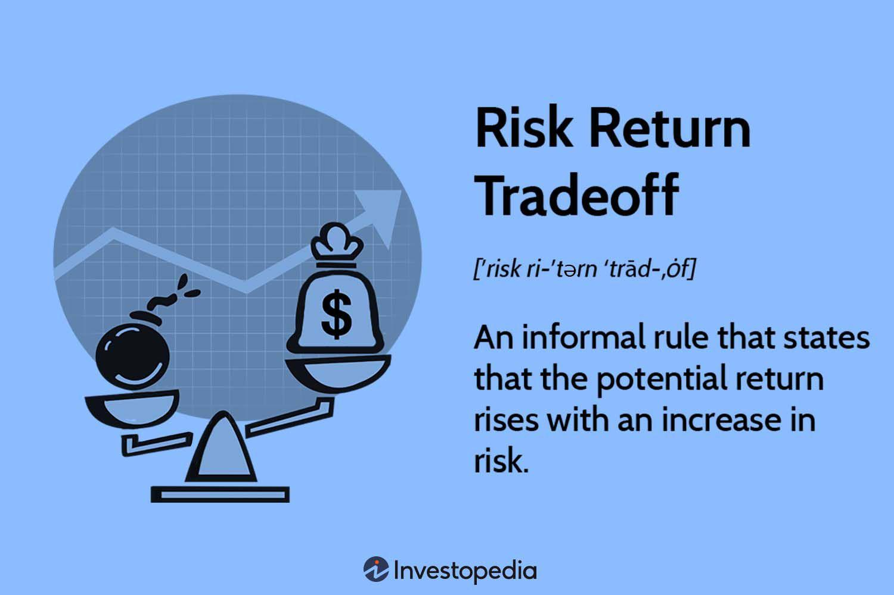

## Table of Contents

## What is the risk-return tradeoff in investment?

The risk-return tradeoff is a basic idea in investing. It means that if you want to make more money, you have to take bigger risks. Imagine you're choosing between two investments. One is safe, like a savings account, and it gives you a small, steady return. The other is riskier, like stocks, and it might give you a bigger return, but it also might lose value.

This tradeoff happens because riskier investments, like stocks, can go up and down a lot. They might make you a lot of money if things go well, but they can also lose value if things go badly. Safer investments, like bonds, usually don't change much in value. They give you a smaller return, but they are more predictable. So, when you invest, you need to decide how much risk you're willing to take to try to get a higher return.

## How does risk affect potential returns in investments?

Risk affects potential returns in investments by creating a balance between what you might gain and what you might lose. When you invest in something risky, like stocks, there's a chance you could make a lot of money if the stock does well. But there's also a chance you could lose money if the stock goes down. This is why risky investments can offer higher returns – they need to attract investors by promising the possibility of bigger gains, even though those gains are not guaranteed.

On the other hand, if you choose safer investments, like government bonds, you're likely to see smaller but more predictable returns. These investments don't fluctuate as much in value, so they are less likely to lose money, but they also won't grow as quickly as riskier options. So, the level of risk you're willing to take directly impacts the potential returns you might see from your investments. The more risk you're comfortable with, the higher the potential returns, but also the higher the potential for losses.

## What are the different types of investment risks?

Investment risks come in different forms, and understanding them can help you make better choices. One type of risk is market risk, which means the whole market can go down and affect all investments. This can happen because of big events like a recession or a sudden change in the economy. Another risk is interest rate risk, which happens when the cost of borrowing money changes. If interest rates go up, the value of bonds can drop because new bonds will pay more interest. There's also inflation risk, where the prices of things go up over time, and your money doesn't buy as much as it used to.

Another important risk is liquidity risk, which means you might not be able to sell your investment quickly without losing money. This can happen with things like real estate or certain stocks that don't trade often. Credit risk is another type, where the company or government you lent money to might not be able to pay you back. This is more common with bonds from companies that aren't doing well. Finally, there's currency risk, which comes into play if you invest in another country. If that country's money loses value compared to your own, your investment could be worth less when you convert it back.

Understanding these different types of risks can help you pick investments that match how much risk you're willing to take. Each type of investment comes with its own set of risks, and knowing them can help you build a balanced portfolio that fits your goals and comfort level with risk.

## How can an investor measure the risk of an investment?

Investors can measure the risk of an investment by looking at something called standard deviation. This is a way to see how much an investment's returns go up and down over time. If an investment has a high standard deviation, it means its value can change a lot, which makes it riskier. If the standard deviation is low, the investment's value doesn't change as much, so it's less risky. Another way to measure risk is by looking at the beta of an investment. Beta tells you how much an investment moves compared to the overall market. A high beta means the investment is more sensitive to market changes, making it riskier.

Another important measure is the Sharpe ratio, which helps investors understand if the extra risk they're taking is worth it. The Sharpe ratio compares the return of an investment to its risk. A higher Sharpe ratio means you're getting more return for the risk you're taking, which is good. Investors also look at something called Value at Risk (VaR), which tells them the most they could lose in a bad scenario. For example, if the VaR is 5% over a month, it means there's a chance you could lose 5% of your investment in that time. These tools help investors make smarter choices by understanding how risky their investments might be.

## What is the relationship between risk and time horizon in investing?

The time horizon of an investment is how long you plan to keep your money invested. This is really important when thinking about risk. If you have a long time horizon, like saving for retirement that's 30 years away, you might be okay with taking more risk. That's because over a long time, the ups and downs of the market can even out, and you might get a bigger return. But if you need your money soon, like in a year or two, you'll want to be more careful. You won't have enough time for the market to recover if it goes down, so you'll want to stick with safer investments.

The relationship between risk and time horizon also means that as you get closer to when you need your money, you might want to move your investments to safer options. For example, if you're saving for a house you want to buy in 5 years, you might start with riskier investments when you're 5 years out, but then switch to safer ones as the time gets closer. This way, you can still try to grow your money over time but protect it when you need it. Understanding your time horizon helps you balance the risk you take with the time you have to recover from any losses.

## Can you explain the concept of diversification in managing risk?

Diversification is a way to manage risk in your investments. It means spreading your money across different types of investments instead of putting it all in one place. Imagine you have a basket of eggs. If you put all your eggs in one basket and drop it, you lose all your eggs. But if you spread your eggs into different baskets, dropping one basket won't ruin all your eggs. In the same way, if one of your investments does badly, it won't hurt your whole portfolio as much because you have other investments that might do well.

When you diversify, you're not just picking different stocks. You can also invest in different things like bonds, real estate, or even different countries. This way, if something bad happens in one area, like a drop in the stock market, your other investments might not be affected as much. Diversification helps smooth out the ups and downs of your investments, making it less likely that you'll lose a lot of money all at once. It's like having a safety net that can help protect your money from big losses.

## How do different asset classes compare in terms of risk and return?

Different asset classes have different levels of risk and potential return. Stocks are usually the riskiest because their prices can go up and down a lot. But they also have the potential for the highest returns over time. If you buy a stock and the company does well, your stock might go up a lot in value. But if the company does badly, your stock could lose value quickly. Bonds are less risky than stocks. They're like loans you give to a company or government, and they pay you back with interest. The return on bonds is usually lower than stocks, but they're more predictable. If you need your money to be safe, bonds might be a good choice.

Real estate is another asset class. It can be riskier than bonds but less risky than stocks. When you invest in real estate, you might buy a house or an apartment building. The value of real estate can go up over time, and you can also earn money from rent. But real estate can be hard to sell quickly, and it needs a lot of work and money to manage. Cash and cash equivalents, like savings accounts or money market funds, are the safest but give the lowest returns. They're good for money you might need soon because they're easy to get to and don't lose value. But over time, inflation can make your money worth less, so keeping all your money in cash isn't usually a good long-term plan.

Each asset class has its own balance of risk and return. Stocks can make you a lot of money but are risky. Bonds are safer but give less return. Real estate is in the middle, and cash is the safest but doesn't grow much. By understanding these differences, you can choose the right mix of investments for your goals and how much risk you're willing to take.

## What role does an investor's risk tolerance play in investment decisions?

An investor's risk tolerance is how much risk they are okay with taking when they invest their money. It's really important because it helps decide what kinds of investments they should pick. If someone has a high risk tolerance, they might be okay with investing in things like stocks, which can go up and down a lot but might give them bigger returns. But if someone has a low risk tolerance, they might want to stick with safer investments like bonds or savings accounts, even if the returns are smaller. Knowing your risk tolerance helps you pick investments that won't keep you up at night worrying about losing your money.

Risk tolerance can also change over time. For example, when you're young and saving for retirement that's far away, you might be okay with taking more risk because you have time to recover from any losses. But as you get older and closer to needing that money, you might want to move to safer investments. This is why it's important to check your risk tolerance regularly and adjust your investments if it changes. By matching your investments to your risk tolerance, you can feel more comfortable with your choices and be more likely to stick with your investment plan over the long term.

## How can historical data be used to assess the risk-return tradeoff?

Historical data can help investors understand the risk-return tradeoff by looking at how investments have done in the past. For example, if you look at the history of stock market returns, you can see that stocks have had higher returns over long periods but also more ups and downs. This tells you that stocks are riskier but can give you more money if you're willing to wait. By looking at this data, you can see patterns and get a sense of how much risk you might be taking with different investments.

You can also use historical data to figure out things like standard deviation and beta, which are ways to measure risk. Standard deviation shows how much an investment's returns have changed over time. A high standard deviation means the investment is riskier because its value can change a lot. Beta tells you how an investment moves compared to the market. If an investment has a high beta, it means it's more sensitive to market changes, making it riskier. By using this historical data, investors can make better choices about which investments match their risk tolerance and goals.

## What advanced statistical measures are used to analyze the risk-return profile of investments?

Advanced statistical measures help investors understand how risky an investment is and what kind of return they might expect. One important measure is the Sharpe ratio, which looks at how much return you get for the risk you take. A higher Sharpe ratio means you're getting more return for the risk, which is good. Another measure is the Sortino ratio, which is similar to the Sharpe ratio but focuses only on the bad risk, or downside risk. This can be helpful because investors usually care more about losing money than gaining it. The Treynor ratio is another measure that looks at how well an investment does compared to how sensitive it is to the market, using something called beta.

There's also something called Value at Risk (VaR), which tells you the most money you could lose in a bad situation. For example, if your VaR is 5% over a month, there's a chance you could lose 5% of your investment in that time. Another useful measure is the Alpha, which shows how well an investment does compared to what you would expect from the market. A positive Alpha means the investment did better than expected, while a negative Alpha means it did worse. These advanced measures help investors make smarter choices by giving them a clearer picture of the risk and potential return of their investments.

## How do modern portfolio theory and the efficient frontier relate to the risk-return tradeoff?

Modern Portfolio Theory (MPT) and the efficient frontier are important ideas that help investors understand the risk-return tradeoff. MPT says that by mixing different investments, you can lower your risk without losing out on returns. It's all about finding the right mix of investments that work well together. This means you don't just look at how each investment does on its own, but how they do when you put them together. The goal is to get the best return for the least amount of risk.

The efficient frontier is a part of MPT that shows the best possible balance between risk and return. Imagine a graph where one side shows risk and the other side shows return. The efficient frontier is a line on this graph that shows the highest return you can get for each level of risk. Any investment or portfolio that sits on this line is doing the best it can for the risk you're taking. If an investment is below the line, it means you're not getting as much return as you could for that level of risk. By using the efficient frontier, investors can pick investments that give them the best chance of getting good returns without taking on too much risk.

## What are some strategies experts use to optimize the risk-return tradeoff in their portfolios?

Experts use a few main strategies to make the best of the risk-return tradeoff in their portfolios. One big strategy is diversification, which means spreading investments across different types of assets, like stocks, bonds, and real estate. By doing this, they lower the chance of losing a lot of money all at once because if one investment does badly, the others might do well. Another strategy is asset allocation, where they decide how much money to put into each type of investment based on how risky they are and how long they plan to keep their money invested. For example, if they have a long time before they need the money, they might put more into stocks, which are riskier but can give higher returns over time.

Another way experts optimize the risk-return tradeoff is by using something called rebalancing. This means they check their portfolio regularly and adjust it to keep the right mix of investments. If stocks have done really well and now make up too big a part of the portfolio, they might sell some stocks and buy more bonds to bring things back into balance. This helps keep the level of risk they're comfortable with. Lastly, some experts use advanced tools like the Sharpe ratio or the efficient frontier to make sure they're getting the best return for the risk they're taking. These tools help them pick investments that fit well with their goals and risk tolerance.

## How do you calculate risk-return metrics?

Investors use various metrics to measure and manage risk, including alpha, beta, and the Sharpe ratio. Each of these metrics serves a unique purpose in the evaluation of an investment's risk-return profile and helps investors tailor their strategies to align with individual risk tolerance and financial goals.

### Alpha
Alpha represents the active return on an investment compared to a market index or benchmark. It is essentially a measure of an asset manager's ability to outperform the broader market through skillful selection and timing. A positive alpha indicates that the investment has performed better than expected relative to the benchmark, whereas a negative alpha suggests underperformance. The formula for calculating alpha is:

$$
\alpha = R_i - (R_f + \beta \times (R_m - R_f))
$$

where:
- $R_i$ is the return of the investment.
- $R_f$ is the risk-free rate.
- $\beta$ is the beta of the investment.
- $R_m$ is the return of the market index.

### Beta
Beta measures an investment's volatility in relation to the overall market. A beta of 1 indicates that the investment's price moves with the market. A beta greater than 1 signifies greater volatility than the market, while a beta less than 1 suggests less volatility. Beta is crucial for understanding an investment’s market risk. It is calculated using:

$$
\beta = \frac{\text{Cov}(R_i, R_m)}{\text{Var}(R_m)}
$$

where:
- $\text{Cov}(R_i, R_m)$ is the covariance between the investment return and the market return.
- $\text{Var}(R_m)$ is the variance of the market return.

### Sharpe Ratio
The Sharpe ratio is a widely used metric for evaluating investment performance by measuring risk-adjusted returns. It allows investors to understand how much excess return they are receiving for the extra volatility endured. The ratio is calculated as:

$$
\text{Sharpe Ratio} = \frac{R_i - R_f}{\sigma_i}
$$

where:
- $R_i$ is the return of the investment.
- $R_f$ is the risk-free rate.
- $\sigma_i$ is the standard deviation of the investment returns.

By providing a framework to quantify risk and returns, these metrics enable investors to make informed decisions about portfolio composition and strategic adjustments. Understanding how to calculate and interpret these metrics is critical in optimizing a portfolio's performance and achieving the desired balance between risk and return.

## What are Risk Management Strategies?

Effective risk management is crucial in mitigating potential losses while striving for substantial returns, especially in the volatile world of investments. Three primary strategies within the risk management framework include diversification, asset allocation, and hedging. These techniques not only manage risk but also provide avenues for optimizing returns across various market conditions.

### Diversification

Diversification involves spreading investments across different financial instruments, industries, and other categories to reduce exposure to any single asset or risk. The principle behind diversification is rooted in the concept of not putting all one's eggs in one basket. By ensuring that a portfolio spans multiple asset classes and sectors, the negative performance of some investments can be offset by the positive performance of others.

**Example:**

Consider an investor who holds stocks in both the technology and healthcare sectors. If the technology sector experiences a downturn, the potential losses might be mitigated if the healthcare sector performs well, thereby stabilizing the overall portfolio returns.

### Asset Allocation

Asset allocation refers to the distribution of investments across various asset classes such as equities, bonds, and cash. The allocation is typically based on the investor's risk tolerance, time horizon, and investment goals. A well-structured asset allocation strategy helps in balancing risk by adjusting the proportions of high-risk and low-risk assets.

**Mathematical Model:**

An investor might use a formula to determine the proportion of each asset class:

$$

w_i = \frac{e_i \cdot S_i}{\sum_{j=1}^{n} e_j \cdot S_j} 
$$

Where:
- $w_i$ is the weight of asset $i$ in the portfolio
- $e_i$ is the expected return of asset $i$
- $S_i$ is the score representing the investor's preference for asset $i$ relative to others 

### Hedging

Hedging is a risk management strategy used to offset potential losses in an investment by taking an opposite position in a related asset. This is commonly achieved using derivatives such as options and futures, which can protect a portfolio against adverse price movements.

**Example:**

A stock investor fearing a market downturn might purchase put options on their holdings. If the market declines, the value gained from the put options can offset the losses incurred on the stock investments.

### Algorithmic Trading and Risk Management

In algorithmic trading, setting predefined risk limits and employing stop-loss mechanisms are vital to controlling downside risk. Algorithms can be programmed to automatically execute trades when certain conditions are met, such as a stock falling below or rising above a specified price threshold.

**Python Example:**

```python
def stop_loss(current_price, purchase_price, stop_loss_percent):
    stop_loss_price = purchase_price * (1 - stop_loss_percent / 100)
    if current_price <= stop_loss_price:
        return "Sell to prevent further loss"
    else:
        return "Hold"

# Example Usage
current_price = 95
purchase_price = 100
stop_loss_percent = 5

action = stop_loss(current_price, purchase_price, stop_loss_percent)
print(action)
```

This code snippet demonstrates a simple stop-loss strategy where an asset is sold if its price drops by a specified percentage, thereby limiting potential losses.

### Real-World Applications

Real-world examples include hedge funds that use quantitative models to adjust asset allocation dynamically based on market conditions. Similarly, mutual funds often diversify across geographies to mitigate country-specific risks. These strategies highlight the practical application of risk management techniques in optimizing portfolio performance while minimizing exposure to potential losses.

## References & Further Reading

[1]: Bodie, Z., Kane, A., & Marcus, A. J. (2020). ["Investments"](https://www.mheducation.com/highered/product/Investments-Bodie.html) (11th ed.). McGraw-Hill Education. 

[2]: Sharpe, W. F. (1966). ["Mutual Fund Performance"](https://www.jstor.org/stable/2351741). The Journal of Business, 39(1), 119-138.

[3]: Markowitz, H. (1952). ["Portfolio Selection"](https://onlinelibrary.wiley.com/doi/abs/10.1111/j.1540-6261.1952.tb01525.x). The Journal of Finance, 7(1), 77-91.

[4]: Black, F., & Scholes, M. (1973). ["The Pricing of Options and Corporate Liabilities"](https://www.cs.princeton.edu/courses/archive/fall09/cos323/papers/black_scholes73.pdf). Journal of Political Economy, 81(3), 637-654.

[5]: Fabozzi, F. J., & Markowitz, H. M. (Eds.). (2002). ["The Theory and Practice of Investment Management"](https://onlinelibrary.wiley.com/doi/book/10.1002/9781118267028). Wiley.

[6]: De Prado, M. L. (2018). ["Advances in Financial Machine Learning"](https://www.amazon.com/Advances-Financial-Machine-Learning-Marcos/dp/1119482089). Wiley.

[7]: Chan, E. (2009). ["Quantitative Trading: How to Build Your Own Algorithmic Trading Business"](https://github.com/ftvision/quant_trading_echan_book). Wiley.

[8]: Jansen, S. (2020). ["Machine Learning for Algorithmic Trading"](https://github.com/stefan-jansen/machine-learning-for-trading). Packt Publishing.

[9]: Elton, E. J., Gruber, M. J., Brown, S. J., & Goetzmann, W. N. (2014). ["Modern Portfolio Theory and Investment Analysis"](https://books.google.com/books/about/Modern_Portfolio_Theory_and_Investment_A.html?id=181CEAAAQBAJ). Wiley. 

[10]: Fama, E. F., & French, K. R. (1992). ["The Cross-Section of Expected Stock Returns"](https://onlinelibrary.wiley.com/doi/full/10.1111/j.1540-6261.1992.tb04398.x). The Journal of Finance, 47(2), 427-465.