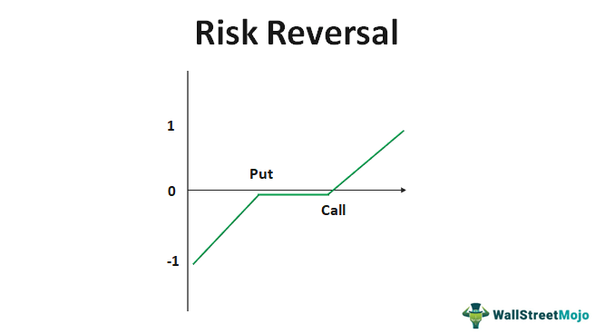

Options trading is a versatile segment of the financial markets, providing investors with the ability to employ various strategies to take advantage of price movements. One strategy that attracts attention for its potential profitability in directional trading is the risk reversal. Essentially, a risk reversal is a strategy that involves simultaneously buying a call option and selling a put option on the same underlying asset, albeit often at different strike prices. This approach is typically employed by traders with a bullish outlook on the asset, aiming to benefit from upward price movements while partially mitigating risks.

The effectiveness of the risk reversal strategy can be significantly amplified through the use of algorithmic trading. By leveraging computer algorithms, traders can automate the execution of this strategy, ensuring precise timing and minimal latency. This technological enhancement allows for the strategy to be executed swiftly and with greater accuracy, eliminating the emotional biases that may affect manual trading decisions. The incorporation of algorithmic trading into risk reversal strategies also provides an opportunity for continuous refinement and optimization, thanks to data analysis and machine learning techniques.



In this article, we explore the intricacies of implementing the risk reversal strategy in options trading, with a particular focus on the role of algorithmic trading in enhancing its effectiveness. Our aim is to offer a detailed overview of how traders can integrate this approach into their portfolios, utilizing technology to optimize execution and improve overall strategy performance. By understanding and utilizing both risk reversals and algorithmic tools, traders can position themselves to capitalize on market trends with more confidence and precision.

## Table of Contents

## Understanding Options Trading and Risk Reversal Strategies

Options trading is a sophisticated financial activity that involves contracts providing the right, but not the obligation, to buy or sell an underlying asset at a predetermined price. These contracts, known as options, are typically leveraged by investors to hedge existing investments or speculate on market movements. There are two primary types of options: call options, which grant the right to purchase an asset, and put options, which confer the right to sell an asset.

The risk reversal strategy is a popular technique among options traders, especially those with a bullish outlook on a particular stock. This strategy generally involves two key positions: buying a call option and simultaneously selling a put option, each with different strike prices. The essence of this approach is similar to synthetic long positions, where the trader seeks to benefit from upward price movements of the underlying asset but at a potentially reduced cost compared to purchasing the asset outright.

### Mechanics of Risk Reversal Strategies

1. **Buying a Call Option**: In a risk reversal, the trader purchases a call option. This expenditure is out-of-pocket, and it provides the right to acquire the underlying asset at the strike price until the option's expiration. The expectation is that the asset's market price will surpass this strike price, thus yielding a profit.

2. **Selling a Put Option**: Concurrently, the trader sells a put option at a lower strike price, which generates premium income. By selling the put, the trader assumes the obligation to purchase the underlying asset at the put's strike price if the market price falls below it at expiration. The premium received from selling the put can offset the cost of buying the call, sometimes fully or partially, depending on market conditions.

### Benefits and Risks

The primary advantage of a risk reversal strategy is its cost efficiency. By financing the call option purchase through the sale of the put option, traders potentially minimize their upfront investment. This approach also strategically aligns with a bullish sentiment, as profits accrue from upward price movements of the underlying asset without owning the asset itself directly.

However, the strategy carries risks. Should the asset's price fall below the put's strike price at expiration, the trader must purchase the asset at that strike price, potentially incurring a loss. Additionally, if market conditions become volatile, the premium received might not be sufficient to cover the price of the call, particularly if implied [volatility](/wiki/volatility-trading-strategies) declines after executing the trade.

### Practical Example

Consider a scenario where a trader is bullish on a stock currently priced at $100. They might express their view by purchasing a call option with a $105 strike price, costing $3, and selling a put option with a $95 strike price, receiving $2 as a premium. Here, the net cost of setting up the risk reversal is $1 ($3 for the call minus the $2 premium from the put).

For this strategy to be profitable, the stock must close above $106 ($105 strike price plus the $1 net cost) by expiration. If the stock remains between $95 and $105, the options expire worthless, and the trader only loses the $1 net cost. Should the stock fall below $95, the trader will be obligated to purchase it at $95, irrespective of its lower market price.

Understanding the dynamics of risk reversals is crucial for traders looking to optimize their options strategy. It requires a balanced view of the market and a keen understanding of the underlying factors influencing asset prices and option premium values.

## The Role of Algorithmic Trading in Options Strategies

Algorithmic trading, commonly known as algo trading, utilizes advanced computer algorithms to automate and execute trading strategies with minimal human input. For options trading, such automation holds particular significance due to the complex nature of strategies like risk reversals. A risk reversal strategy involves the simultaneous purchase of a call option and the sale of a put option, typically at different strike prices, to capitalize on directional market movements. 

The use of algorithms in executing this strategy enhances both the speed and precision of trades. Algorithms can scan large volumes of market data rapidly, identify optimal trading opportunities, and execute trades within milliseconds. This process eliminates the time delay inherent in manual trading, allowing traders to capitalize on fleeting market conditions.

To program algorithms for these strategies, traders often rely on platforms like MetaTrader, QuantConnect, or [Interactive Brokers](/wiki/interactive-brokers-api)’ API, which provide the necessary tools to design, test, and deploy trading algorithms. Python, with its extensive libraries such as NumPy and pandas for data handling, along with packages like PyAlgoTrade and Backtrader for trading, is frequently used for developing and [backtesting](/wiki/backtesting) these strategies. A simple example in Python to calculate the theoretical price of a call option in a risk reversal strategy could look like this:

```python
from scipy.stats import norm
import numpy as np

def call_option_price(S, K, T, r, q, sigma):
    """
    Calculate the Black-Scholes price of a European call option.

    S: Current stock price
    K: Strike price
    T: Time to expiration in years
    r: Risk-free interest rate
    q: Dividend yield
    sigma: Volatility of the underlying asset
    """

    d1 = (np.log(S / K) + (r - q + 0.5 * sigma ** 2) * T) / (sigma * np.sqrt(T))
    d2 = d1 - sigma * np.sqrt(T)

    call_price = (S * np.exp(-q * T) * norm.cdf(d1)) - (K * np.exp(-r * T) * norm.cdf(d2))
    return call_price

# Example parameters
S = 100  # Stock price
K = 105  # Strike price
T = 1    # Time to expiration
r = 0.05 # Risk-free rate
q = 0    # Dividend yield
sigma = 0.2 # Volatility

print(f"Call Option Price: {call_option_price(S, K, T, r, q, sigma):.2f}")
```

The incorporation of technology not only improves execution speed but also reduces human-related biases and errors. Automated strategies are consistent in executing pre-defined rules, thus maintaining discipline and objectivity in trading. Moreover, [algorithmic trading](/wiki/algorithmic-trading) allows for continuous refinement of strategies through data analysis and [machine learning](/wiki/machine-learning). This ability to adapt and optimize strategies in real time gives traders a significant competitive advantage.

Incorporating technology into options trading, particularly via algorithmic methods, maximizes efficiency and enhances strategic implementation. As financial markets grow increasingly complex, the technological prowess offered by algorithmic trading becomes essential for traders seeking to maintain an edge.

## Benefits of Using Algo Trading for Risk Reversal Strategies

Integrating algorithmic trading with risk reversal strategies offers numerous advantages that enhance both the efficiency and effectiveness of trading. One of the primary benefits is increased efficiency in executing trades. Algorithmic systems can swiftly identify and act upon trading opportunities, minimizing the lag time associated with manual trading. By using predefined parameters, algorithms ensure trades are executed at the optimal moment, hence capturing the best prices available. This speed is particularly beneficial in volatile markets where conditions can change rapidly, affecting the risk reversal's profitability.

Another significant advantage of algo trading is the reduction of emotional bias. Human traders are often influenced by emotions like fear and greed, which can lead to suboptimal decision-making. In contrast, algorithms operate based on logical criteria without being swayed by emotions. This objectivity leads to more consistent application of the risk reversal strategy, ensuring that decisions are aligned with the trader's overall strategy rather than short-term emotional reactions.

Algo trading also facilitates faster execution of trades, a crucial aspect when dealing with options where timing can significantly impact the potential gains or losses. For instance, algorithms can simultaneously execute multiple trades, such as buying a call option while selling a put option, thereby eliminating the discrepancies that might occur with manual execution and reducing slippage.

Moreover, algorithmic trading harnesses the power of data analysis and machine learning to refine strategies continuously. Algorithms can be programmed to analyze vast datasets for trends and patterns that may not be immediately apparent to human traders. This capability allows traders to adjust their risk reversal approaches based on real-time insights, thereby optimizing their strategies for current market conditions. Python, for example, offers multiple libraries like Pandas for data analysis and Scikit-learn for machine learning, making it an accessible choice for implementing such enhancements.

Automation also aligns with robust risk management practices. Algorithms can be set to automatically adjust positions based on risk thresholds, helping to prevent substantial losses. For example, stop-loss orders can be integrated into algorithms to automatically sell positions that fall below a certain value. This proactive risk management approach ensures that potential losses are mitigated without the need for constant manual oversight.

Consider a real-life case study where integrating algorithmic trading into a risk reversal strategy proved beneficial. A financial firm used algorithms to execute a risk reversal strategy on a highly volatile stock. By incorporating market data and predictive analytics into their trading algorithms, the firm achieved a 15% higher return than their traditional manual trading strategies. This success was attributed to quicker execution times, reduced emotional impact, and the ability to continuously refine their trading strategy using real-time data.

In conclusion, the integration of algorithmic trading with risk reversal strategies not only enhances trading efficiency and execution speed but also supports consistent, data-driven decision-making that mitigates emotional and market-related risks, ultimately leading to improved trading outcomes.

## Challenges and Considerations

Algorithmic trading, despite its numerous advantages, presents a range of challenges that traders must tackle to ensure effective deployment. Developing and maintaining sophisticated algorithms requires a strong understanding of both programming languages and financial markets. The complexity of algorithm creation can be a significant hurdle, particularly for traders who may not possess advanced coding skills. Algorithms must be intricately designed to adapt to varying market conditions, necessitating continuous refinement to maintain optimal performance.

Technical risks further complicate the landscape of algorithmic trading. System failures, such as hardware malfunctions or software glitches, can lead to significant disruptions in trading activities. For instance, a server crash might result in missed trades or improper execution of strategies. Additionally, incorrect coding can cause algorithms to misinterpret market signals, potentially leading to unintended trades and financial losses. Traders need to implement robust testing procedures to identify and rectify such issues before they impact live trading environments.

Practical advice for overcoming these challenges includes adopting a comprehensive approach to algorithm development and deployment. Employing techniques such as back-testing can aid in evaluating algorithms against historical data, providing insights into their potential performance under various market scenarios. This process helps to identify any discrepancies or failures in the algorithm's logic, ensuring that it aligns correctly with intended trading strategies.

Moreover, implementing a robust risk management framework is essential. This includes setting up fail-safes and redundancy systems to counteract technical risks. For instance, employing cloud-based services for data storage and processing can offer enhanced reliability and scalability. Regularly updated monitoring systems can alert traders to any anomalies in real-time, allowing for swift corrective actions.

Regulatory considerations are another vital aspect of algorithmic trading. Different markets have distinctive legal requirements that govern trading activities, including algorithmic strategies. It is crucial for traders to stay informed about these regulations to avoid non-compliance, which could result in legal penalties. Engaging with legal experts or compliance officers can be valuable in navigating complex regulatory environments, ensuring that trading practices adhere to the requisite standards. 

In summary, while algo trading provides efficiencies and advanced capabilities, addressing the inherent challenges is critical. By focusing on robust programming, rigorous testing, meticulous risk management, and regulatory compliance, traders can overcome these hurdles, enhancing the potential benefits of integrating algorithmic strategies like risk reversals into their trading portfolios.

## Conclusion

The risk reversal strategy serves as an instrumental tool for traders who aim to leverage market trends for potential profit. By simultaneously purchasing call options and selling put options, traders can express a bullish outlook on the underlying asset without direct exposure. This method offers the advantage of gaining from upward price movements while mitigating downside risk through the collected premium from the sold put option.

When integrated with algorithmic trading, the effectiveness of the risk reversal strategy is significantly heightened. Algorithmic trading automates the execution process, ensuring precise timing and reducing the human errors associated with manual trading. By using algorithms, traders can benefit from enhanced data analysis capabilities, allowing for more informed and faster decision-making regarding entry and [exit](/wiki/exit-strategy) points. For example, an algorithm can be programmed in Python to automatically execute a risk reversal strategy based on specific market signals:

```python
def execute_risk_reversal(price, call_strike, put_strike, call_premium, put_premium):
    if price > call_strike:
        # Buy call option logic
        profit = price - call_strike - call_premium
    elif price < put_strike:
        # Sell put option logic
        profit = put_strike - price + put_premium
    else:
        profit = put_premium - call_premium  # Premium collected from the put

    return profit

# Example usage:
price = 105
call_strike = 100
put_strike = 90
call_premium = 3
put_premium = 5

potential_profit = execute_risk_reversal(price, call_strike, put_strike, call_premium, put_premium)
print(f"Potential Profit: {potential_profit}")
```

Adopting a balanced strategy that combines both traditional methods and cutting-edge technology provides traders with a competitive advantage. Such an approach not only optimizes execution but also enables a more informed response to market fluctuations. As financial markets continue to develop, maintaining an adaptable and informed outlook becomes essential for sustained trading success.

Incorporating algorithmic trading and risk reversal strategies into investment portfolios invites opportunities for improved performance, yet it requires continual exploration and adaptation to remain effective. We encourage traders to further investigate these methodologies, as they hold substantial potential for enhancing trading outcomes in an ever-changing market environment.

## References & Further Reading

[1]: ["Dynamic Hedging: Managing Vanilla and Exotic Options"](https://www.amazon.com/Dynamic-Hedging-Managing-Vanilla-Options/dp/0471152803) by Nassim Nicholas Taleb

[2]: ["Options, Futures, and Other Derivatives"](https://www.pearson.com/en-us/subject-catalog/p/options-futures-and-other-derivatives/P200000005938/9780136939917) by John C. Hull

[3]: ["Algorithmic Trading and DMA: An introduction to direct access trading strategies"](https://archive.org/details/algorithmictradi0000john) by Barry Johnson

[4]: ["Option Volatility and Pricing: Advanced Trading Strategies and Techniques"](https://www.amazon.com/Option-Volatility-Pricing-Strategies-Techniques/dp/0071818774) by Sheldon Natenberg

[5]: ["Python for Finance: Analyze Big Financial Data"](https://books.google.com/books/about/Python_for_Finance.html?id=E93SBQAAQBAJ) by Yves Hilpisch