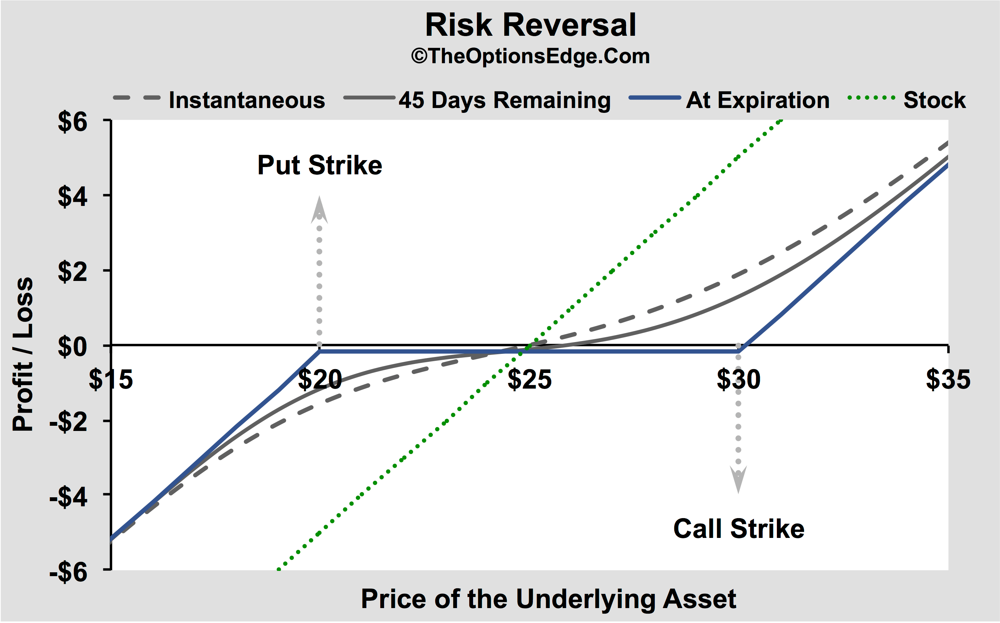

Options trading has become increasingly popular in recent years as investors and traders seek to leverage financial instruments to enhance their investment strategies and manage risk effectively. Options are derivatives that grant the holder the right, but not the obligation, to buy or sell an underlying asset at a predetermined price before a specific expiration date. This flexibility makes options a versatile tool in the financial markets.

There are two primary types of options: call options and put options. A call option gives the holder the right to purchase an underlying asset at a set price, known as the strike price, within a specified timeframe. Investors typically use call options when they anticipate an upward movement in the asset's price, aiming to profit from the price increase without directly purchasing the asset. In contrast, a put option provides the holder the right to sell the underlying asset at the strike price before expiration. Put options are often employed as a protective strategy against a decline in asset value, allowing investors to hedge potential losses.



Risk reversal strategies play a significant role in options trading by serving as a hedging mechanism. This strategy involves simultaneously selling put options and buying call options to create a position that benefits from upward movements in the market, thereby protecting against downside risks. A risk reversal is particularly useful in volatile markets, allowing traders to maintain an advantageous position with limited capital outlay.

Algorithmic trading has revolutionized modern finance and options trading by employing complex algorithms to automate trading strategies, improve efficiency, and capture market opportunities. These algorithms can process vast amounts of data at high speeds and execute trades with precision unattainable by human traders. In the context of stock options, algorithmic trading is pivotal in optimizing strategies such as risk reversal, ensuring timely and accurate execution.

This article aims to explore the intricate relationship between call and put options, risk reversal strategies, and algorithmic trading. By understanding these key concepts, traders, whether beginners or seasoned professionals, can develop a more comprehensive approach to options trading. Gaining insights into how these elements interplay is crucial for capitalizing on market movements and managing risk effectively. As the financial markets continue to evolve, a deep understanding of these strategies and technologies becomes increasingly vital for anyone involved in trading.

## Table of Contents

## Understanding Call and Put Options

Call options and put options are foundational components of options trading, offering traders flexible strategies to potentially maximize their returns or protect their investments. 

A call option provides the holder with the right, but not the obligation, to purchase a security at a predetermined price, known as the strike price, within a specific time frame. The primary purpose of call options in a trading strategy is to benefit from upward movements in the price of the underlying asset. For example, if an investor forecasts that the price of a stock will rise, they might purchase a call option to capitalize on the price increase without the need to pay the full price of the shares upfront. This allows the trader to leverage their position, leading to potentially high returns if the stock price rises above the strike price before expiration. However, if the stock remains below the strike price, the call option may expire worthless, and the trader will only lose the premium paid for the option.

On the other hand, a put option offers the holder the right to sell a security at the strike price within the specified period. Put options are often used as a protective measure in investing, allowing traders to hedge against potential declines in the value of an asset they own. For instance, an investor holding shares that they wish to retain for the long term can purchase a put option to safeguard against short-term declines. If the stock price falls below the strike price, the value of the put option increases, offsetting some of the losses from the declining stock.

There are fundamental differences between call and put options. While call options are used to profit from upward price movements, put options are designed to protect against or profit from downward price movements. Their payoff structures also differ: call options gain value as the underlying asset's price rises above the strike price, whereas put options gain value as the price falls below the strike price.

Real market examples highlight how these options operate. Suppose an investor buys a call option for Company XYZ at a $50 strike price, expiring in two months, for a $2 premium. If Company XYZ's stock climbs to $60, the investor potentially earns a profit. Conversely, if the investor holds a put option for the same company with a $50 strike price, and the stock's price falls to $40, the investor can sell at $50, thus protecting against further declines.

Timing and accurate market predictions are crucial in options trading. The value of options is heavily influenced by factors such as the underlying asset's price movements, [volatility](/wiki/volatility-trading-strategies), time remaining until expiration, and prevailing interest rates. Traders must assess these variables to make informed decisions on when to buy or sell call and put options. Effective market prediction enables traders to select appropriate strike prices and expiration dates, optimizing their chances for profitable outcomes. 

Understanding call and put options is vital for traders navigating the intricacies of options markets. Mastery of these elements not only serves as a foundation for various trading strategies but also aids in developing comprehensive approaches to risk management and speculative investments.

## What is a Risk Reversal Strategy?

A risk reversal strategy in options trading involves simultaneously buying call options and selling put options on the same underlying asset with the same expiration date. The primary goal of this strategy is to hedge against potential market volatility while capitalizing on anticipated upward price movements of the underlying asset.

Traders employ risk reversal strategies by first identifying a stock or asset that they believe will appreciate in value. By selling put options, traders collect premiums, essentially taking a neutral to bullish stance on the asset. This part of the strategy generates income, which can be used to offset the cost of purchasing call options. Buying call options gives the trader the right, but not the obligation, to purchase the asset at a specified strike price. The strategy benefits if the asset's market price rises above this strike price, allowing the trader to profit from the asset's increase in value.

Mathematically, the payoff for a risk reversal strategy can be expressed as follows:

- Call option payoff: $\max(0, S_T - K_{call})$
- Put option payoff collected as premium: $-\max(0, K_{put} - S_T)$

Here, $S_T$ is the price of the underlying asset at expiration, $K_{call}$ is the strike price of the call option, and $K_{put}$ is the strike price of the put option.

In practice, a trader might sell put options with a strike price close to the current market price and buy call options with a higher strike price. This positions them to benefit from upward price movements while limiting their downside exposure to the extent of the put option premium collected.

Recent market scenarios have shown the effectiveness of risk reversal strategies. For example, during periods of anticipated market rallies, traders have utilized this strategy to profit effectively while managing risk. Employing such strategies can be particularly advantageous when traditional market indicators suggest a probable bullish trend.

The potential benefits of risk reversal include limited upfront investment and the ability to profit from upward movements in the underlying asset. However, these benefits come with risks. The main risk is if the market moves against the trader's expectations, either by the asset price falling below the put option strike price or by failing to rise sufficiently above the call option strike price. In such cases, traders may face losses equivalent to the premium collected from the put options, or they might not benefit enough to compensate for the cost of the call options.

In summary, the risk reversal strategy is a versatile tool in options trading, allowing traders to hedge against volatility while positioning themselves to benefit from asset appreciation. However, it requires careful market analysis and timing to mitigate inherent risks.

## Algorithmic Trading with Stock Options

Algorithmic trading refers to the use of computer algorithms to automate trading decisions and execution. This approach is transforming the financial landscape by increasing efficiency, reducing human error, and exploiting fleeting market opportunities. In options trading, algorithms bring several advantages, enabling traders to handle complex strategies such as risk reversals more effectively.

One primary advantage of [algorithmic trading](/wiki/algorithmic-trading) in options is its ability to rapidly process large sets of financial data, identifying and executing profitable trades at speeds unattainable for human traders. Algorithms can sift through historical and real-time market data to recognize patterns and trends, which aids in predicting price movements and optimizing trading strategies.

Risk reversal strategies involve buying call options and selling put options on the same underlying asset, typically at different strike prices, to hedge against market volatility. Algorithms optimize these strategies by continuously analyzing market conditions, adjusting the strike prices and expiration dates based on current data to maximize expected returns and minimize risk exposure.

The technology underlying options algorithmic trading includes data analysis, [machine learning](/wiki/machine-learning) (ML), and [artificial intelligence](/wiki/ai-artificial-intelligence) (AI). Data analysis focuses on collecting and interpreting vast amounts of financial information to inform strategy development. Machine learning algorithms, which can self-improve by learning from past trades and market conditions, are particularly useful for predicting price movements and managing dynamic trading strategies.

AI techniques further enhance trading algorithms by enabling more complex decision-making processes. For instance, [reinforcement learning](/wiki/reinforcement-learning), an area of AI, allows algorithms to develop sophisticated trading strategies by continually learning from simulated trades in a controlled environment.

There are notable examples of successful algorithmic trading systems in real-world scenarios. For instance, Renaissance Technologies, a pioneer in [quantitative trading](/wiki/quantitative-trading), has leveraged algorithms to achieve unprecedented returns. Their systems capitalize on small market inefficiencies, using advanced statistical models and machine learning techniques.

Overall, algorithmic trading significantly enhances the capability of traders to execute complex options strategies such as risk reversals. By integrating advanced technologies like machine learning and AI, traders can optimize their decision-making processes, adapt to changing market conditions, and potentially achieve superior trading outcomes.

## Integrating Calls and Puts in Algo Trading Strategies

Integrating calls and puts into algorithmic trading strategies involves leveraging the unique characteristics of these financial derivatives to achieve optimal trading performance. Call and put options serve as the fundamental building blocks in options trading, enabling traders to speculate on price movements or hedge against potential losses. When incorporated into algorithmic frameworks, they offer significant potential to enhance trading efficacy. 

**Complexities of Automating Call and Put Options Strategies**

Automating options trading with calls and puts introduces complexities regarding pricing, execution, and risk management. Pricing options involves understanding the Greeks, which measure various risk factors such as delta (Δ), gamma (Γ), theta (Θ), vega (ν), and rho (ρ). These factors influence the value of options based on changes in underlying variables. Implementing algorithms that can dynamically adjust to these parameters requires sophisticated models that can accurately forecast market movements and react quickly to changes.

The execution of options strategies also poses challenges, such as aligning trade timings with market conditions and managing transaction costs. Algorithms must be designed to account for [liquidity](/wiki/liquidity-risk-premium), bid-ask spreads, and slippage. This task is computationally intensive and requires seamless integration with brokerage systems to ensure orders are placed and executed efficiently.

**Optimizing Risk Return Profiles Using Calls and Puts**

Algorithms can optimize risk-return profiles by employing advanced statistical and predictive models to forecast volatility and price movements, thus making informed decisions on whether to buy or sell options. For instance, machine learning algorithms can analyze historical data to predict volatility and adjust trading strategies accordingly. By programming algorithms to consider market signals and option Greeks, traders can better manage risk and capitalize on potential gains.

One approach could include using a Monte Carlo simulation to project the potential outcomes of different call and put strategies under varying market conditions. This analysis aids in quantifying potential returns against associated risks. Advanced optimization algorithms, like genetic algorithms, can further fine-tune strategies by iteratively testing and selecting the best-performing options combinations.

**Strategies to Manage Risk and Enhance Returns Using Automated Risk Reversals**

Automated risk reversals, which involve selling put options and buying call options, offer a way to hedge anticipated movements in the underlying asset while positioning for potential upside. Algorithms can automate this process by continuously monitoring market data and adjusting positions to maintain the desired risk exposure.

Consider a Python script that leverages risk reversal strategies:

```python
import numpy as np

def calculate_option_premium(underlying_price, strike_price, volatility, time_to_expiry, risk_free_rate, option_type='call'):
    # Black-Scholes option pricing formula simplified for demonstration
    d1 = (np.log(underlying_price / strike_price) + (risk_free_rate + 0.5 * volatility**2) * time_to_expiry) / (volatility * np.sqrt(time_to_expiry))
    d2 = d1 - volatility * np.sqrt(time_to_expiry)
    if option_type == 'call':
        option_price = (underlying_price * norm.cdf(d1)) - (strike_price * np.exp(-risk_free_rate * time_to_expiry) * norm.cdf(d2))
    else:
        option_price = (strike_price * np.exp(-risk_free_rate * time_to_expiry) * norm.cdf(-d2)) - (underlying_price * norm.cdf(-d1))
    return option_price

# Example: Automating risk reversal strategy
buy_call_price = calculate_option_premium(100, 105, 0.2, 1, 0.01, option_type='call')
sell_put_price = calculate_option_premium(100, 95, 0.2, 1, 0.01, option_type='put')

# Net premium to be paid/received
net_option_price = buy_call_price - sell_put_price
```

This code snippet uses the Black-Scholes model to calculate option premiums for a simple risk reversal strategy, automating decision-making based on market data inputs.

**Insights from Industry Professionals**

According to industry professionals, the key to integrating calls and puts into algorithmic systems is robust data analysis and rigorous [backtesting](/wiki/backtesting). Successful implementation often leverages machine learning techniques that learn from historical data to refine strategy parameters dynamically. Experts also emphasize the need for ongoing monitoring and adjustment of algorithms to adapt to changing market conditions.

Furthermore, professionals in the field recognize the importance of technological infrastructure, as high-frequency trading environments demand low-latency systems capable of executing trades at speed and scale. Collaboration between quantitative analysts, data scientists, and software engineers is essential to build and maintain these sophisticated trading systems effectively.

## Risks and Challenges

Options trading, while offering lucrative opportunities, carries inherent risks and challenges. One significant risk is the potential for substantial financial losses, which can arise from market volatility and incorrect market predictions. Call and put options, integral to various strategies like risk reversal, expose traders to the possibility of losing more than their initial investment due to leverage. A risk reversal strategy, which involves selling put options and buying call options, might incur losses if market movements defy expectations.

Implementing algorithmic trading for options trading presents several technical challenges. Developing effective algorithms requires sophisticated models that can accurately predict market trends and execute trades in real-time. These models rely on assumptions, which, if incorrect, can lead to flawed trading decisions and financial losses. For instance, Gaussian models often assume normality and independence in returns distribution, potentially misrepresenting market behavior.

Security and ethical considerations are critical in algorithmic trading. Algorithms must be secure against cyber threats that could compromise trading systems and result in significant financial damage or market manipulation. Ethical considerations include ensuring transparency and fairness in trading practices, as algorithmic trading can sometimes exacerbate market volatility or lead to unfair advantages.

To mitigate risks in algorithmic trading, traders should adopt a multifaceted approach. Diversifying the portfolio can reduce the impact of adverse market movements. It's essential to employ robust risk management strategies, such as implementing stop-loss orders and constantly revisiting model assumptions to ensure they align with current market conditions. Continuous monitoring and adjusting of algorithms based on new data and market feedback can also help to minimize risks. Additionally, understanding regulatory requirements and ensuring compliance with ethical standards will bolster the security and integrity of algorithmic trading systems. Ensuring that systems are equipped with proper security measures, such as encryption and robust access controls, further protects against potential cyber threats.

## Future Trends in Options Trading and Algo Trading

Advancements in technology are poised to significantly influence the future of options trading. The integration of sophisticated tools such as machine learning and artificial intelligence is transforming the analytical capabilities of traders, enabling more precise predictions of market trends. As these technologies become more refined, options trading is expected to become even more efficient and adaptive to market changes.

Emerging trends in algorithmic trading are particularly noteworthy. High-frequency trading ([HFT](/wiki/high-frequency-trading-strategies)) and complex algorithms are enhancing the speed and efficiency of transactions. These technologies allow traders to execute thousands of trades in mere seconds, optimizing strategies such as risk reversals. The increased computational power facilitates better data analysis and faster decision-making, reducing the latency that can impact trading performance.

Regulatory changes are an essential [factor](/wiki/factor-investing) influencing algorithmic trading strategies. As technology evolves, regulatory bodies are continually adjusting policies to manage risk and ensure market stability. Stricter regulations may be implemented to monitor algo trading's role in market manipulation and flash crashes. These changes can affect the design and deployment of algorithmic trading strategies, with traders needing to stay informed and adapt their systems accordingly.

The integration of new technologies like blockchain holds potential for options trading. Blockchain can provide enhanced transparency and security, making it attractive for options traders concerned with counterparty risk. Smart contracts, a feature of blockchain technology, could automate and enforce option contracts, reducing the reliance on intermediaries and decreasing costs.

Industry experts predict several evolutions in the interplay of calls, puts, and risk reversal strategies within algorithmic trading. Algorithms are expected to become more autonomous, incorporating self-learning capabilities that constantly enhance trading strategies without human intervention. This could lead to more dynamic risk management approaches, where algorithms adjust call and put positions in real-time, optimizing the risk-return tradeoff.

In conclusion, options trading is on the cusp of a technological transformation driven by algorithmic trading, regulatory evolutions, and emerging technologies like blockchain. Traders who embrace these advancements and integrate them into their strategies are likely to gain a competitive edge in an increasingly complex market environment.

## Conclusion

In this exploration of options trading, we have delved into the foundational concepts of calls, puts, and risk reversal strategies. Calls provide investors with the opportunity to capture upward market movements, while puts offer protection against declines. The strategic interplay between these options facilitates a risk reversal approach, enabling traders to hedge against volatility by balancing potential profits against losses.

Algorithmic trading stands out as a transformative force in the world of options trading. By harnessing complex algorithms, traders can enhance their strategies, optimizing risk return profiles, and executing trades with precision and speed. Algorithms are particularly effective in refining risk reversal techniques, allowing for dynamic adjustments and better risk management.

Continued learning about the complexities of options and algorithmic trading is crucial for any trader aiming to stay ahead in the fast-evolving financial markets. As technology advances, the potential for innovation and growth in this niche becomes increasingly evident. Blockchain technologies and machine learning algorithms promise to introduce further efficiencies and insights into trading strategies.

We encourage traders to explore algorithmic solutions to optimize their trading activities. Algorithmic strategies not only streamline operations but also provide nuanced insights that are otherwise challenging to glean in manual trading. As the landscape evolves, embracing these tools could be pivotal in maintaining a competitive edge in options trading.

## References & Further Reading

[1]: Hull, J. C. (2018). ["Options, Futures, and Other Derivatives"](https://www.semanticscholar.org/paper/Options%2C-Futures%2C-and-Other-Derivatives-Hull/89bdee500c8623864fc9eb7a471546aa713acc44) (10th Edition). Pearson.

[2]: Narang, R. J. (2013). ["Inside the Black Box: A Simple Guide to Quantitative and High Frequency Trading"](https://onlinelibrary.wiley.com/doi/book/10.1002/9781118662717) (2nd Edition). Wiley.

[3]: Lopez de Prado, M. (2018). ["Advances in Financial Machine Learning"](https://www.amazon.com/Advances-Financial-Machine-Learning-Marcos/dp/1119482089). Wiley.

[4]: Jansen, S. (2020). ["Machine Learning for Algorithmic Trading: Predictive Models to Extract Signals from Market and Alternative Data for Systematic Trading Strategies with Python"](https://github.com/stefan-jansen/machine-learning-for-trading). Packt Publishing.

[5]: Chan, E. P. (2009). ["Quantitative Trading: How to Build Your Own Algorithmic Trading Business"](https://github.com/ftvision/quant_trading_echan_book). Wiley.