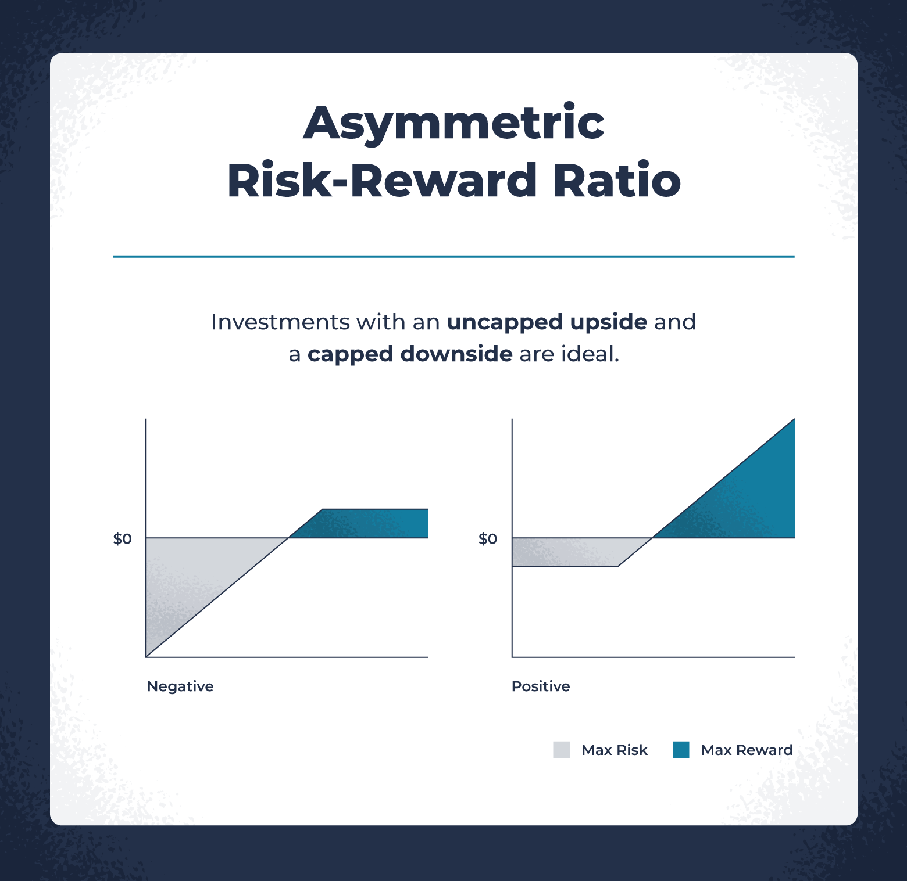

## Table of Contents

## What is risk and reward analysis?

Risk and reward analysis is a way to think about the good and bad things that might happen when you make a choice. It helps you understand what you might gain and what you might lose before you decide to do something. For example, if you are thinking about starting a new business, you would look at how much money you could make and also how much money you could lose.

This kind of analysis is used a lot in business and investing, but it can be helpful in everyday life too. It's like weighing the pros and cons, but with a focus on what you stand to gain or lose. By doing this analysis, you can make smarter choices because you have a better idea of what might happen. It helps you be more prepared for different outcomes.

## Why is understanding upside potential important in investment decisions?

Understanding upside potential is important in investment decisions because it shows you how much money you could make if things go well. It's like looking at the best possible outcome. When you know the upside potential, you can decide if the possible reward is worth the risk you're taking. For example, if you're thinking about buying a stock, you want to know how high its price could go. This helps you see if the investment could be really profitable.

Also, knowing the upside potential helps you compare different investment options. If one investment has a much higher upside than another, you might choose it, even if it's riskier. It's all about balancing the chance of big gains with the chance of losses. By understanding the upside potential, you can make smarter choices and feel more confident about where you put your money.

## How can you measure the upside potential of an investment?

To measure the upside potential of an investment, you can look at how much the value of the investment could grow. For example, if you're thinking about buying a stock, you might look at the company's past performance and future plans. You could see how much the stock price has grown in the past and what the company says about its future growth. This helps you guess how high the stock price might go. You can also use tools like financial models or forecasts from experts to get an idea of the upside potential.

Another way to measure upside potential is by comparing the investment to others. If you're looking at different stocks, you might see which one has the biggest potential to grow. You can do this by looking at things like the price-to-earnings ratio or other financial metrics that show how much value you're getting for your money. By comparing, you can see which investment might give you the biggest reward if things go well. This helps you decide where to put your money to get the best possible outcome.

## What are common metrics used to evaluate the upside potential of a stock?

When you want to know how much a stock might grow, you can look at some common metrics. One of these is the price-to-earnings ratio, or P/E ratio. This tells you how much you're paying for each dollar of the company's earnings. A lower P/E ratio might mean the stock is a good deal, and it could have a lot of room to grow. Another metric is the earnings growth rate, which shows how fast the company's earnings are increasing. If a company's earnings are growing quickly, the stock price might go up a lot too.

You can also look at the price-to-book ratio, which compares the stock's market value to its book value. If the price-to-book ratio is low, it might mean the stock is undervalued and could have a big upside. Another useful metric is the return on equity (ROE), which shows how well the company is using its money to make more money. A high ROE can be a sign that the company is doing well and the stock might have a lot of potential to grow.

These metrics help you understand how much a stock might go up in value. By looking at them, you can make better guesses about which stocks might give you the biggest rewards. It's like having a map to find the best investment opportunities.

## Can you explain the concept of risk-adjusted returns in relation to upside potential?

Risk-adjusted returns are a way to see how much money you're making from an investment while also thinking about how risky it is. It's like looking at the reward you get and comparing it to the chance of losing money. When you know the risk-adjusted return, you can better understand if the upside potential of an investment is worth the risk. For example, if two investments have the same upside potential but one is much riskier, the one with less risk might be a better choice because it gives you a better reward for the risk you're taking.

To measure risk-adjusted returns, people often use something called the Sharpe ratio. This number helps you see how much extra return you're getting for each unit of risk. If an investment has a high Sharpe ratio, it means you're getting a good reward for the risk you're taking. This can help you decide if the upside potential of an investment is really worth it. By looking at risk-adjusted returns, you can make smarter choices about where to put your money, balancing the chance of big gains with the possibility of losses.

## How do market conditions affect the upside potential of investments?

Market conditions play a big role in the upside potential of investments. When the market is doing well, like when the economy is growing and people are feeling confident, the upside potential of many investments can be higher. This is because companies might make more money, and their stock prices might go up a lot. For example, if a lot of people are buying things, companies that sell those things might see their profits grow, which can make their stock prices rise.

On the other hand, when the market is not doing well, like during a recession or when there's a lot of uncertainty, the upside potential of investments can be lower. In these times, people might be more careful about spending money, and companies might not make as much profit. This can make stock prices go down or not grow as much. So, understanding the current market conditions can help you guess how much an investment might grow and decide if it's a good time to invest.

## What role does diversification play in maximizing upside potential while managing risk?

Diversification is a way to spread your money across different types of investments. This can help you get the most out of the upside potential while also keeping the risk under control. When you put all your money into one investment, it can be really risky because if that investment doesn't do well, you could lose a lot. But if you spread your money out, you have a better chance of some of your investments doing well, even if others don't. This way, you can still see big gains from the investments that go up a lot, but you're not putting all your eggs in one basket.

By diversifying, you can also take advantage of different market conditions. Some investments might do better when the economy is growing, while others might do better when things are not going so well. For example, if you have money in both stocks and bonds, you might see your stocks grow a lot during good times, but your bonds can help protect your money during bad times. This balance can help you maximize the upside potential of your overall investment portfolio while managing the risk of big losses.

## How can historical data be used to predict future upside potential?

Historical data can help you guess how much an investment might grow in the future. By looking at how a stock or a company did in the past, you can see patterns and trends. For example, if a company's stock price went up a lot during certain times of the year, you might think it could happen again. Or if a company's earnings grew steadily over the last few years, you might expect them to keep growing. This information can give you a good idea of what the upside potential might be.

But, it's important to remember that the past doesn't always tell us exactly what will happen in the future. Things like new technology, changes in the economy, or unexpected events can make the future different from the past. So, while historical data is a helpful tool, it's just one part of the puzzle. You should also look at other things, like what's happening in the market now and what experts think might happen next, to get a full picture of the upside potential.

## What are some advanced statistical models used for forecasting upside potential?

One advanced statistical model used for forecasting upside potential is the Monte Carlo simulation. This model uses lots of random numbers to run many different scenarios of what might happen to an investment. It's like playing out many different futures to see all the possible outcomes. By doing this, you can see not just the best-case scenario but also the average and worst-case scenarios. This helps you understand the full range of upside potential and make better decisions about where to put your money.

Another model is the regression analysis. This model looks at how different things, like interest rates or company earnings, have affected an investment's price in the past. By understanding these relationships, you can predict how changes in these factors might affect the investment's price in the future. For example, if you know that a company's stock price goes up when its earnings grow, you can use this information to guess how much the stock price might rise if earnings keep growing. This helps you see the upside potential based on what's likely to happen.

## How do different investment strategies impact the upside potential of a portfolio?

Different investment strategies can change how much your portfolio might grow. If you use a growth strategy, you're looking for stocks or other investments that could go up a lot in value. These are often companies that are growing quickly or are in new industries. This strategy can lead to big gains if you pick the right investments, but it can also be riskier because these companies might not always do well. On the other hand, a value strategy focuses on finding investments that seem underpriced. These might not grow as fast as [growth stocks](/wiki/growth-stocks), but they can still offer good upside potential if the market realizes their true value.

Another strategy is income investing, where you focus on investments that pay you regular money, like dividends from stocks or interest from bonds. This strategy might not have the same high upside potential as growth investing, but it can provide a steady return and help balance out the risk in your portfolio. By mixing different strategies, like having some growth stocks, some value stocks, and some income investments, you can try to maximize the upside potential while managing risk. This way, you can take advantage of different market conditions and improve your chances of seeing your portfolio grow.

## What are the psychological factors investors should consider when evaluating upside potential?

When investors think about how much money they might make from an investment, they should also think about their own feelings and thoughts. One big psychological [factor](/wiki/factor-investing) is something called "loss aversion." This means that people feel the pain of losing money much more than the joy of making money. So, even if an investment has a big upside potential, an investor might be too scared to take the risk because they're worried about losing money. It's important for investors to know this about themselves so they can make choices that match their comfort with risk.

Another psychological factor is "overconfidence." Some investors might think they know more than they really do and take bigger risks because they believe they can predict the future. This can lead them to focus too much on the upside potential and not enough on the risks. Being aware of overconfidence can help investors stay realistic and not bet too much on one investment just because they think it will do well. By understanding these psychological factors, investors can make smarter decisions that balance the chance of big gains with the risk of losses.

## How can scenario analysis enhance the understanding of upside potential in complex investment environments?

Scenario analysis is a tool that helps investors see how different things might affect their investments. It's like playing out different stories of what could happen in the future. By looking at many different scenarios, investors can get a better idea of the upside potential of their investments. For example, they can see what might happen if the economy grows a lot, or if there's a big change in technology, or if there's a new law that affects their investments. This helps them understand not just the best-case scenario but also other possible outcomes.

Using scenario analysis is especially helpful in complex investment environments where lots of things can change. It lets investors think about how different risks and opportunities might play out. By doing this, they can plan better and make choices that fit with what they want to happen. It's like having a map that shows many different paths you could take, so you can pick the one that looks best for you. This way, investors can feel more ready for whatever might happen and make the most of the upside potential in their investments.

## What is the Concept of Upside Potential?

Upside potential is a critical concept for investors and traders, representing the potential financial gains that an investment might achieve relative to its current price or value. This concept is pivotal in evaluating whether an investment might yield a satisfactory return over a defined period.

### Methods to Assess and Quantify Upside Potential

Assessing and quantifying upside potential involves several methods and analytical tools, often predicated on both quantitative and qualitative analyses. Quantitative methods include statistical models and financial ratios that estimate the potential increase in asset prices. Commonly used approaches are:

1. **Discounted Cash Flow (DCF) Analysis**: This method involves estimating the value of an investment based on its expected future cash flows, discounted back to their present value. The formula is represented as:
$$
   DCF = \sum \frac{CF_t}{(1 + r)^t}

$$

   where $CF_t$ is the cash flow in period $t$, and $r$ is the discount rate.

2. **Price-to-Earnings (P/E) Ratio**: Investors assess upside potential by comparing an asset's current P/E ratio with historical averages or industry benchmarks to identify undervaluation.

3. **Technical Analysis**: Chart patterns and indicators, such as moving averages and relative strength indices (RSIs), help traders predict future price movements.

4. **Monte Carlo Simulations**: Used for complex investments, simulations model a range of possible outcomes to assess potential future valuations.

### The Impact of Market Conditions on Upside Potential

Market conditions play a significant role in determining and realizing upside potential. Bull markets typically enhance upside potential as investor sentiment drives prices upward, sometimes beyond fundamental values. Conversely, during bear markets, the upside potential may be constrained by prevailing pessimism, even if an asset appears undervalued.

Additionally, macroeconomic factors such as interest rates, inflation, and geopolitical stability can alter the perceived upside potential of investments. For example, low-interest rates might increase the attractiveness of equities, thereby enhancing their upside potential.

### Using Upside Potential to Make Informed Investment Decisions

Investors aiming to capitalize on upside potential must perform comprehensive investment analysis to form informed strategies. Key actions include:

- **Diversification**: By diversifying across various asset classes and sectors, investors can mitigate risk while seeking assets with substantial upside potential.
- **Sector Rotation**: Involves shifting investments from one sector to another to capture upside in emergent growth areas.
- **Momentum Investing**: Entails purchasing assets that demonstrate an upward price trend, anticipating continued momentum based on observed upward potential.

### Examples of High Upside Potential Investments

Several types of investments are often highlighted for their strong upside potential:

- **Growth Stocks**: Companies with expected high earnings growth rates, often in technology or emerging markets, are typically associated with high upside potential.
- **Startups and Venture Capital**: High-risk investments in early-stage companies can yield significant returns if the business model proves successful.
- **Cryptocurrencies**: Known for their volatility and speculative nature, certain cryptocurrencies may offer high upside potential during periods of adoption and technological advancement.

In conclusion, understanding and leveraging upside potential is essential for maximizing returns and making informed investment decisions in various market environments. By employing strategies and tools to assess upside potential, investors can better navigate the complexities of financial markets.

## References & Further Reading

[1]: Bergstra, J., Bardenet, R., Bengio, Y., & Kégl, B. (2011). ["Algorithms for Hyper-Parameter Optimization."](https://papers.nips.cc/paper/4443-algorithms-for-hyper-parameter-optimization) Advances in Neural Information Processing Systems 24.

[2]: ["Advances in Financial Machine Learning"](https://www.amazon.com/Advances-Financial-Machine-Learning-Marcos/dp/1119482089) by Marcos Lopez de Prado

[3]: ["Evidence-Based Technical Analysis: Applying the Scientific Method and Statistical Inference to Trading Signals"](https://www.amazon.com/Evidence-Based-Technical-Analysis-Scientific-Statistical/dp/0470008741) by David Aronson

[4]: ["Machine Learning for Algorithmic Trading"](https://github.com/stefan-jansen/machine-learning-for-trading) by Stefan Jansen

[5]: ["Quantitative Trading: How to Build Your Own Algorithmic Trading Business"](https://www.amazon.com/Quantitative-Trading-Build-Algorithmic-Business/dp/1119800064) by Ernest P. Chan