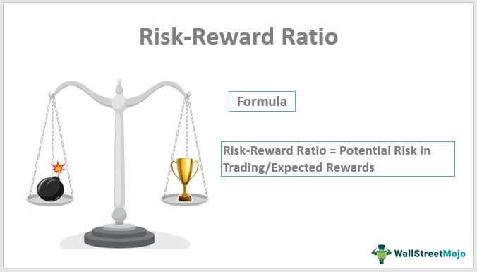

Algorithmic trading harnesses the power of computers to execute trading orders at speeds and frequencies that a human trader cannot achieve. This approach to trading presents both significant opportunities and formidable challenges. Opportunities arise in the form of enhanced efficiency, the ability to process large volumes of data in real time, and the creation of sophisticated trading strategies that can adapt to dynamic markets. However, these opportunities are accompanied by challenges such as the need for robust risk assessment and precise decision-making. 

Risk assessment is critical because it involves evaluating the potential financial losses that may occur as a result of trading activities. In algorithmic trading, this is achieved through quantitative data analysis, enabling traders to predict and mitigate risks effectively. The unpredictability of market conditions demands that traders have the tools and knowledge to manage their exposure to risk proactively.



Decision-making in algorithmic trading hinges on the use of automated systems and quantitative models. These systems can eliminate emotional biases and base trades solely on statistical evidence and logic. This requires continuously updated data to ensure that the algorithms respond to evolving market conditions with precision and speed.

Understanding and calculating rewards are equally essential in developing robust trading strategies. One fundamental concept in trading is the risk-reward ratio, which provides traders with a measure to compare the potential risk to potential rewards. By employing strategies that favor a higher ratio of reward to risk, traders can enhance their chances of profitability.

This article examines how risk assessment, decision-making, and reward calculation integrate into algorithmic trading. It underscores the importance of these processes in achieving successful trading outcomes. By exploring these components, we aim to provide insight into how algorithmic trading can be harnessed effectively, balancing the scales of opportunity and challenge for optimal trading performance.

## Table of Contents

## Understanding Risk Assessment in Algorithmic Trading

Risk assessment in algorithmic trading is a critical component that involves evaluating the potential financial losses inherent in trading activities. It integrates quantitative data analysis to predict and mitigate risks, offering traders a systematic approach to manage their exposure to market volatility and unexpected events effectively.

In [algorithmic trading](/wiki/algorithmic-trading), sophisticated mathematical models and statistical techniques are employed to quantify risk. These quantitative methods are essential for understanding the probability of different trading outcomes and their associated impacts. By analyzing historical data and market trends, traders can forecast potential market behaviors and vulnerabilities. For instance, Value at Risk (VaR) is a commonly used metric that estimates the potential loss in value of a portfolio over a defined period for a given confidence interval. Mathematically, this can be represented as:

$$
\text{VaR}_\alpha = -\inf \left\{ x \in \mathbb{R} : P(L \leq x) > \alpha \right\}
$$

where $L$ is the random variable representing loss and $\alpha$ is the confidence level.

Effective risk assessment strategies in algorithmic trading are not just about prediction but are also focused on mitigation. This involves deploying tools that can safeguard traders from significant losses. Stop-loss orders are widely used to limit potential losses by automatically selling a security when its price falls to a predetermined level. This tool is instrumental in protecting capital, especially in volatile markets.

Risk-reward ratios also play a pivotal role in managing exposure. This ratio compares the potential risk to the potential reward of a trade, guiding traders in making informed decisions. A favorable risk-reward ratio is desirable as it indicates that the potential rewards outweigh the risks, aligning with the trader's risk tolerance and investment objectives.

In conclusion, integrating comprehensive risk assessment methodologies in algorithmic trading strategies is paramount for maintaining consistent performance and sustainability in the market. By systematically analyzing risks and implementing effective mitigation techniques like stop-loss orders and understanding risk-reward ratios, traders can enhance their ability to manage potential downsides and maximize returns.

## Decision Making in Algorithmic Trading

Algorithmic trading necessitates accurate decision-making through the application of quantitative models. These models serve as the cornerstone for establishing precise entry and [exit](/wiki/exit-strategy) points in trading, allowing for the automation of trades according to predetermined criteria. Automated systems are adept at executing trades swiftly, thereby removing the influence of human emotion and emotional biases, which can often lead to suboptimal trading decisions.

The decision-making process in algorithmic trading is significantly enriched by access to real-time data and the ability to respond to evolving market conditions. Advanced algorithms are designed to process vast amounts of market data, extracting valuable insights to guide trading decisions. This capability ensures that the algorithms continuously adapt to market changes, enhancing their decision-making effectiveness.

Backtesting plays a critical role in validating the efficacy of trading algorithms. By simulating the algorithmic trading strategies on historical data, traders can gauge their performance prior to deployment in live markets. This process helps identify potential weaknesses in the model and allows for refinements to be made, minimizing the risk of financial loss. Effective [backtesting](/wiki/backtesting) involves rigorously testing the algorithm under various market scenarios to ensure robustness.

Consideration of the following Python code snippet demonstrates a basic backtesting framework that evaluates a simple moving average crossover strategy for buy and sell signals:

```python
import pandas as pd
import numpy as np

# Sample data: historical prices
data = {'Price': [100, 102, 104, 105, 107, 106, 108, 111, 110, 109]}
df = pd.DataFrame(data)

# Calculate moving averages
df['SMA_5'] = df['Price'].rolling(window=5).mean()
df['SMA_10'] = df['Price'].rolling(window=10).mean()

# Generate trading signals
df['Signal'] = 0
df.loc[df['SMA_5'] > df['SMA_10'], 'Signal'] = 1  # Buy signal
df.loc[df['SMA_5'] < df['SMA_10'], 'Signal'] = -1 # Sell signal

# Calculate returns
df['Returns'] = df['Signal'].shift(1) * (df['Price'].pct_change())

# Print the strategy's performance
df['Cumulative Returns'] = (1 + df['Returns']).cumprod()
print(df[['Price', 'SMA_5', 'SMA_10', 'Signal', 'Cumulative Returns']])
```

This example illustrates how a simple strategy can be implemented, tested, and analyzed to ensure it aligns with the intended trading objectives. Enhanced understanding of backtesting results allows traders to refine decision-making parameters, increasing the potential for success in algorithmic trading.

## Calculating Rewards: The Importance of Risk-Reward Ratio

Calculating the risk-reward ratio is a fundamental step in assessing the potential viability of a trade. This ratio compares the amount of risk versus the amount of reward, providing traders a numerical basis to evaluate whether an investment provides a sufficient return relative to the risk taken. The risk-reward ratio is defined as:

$$
\text{Risk-Reward Ratio} = \frac{\text{Potential Loss}}{\text{Potential Gain}}
$$

A favorable risk-reward ratio suggests that the potential gains justify the exposure to risk. For instance, a risk-reward ratio of 1:2 indicates that a trader is willing to risk $1 to potentially gain $2. This creates a scenario where the reward is twice the risk, demonstrating a potentially profitable investment opportunity if the trader's analysis proves accurate.

Traders aim to maintain a favorable risk-reward ratio, often targeting ratios such as 1:2, 1:3, or higher. A ratio of 1:2 is a common benchmark, meaning the potential gain is double the risk. This helps in ensuring that even if only a portion of the trades are winners, the overall profitability of the trading strategy is sustained due to the higher gains from winning trades compensating for losing ones.

In algorithmic trading, calculating the risk-reward ratio becomes an integral part of the trading strategy development process. Here's a simple Python function to calculate the risk-reward ratio:

```python
def calculate_risk_reward(potential_loss, potential_gain):
    if potential_gain == 0:
        raise ValueError("Potential gain must be greater than zero.")
    ratio = potential_loss / potential_gain
    return ratio

# Example usage
potential_loss = 50  # Risk $50
potential_gain = 100  # Gain $100
risk_reward_ratio = calculate_risk_reward(potential_loss, potential_gain)
print("Risk-Reward Ratio:", risk_reward_ratio)  # Output: Risk-Reward Ratio: 0.5
```

In trading, selecting trades based on a calculated risk-reward ratio helps filter out less promising opportunities and focus on those that align with strategic risk management goals. This systematic approach assists traders in maintaining discipline, minimizing emotional influence, and ultimately striving toward profitable outcomes.

Professional traders adopt this strategy rigorously, whereby maintaining a higher ratio such as 1:2 or more not only optimizes the probability of net gains but also strategically mitigates losses over time. Through this disciplined approach, traders are better equipped to endure bouts of market [volatility](/wiki/volatility-trading-strategies) and capitalize on movements that align with their calculated forecasts.

## Algorithmic Trading and Reward Calculation Strategies

In algorithmic trading, reward calculations play a fundamental role in guiding trading strategies. These calculations are integrated into trading algorithms, enabling them to make decisions that aim to optimize potential returns while simultaneously managing associated risks. By embedding reward calculations into algorithms, traders can achieve more efficient and systematic approaches to trading.

Optimization of algorithms is critical for maximizing potential rewards. This involves refining algorithms to improve performance metrics such as return on investment, Sharpe ratio, and drawdown minimization. Techniques such as [machine learning](/wiki/machine-learning) and advanced statistical methods can be employed to enhance algorithmic efficiency and precision. Machine learning models, for instance, can learn from historical data to predict future price movements, helping traders fine-tune their algorithms to seize profitable opportunities.

Visual and statistical tools are invaluable in setting realistic targets and determining exit strategies. Tools such as heatmaps, scatter plots, and regression analysis allow traders to visualize data trends and correlations, offering insights into market behavior. For example, a heatmap can reveal the profitability of different trades over time, assisting traders in identifying high-reward strategies and adjusting their algorithms accordingly. Similarly, statistical analyses can aid in estimating expected returns and potential risks, allowing traders to set quantifiable targets for their trading models.

To ensure trading strategies remain effective, regular adjustments to algorithms are necessary. Market conditions are dynamic, and algorithms must be adaptable to shifts in trends, [liquidity](/wiki/liquidity-risk-premium), and volatility. Traders often conduct periodic reviews and backtesting of their algorithms using historical data to validate their strategies and make necessary modifications. Backtesting provides a simulated environment where traders can assess the performance of their algorithms under various market scenarios, ensuring they remain aligned with current trends and continue to maximize reward potential.

The process of integrating reward calculations into algorithmic trading requires a blend of technical skill and strategic thinking. By utilizing optimization techniques, visual tools, and frequent adjustments, traders can enhance their algorithmic trading strategies and improve their chances of achieving significant returns.

## Limiting Risks with Stop Losses and Other Techniques

Stop-loss orders provide traders with essential tools to mitigate potential losses during trading activities. These orders are predefined price thresholds set by traders, allowing an automatic sale of a financial instrument when it reaches a specified price. By doing so, traders effectively limit their losses in adverse market conditions. In algorithmic trading, stop-loss mechanisms are commonly integrated into trading algorithms to safeguard capital and manage risk efficiently.

Algorithmic strategies frequently deploy stop-loss orders to automatically execute trades without emotion, which is particularly useful in volatile markets where rapid price changes can occur. For instance, consider an algorithm designed to sell a stock if its price drops by 5% from the purchase price. This technique can help ensure that excessive losses are avoided, preserving the trader's capital for future trades.

Diversification is another crucial strategy for risk management. By diversifying investments across various asset classes, sectors, or geographic regions, traders can reduce the impact of a poor-performing asset on their overall portfolio. Diversification follows the principle that not all markets or securities move in concert, therefore spreading risk. For example, holding both stocks and bonds in a portfolio can minimize risk, as these asset classes often behave differently under similar economic conditions.

Hedging further supports risk management by counterbalancing potential losses in one investment with gains in another. Traders often use derivative products such as options and futures for hedging purposes. For example, an investor holding a significant equity position might purchase put options on a stock index to protect against a broad market downturn. This helps minimize potential losses without liquidating the position prematurely.

Collectively, these techniques maintain trading confidence and safeguard capital. In algorithmic trading, the integration of stop-loss orders, diversification, and hedging helps ensure a structured approach to risk management. Implementing these strategies mitigates potential trading hazards and contributes to a more sustainable trading practice.

## Conclusion

Risk assessment, decision-making, and reward calculation form the backbone of successful algorithmic trading. These elements, when correctly managed, significantly enhance trading performance and profitability. By assessing risks accurately, traders can foresee potential financial losses and strategically position their trades to minimize exposure. Decision-making in algorithmic trading is heavily reliant on quantitative models and automated systems, which allow traders to execute actions based on objective criteria, reducing emotional interference.

In trading, calculating rewards is equally important as understanding risks. The risk-reward ratio is a pivotal concept that aids traders in determining the viability of their trades. By aiming for a favorable risk-reward ratio, typically a minimum of 1:2, traders are able to justify the risks they are willing to take for the potential gains. To sustain profitability, it is crucial for traders to continuously evaluate and adapt their strategies, taking into account dynamic market conditions.

Traders are encouraged to continually educate themselves on emerging trends and techniques in algorithmic trading. This ongoing education supports the adaptation of strategies to maintain their effectiveness in real-time market environments. With the appropriate tools and a strong understanding of risk, decision-making, and reward calculation principles, algorithmic trading can become a consistently rewarding venture.

## References & Further Reading

[1]: Bergstra, J., Bardenet, R., Bengio, Y., & Kégl, B. (2011). ["Algorithms for Hyper-Parameter Optimization."](https://papers.nips.cc/paper/4443-algorithms-for-hyper-parameter-optimization) Advances in Neural Information Processing Systems 24.

[2]: ["Advances in Financial Machine Learning"](https://www.amazon.com/Advances-Financial-Machine-Learning-Marcos/dp/1119482089) by Marcos Lopez de Prado

[3]: ["Evidence-Based Technical Analysis: Applying the Scientific Method and Statistical Inference to Trading Signals"](https://books.google.com/books/about/Evidence_Based_Technical_Analysis.html?id=jbD47VkOHAEC) by David Aronson

[4]: ["Machine Learning for Algorithmic Trading"](https://github.com/stefan-jansen/machine-learning-for-trading) by Stefan Jansen

[5]: ["Quantitative Trading: How to Build Your Own Algorithmic Trading Business"](https://www.amazon.com/Quantitative-Trading-Build-Algorithmic-Business/dp/1119800064) by Ernest P. Chan