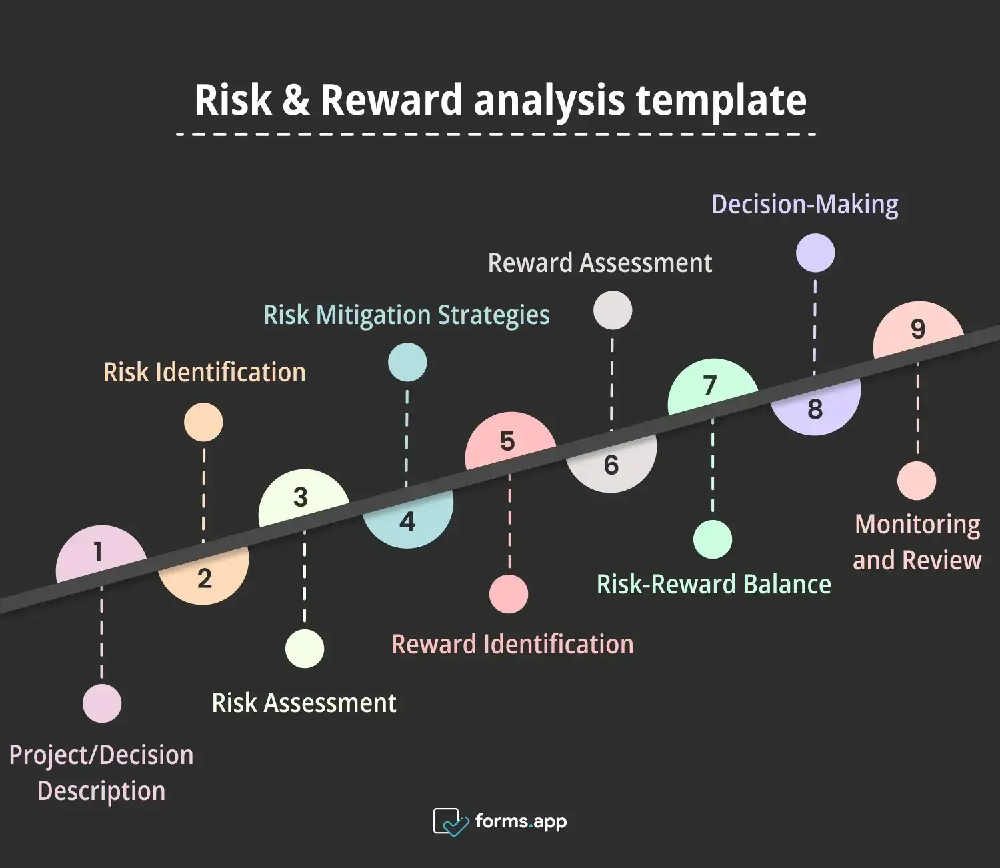

## Table of Contents

## What is risk and reward assessment?

Risk and reward assessment is a way to figure out how much you might gain or lose when you make a choice. It's like weighing the good and the bad before deciding to do something. For example, if you're thinking about starting a new business, you would look at how much money you could make and compare it to how much money you might lose if things don't go well.

This kind of assessment helps people make smarter decisions. By looking at both the risks and the rewards, you can decide if the possible benefits are worth the chance of losing something. It's used in many areas, like investing money, starting projects at work, or even planning personal goals. Understanding the risks and rewards can help you prepare better and choose the best path forward.

## Why is risk and reward assessment important in decision-making?

Risk and reward assessment is important in decision-making because it helps you see the possible good and bad outcomes of your choices. When you know what you might gain and what you might lose, you can make smarter decisions. For example, if you're thinking about buying a new car, you would look at how much it costs and how much it will help you. If the car is too expensive and you don't really need it, you might decide it's not worth the risk.

This kind of assessment also helps you plan better. By understanding the risks, you can think of ways to lower them. For instance, if you're investing money, you might choose to spread it out in different places so you don't lose everything if one investment fails. Knowing the rewards helps you set goals and decide if the effort is worth it. In the end, risk and reward assessment makes your decisions more thoughtful and helps you feel more confident about the choices you make.

## How can beginners start assessing risks and rewards in everyday situations?

Beginners can start assessing risks and rewards by thinking about the possible good and bad things that could happen with a choice. For example, if you're deciding whether to go to a party, think about the fun you might have (the reward) and the chance you might be tired the next day (the risk). It's helpful to write down these thoughts so you can see them clearly. Ask yourself, "What's the best thing that could happen? What's the worst thing that could happen?" This way, you can see if the good things are worth the chance of the bad things happening.

Another way to start is by talking to other people about their experiences. If you're thinking about trying a new hobby, like rock climbing, ask someone who has done it before. They can tell you about the fun parts and the tricky parts. This can give you a better idea of what to expect. Remember, it's okay to start small. You don't have to make big decisions right away. Practice with little choices, like deciding what to eat for dinner, and you'll get better at weighing risks and rewards over time.

## What are common methods used to quantify risk and reward?

One common method to quantify risk and reward is by using numbers. People often look at how much money they might make or lose. For example, if you're investing in stocks, you might look at the stock's past performance and the potential future growth to guess how much money you could make. On the risk side, you might look at how much the stock's price goes up and down, which is called volatility. The more it goes up and down, the riskier it is. This helps you see if the possible reward is worth the risk.

Another method is using a scale or a chart. For example, you could rate the risk and reward on a scale from 1 to 10, where 1 is low and 10 is high. This can help you compare different choices more easily. You might also use a chart to list all the possible good and bad outcomes and assign them a number based on how likely they are to happen and how much they would affect you. This way, you can see all the risks and rewards in one place and decide if the choice is worth it.

Some people also use probability and expected value to quantify risk and reward. Probability is about how likely something is to happen. For example, if you're thinking about starting a new business, you might guess the chance that it will succeed. Expected value is a way to combine the probability with the reward or risk. You multiply the chance of something happening by how much it would be worth to you. This gives you a number that helps you see if the choice is a good one. By using these methods, you can make better decisions by understanding the numbers behind your choices.

## Can you explain the concept of risk tolerance and its role in reward assessment?

Risk tolerance is about how much risk you're okay with when making a choice. It's different for everyone. Some people like to take big risks because they think the rewards might be really good. Others don't like risks at all and prefer to keep things safe, even if it means the rewards might be smaller. Knowing your risk tolerance helps you decide what choices to make. If you know you don't like taking big risks, you'll choose options that are safer, even if they might not give you the biggest rewards.

Risk tolerance plays a big part in how you assess rewards. When you look at the possible rewards of a choice, you also think about how much risk you're willing to take to get those rewards. For example, if you're thinking about investing money, you might see a chance to make a lot of money, but it's very risky. If your risk tolerance is low, you might decide the reward isn't worth it. But if you're okay with taking big risks, you might go for it. Understanding your risk tolerance helps you see if the rewards of a choice are worth the risks you have to take.

## How do different industries apply risk and reward assessment differently?

In the finance industry, risk and reward assessment is key for making investment choices. People in this field look at how much money they might make and how much they could lose. They use numbers and charts to figure this out. For example, a stockbroker might look at a company's past performance and future growth to decide if buying its stock is a good idea. They also think about how much the stock's price might go up and down, which is called volatility. This helps them see if the possible reward is worth the risk. Knowing their own risk tolerance is important too, because it helps them decide if they're okay with taking big risks for bigger rewards.

In the healthcare industry, risk and reward assessment is used to make decisions about treatments and patient care. Doctors and nurses look at the benefits of a treatment and compare them to the possible side effects or risks. For example, if a patient needs surgery, the doctor will explain how the surgery might help the patient get better, but also talk about the risks, like infection or complications. The patient's risk tolerance is important here too. If the patient doesn't want to take big risks, they might choose a safer treatment, even if it means the rewards might be smaller. This helps make sure the choices are good for the patient's health and well-being.

In the technology industry, risk and reward assessment is used when deciding to develop new products or features. Companies look at how much money and time they might need to spend, and compare that to how much they could earn from the new product. For example, a tech company might think about creating a new app. They would look at the cost of development and the potential profits. They also think about the risks, like the app not being popular or having technical problems. Knowing their risk tolerance helps them decide if they're willing to spend a lot of money and time on something that might not work out, but could bring big rewards if it does.

## What tools or software are available to help with risk and reward analysis?

There are many tools and software that can help with risk and reward analysis. One popular tool is Microsoft Excel, which is great for making charts and doing calculations. People use Excel to list all the possible good and bad things that could happen with a choice, and then they can use numbers to see if the choice is worth it. Another tool is risk management software like RiskWatch or @RISK, which helps people see how likely different risks are and how much they could affect their plans. These tools use numbers and charts to make it easier to understand the risks and rewards.

Another type of software is decision-making tools like Decision Lens or Expert Choice, which help people compare different choices and see which one is best. These tools let you put in all the information about the risks and rewards of each choice, and then they show you which choice has the best balance of risks and rewards. They can also help you see how your own risk tolerance affects your decisions. By using these tools, you can make better choices because you have a clear picture of what might happen.

## How can historical data be used to improve risk and reward assessments?

Historical data can help improve risk and reward assessments by showing what happened in the past. When you look at old information, you can see patterns and trends that can help you guess what might happen next. For example, if you're thinking about investing in a company, you can look at how their stock did in the past. If the stock went up a lot during good times and didn't fall too much during bad times, you might think it's a good investment. This way, historical data gives you a better idea of the risks and rewards you might face.

Using historical data also helps you learn from past mistakes and successes. If you see that a certain choice worked out well in the past, you might decide to do it again. But if it didn't work out, you can try to figure out why and avoid making the same mistake. For example, if a new product failed because it was too expensive, you might decide to make the next product cheaper. By looking at what happened before, you can make smarter choices and improve your chances of getting good rewards while managing the risks.

## What are the psychological biases that can affect risk and reward decision-making?

One psychological bias that can affect risk and reward decision-making is called overconfidence. This is when people think they know more than they really do, or they think they're better at something than they are. For example, someone might think they can predict the stock market really well, so they take big risks without really understanding how things work. This can lead to bad choices because they're not seeing the risks clearly.

Another bias is loss aversion, which means people feel the pain of losing something more than the joy of gaining something. This can make people too scared to take risks, even when the rewards might be good. For example, someone might not want to start a new business because they're too worried about losing money, even if the business could be very successful. This bias can make people miss out on good opportunities because they're too focused on avoiding losses.

A third bias is the availability heuristic, where people judge the likelihood of something happening based on how easily they can think of examples. If someone hears a lot about businesses failing, they might think starting a business is too risky, even if many businesses do well. This can lead to wrong decisions because they're not looking at all the information, just what's easy to remember.

## How does one balance short-term gains against long-term risks in an assessment?

Balancing short-term gains against long-term risks is like choosing between getting something good now or waiting for something even better later. Short-term gains are things you can have right away, like making quick money from a risky investment. But they can come with long-term risks, like losing money in the future if the investment goes bad. To balance these, you need to think about how much you want the short-term gain and how much you're willing to risk losing in the long run. For example, if you're thinking about buying a cheap car that might break down soon, you might save money now but end up spending more on repairs later.

One way to make this decision is by looking at the big picture. Think about what you want in the future and how the choice you make now will affect that. If you want to save money for a big goal, like buying a house, you might decide that the short-term gain isn't worth the long-term risk. It's helpful to write down the short-term gains and the long-term risks and see if the reward of the short-term gain is big enough to make up for the risk. By doing this, you can make a choice that helps you reach your long-term goals without losing too much along the way.

## What advanced statistical models are used in expert risk and reward assessments?

In expert risk and reward assessments, one advanced statistical model that is often used is the Monte Carlo simulation. This model helps people see all the different things that could happen by running many different scenarios. It's like playing out a game many times to see all the possible ways it could end. For example, if you're thinking about investing in a stock, the Monte Carlo simulation can show you how the stock might go up or down over time. By looking at all these different paths, you can get a better idea of the risks and rewards and make a smarter choice.

Another model that experts use is regression analysis. This model looks at how different things are related to each other. For example, it can help you see how the price of a stock might change based on things like the economy or company news. By understanding these relationships, you can predict what might happen in the future and see if the rewards are worth the risks. Regression analysis helps you make decisions based on solid data, so you're not just guessing.

## How can organizations integrate risk and reward assessment into their strategic planning?

Organizations can integrate risk and reward assessment into their strategic planning by making it a regular part of their decision-making process. When they are planning for the future, they should always look at the good and bad things that could happen with each choice. For example, if a company is thinking about starting a new product line, they would look at how much money they could make and compare it to how much they might lose if the product doesn't sell well. By doing this, they can decide if the possible rewards are worth the risks. They can use tools like charts and numbers to help them see the risks and rewards clearly and make better choices.

Another way organizations can use risk and reward assessment is by talking to everyone involved. This means getting input from different parts of the company, like the people who make the products, the people who sell them, and the people who manage the money. Each group can give a different view on the risks and rewards, which helps the company see the whole picture. By including everyone, the organization can make sure they are looking at all the possible good and bad things that could happen. This helps them plan better and be ready for whatever might come their way.

## What is the process of understanding risk assessment in algorithmic trading?

Risk assessment in algorithmic trading is a critical component that involves evaluating the potential financial losses inherent in trading activities. It integrates quantitative data analysis to predict and mitigate risks, offering traders a systematic approach to manage their exposure to market volatility and unexpected events effectively.

In [algorithmic trading](/wiki/algorithmic-trading), sophisticated mathematical models and statistical techniques are employed to quantify risk. These quantitative methods are essential for understanding the probability of different trading outcomes and their associated impacts. By analyzing historical data and market trends, traders can forecast potential market behaviors and vulnerabilities. For instance, Value at Risk (VaR) is a commonly used metric that estimates the potential loss in value of a portfolio over a defined period for a given confidence interval. Mathematically, this can be represented as:

$$
\text{VaR}_\alpha = -\inf \left\{ x \in \mathbb{R} : P(L \leq x) > \alpha \right\}
$$

where $L$ is the random variable representing loss and $\alpha$ is the confidence level.

Effective risk assessment strategies in algorithmic trading are not just about prediction but are also focused on mitigation. This involves deploying tools that can safeguard traders from significant losses. Stop-loss orders are widely used to limit potential losses by automatically selling a security when its price falls to a predetermined level. This tool is instrumental in protecting capital, especially in volatile markets.

Risk-reward ratios also play a pivotal role in managing exposure. This ratio compares the potential risk to the potential reward of a trade, guiding traders in making informed decisions. A favorable risk-reward ratio is desirable as it indicates that the potential rewards outweigh the risks, aligning with the trader's risk tolerance and investment objectives.

In conclusion, integrating comprehensive risk assessment methodologies in algorithmic trading strategies is paramount for maintaining consistent performance and sustainability in the market. By systematically analyzing risks and implementing effective mitigation techniques like stop-loss orders and understanding risk-reward ratios, traders can enhance their ability to manage potential downsides and maximize returns.

## How do you calculate rewards and why is the risk-reward ratio important?

Calculating the risk-reward ratio is a fundamental step in assessing the potential viability of a trade. This ratio compares the amount of risk versus the amount of reward, providing traders a numerical basis to evaluate whether an investment provides a sufficient return relative to the risk taken. The risk-reward ratio is defined as:

$$
\text{Risk-Reward Ratio} = \frac{\text{Potential Loss}}{\text{Potential Gain}}
$$

A favorable risk-reward ratio suggests that the potential gains justify the exposure to risk. For instance, a risk-reward ratio of 1:2 indicates that a trader is willing to risk $1 to potentially gain $2. This creates a scenario where the reward is twice the risk, demonstrating a potentially profitable investment opportunity if the trader's analysis proves accurate.

Traders aim to maintain a favorable risk-reward ratio, often targeting ratios such as 1:2, 1:3, or higher. A ratio of 1:2 is a common benchmark, meaning the potential gain is double the risk. This helps in ensuring that even if only a portion of the trades are winners, the overall profitability of the trading strategy is sustained due to the higher gains from winning trades compensating for losing ones.

In algorithmic trading, calculating the risk-reward ratio becomes an integral part of the trading strategy development process. Here's a simple Python function to calculate the risk-reward ratio:

```python
def calculate_risk_reward(potential_loss, potential_gain):
    if potential_gain == 0:
        raise ValueError("Potential gain must be greater than zero.")
    ratio = potential_loss / potential_gain
    return ratio

# Example usage
potential_loss = 50  # Risk $50
potential_gain = 100  # Gain $100
risk_reward_ratio = calculate_risk_reward(potential_loss, potential_gain)
print("Risk-Reward Ratio:", risk_reward_ratio)  # Output: Risk-Reward Ratio: 0.5
```

In trading, selecting trades based on a calculated risk-reward ratio helps filter out less promising opportunities and focus on those that align with strategic risk management goals. This systematic approach assists traders in maintaining discipline, minimizing emotional influence, and ultimately striving toward profitable outcomes.

Professional traders adopt this strategy rigorously, whereby maintaining a higher ratio such as 1:2 or more not only optimizes the probability of net gains but also strategically mitigates losses over time. Through this disciplined approach, traders are better equipped to endure bouts of market [volatility](/wiki/volatility-trading-strategies) and capitalize on movements that align with their calculated forecasts.

## References & Further Reading

[1]: Bergstra, J., Bardenet, R., Bengio, Y., & Kégl, B. (2011). ["Algorithms for Hyper-Parameter Optimization."](https://papers.nips.cc/paper/4443-algorithms-for-hyper-parameter-optimization) Advances in Neural Information Processing Systems 24.

[2]: ["Advances in Financial Machine Learning"](https://www.amazon.com/Advances-Financial-Machine-Learning-Marcos/dp/1119482089) by Marcos Lopez de Prado

[3]: ["Evidence-Based Technical Analysis: Applying the Scientific Method and Statistical Inference to Trading Signals"](https://books.google.com/books/about/Evidence_Based_Technical_Analysis.html?id=jbD47VkOHAEC) by David Aronson

[4]: ["Machine Learning for Algorithmic Trading"](https://github.com/stefan-jansen/machine-learning-for-trading) by Stefan Jansen

[5]: ["Quantitative Trading: How to Build Your Own Algorithmic Trading Business"](https://www.amazon.com/Quantitative-Trading-Build-Algorithmic-Business/dp/1119800064) by Ernest P. Chan