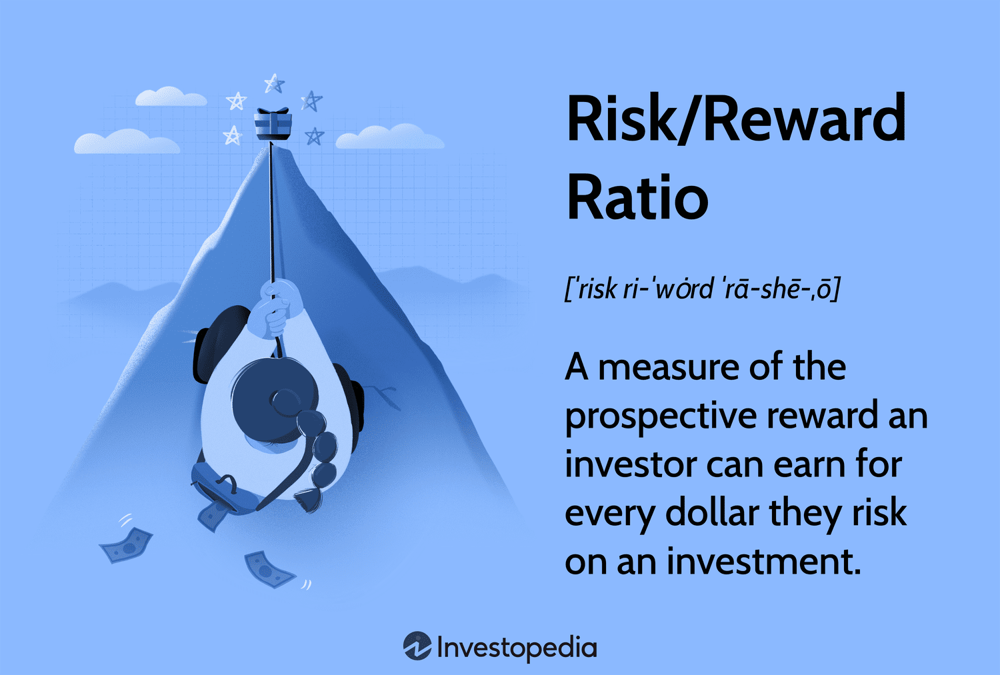

## Table of Contents

## What is the risk-reward ratio in stock investing?

The risk-reward ratio in stock investing is a way to measure how much risk you are taking to get a certain reward. It's like a balance scale where you put the potential profit on one side and the possible loss on the other. For example, if you might lose $1 for every $2 you could gain, your risk-reward ratio is 1:2. This helps investors decide if a stock is worth the risk.

When you use the risk-reward ratio, you want to make sure the reward is big enough to make the risk worth it. If the potential reward is small compared to the risk, you might want to look for a better opportunity. A good risk-reward ratio can help you make smarter choices and manage your money better. It's not a perfect tool, but it's a helpful guide for making decisions in the stock market.

## Why is the risk-reward ratio important for investors?

The risk-reward ratio is important for investors because it helps them understand if a stock is worth the risk. It shows how much money they could lose compared to how much they could gain. If the potential reward is much bigger than the risk, it might be a good investment. But if the risk is bigger than the reward, it might be better to look for another stock. This helps investors make smarter choices and not lose too much money.

Using the risk-reward ratio also helps investors manage their money better. It's like having a map when you're trying to find your way. By looking at the ratio, investors can decide if they want to take a big risk for a big reward, or if they want to play it safe with a smaller reward. This way, they can plan their investments and feel more confident about their decisions.

## How do you calculate the risk-reward ratio for a stock investment?

To calculate the risk-reward ratio for a stock investment, you need to figure out how much money you could lose and how much money you could gain. First, decide at what price you will buy the stock. Then, set a target price for selling the stock if it goes up, which is your potential reward. Also, set a stop-loss price, which is the price at which you will sell the stock if it goes down, to limit your loss. The difference between your buying price and your stop-loss price is your risk. The difference between your buying price and your target selling price is your reward.

Once you have these numbers, you can find the risk-reward ratio by dividing the reward by the risk. For example, if you buy a stock at $50, set a stop-loss at $45, and a target sell price at $60, your risk is $50 - $45 = $5, and your reward is $60 - $50 = $10. So, your risk-reward ratio is $10/$5, which equals 2:1. This means for every dollar you risk, you could gain two dollars. Using this ratio helps you see if the potential reward is worth the risk you are taking.

## What is considered a good risk-reward ratio in stock investing?

A good risk-reward ratio in stock investing is often considered to be at least 2:1. This means that for every dollar you risk, you could potentially earn two dollars. Many investors look for this ratio or higher because it shows that the potential reward is big enough compared to the risk. A 2:1 ratio gives investors a sense of safety, knowing that if they are right about half of their trades, they can still come out ahead.

However, what is considered "good" can vary depending on the investor's goals and how much risk they are willing to take. Some investors might be happy with a 1:1 ratio if they are very confident in their picks and want to make quick trades. Others might aim for a 3:1 or higher ratio if they want to be more conservative and only take on investments with a higher potential reward compared to the risk. Ultimately, the key is finding a balance that fits your own comfort level and investment strategy.

## How does the risk-reward ratio affect investment decisions?

The risk-reward ratio helps investors make smart choices about which stocks to buy. It shows how much money they might lose compared to how much they might gain. If the ratio is high, like 2:1 or 3:1, it means the potential reward is much bigger than the risk. This can make investors feel more confident about buying the stock because the possible gain is worth the risk. On the other hand, if the ratio is low, like 1:1 or less, it might not be worth the risk because the reward isn't big enough compared to what they could lose.

Investors use the risk-reward ratio to plan their investments and manage their money better. By looking at this ratio, they can decide if they want to take a big risk for a big reward, or if they want to play it safe with a smaller reward. This helps them set their goals and choose stocks that fit their comfort level. Even though the risk-reward ratio isn't perfect, it's a helpful tool that guides investors in making better decisions and feeling more in control of their money.

## Can the risk-reward ratio be used in different types of investments?

Yes, the risk-reward ratio can be used in many types of investments, not just stocks. It can help with bonds, real estate, and even starting a business. The idea is the same: you compare how much you might lose to how much you might gain. For example, if you're thinking about buying a rental property, you look at the costs like the down payment and repairs, and then compare that to the rent you could earn. If the rent (reward) is a lot more than the costs (risk), it might be a good investment.

Using the risk-reward ratio in different investments helps people make smarter choices. It's like a tool that shows if the possible reward is worth the risk. Whether you're investing in a new business idea, buying a bond, or looking at real estate, this ratio can guide you. It's not perfect, but it gives you a clear way to think about your money and decide if an investment fits your goals and how much risk you're willing to take.

## What are the limitations of using the risk-reward ratio?

The risk-reward ratio is a helpful tool, but it has some limits. One big limit is that it doesn't tell you how likely it is that you'll actually get the reward. Just because the reward is big compared to the risk doesn't mean you'll definitely get it. The stock market can be unpredictable, and even with a good ratio, you might still lose money. Also, the ratio doesn't think about other costs like fees and taxes, which can make your real reward smaller than you thought.

Another limit is that the risk-reward ratio looks at each investment by itself, but it doesn't help you see the big picture of your whole investment plan. If you're investing in lots of different things, the ratio for one stock might look good, but it might not fit with your overall goals. Plus, people can feel differently about risk. What seems like a good ratio to one person might not feel worth it to someone else. So, while the risk-reward ratio is a good guide, it's not the only thing you should look at when making investment choices.

## How can an investor improve their risk-reward ratio?

An investor can improve their risk-reward ratio by setting better target prices and stop-loss levels. When you set a target price for selling a stock, make sure it's high enough to give you a good reward compared to the risk. Also, set your stop-loss at a price that limits how much you could lose. If you can make the reward bigger and the risk smaller, your risk-reward ratio will get better. For example, if you buy a stock at $50, setting a target sell price at $60 instead of $55 makes your reward bigger. And setting a stop-loss at $48 instead of $45 makes your risk smaller.

Another way to improve the risk-reward ratio is by doing more research and [picking](/wiki/asset-class-picking) better stocks. Look for companies that have strong growth and good financial health. The more you know about a company, the better you can guess how much the stock might go up. This can help you set a higher target price for selling. Also, understanding the market and the economy can help you set a smarter stop-loss price, so you don't lose too much if the stock goes down. By choosing stocks with a higher chance of going up and setting smart prices, you can make your risk-reward ratio better.

## How does the risk-reward ratio relate to portfolio diversification?

The risk-reward ratio helps investors make choices about single stocks, but it also fits into the bigger picture of a whole investment plan, like portfolio diversification. When you spread your money across different types of investments, like stocks, bonds, and real estate, you're trying to lower your overall risk. Even if one investment has a great risk-reward ratio, it might not be enough if it's the only thing in your portfolio. By having different investments, you can balance out the risk and reward across your whole portfolio.

For example, if you have a stock with a high risk-reward ratio, it might be riskier than you want for your whole portfolio. So, you might add some safer investments, like bonds, to lower the overall risk. This way, even if the stock doesn't do well, your other investments might help balance it out. By thinking about the risk-reward ratio of each investment and how it fits with your other investments, you can make a more balanced and safer portfolio.

## What are some common mistakes investors make when assessing the risk-reward ratio?

One common mistake investors make when assessing the risk-reward ratio is focusing too much on the potential reward without considering the likelihood of achieving it. Just because a stock has a high reward compared to the risk doesn't mean it's a sure thing. The stock market can be unpredictable, and even with a good ratio, the stock might not reach the target price. Investors need to think about how likely it is that the stock will actually go up to the reward they're hoping for.

Another mistake is not taking into account all the costs involved. The risk-reward ratio looks at the difference between the buying price, the stop-loss price, and the target sell price, but it doesn't include other costs like trading fees, taxes, and other expenses. These costs can make the actual reward smaller than what the ratio suggests. Investors should always think about these extra costs to get a more accurate picture of the risk and reward.

## How do market conditions influence the risk-reward ratio of investments?

Market conditions can change the risk-reward ratio of investments a lot. When the market is doing well and going up, investors might feel more confident. They might set higher target prices for selling their stocks because they think the stocks will keep going up. This can make the reward part of the ratio bigger. But if the market is shaky or going down, investors might be more careful. They might set lower target prices and tighter stop-losses to protect their money. This can make the risk part of the ratio bigger compared to the reward.

Also, different types of market conditions can affect different investments in different ways. In a booming economy, stocks might have a better risk-reward ratio because companies are making more money and their stock prices are going up. But in a bad economy, stocks might be riskier and the reward might not be as big. On the other hand, bonds might have a better risk-reward ratio during tough times because they are seen as safer. So, investors need to keep an eye on the market and adjust their risk-reward ratios based on what's happening around them.

## How can advanced statistical models enhance the analysis of the risk-reward ratio?

Advanced statistical models can help investors get a better understanding of the risk-reward ratio by looking at more data and finding patterns that are hard to see with just simple math. These models can use past stock prices and other information to guess how likely it is that a stock will reach the target price. They can also help figure out how much the stock might go up or down, which makes the risk-reward ratio more accurate. By using these models, investors can make better guesses about what might happen and set their target prices and stop-losses in a smarter way.

These models can also look at how different things in the market, like interest rates or big news, might change the risk-reward ratio. They can show how these things affect stocks and help investors see if the reward is really worth the risk. Even though these models are really helpful, they're not perfect. The stock market can be hard to predict, and even the best models can get things wrong sometimes. But by using advanced statistical models, investors can make more informed choices and feel more confident about their investments.

## What are the basics of stock investing?

Stock investing involves purchasing shares in a company, making the investor a partial owner of that firm. This investment vehicle can be an integral component of a diversified portfolio due to its potential for long-term capital appreciation, dividend income, and inflation protection. Including stocks in an investment portfolio can enhance its growth potential while also carrying inherent risks. Understanding these risks and benefits is crucial for making informed investment decisions.

### Key Concepts

#### Stock Valuation
Stock valuation determines a stock's intrinsic value, helping investors decide whether a stock is priced appropriately by the market. Various methods include examining a company's financial statements, such as its earnings, cash flow, and debt. Common valuation techniques include:

1. **Price-to-Earnings (P/E) Ratio**: This ratio compares a company's current share price to its per-share earnings. It's a commonly used metric to assess whether a stock is over or undervalued.
$$
   \text{P/E Ratio} = \frac{\text{Market Value per Share}}{\text{Earnings per Share (EPS)}}

$$

2. **Discounted Cash Flow (DCF) Analysis**: This approach calculates the present value of expected future cash flows, providing an estimate of the stock's intrinsic value.

#### Diversification
Diversification involves spreading investments across various asset classes to reduce risk. By holding a mix of different stocks, sectors, and geographies, an investor can mitigate the impact of a poor-performing asset on the portfolio. The goal is to balance risk and return by ensuring that the success or failure of a single investment doesn’t disproportionately impact the entire portfolio.

#### Market Analysis
Market analysis forms the basis of strategic stock investing and involves evaluating economic indicators, industry trends, and market conditions. It assists investors in understanding broader market dynamics and identifying potential opportunities or risks.

### Types of Stocks

1. **Growth Stocks**: These are shares in companies expected to grow at an above-average rate compared to other companies. They often reinvest earnings into expansion and innovation, and as such, may not pay dividends.

2. **Value Stocks**: These stocks are believed to be undervalued by the market and have a lower price relative to their fundamentals, such as dividends, earnings, or sales. Investors purchase value stocks in anticipation of earning returns when the market corrects the undervaluation.

3. **Dividend Stocks**: These are from companies that regularly return a portion of profits to shareholders, providing income in addition to any capital gains from selling the stock.

### Varying Strategies

Investors choose strategies based on market conditions and their individual objectives. For instance, a bullish market might favor growth and [momentum](/wiki/momentum) strategies, while a bearish market might see value and defensive stocks in high demand. Long-term investors might focus on diversified portfolios of value stocks or dividend yield stocks to weather various market cycles.

### Algorithmic Strategies in Stock Investing

Algorithmic trading applies mathematical models and software to execute trades. Advanced algorithms analyze vast data sets to identify buy or sell opportunities, optimizing stock selection and portfolio management. Advantages include:

- **Speed and Efficiency**: Algorithms can process real-time data much faster than human capability, identifying and acting on opportunities instantaneously.

- **Backtesting**: Algorithms can be backtested on past market data to evaluate their performance before deployment, offering a risk-managed approach to strategy formulation.

Python example of a basic moving average crossover strategy:

```python
import pandas as pd

def moving_average_strategy(data, short_window, long_window):
    signals = pd.DataFrame(index=data.index)
    signals['price'] = data['price']
    signals['short_mavg'] = data['price'].rolling(window=short_window, min_periods=1).mean()
    signals['long_mavg'] = data['price'].rolling(window=long_window, min_periods=1).mean()
    signals['signal'] = 0.0
    signals['signal'][short_window:] = np.where(signals['short_mavg'][short_window:] 
                                                 > signals['long_mavg'][short_window:], 1.0, 0.0)   
    signals['positions'] = signals['signal'].diff()
    return signals

# Example usage
# data is a DataFrame with a 'price' column
# signals = moving_average_strategy(data, short_window=40, long_window=100)
```

Such algorithmic strategies automate and enhance decision-making processes, evolving traditional methods of stock investing through technology-driven insights.

## References & Further Reading

[1]: Asness, C. S., Frazzini, A., & Pedersen, L. H. (2013). ["Quality Minus Junk"](https://papers.ssrn.com/sol3/papers.cfm?abstract_id=2312432) Journal of Finance, 69(4), 2125-2160.

[2]: Narang, R. K. (2009). ["Inside the Black Box: A Simple Guide to Quantitative and High-Frequency Trading"](https://onlinelibrary.wiley.com/doi/book/10.1002/9781118267738) Wiley Finance.

[3]: Pardo, R. (2008). ["The Evaluation and Optimization of Trading Strategies"](https://onlinelibrary.wiley.com/doi/book/10.1002/9781119196969) Wiley Trading.

[4]: Haugh, M. B. (2004). ["Algorithmic Trading Strategies with Dynamic Programming and Reinforcement Learning"](https://www.researchgate.net/publication/356833146_Algorithmic_Trading_and_Reinforcement_Learning_Robust_methodologies_for_AI_in_finance) Advances in Neural Information Processing Systems.

[5]: Kissell, R. (2013). ["The Science of Algorithmic Trading and Portfolio Management"](https://www.sciencedirect.com/book/9780124016897/the-science-of-algorithmic-trading-and-portfolio-management) Elsevier.