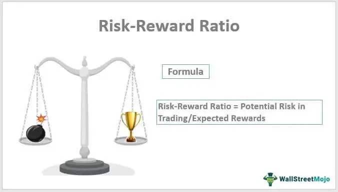

Investment strategies, risk-reward ratios, stock investing, and algorithmic trading are foundational concepts critical to comprehending the stock market's intricate ecosystem. Investment strategies are systematic plans created to guide an investor's selection and management of an investment portfolio. They vary from conservative approaches aimed at preserving capital to aggressive tactics seeking high returns, often tailored to align with an individual’s risk tolerance and financial goals.

The risk-reward ratio is a key metric in evaluating potential investments, representing the expected returns of an investment compared to the amount of risk undertaken to achieve those returns. It's calculated by dividing the potential profit from a trade by the potential loss. A thorough understanding of this ratio allows investors to balance the pursuit of higher returns against the possibility of incurring losses, thus making informed decisions about asset allocation and investment opportunities. 



Stock investing involves purchasing shares of companies with the expectation of capital appreciation, dividend income, or a combination of both. It requires analysis of market trends, economic indicators, and company performance to make decisions that align with the investor’s objectives. Stocks can be categorized into growth, value, and dividend stocks, each offering different risk-return dynamics and playing unique roles within an investor's portfolio.

Algorithmic trading, an increasingly popular approach, employs computer algorithms to automate trading processes. These algorithms can execute trades at speeds and frequencies impossible for a human trader, optimizing strategies through backtesting on historical data. Their integration into the investment landscape has reshaped traditional investing paradigms, enabling traders to better manage risk and exploit market inefficiencies with precision.

Understanding these concepts is essential for successful stock market investing, as their strategic combination forms the basis for informed decision-making. A blend of well-defined investment strategies, accurate risk-reward analysis, and innovative algorithmic trading techniques can significantly enhance investment outcomes. With the rise of technology-driven trading systems, investors face a paradigm shift where these elements coalesce to offer more sophisticated and adaptive approaches to managing investments. This section sets the stage for a comprehensive exploration of each element and their interwoven roles in crafting a robust investment strategy.

## Table of Contents

## Understanding the Investment Strategy

An investment strategy is a coherent plan or approach adopted by an investor to guide their decisions regarding asset allocation and security selection, aiming to achieve specific financial objectives. At its core, an investment strategy provides a structured method for selecting the right investments tailored to the investor's financial goals, risk tolerance, and time horizon. It acts as a roadmap, helping investors navigate the complexities of the financial markets and maintain focus on their long-term objectives.

Various investment strategies exist, each with unique characteristics and intended outcomes. Some of the most prominent strategies in the stock market include:

1. **Value Investing**: This strategy involves selecting stocks that appear to be undervalued in the market. Investors using this approach rely on fundamental analysis to identify stocks trading below their intrinsic value, with the expectation that their prices will eventually reflect their true worth.

2. **Growth Investing**: Growth investors focus on companies that demonstrate high potential for expansion and revenue growth. These stocks are typically characterized by higher price-to-earnings ratios and are often found in emerging industries or technology sectors.

3. **Income Investing**: This approach prioritizes generating a steady income stream through dividends or interest payments. Income investors tend to focus on stocks from established companies with a history of regular dividend payments.

4. **Momentum Investing**: Momentum investors capitalize on market trends by purchasing stocks that have demonstrated an upward price movement and selling those on a downward trend. This strategy relies heavily on technical analysis and market timing.

5. **Index Investing**: An index strategy involves replicating the performance of a specific index, such as the S&P 500, by purchasing the same stocks in the same proportions as the index. This passive investment strategy aims to achieve market-average returns with lower management costs.

Investment strategies are not one-size-fits-all; they're customized based on individual risk tolerance and financial goals. Investors with a higher risk appetite may pursue aggressive growth strategies, while those with a lower tolerance might opt for conservative income-based approaches. Tailoring a strategy involves assessing various risk factors, likely returns, and the time frame needed to achieve specific financial objectives.

Discipline and consistency are crucial when executing an investment strategy. Adhering strictly to a defined plan helps investors stay on track despite market volatilities and emotional impulses that might otherwise lead to hasty decisions. Successful investors often employ set rules for when to buy or sell, ensuring that their actions align with the strategy’s goals.

Algorithmic trading has emerged as a significant component of modern investment strategies. By leveraging sophisticated mathematical models and algorithms, investors can automate trading processes, allowing for rapid execution of transactions based on predetermined criteria. Algorithmic trading enhances the ability to perform complex calculations and analyze market data in real-time, optimizing the timing and precision of trades.

For instance, a simple algorithmic approach might involve the execution of trades based on moving average crossovers. In a Python context, this can be achieved by implementing logic to buy or sell stocks when short-term moving average crosses the long-term moving average:

```python
def moving_average_strategy(prices, short_window=40, long_window=100):
    signals = pd.DataFrame(index=prices.index)
    signals['signal'] = 0.0

    # Calculate short-term moving average
    signals['short_mavg'] = prices['Close'].rolling(window=short_window, min_periods=1, center=False).mean()
    # Calculate long-term moving average
    signals['long_mavg'] = prices['Close'].rolling(window=long_window, min_periods=1, center=False).mean()

    # Generate buy/sell signals
    signals['signal'][short_window:] = np.where(signals['short_mavg'][short_window:] > signals['long_mavg'][short_window:], 1.0, 0.0)   
    signals['positions'] = signals['signal'].diff()

    return signals
```

This automation not only helps in maintaining discipline but also aligns closely with the strategy’s parameters, removing human biases and increasing efficiency in managing investments.

In conclusion, investment strategies serve as foundational elements in financial planning, enabling investors to systematically pursue their financial goals while considering risk constraints. With the integration of [algorithmic trading](/wiki/algorithmic-trading), these strategies can significantly enhance decision-making and execution in today's fast-paced markets.

## Decoding the Risk-Reward Ratio

The risk-reward ratio is a critical concept in stock investing, serving as a fundamental measure to gauge the potential profitability of an investment against its possible losses. This ratio is derived by comparing the expected return of an investment to the amount of risk involved in undertaking it. It is typically expressed as a decimal or fraction in which the value represents the potential reward for every unit of risk assumed.

For example, if an investment offers a potential gain of $200 with a potential loss of $100, the risk-reward ratio would be 2:1. This means that for every dollar risked, the investor aims to gain two dollars. Thus, a lower risk-reward ratio is preferable, as it indicates that an investor is exposed to less risk for a given level of expected return.

Investors utilize the risk-reward ratio to evaluate trades and investment opportunities, enabling informed decision-making. By assessing this ratio, investors can balance the pursuit of higher returns with the responsibility of managing potential losses. A favorable risk-reward ratio informs investors whether an opportunity aligns with their investment goals and risk tolerance. Additionally, a tightly controlled risk-reward strategy aids in minimizing losses over time, contributing to the overall success and sustainability of an investment strategy.

To illustrate how different risk-reward ratios can influence investment decisions, consider two hypothetical investment scenarios. Investment A offers a risk-reward ratio of 3:1, while Investment B maintains a ratio of 1.5:1. Assuming both investments have the same probability of success, an investor might opt for Investment A, given the higher potential rewards in relation to risk. However, if Investment B's probability of success is substantially higher, investors might gravitate towards it despite the lower risk-reward ratio.

Algorithmic trading systems leverage complex mathematical models and real-time data analysis to calculate and optimize risk-reward ratios automatically. These systems are designed to process vast amounts of market data to identify opportunities with favorable risk-reward profiles. By employing algorithms, investors can execute trades with precision and speed, which aids in maintaining target risk-reward ratios across their portfolios. Algorithms can also incorporate stop-loss orders and other mechanisms to manage risk dynamically, ensuring that the investments adhere to predefined risk parameters.

A basic Python script for calculating a risk-reward ratio might resemble the following:

```python
def calculate_risk_reward(potential_gain, potential_loss):
    if potential_loss == 0:
        return float('inf')  # Infinite risk-reward if there's no potential loss
    return potential_gain / potential_loss

# Example usage
potential_gain = 200  # Expected profit
potential_loss = 100  # Potential loss

risk_reward_ratio = calculate_risk_reward(potential_gain, potential_loss)
print(f"Risk-Reward Ratio: {risk_reward_ratio:.2f}:1")
```

In conclusion, understanding and utilizing the risk-reward ratio is integral to effective stock investing. By balancing potential gains against potential downsides, investors can make more strategic decisions, reducing unnecessary risks while capitalizing on profitable opportunities. Through the advancement of algorithmic trading systems, the evaluation and optimization of risk-reward ratios have become more efficient, allowing investors to maintain disciplined investment practices in fast-moving financial markets.

## Basics of Stock Investing

Stock investing involves purchasing shares in a company, making the investor a partial owner of that firm. This investment vehicle can be an integral component of a diversified portfolio due to its potential for long-term capital appreciation, dividend income, and inflation protection. Including stocks in an investment portfolio can enhance its growth potential while also carrying inherent risks. Understanding these risks and benefits is crucial for making informed investment decisions.

### Key Concepts

#### Stock Valuation
Stock valuation determines a stock's intrinsic value, helping investors decide whether a stock is priced appropriately by the market. Various methods include examining a company's financial statements, such as its earnings, cash flow, and debt. Common valuation techniques include:

1. **Price-to-Earnings (P/E) Ratio**: This ratio compares a company's current share price to its per-share earnings. It's a commonly used metric to assess whether a stock is over or undervalued.
$$
   \text{P/E Ratio} = \frac{\text{Market Value per Share}}{\text{Earnings per Share (EPS)}}

$$

2. **Discounted Cash Flow (DCF) Analysis**: This approach calculates the present value of expected future cash flows, providing an estimate of the stock's intrinsic value.

#### Diversification
Diversification involves spreading investments across various asset classes to reduce risk. By holding a mix of different stocks, sectors, and geographies, an investor can mitigate the impact of a poor-performing asset on the portfolio. The goal is to balance risk and return by ensuring that the success or failure of a single investment doesn’t disproportionately impact the entire portfolio.

#### Market Analysis
Market analysis forms the basis of strategic stock investing and involves evaluating economic indicators, industry trends, and market conditions. It assists investors in understanding broader market dynamics and identifying potential opportunities or risks.

### Types of Stocks

1. **Growth Stocks**: These are shares in companies expected to grow at an above-average rate compared to other companies. They often reinvest earnings into expansion and innovation, and as such, may not pay dividends.

2. **Value Stocks**: These stocks are believed to be undervalued by the market and have a lower price relative to their fundamentals, such as dividends, earnings, or sales. Investors purchase value stocks in anticipation of earning returns when the market corrects the undervaluation.

3. **Dividend Stocks**: These are from companies that regularly return a portion of profits to shareholders, providing income in addition to any capital gains from selling the stock.

### Varying Strategies

Investors choose strategies based on market conditions and their individual objectives. For instance, a bullish market might favor growth and [momentum](/wiki/momentum) strategies, while a bearish market might see value and defensive stocks in high demand. Long-term investors might focus on diversified portfolios of value stocks or dividend yield stocks to weather various market cycles.

### Algorithmic Strategies in Stock Investing

Algorithmic trading applies mathematical models and software to execute trades. Advanced algorithms analyze vast data sets to identify buy or sell opportunities, optimizing stock selection and portfolio management. Advantages include:

- **Speed and Efficiency**: Algorithms can process real-time data much faster than human capability, identifying and acting on opportunities instantaneously.

- **Backtesting**: Algorithms can be backtested on past market data to evaluate their performance before deployment, offering a risk-managed approach to strategy formulation.

Python example of a basic moving average crossover strategy:

```python
import pandas as pd

def moving_average_strategy(data, short_window, long_window):
    signals = pd.DataFrame(index=data.index)
    signals['price'] = data['price']
    signals['short_mavg'] = data['price'].rolling(window=short_window, min_periods=1).mean()
    signals['long_mavg'] = data['price'].rolling(window=long_window, min_periods=1).mean()
    signals['signal'] = 0.0
    signals['signal'][short_window:] = np.where(signals['short_mavg'][short_window:] 
                                                 > signals['long_mavg'][short_window:], 1.0, 0.0)   
    signals['positions'] = signals['signal'].diff()
    return signals

# Example usage
# data is a DataFrame with a 'price' column
# signals = moving_average_strategy(data, short_window=40, long_window=100)
```

Such algorithmic strategies automate and enhance decision-making processes, evolving traditional methods of stock investing through technology-driven insights.

## A Glance at Algorithmic Trading

Algorithmic trading, often referred to as algo trading, involves using computer algorithms to automate stock trading. These algorithms make buy and sell decisions based on pre-defined criteria, leveraging mathematical models and statistical analyses to identify trading opportunities. The role of algorithmic trading in the stock market has grown substantially in recent years. Its influence is evident as it now accounts for a significant portion of trading volumes on major stock exchanges. This shift is primarily driven by its ability to execute trades at high speed and with precision that surpasses human capabilities.

At the core of an algorithmic trading system is the algorithm itself—a systematic set of computations that directs the trading process. The technologies involved include advanced computing systems and software platforms, often equipped with high-speed internet connections to ensure timely execution of trades. These systems process large volumes of market data in real-time, analyze the data according to the algorithm's logic, and execute trades accordingly.

The advantages of algorithmic trading are manifold. Speed is perhaps the most significant, as algorithms can assess multiple markets and execute orders in fractions of a second. Precision is another key advantage; algorithms adhere strictly to the set instructions and are less prone to errors caused by human emotion or fatigue. Additionally, algorithms facilitate [backtesting](/wiki/backtesting), which enables traders to test a strategy on historical data before deploying it in live markets. This helps in refining strategies and foreseeing potential outcomes and risks.

Despite these benefits, algorithmic trading is not without risks and limitations. One major risk is system failure, where technological glitches can result in significant financial losses. Moreover, while algorithms trade based on past data, market conditions are dynamic and can deviate from historical patterns, leading to sub-optimal decision-making. Liquidity risk is another concern, especially in less liquid markets where executing large orders can significantly impact prices.

Ethical considerations and regulatory environments also play a crucial role in algorithmic trading. The use of algorithms introduces concerns regarding market fairness, as high-frequency trading ([HFT](/wiki/high-frequency-trading-strategies)) algorithms can potentially exploit slower traders. Regulatory bodies, such as the Securities and Exchange Commission (SEC) in the United States, have established guidelines to address these ethical concerns, focusing on transparency and fair trading practices. Additionally, regulations require that algorithmic traders implement robust risk management procedures to mitigate systemic risks.

In summary, algorithmic trading represents a significant evolution in stock market dynamics. While offering considerable advantages in terms of speed and efficiency, it also presents distinct challenges and ethical considerations. As algorithmic trading continues to evolve, balancing these factors remains critical for its sustainable integration into global financial markets.

## Synergizing Strategy, Risk, and Algo Trading

An integrated approach that combines investment strategies, risk-reward analysis, and algorithmic trading can significantly enhance investment outcomes, offering both diversification and optimization. By cohesively aligning these elements, investors can take advantage of systematic decision-making processes while maintaining a personalized investment strategy.

**Real-Life Examples and Case Studies**

One notable example of this synergy in practice is the Medallion Fund managed by Renaissance Technologies, a [hedge fund](/wiki/hedge-fund-trading-strategies) known for its quantitative investment methodologies. The fund's approach effectively balances investment strategies with algorithmic trading and risk assessment, resulting in exceptional returns over the years. By leveraging vast data sets and sophisticated algorithms, the fund continuously refines its risk-reward strategy, maintaining a robust performance record.

Another illustrative case is Bridgewater Associates, which employs a systematic, algorithm-driven investment process. By focusing on global macroeconomic trends and risk parity principles, the firm integrates comprehensive risk-reward analysis with algorithmic strategy, ensuring diversified exposure while managing potential [volatility](/wiki/volatility-trading-strategies).

**Potential Pitfalls and Mitigation**

While the integration of these elements offers substantial advantages, it is not without its challenges. Over-reliance on algorithms can lead to unforeseen risks, particularly during market anomalies or rapid shifts. To mitigate this, investors should implement a robust risk management framework and continuously monitor algorithm performance to adjust strategies in response to changing market conditions.

Furthermore, ensuring data quality is crucial, as algorithms rely heavily on historical and real-time data inputs. Anomalies or inaccuracies in data can lead to misguided decisions with significant financial implications. Employing real-time monitoring and frequent backtesting can help identify and correct errors early.

**Future Trends**

The future of investment strategies, risk-reward analysis, and algorithmic trading lies in the evolution of [artificial intelligence](/wiki/ai-artificial-intelligence) (AI) and [machine learning](/wiki/machine-learning) techniques. These technologies offer the ability to process and analyze vast quantities of data, uncovering patterns and insights that humans might miss. Emerging technologies such as quantum computing may further enhance algorithmic capabilities, allowing for even more sophisticated modeling and faster execution times.

**Tips for Investors**

Investors considering the adoption of algorithmic trading should start by understanding their personal investment goals and risk appetite. It is recommended to begin with a hybrid approach, combining traditional methods with automated strategies. This can be done by:

1. Starting with simple algorithms, such as moving average crossovers, to familiarize oneself with the basic principles of algorithmic trading.

   ```python
   import pandas as pd
   import numpy as np

   # Sample moving average crossover strategy
   data = pd.read_csv('stock_data.csv')
   data['MA50'] = data['Close'].rolling(window=50).mean()
   data['MA200'] = data['Close'].rolling(window=200).mean()
   data['Signal'] = np.where(data['MA50'] > data['MA200'], 1, 0)
   ```

2. Conducting thorough backtesting to evaluate performance under various market conditions.
3. Regularly reviewing and adjusting algorithms as needed, making use of machine learning to refine models based on new data inputs.
4. Ensuring robust infrastructure is in place, including high-speed data feeds and reliable execution platforms.

By merging these strategies with caution and oversight, investors can harness the full potential of algorithmic trading, enhancing their ability to achieve long-term financial objectives.

## Conclusion

In summary, this article has outlined the fundamental elements necessary for making informed stock market investments, emphasizing the interconnectedness of investment strategies, risk-reward ratios, and algorithmic trading. An effective investment strategy serves as the foundation, catering to individual risk tolerance and financial goals while demanding discipline and consistency. The risk-reward ratio is pivotal in evaluating potential trades by balancing the pursuit of returns against potential losses.

Algorithmic trading has grown significantly, offering advantages like speed and precision in executing strategies, although it introduces new risks and ethical considerations. By integrating these components, investors can enhance the potential of their portfolios, as demonstrated by real-life case studies.

Continuous education on the evolving financial landscape is paramount for investors striving to optimize their approach. Considering algorithmic trading can provide innovative solutions to traditional investing challenges. By adopting a comprehensive understanding and leveraging math and technology, investors can improve their capacity to achieve financial goals and adapt to market changes. This well-rounded investment framework promises better opportunities for navigating the complexities of global financial markets.

## References & Further Reading

[1]: Asness, C. S., Frazzini, A., & Pedersen, L. H. (2013). ["Quality Minus Junk"](https://papers.ssrn.com/sol3/papers.cfm?abstract_id=2312432) Journal of Finance, 69(4), 2125-2160.

[2]: Narang, R. K. (2009). ["Inside the Black Box: A Simple Guide to Quantitative and High-Frequency Trading"](https://onlinelibrary.wiley.com/doi/book/10.1002/9781118267738) Wiley Finance.

[3]: Pardo, R. (2008). ["The Evaluation and Optimization of Trading Strategies"](https://onlinelibrary.wiley.com/doi/book/10.1002/9781119196969) Wiley Trading.

[4]: Haugh, M. B. (2004). ["Algorithmic Trading Strategies with Dynamic Programming and Reinforcement Learning"](https://www.researchgate.net/publication/356833146_Algorithmic_Trading_and_Reinforcement_Learning_Robust_methodologies_for_AI_in_finance) Advances in Neural Information Processing Systems.

[5]: Kissell, R. (2013). ["The Science of Algorithmic Trading and Portfolio Management"](https://www.sciencedirect.com/book/9780124016897/the-science-of-algorithmic-trading-and-portfolio-management) Elsevier.