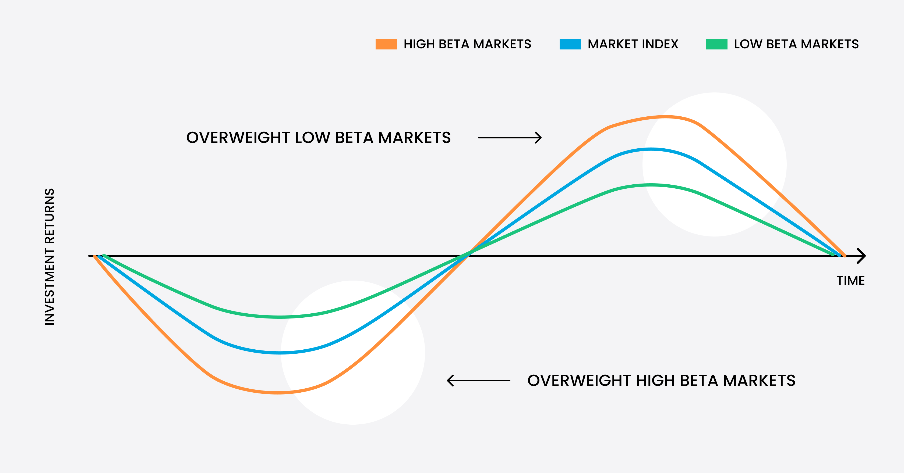

## Table of Contents

## What are high-beta stocks?

High-beta stocks are stocks that tend to move more dramatically than the overall market. If the market goes up, high-beta stocks usually go up even more. If the market goes down, these stocks often drop more sharply too. The term "beta" is a measure of a stock's volatility compared to the market. A beta higher than 1 means the stock is more volatile than the market.

Investors might choose high-beta stocks if they want to take on more risk for the chance of higher returns. These stocks can be exciting but also risky. They can lead to big gains when the market is doing well, but they can also result in big losses during downturns. Because of this, high-beta stocks are often favored by more aggressive investors who are comfortable with the ups and downs of the market.

## How do high-beta stocks differ from low-beta stocks?

High-beta stocks and low-beta stocks are different in how they move with the market. High-beta stocks move a lot more than the market. If the market goes up, high-beta stocks go up even more. If the market goes down, these stocks fall even harder. They have a beta value higher than 1, which means they are more risky but can also give bigger rewards. People who like to take more risks might choose high-beta stocks because they can make more money when the market is doing well.

On the other hand, low-beta stocks move less than the market. They have a beta value less than 1, which means they are less risky. If the market goes up, low-beta stocks might not go up as much. If the market goes down, these stocks might not fall as much either. People who want to be safer with their money might choose low-beta stocks. They won't make as much money when the market is doing well, but they also won't lose as much when the market is doing badly.

## What is the relationship between risk and reward in trading high-beta stocks?

Trading high-beta stocks means you're taking on more risk, but it also gives you the chance for bigger rewards. These stocks move more than the market, so if the market goes up, high-beta stocks can go up a lot more. This means if you pick the right high-beta stocks, you could make a lot of money when the market is doing well. But, because they move so much, you also have to be ready for big losses if the market goes down.

The relationship between risk and reward in high-beta stocks is like a seesaw. The more risk you take, the higher the possible reward can be. But, it's not guaranteed. Sometimes, even if you take a lot of risk, things might not go your way, and you could lose money. That's why it's important to think carefully about how much risk you're willing to take before you start trading high-beta stocks.

## How can beginners identify high-beta stocks?

Beginners can identify high-beta stocks by looking at a stock's beta value, which is a number that shows how much a stock moves compared to the market. You can find a stock's beta on financial websites like Yahoo Finance or Bloomberg. A beta higher than 1 means the stock is a high-beta stock. For example, if a stock has a beta of 1.5, it moves 50% more than the market. So, if the market goes up by 10%, this stock might go up by 15%.

Another way to spot high-beta stocks is by watching how a stock reacts to market changes. If you see that a stock goes up a lot when the market goes up and drops a lot when the market goes down, it's probably a high-beta stock. You can also look at news and reports about a company. Companies in industries like technology or small-cap stocks often have higher betas because they can be more risky and more rewarding. By keeping an eye on these things, beginners can get better at spotting high-beta stocks.

## What are the potential rewards of investing in high-beta stocks?

Investing in high-beta stocks can lead to big rewards. When the market goes up, high-beta stocks often go up even more. This means if you choose the right high-beta stocks, you could make a lot of money in a short time. For example, if the market goes up by 10%, a high-beta stock with a beta of 1.5 might go up by 15%. This can be very exciting for investors who like to take risks and are looking for big gains.

Another reward of high-beta stocks is the chance to beat the market. Because these stocks move more than the market, they can give you higher returns when things are going well. If you're good at [picking](/wiki/asset-class-picking) stocks and timing the market, high-beta stocks can help you grow your money faster than if you just followed the market. This is why many aggressive investors are drawn to high-beta stocks—they're looking for that extra boost in their investments.

## What are the risks associated with trading high-beta stocks?

Trading high-beta stocks can be risky because they move a lot more than the market. When the market goes down, high-beta stocks can lose a lot more value. This means if you own high-beta stocks and the market takes a dip, you could lose a big part of your money very quickly. It's like riding a roller coaster; it can be thrilling when it's going up, but scary when it's going down.

Another risk is that high-beta stocks can be hard to predict. They react strongly to news and market changes, which means even small events can cause big swings in their price. This can make it hard to know when to buy or sell, and you might end up making the wrong move at the wrong time. If you're not ready for this kind of uncertainty, high-beta stocks can be stressful and lead to big losses.

## How does market volatility affect high-beta stocks?

Market volatility means the market is moving up and down a lot. When the market is volatile, high-beta stocks feel it even more. If the market goes up a little, high-beta stocks can go up a lot more. But if the market goes down, these stocks can drop a lot more too. This is because high-beta stocks are more sensitive to what's happening in the market. They move more than the market, so when things are shaky, high-beta stocks can be really wild.

Because of this, trading high-beta stocks during times of high market volatility can be really risky. You might make a lot of money if you guess right, but you could also lose a lot if you guess wrong. It's like trying to catch a fast-moving ball; it can be exciting, but also hard to do. If you're not ready for big ups and downs, high-beta stocks in a volatile market can be too much to handle.

## What strategies can be used to manage risk when trading high-beta stocks?

One way to manage risk when trading high-beta stocks is by using stop-loss orders. A stop-loss order is like a safety net. It tells your broker to sell your stock if it falls to a certain price. This can help you limit how much money you lose if the stock goes down a lot. Another strategy is to not put all your money into one stock. Instead, spread your money across different high-beta stocks. This way, if one stock does badly, you won't lose everything.

Another strategy is to keep an eye on the market and the news. High-beta stocks move a lot when the market changes, so knowing what's going on can help you make better choices. You might decide to sell your stocks before a big drop or buy more when things look good. Also, think about how much risk you're okay with. If you're not comfortable with big ups and downs, you might want to mix in some low-beta stocks or other safer investments to balance things out.

## How do economic cycles impact the performance of high-beta stocks?

Economic cycles have a big effect on high-beta stocks. When the economy is doing well and growing, high-beta stocks usually do even better. They can go up a lot more than the market because people feel good about investing and taking risks. This is a good time for high-beta stocks because they can give you big rewards if you pick the right ones. But, you have to be careful because even in good times, these stocks can still be risky.

On the other hand, when the economy is not doing well and maybe even shrinking, high-beta stocks can do badly. They can lose value a lot faster than the market because people get scared and don't want to take risks. During these times, high-beta stocks can be really hard to handle because they can drop a lot. So, it's important to think about where the economy is in its cycle before you decide to buy or sell high-beta stocks.

## What role does diversification play in a portfolio containing high-beta stocks?

Diversification is really important when you have high-beta stocks in your portfolio. It means not putting all your money into just one or a few high-beta stocks. Instead, you spread your money across different kinds of stocks, including some that are less risky. This way, if one high-beta stock does badly, you won't lose all your money because other parts of your portfolio might be doing okay. It's like not putting all your eggs in one basket; if one egg breaks, you still have others.

By mixing high-beta stocks with other investments, you can balance out the risk. High-beta stocks can go up and down a lot, but if you also have some low-beta stocks or other safe investments, the ups and downs won't be as scary. This can help you feel more comfortable with your investments because you know you're not taking too much risk all at once. Diversification helps you keep your money safer while still giving you a chance to make good returns from your high-beta stocks.

## How can advanced technical analysis be applied to trading high-beta stocks?

Advanced technical analysis can help you make better decisions when trading high-beta stocks. One way to do this is by using indicators like the Relative Strength Index (RSI) or the Moving Average Convergence Divergence (MACD). These tools can show you if a stock is overbought or oversold, which means it might be a good time to buy or sell. For high-beta stocks, these indicators can be really helpful because these stocks move a lot, and you need to be quick to spot when they might change direction.

Another way to use technical analysis is by looking at chart patterns. High-beta stocks often make big moves, and you can see these moves in patterns like head and shoulders or double tops and bottoms. By studying these patterns, you can guess where the stock price might go next. This can help you decide when to get in or out of a trade. Technical analysis takes some practice, but it can give you an edge when trading high-beta stocks because it helps you understand the market's ups and downs better.

## What are some case studies of successful and unsuccessful trades in high-beta stocks?

One successful case of trading high-beta stocks was when an investor bought shares of Tesla (TSLA) in early 2020. Tesla is known for being a high-beta stock because its price can change a lot. At that time, the stock was around $80 per share. The investor saw that Tesla was growing fast and had good news coming up. They decided to buy and hold the stock. By the end of 2020, Tesla's stock price had gone up to over $700 per share. The investor made a lot of money because they picked a high-beta stock at the right time and held on during the ups and downs.

On the other hand, an unsuccessful case happened with a different investor who bought shares of GameStop (GME) in early 2021. GameStop is another high-beta stock that can move a lot. The stock was around $40 per share when the investor bought it, hoping to make a quick profit from a short squeeze. But the stock price was very volatile, and after going up to over $400 per share, it crashed back down. The investor didn't have a plan to sell at the right time and ended up losing a lot of money when the stock price fell back to around $40 per share. This shows how high-beta stocks can be risky if you don't know when to get out.

## What is Understanding Investment Risk?

Investment risk refers to the inherent uncertainty regarding the returns on an investment, encompassing both potential gains and potential losses. This uncertainty arises from various factors that can influence the performance of an investment portfolio, including changes in economic conditions, market trends, and company-specific events. Understanding and managing this risk is essential for investors aiming to achieve their investment objectives while minimizing potential losses.

Investment risk is broadly categorized into two main components: systematic risk and unsystematic risk. Systematic risk, also known as market risk, affects the entire market and is influenced by factors such as interest rates, inflation, economic cycles, and geopolitical events. This type of risk is unavoidable and cannot be eliminated through diversification, as it impacts all securities across the market to varying degrees. Examples of systematic risk include fluctuations in interest rates and economic recessions.

On the other hand, unsystematic risk, also referred to as idiosyncratic or specific risk, affects specific sectors or individual companies. This type of risk arises from factors such as management decisions, competitive position, and industry-specific trends. Unlike systematic risk, unsystematic risk can be significantly reduced or even eliminated through diversification across different sectors and securities. For example, the bankruptcy of a single company or a regulatory change affecting a particular industry represents unsystematic risk.

One of the key tools used by investors to assess the level of market risk associated with individual stocks is beta. Beta is a measure of a stock's [volatility](/wiki/volatility-trading-strategies) in relation to the overall market. It indicates how much a stock's price is expected to move in response to market changes. A beta greater than 1 suggests that the stock is more volatile than the overall market and might experience larger price swings, while a beta less than 1 indicates lower volatility relative to the market. By calculating beta, investors can gauge the sensitivity of a stock's returns to market movements and make informed decisions about its inclusion in a portfolio.

The formula for calculating beta is as follows:

$$
\beta = \frac{\text{Cov}(R_i, R_m)}{\text{Var}(R_m)}
$$

where $\text{Cov}(R_i, R_m)$ represents the covariance between the returns of the individual stock $R_i$ and the returns of the market $R_m$, and $\text{Var}(R_m)$ is the variance of the market returns. By incorporating beta into investment strategies, investors can better understand and manage the risks associated with their portfolios. This measure helps in constructing diversified portfolios that align with an investor's risk tolerance and financial goals.

## What is Beta and why is it important?

Beta is a fundamental statistical measure that assesses the volatility of a stock or portfolio in relation to the overall market. It provides insight into how much a stock's price is expected to fluctuate when the market experiences shifts. The beta coefficient serves as a comparative tool that helps investors estimate how much risk they might assume when investing in a specific stock relative to the broader market.

A beta value is calculated using the formula: 

$$

\beta = \frac{\text{Covariance}(R_i, R_m)}{\text{Variance}(R_m)} 
$$

where $R_i$ represents the return of the investment and $R_m$ denotes the market return. The covariance between the stock's returns and the market's returns illustrates how the stock moves with the market, while the variance of the market's returns indicates the market's overall volatility.

A beta greater than 1 signifies that the stock exhibits higher volatility compared to the market. For instance, a beta of 1.5 suggests that the stock is 50% more volatile than the market. Such stocks may offer higher returns but come with increased risk. Conversely, a beta less than 1 indicates that the stock is less volatile than the market, implying a more stable investment with potentially lower returns.

Understanding beta is essential for investors aiming to assess risk levels and formulate informed trading strategies. By integrating beta analysis, investors can anticipate how changes in market conditions might impact individual stock investments and adjust their portfolios accordingly. This assessment aids in aligning investment strategies with risk tolerance, allowing for more efficient risk management.

## What is the relationship between Algorithmic Trading and Risk Management?

Algorithmic trading employs computer algorithms to execute trades based on predefined criteria, such as beta analysis. This method allows for swift processing of financial data, enabling informed, real-time trading decisions. Within this framework, beta is fundamental as it automates risk assessment and adjusts portfolio positions accordingly.

The integration of beta into [algorithmic trading](/wiki/algorithmic-trading) systems allows traders to respond to market fluctuations promptly. By assessing a stock's beta, these systems can determine the security's volatility relative to the broader market. For instance, a beta greater than one signifies a stock that might move more aggressively than the market, offering potentially higher returns but with increased risk. Conversely, a beta less than one points to lower volatility and, generally, lower risk.

Algorithmic trading systems utilize beta to adjust trade positions based on these volatility insights. Algorithms can be programmed to alter positions automatically if the beta indicates a significant market movement, thus optimizing risk management strategies. For example, during periods of high market volatility, an algorithm might reduce exposure to high-beta stocks to safeguard the portfolio against potential large losses.

Python, a prevalent programming language in the finance industry, can be employed to calculate beta and automate trading decisions. The formula for beta is given by:

$$
\beta = \frac{\text{Cov}(R_i, R_m)}{\text{Var}(R_m)}
$$

where $R_i$ is the return of the investment, $R_m$ is the return of the market, $\text{Cov}(R_i, R_m)$ is the covariance of the security's returns with the market returns, and $\text{Var}(R_m)$ is the variance of the market returns.

Using Python, the implementation might look like this:

```python
import numpy as np
import pandas as pd

def calculate_beta(stock_returns, market_returns):
    covariance_matrix = np.cov(stock_returns, market_returns)
    beta = covariance_matrix[0, 1] / covariance_matrix[1, 1]
    return beta

# Example usage
stock_returns = pd.Series([...] )  # replace [...] with actual data
market_returns = pd.Series([...] ) # replace [...] with actual data
beta = calculate_beta(stock_returns, market_returns)
print("Beta:", beta)
```

By incorporating beta calculations into algorithmic systems, traders can maintain a dynamic approach to risk management, adjusting their investment positions as needed to align with changing market conditions. This capability boosts their ability to achieve optimal returns while mitigating potential risks, aligning trading strategies with both short-term market movements and long-term investment goals.

## How do you calculate Beta in trading strategies?

Beta is a fundamental metric in evaluating how an individual stock's returns move relative to the overall market, providing a quantifiable measure of market risk. To calculate beta, the process begins by determining the covariance between the stock's returns and the market's returns. Covariance measures how changes in the returns of the stock are related to changes in the market returns. To compute beta, this covariance is then divided by the variance of the market returns. The formula for beta ($\beta$) is expressed as:

$$
\beta = \frac{\text{Cov}(\text{Stock Returns}, \text{Market Returns})}{\text{Var}(\text{Market Returns})}
$$

This measurement aids investors and algorithmic traders in understanding how much a stock is expected to move in relation to market changes, allowing better management of portfolio risk.

Incorporating beta into trading strategies offers valuable insights by highlighting how a stock's price movements are intertwined with market volatility. Investors can use this information to adjust portfolios, ensuring an alignment with risk tolerance and market conditions. For instance, holding a diversified portfolio with varying beta coefficients can stabilize overall returns, cushioning the effects of stock-specific volatilities.

For practical applications, tools like Python offer extensive libraries and resources to streamline the beta calculation and integration process. The flexibility and computational power of Python allow for precise and efficient computation, leveraging libraries such as NumPy and pandas to handle large datasets. Here is a simple Python example to illustrate the calculation of beta using these libraries:

```python
import numpy as np
import pandas as pd

# Sample data: daily returns
stock_returns = np.array([0.01, 0.02, -0.015, 0.005, 0.02])
market_returns = np.array([-0.005, 0.01, -0.01, 0.015, 0.02])

# Calculate covariance matrix
covariance_matrix = np.cov(stock_returns, market_returns)

# Extract covariance of stock to market
cov_stock_market = covariance_matrix[0, 1]

# Calculate variance of market returns
var_market = np.var(market_returns)

# Calculate beta
beta = cov_stock_market / var_market
print(f"Beta: {beta}")
```

This code snippet calculates beta by first computing the covariance matrix of the stock and market returns, then extracting the necessary values to find the beta coefficient. By using such computational tools, investors can enhance the precision and timeliness of investment decisions, making it possible to adjust strategies dynamically in response to shifting market conditions.

## What is the Role of Beta in Algorithmic Trading?

In algorithmic trading, beta serves as a vital tool for adjusting trading positions based on prevailing market conditions, thus optimizing risk management. By quantifying the volatility of a stock relative to the market, beta allows trading algorithms to make informed decisions that enhance risk-adjusted returns.

Trading algorithms employ beta to monitor and respond to market dynamics, thereby maximizing potential returns. These algorithms are programmed to analyze market data continuously and adjust their trading strategies in response to changes in beta values. For example, if the beta of a particular stock increases, indicating higher volatility compared to the market, the algorithm might reduce the position size to mitigate risk exposure. Conversely, a decreasing beta might trigger an increase in position size, capitalizing on the lower relative risk.

Incorporating continuous beta analysis into trading systems facilitates adaptive investment strategies. Advanced algorithms leverage real-time beta calculations to refine their understanding of market movements and adjust trading strategies accordingly. The ability to continuously monitor and integrate beta values allows for a dynamic approach to managing portfolios, ensuring that investment strategies remain aligned with market trends and risk appetites.

The mathematical foundation of beta is grounded in the covariance of a stock's returns relative to the market, which can be expressed as:

$$
\beta = \frac{\text{Cov}(R_i, R_m)}{\text{Var}(R_m)}
$$

Where $R_i$ represents the returns of the individual stock, and $R_m$ denotes the market returns. This formula calculates how much the stock's returns move in relation to the market as a whole, providing a quantifiable measure of relative risk.

For practical implementation, Python can be used to calculate beta and integrate it into trading algorithms. Here's a simple example of how to compute beta using Python:

```python
import numpy as np
import pandas as pd

# Example stock and market return data
stock_returns = np.array([0.02, 0.03, -0.01, 0.04, 0.01])
market_returns = np.array([0.01, 0.02, 0.00, 0.03, 0.02])

# Calculate covariance matrix
cov_matrix = np.cov(stock_returns, market_returns)
covariance = cov_matrix[0, 1]

# Calculate market variance
market_variance = np.var(market_returns)

# Calculate beta
beta = covariance / market_variance

print(f'The beta of the stock is: {beta}')
```

Through continuous beta analysis, algorithmic trading systems can remain adaptable, effectively navigating volatile markets and optimizing returns while managing risks. Utilizing beta within these systems permits a structured and quantitative approach to adjusting trading positions in real time, enhancing the overall agility and efficiency of the investment strategy.

## References & Further Reading

[1]: ["Advances in Financial Machine Learning"](https://www.amazon.com/Advances-Financial-Machine-Learning-Marcos/dp/1119482089) by Marcos Lopez de Prado

[2]: ["Quantitative Trading: How to Build Your Own Algorithmic Trading Business"](https://www.amazon.com/Quantitative-Trading-Build-Algorithmic-Business/dp/1119800064) by Ernest P. Chan

[3]: ["Machine Learning for Algorithmic Trading"](https://github.com/stefan-jansen/machine-learning-for-trading) by Stefan Jansen

[4]: ["Evidence-Based Technical Analysis: Applying the Scientific Method and Statistical Inference to Trading Signals"](https://www.amazon.com/Evidence-Based-Technical-Analysis-Scientific-Statistical/dp/0470008741) by David Aronson

[5]: ["A Practitioner's Guide to Factor Models"](https://rpc.cfainstitute.org/en/research/foundation/1994/a-practitioners-guide-to-factor-models) by Richard A. DeFusco, Dennis W. McLeavey, Jerald E. Pinto