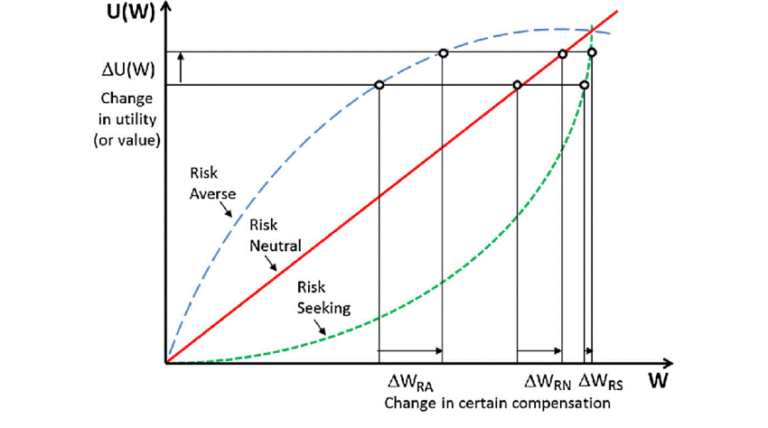

## Table of Contents

## What is risk-seeking behavior?

Risk-seeking behavior is when a person chooses to do things that have a lot of uncertainty or danger, hoping to gain something big in return. These people are not afraid of taking chances and often look for situations where the outcome is not certain. They believe that the potential rewards are worth the risks they take.

For example, someone might invest all their money in a new business that could fail, but if it succeeds, they could make a lot of money. Another example is a person who enjoys extreme sports like skydiving or rock climbing. They know these activities are dangerous, but they find the thrill and excitement worth it. Risk-seeking behavior can lead to big wins, but it can also result in big losses.

## How does risk-seeking behavior differ from risk-averse behavior?

Risk-seeking behavior and risk-averse behavior are opposite ways people deal with uncertainty. People who are risk-seeking like to take chances. They choose options where they might lose a lot, but they could also win big. They enjoy the excitement and the possibility of a big reward, even if it's not very likely. For example, they might bet a lot of money on a horse race or start a risky new business.

On the other hand, people who are risk-averse try to avoid uncertainty. They prefer to choose options that are safer, even if the reward is smaller. They would rather keep what they have than take a chance on losing it. For instance, they might put their money in a savings account instead of investing it in the stock market, because they want to be sure their money is safe.

These two types of behavior show how differently people can react to the same situation. A risk-seeker might see a new opportunity as exciting, while a risk-averse person might see it as scary and choose to stay away from it. Both ways of thinking can affect decisions in everyday life, from choosing a job to deciding how to spend money.

## What are some common examples of risk-seeking behavior in everyday life?

Risk-seeking behavior can show up in many parts of everyday life. One common example is in financial decisions. Some people might choose to invest their money in stocks or cryptocurrencies that are known to be very unpredictable. They hope to make a lot of money quickly, even though there's a big chance they could lose it all. Another example is gambling, like playing the lottery or betting on sports. People who do this are hoping for a big win, but they know the odds are against them.

Another way risk-seeking behavior appears is in the activities people choose for fun. Some people enjoy extreme sports like skydiving, rock climbing, or bungee jumping. These activities are exciting but also very dangerous. They do them because they love the thrill and the challenge. Similarly, some people might drive fast cars or ride motorcycles at high speeds, knowing it's risky but enjoying the adrenaline rush.

Risk-seeking behavior can also be seen in career choices. Some people might leave a stable job to start their own business, even if it's in a new and untested market. They're willing to risk their financial security for the chance to be their own boss and potentially make more money. Others might choose jobs in fields like journalism or the arts, where success is not guaranteed, but the potential for personal fulfillment and fame is high.

## What psychological factors contribute to risk-seeking behavior?

One big reason people act in risk-seeking ways is because of how their brains work. Some people naturally feel more excited by the chance of winning big. This excitement comes from a chemical in the brain called dopamine. When people take risks and things go well, their brains release dopamine, which makes them feel good. This feeling can make them want to take more risks, hoping to feel that rush again. Also, some people might have grown up in situations where they had to take risks just to get by. This can make them more comfortable with uncertainty and more likely to seek out risky situations.

Another factor is how people see themselves and the world around them. Some people think they are luckier or smarter than others, which makes them more willing to take chances. This is called overconfidence. They might believe they can beat the odds, even when the odds are against them. Also, some people might feel bored or unhappy with their normal life, so they look for excitement and new experiences through risk-taking. This can be a way to feel more alive or to escape from problems they are facing.

## How can risk-seeking behavior be measured or assessed?

Risk-seeking behavior can be measured in different ways. One common way is by using surveys and questionnaires. These ask people about the choices they make in different situations. For example, a survey might ask if someone would rather have a sure $50 or a 50% chance at $100. Their answers can show if they like to take risks or play it safe. Another way to measure risk-seeking is by looking at what people actually do. Researchers might watch how people invest money, what sports they play, or what jobs they choose. This real-life behavior can tell us a lot about how much risk someone is willing to take.

There are also more scientific ways to measure risk-seeking behavior. Scientists can use brain scans to see how the brain reacts to risky choices. For example, they might see if certain parts of the brain light up when someone decides to take a big risk. This can show how much the brain enjoys risk-taking. Another scientific method is to use computer games or simulations. These games put people in situations where they have to make risky decisions, and researchers can see how they choose. All these methods help us understand why some people are more likely to seek out risks than others.

## What are the potential benefits of engaging in risk-seeking behavior?

Engaging in risk-seeking behavior can lead to big rewards. When people take chances, they might discover new opportunities that others miss. For example, starting a new business can be very risky, but if it succeeds, it can bring a lot of money and personal satisfaction. People who take risks can also learn a lot from their experiences. Even if they fail, they gain knowledge and skills that can help them do better next time. This can make them more confident and ready to face new challenges.

Risk-seeking behavior can also make life more exciting and fun. Some people enjoy the thrill of doing things that are uncertain or dangerous, like trying extreme sports. This excitement can make them feel more alive and happy. It can also help them meet new people and make new friends who share their love for adventure. Overall, while risk-seeking behavior can be dangerous, it can also lead to big wins and a more interesting life.

## What are the potential negative consequences of risk-seeking behavior?

Risk-seeking behavior can lead to big problems. When people take big chances, they might lose a lot of money. For example, if someone invests all their money in a new business and it fails, they could end up broke. This can make it hard to pay bills or take care of their family. Risk-taking can also hurt people physically. If someone does dangerous things like extreme sports or driving fast, they might get hurt or even die. These risks can cause a lot of pain and sadness for them and their loved ones.

Another problem with risk-seeking behavior is that it can lead to addiction. Some people might start gambling or using drugs to feel the excitement of taking risks. But these activities can become hard to stop, and they can ruin lives. Risk-taking can also make relationships hard. If someone always chooses risky options, their friends and family might worry about them or feel left out. This can cause fights and make people feel alone. Overall, while taking risks can be exciting, it's important to think about the possible bad outcomes too.

## How does risk-seeking behavior vary across different cultures?

Risk-seeking behavior can be different in different cultures. In some places, people might be more willing to take big chances because they grew up in a culture that values trying new things and being brave. For example, in the United States, many people believe in the "American Dream" and think that taking risks can lead to big success. They might start new businesses or invest in the stock market, hoping to make a lot of money. On the other hand, in some cultures, people might be more careful and prefer to stick with what is safe and known. In Japan, for instance, there is a strong focus on harmony and stability, so people might be less likely to take big risks.

These differences can also show up in everyday life. In some countries, like Brazil, people might enjoy risky activities like extreme sports or street racing because they value excitement and living in the moment. In contrast, in places like Sweden, where safety and security are highly valued, people might be more likely to avoid risky behaviors and choose safer hobbies. These cultural differences can affect how people make decisions about money, work, and fun, showing that what is seen as "normal" risk-taking can vary a lot from one place to another.

## What role does age play in the prevalence of risk-seeking behavior?

Age can have a big impact on how much risk someone is willing to take. Young people, especially teenagers and those in their early twenties, often engage in more risk-seeking behavior. This is because their brains are still developing, and they might not fully understand the consequences of their actions. They might do things like drive fast, try drugs, or make risky financial decisions because they want to feel excited and show off to their friends. As people get older, they usually become more careful. They might have more responsibilities, like a job or a family, which makes them think twice before taking big risks.

However, age doesn't always make people less willing to take risks. Some older people might still enjoy risky activities, like investing in the stock market or starting a new business later in life. They might have more experience and feel more confident in their ability to handle risks. But in general, as people age, they tend to value safety and stability more, so they might choose safer options more often. This shows that while young people might be more likely to seek out risks, age can change how much risk someone is willing to take.

## How can risk-seeking behavior impact decision-making in business and finance?

Risk-seeking behavior can really change how people make choices in business and finance. People who like to take risks might start new businesses or invest in things that are not sure to work out. They think the chance of making a lot of money is worth the risk of losing it all. This can lead to big successes, like a new company becoming very popular or an investment growing a lot. But it can also lead to big failures, like a business going bankrupt or losing a lot of money on a bad investment. These people are okay with the ups and downs because they enjoy the excitement and believe in their ability to handle whatever happens.

In finance, risk-seeking behavior can make people choose to put their money in things like stocks or cryptocurrencies that can go up and down a lot. They might ignore safer options like savings accounts because they want the thrill of possibly making a lot more money. This can be good if the market goes up, but it can be bad if the market goes down. Over time, this kind of behavior can lead to big wins or big losses. It's important for these people to think carefully about their choices and maybe talk to experts to make sure they are not taking too many risks.

## What interventions or strategies can be used to modify risk-seeking behavior?

One way to change risk-seeking behavior is by teaching people about the good and bad things that can happen when they take risks. This can be done through classes or talks that explain how to think about risks and make better choices. For example, a class might show how to weigh the chances of winning big against the chances of losing everything. By understanding these things, people might choose to take fewer risks or think more carefully before they act. Also, talking to a counselor or therapist can help. They can help people figure out why they take risks and find other ways to feel excited or happy without taking big chances.

Another way to change risk-seeking behavior is by setting up rules or limits. For example, someone might decide to only spend a certain amount of money on risky investments or to only do dangerous sports with proper safety gear. Having these rules can help people enjoy the excitement of risks without getting hurt or losing too much. Friends and family can also help by talking about the risks and supporting safer choices. If someone knows their loved ones are worried, they might be more likely to think twice before taking a big risk. Overall, a mix of learning, talking, and setting limits can help people change their risk-seeking behavior and make better decisions.

## How do theories like prospect theory explain risk-seeking behavior in the context of decision-making under uncertainty?

Prospect theory helps us understand why people might choose to take risks even when it seems like a bad idea. This theory says that people don't always make choices based on what's most likely to happen. Instead, they think about how much they could win or lose and how they feel about those outcomes. When people are facing a loss, they might take big risks to avoid it. For example, if someone is losing money in a game, they might bet even more to try to win it back, even though it's risky. This is because the pain of losing feels worse than the joy of winning, so they take chances to avoid that pain.

Prospect theory also explains that people value what they might gain or lose differently depending on the situation. If someone is already doing well, they might not want to take big risks because they don't want to lose what they have. But if they're in a bad spot, they might be more willing to take chances to change their situation. This shows that risk-seeking behavior can change based on whether people feel like they are winning or losing. Understanding this can help us see why some people take big risks, even when it might not seem smart to do so.

## References & Further Reading

[1]: Aldridge, I. (2013). ["High-Frequency Trading: A Practical Guide to Algorithmic Strategies and Trading Systems"](https://www.amazon.com/High-Frequency-Trading-Practical-Algorithmic-Strategies/dp/1118343506). Wiley.

[2]: Taleb, N. N. (2007). ["The Black Swan: The Impact of the Highly Improbable"](https://archive.org/details/10.1.1.695.4305). Random House.

[3]: Narang, M. (2013). ["Inside the Black Box: A Simple Guide to Quantitative and High Frequency Trading"](https://onlinelibrary.wiley.com/doi/book/10.1002/9781118662717). Wiley.

[4]: Kissell, R. (2014). ["The Science of Algorithmic Trading and Portfolio Management"](https://www.sciencedirect.com/book/9780124016897/the-science-of-algorithmic-trading-and-portfolio-management). Academic Press.

[5]: Cartea, Á., Jaimungal, S., & Penalva, J. (2015). ["Algorithmic and High-Frequency Trading"](https://assets.cambridge.org/97811070/91146/frontmatter/9781107091146_frontmatter.pdf). Cambridge University Press.