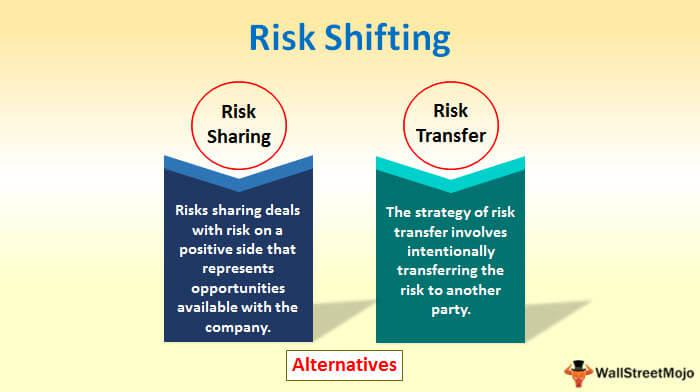

Financial risk is an integral aspect of the global economy, impacting individuals, corporations, and governments alike. It encompasses the potential for financial loss in various activities and decision-making processes. Given its pervasive nature, understanding financial risk and strategies for managing it are crucial in today's complex environment. This knowledge aids in effective decision-making for investments and policy-making, ensuring economic stability and growth.

Economic examples of risk provide valuable insights into the mechanics of financial systems and the potential pitfalls that can arise from inadequate risk management. Such understanding is not only important at the micro level, affecting individual portfolios and businesses, but also at the macro level, where entire economies can feel the repercussions of mismanaged risks.



Two significant developments that have transformed how financial risks are perceived and managed are algorithmic trading and risk shifting. Algorithmic trading employs sophisticated computer algorithms to execute trades at speeds and frequencies impossible for human traders, optimizing decisions based on vast datasets. This transformation has revolutionized financial markets, bringing both potential opportunities and challenges in managing associated risks.

Risk shifting, on the other hand, involves the transfer of risk from one entity to another through various financial instruments and strategies. By reallocating potential risks, businesses and investors can protect themselves from unforeseen market fluctuations, though this shift can occasionally introduce new risks, such as moral hazards.

This article explores the intricacies of financial risk with a focused examination of economic implications, the mechanisms of risk shifting, and the significant impacts of algorithmic trading. These components collectively underscore the evolving nature of risk management in modern finance, emphasizing the need for innovation and rigorous oversight in safeguarding economic stability.

## Table of Contents

## Understanding Financial Risk

Financial risk represents the potential for financial loss endured by individuals or entities engaging in investment or business activities. This concept is a fundamental aspect of financial markets and is characterized by several distinct types. 

Market risk, often referred to as systematic risk, arises from fluctuations in market prices and interest rates that impact an investment’s value. This type of risk is unavoidable and affects the entire market. For instance, changes in equity prices, [interest rate](/wiki/interest-rate-trading-strategies) variations, or movements in commodity prices are typical drivers of market risk. Mathematically, market risk can be represented by the [volatility](/wiki/volatility-trading-strategies) or beta of an asset, which measures its sensitivity relative to overall market movement.

Credit risk, also known as default risk, pertains to the possibility that a borrower may fail to make required payments. This risk is particularly crucial to lenders, financial institutions, and investors in debt securities. The assessment of credit risk typically involves credit scoring systems and rating agencies, which evaluate the creditworthiness of borrowers. The probability of default and loss given default are critical metrics in quantifying credit risk.

Liquidity risk involves the inability to buy or sell an asset without significantly affecting its price due to insufficient market activity. This type of risk is most pronounced during periods of market stress when demand for selling high-risk assets increases. For example, a real estate investment may face [liquidity](/wiki/liquidity-risk-premium) risk due to the time required to find a buyer willing to pay a fair price.

Operational risk encompasses losses resulting from inadequate or failed internal processes, people, systems, or external events. This can include risks from fraud, regulatory compliance breaches, or cybersecurity threats. Unlike market and credit risk, operational risk is often harder to quantify due to its unpredictable nature and reliance on the robustness of internal controls and risk management frameworks.

Financial risks operate at both the micro level, affecting individual entities or portfolios, and the macro level, where they have broader economic implications. Individual investments are susceptible to specific risk factors that can influence their performance. On a larger scale, financial risks can disrupt entire sectors or economies, as seen in financial crises where integrated risk factors led to widespread economic downturns. Recognizing the interplay between these risks is crucial for strategic decision-making and economic stability.

## Economic Examples of Financial Risk

Historical economic events offer valuable insights into financial risk, exemplifying how mismanagement and unforeseen circumstances can lead to significant economic consequences. One of the most notable examples is the 2008 financial crisis, which highlighted systemic financial risk stemming from inadequate risk management practices. The crisis was precipitated by the widespread issuance of subprime mortgages, excessive risk-taking by financial institutions, and subsequent failures in the regulatory framework. This chain of events led to a liquidity crunch, a collapse in the housing market, and a global economic downturn, illustrating the interconnectedness of financial systems and the potential for systemic risk when key components within the system fail to function effectively.

Another illustrative example is the dot-com bubble of the late 1990s, characterized by excessive speculation in the technology and internet sectors. Investors poured substantial capital into unproven tech start-ups, driving stock prices to unsustainable levels based on speculative future growth rather than fundamental financial performance. When the bubble burst, it resulted in a sharp decline in stock prices, significant financial losses, and a slowdown in economic growth, underscoring the dangers of speculative investment driven by market euphoria.

The housing market crash is another significant case of financial risk with dire economic implications. Much like the 2008 financial crisis, it involved overvalued real estate assets and excessive borrowing, often without regard to creditworthiness or the borrower’s ability to repay. When housing prices began to decline, the value of mortgage-backed securities plummeted, leading to substantial losses for financial institutions and investors, and causing widespread economic instability.

Currency devaluation events worldwide also exemplify financial risk, particularly in emerging markets. For instance, when a country’s currency is devalued, it can lead to inflation, increased cost of imports, and reduced purchasing power. These effects can destabilize an economy, causing widespread financial distress. Notable examples include the 1997 Asian financial crisis, where several Asian economies experienced drastic currency devaluations, leading to financial turmoil and recession in the region.

These historical events demonstrate how financial risk manifests across various sectors and geographies and the profound impact it can have on global and national economies. Understanding and learning from these examples are crucial for developing effective risk management strategies in the future.

## Risk Shifting: What It Is and How It Works

Risk shifting refers to the strategic transfer of risk from one entity to another, commonly employed in financial sectors such as insurance and investments. The core idea is to allocate financial risk to parties better equipped to manage or absorb potential losses, thereby reducing the financial burden on the original holder. This practice is crucial in managing potential losses, providing stability to businesses and individuals. However, it can also create moral hazards, where parties engage in riskier behavior because they do not bear the full cost of that risk.

One prevalent method of risk shifting is through hedging strategies. Hedging involves taking an offsetting position in a related security to counterbalance potential losses in another investment. For instance, an investor holding a position in a risky asset, such as a volatile stock, might purchase options or futures contracts on that stock to hedge against its potential decline in value.

In investment portfolios, risk is frequently shifted through the use of derivatives. These financial instruments derive their value from underlying assets, such as stocks, bonds, or interest rates. By entering into derivative contracts, such as credit default swaps (CDS), parties can transfer credit risk associated with a borrower defaulting on a debt. The entities offering these swaps assume the risk in exchange for a premium, providing a safety net for the original lender.

Another example of risk shifting is seen in the restructuring of pension plans. Many companies have transitioned from defined-benefit plans, which assure a specific payout at retirement, to defined-contribution plans, where the payout depends on investment performance. This shift places the investment risk on employees, who must manage their pension funds to achieve desired retirement outcomes.

Despite its benefits, risk shifting raises ethical concerns due to potential moral hazards. When entities are shielded from the full consequences of risk, they may engage in riskier ventures, knowing that losses are borne elsewhere. This behavior can exacerbate financial instability and lead to systemic crises if not properly managed or regulated. Consequently, while risk shifting serves as a valuable tool in financial risk management, it necessitates careful oversight to prevent unintended negative effects on both the markets and participating entities.

## The Role of Algorithmic Trading in Financial Risk

Algorithmic trading employs computer algorithms to execute trades automatically based on pre-set conditions, revolutionizing the finance sector. By optimizing trade execution speed and minimizing human errors, [algorithmic trading](/wiki/algorithmic-trading) enhances the ability to exploit profitable opportunities yet simultaneously elevates risk levels. 

One of the key aspects is its ability to process vast datasets rapidly, identifying trading prospects that might be undetectable to humans. This swiftness, however, can exacerbate market volatility, particularly when different algorithms react similarly to market events, leading to rapid buying or selling, which might cascade into significant market swings.

High-frequency trading ([HFT](/wiki/high-frequency-trading-strategies)), a subset of algorithmic trading, epitomizes this dynamic. Employing state-of-the-art technology, HFT platforms execute a massive number of trades within microseconds, contributing significantly to market liquidity. Yet, their sheer trading [volume](/wiki/volume-trading-strategy) can also destabilize markets. Events such as the "Flash Crash" of May 6, 2010, underscored how algorithmic trading, particularly HFT, can swiftly impact market stability: a large sell order triggered computers to rapidly shed positions, causing a sharp market downturn within minutes.

Algorithmic trading's dual capability of enhancing efficiency and heightening risks necessitates sophisticated risk management strategies. Algorithms must incorporate mechanisms to assess real-time market conditions and adjust trading strategies dynamically. A simplified implementation using Python might involve functions to evaluate and adjust risk continuously, such as leveraging [machine learning](/wiki/machine-learning) models to anticipate market dynamics. 

```python
import numpy as np
from sklearn.linear_model import LinearRegression

# Hypothetical data: market indicators and asset prices
market_data = np.array([[1, 2], [2, 3], [3, 4]])
prices = np.array([1.1, 1.5, 1.9])

# Train a simple predictive model
model = LinearRegression().fit(market_data, prices)

# Function to assess risk and adjust trading strategy
def adjust_trading_strategy(new_market_data):
    predicted_price = model.predict([new_market_data])
    # assume some risk thresholds
    if predicted_price < 1.5:
        print("Increase sell positions")
    else:
        print("Hold or buy more")
```

This illustrative code predicts asset prices based on market data, allowing the adjustment of trading strategies to manage risk proactively. While the capacity for increased liquidity and efficiency through algorithmic trading is significant, market participants must ensure robust risk assessment mechanisms to mitigate potential disruptions to market stability.

## Challenges and Limitations in Managing Financial Risk

Managing financial risk is a complex task fraught with challenges and limitations. A primary concern is the unpredictability of black swan events—unexpected occurrences that have severe consequences and lie outside regular expectations. These events highlight the inherent unpredictability of financial markets and the difficulties in preparing for such rare and impactful phenomena. Black swan events defy traditional risk models, underscoring the necessity for financial institutions to maintain flexibility and resilience in their risk management strategies.

Another significant limitation in current risk management practices is the reliance on historical data for risk modeling. Traditional risk assessment techniques assume that future market behavior will mirror past patterns, which is often not the case during periods of unprecedented market volatility. The financial crisis of 2008, for instance, exposed the shortcomings of models overly dependent on historical data. As market conditions evolve, risk managers must continuously update and adapt their models to consider new data and alternative scenarios. This requires integrating more dynamic and comprehensive modeling approaches, potentially leveraging machine learning and [artificial intelligence](/wiki/ai-artificial-intelligence) to capture complex market influences beyond historical data points.

In addition to the challenges posed by black swan events and data limitations, ensuring regulatory compliance and upholding ethical trading practices introduce further complexities. Financial institutions must navigate a multifaceted regulatory landscape that varies across regions and jurisdictions. Compliance with these regulations often requires significant resources and coordination within organizations to ensure adherence to legal standards without stifling innovation or competitiveness. Ethical trading practices are equally crucial; institutions must strive to foster transparency and fairness to maintain trust in financial markets.

Despite these challenges, robust risk management remains essential for financial stability. Institutions are increasingly turning to advanced technologies and harmonized regulatory frameworks to alleviate some of these limitations. Engaging in proactive risk assessment and fostering a culture of compliance and ethical behavior can mitigate risks and allow for sustainable financial growth.

## Strategies for Effective Risk Management

Implementing robust risk management strategies is vital for mitigating potential losses in financial trading. One of the key techniques is setting stop-loss orders, which automatically sell a security when its price falls to a predetermined level, thereby preventing further losses. This ensures that traders minimize their exposure to adverse market movements without needing constant monitoring. 

Portfolio diversification is another fundamental strategy, involving the allocation of investments across various asset classes, such as stocks, bonds, and commodities. The principle here is to reduce the unsystematic risk associated with individual investments, leveraging the fact that different assets react differently to economic events. By diversifying, the investor can achieve a more stable overall portfolio performance.

Stress testing is a critical tool that assesses the potential impact of extreme market conditions on an investment portfolio. It involves simulating scenarios such as market crashes, interest rate changes, or economic downturns to evaluate a portfolio's resilience. These tests help identify vulnerabilities and aid in developing strategies to mitigate potential adverse impacts.

Continuous model updates are essential in adapting to evolving market conditions. Financial models used in risk assessment and management must be regularly revised to reflect the latest data and economic indicators. This approach helps in maintaining the accuracy and reliability of risk predictions, which is crucial for making informed decisions.

Regulations and ethical standards also play an indispensable role in shaping effective risk management practices. Financial markets are heavily regulated to protect investors and maintain market integrity. Adherence to regulatory standards ensures that trading practices are transparent, fair, and mitigate systemic risks. Ethical standards further reinforce this by promoting responsible conduct among market participants, ensuring that risk-taking does not compromise the stability of financial systems.

In conclusion, effective risk management strategies encompass a comprehensive approach including technical measures, regulatory compliance, and ethical considerations. These strategies are integral not only to individual investor protection but also to the broader health and stability of financial markets.

## Conclusion

Understanding and managing financial risk is critical for maintaining economic stability and creating resilient market environments. In a complex global economy, where variables constantly evolve, risk shifting and algorithmic trading have emerged as transformative yet challenging components of risk management strategies. 

Risk shifting offers innovative pathways to distribute financial risks across various stakeholders, primarily through methods like hedging and transferring credit risk via derivatives. However, this approach necessitates careful consideration of potential moral hazards and requires stringent oversight to ensure that transferred risks do not culminate in adverse outcomes for the broader financial system.

Algorithmic trading, characterized by precision and speed, automates complex trading decisions through computer algorithms. It enhances efficiencies but simultaneously introduces complexities, such as heightened market volatility and liquidity concerns. The rapid execution of high-frequency trades can amplify risks, placing greater importance on sophisticated algorithms and robust oversight to mitigate unintended consequences.

A successful risk management strategy in today's financial markets mandates continuous learning and adaptation. The dynamic nature of financial environments means that historical data alone may be insufficient to foresee future market conditions. Consequently, risk models require ongoing adjustments to remain effective. Additionally, adherence to ethical standards is paramount to fostering trust and ensuring fair practices within the financial industry.

Balancing innovative risk management techniques with effective regulatory frameworks and ethical practices ensures the long-term stability and integrity of financial markets. As the landscape of financial risk continues to evolve, the principles of continuous improvement and responsibility remain at the forefront of effective financial risk management.

## References & Further Reading

[1]: ["Advances in Financial Machine Learning"](https://www.amazon.com/Advances-Financial-Machine-Learning-Marcos/dp/1119482089) by Marcos Lopez de Prado

[2]: Bergstra, J., Bardenet, R., Bengio, Y., & Kégl, B. (2011). ["Algorithms for Hyper-Parameter Optimization."](https://dl.acm.org/doi/10.5555/2986459.2986743) Advances in Neural Information Processing Systems 24.

[3]: ["Evidence-Based Technical Analysis: Applying the Scientific Method and Statistical Inference to Trading Signals"](https://www.amazon.com/Evidence-Based-Technical-Analysis-Scientific-Statistical/dp/0470008741) by David Aronson

[4]: ["Machine Learning for Algorithmic Trading"](https://github.com/stefan-jansen/machine-learning-for-trading) by Stefan Jansen

[5]: ["Quantitative Trading: How to Build Your Own Algorithmic Trading Business"](https://www.amazon.com/Quantitative-Trading-Build-Algorithmic-Business/dp/1119800064) by Ernest P. Chan