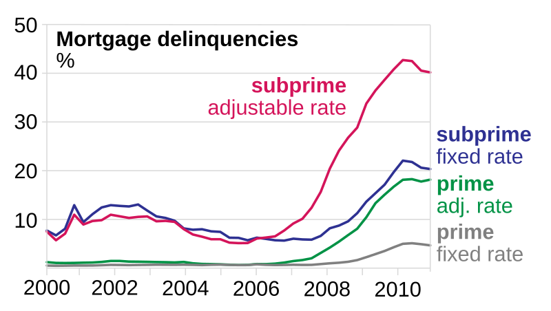

The financial crisis of 2007-2008 was a pivotal period in global economic history, with widespread consequences for markets and societies worldwide. At the heart of this crisis were subprime mortgages, which fundamentally changed the landscape of financial risk management and regulation. Subprime mortgages are high-risk loans extended to borrowers with lower credit ratings. These loans were typically characterized by higher interest rates and unfavorable terms, reflecting the increased risk lenders assumed. However, these mortgages also opened up opportunities for greater homeownership and profitability in the early 2000s, driving significant growth in the housing market.

The proliferation of subprime mortgages contributed to a housing bubble, which eventually collapsed and triggered widespread financial instability. As the crisis unfolded, it became evident that the interconnectedness of global financial systems could amplify local disturbances into international crises. The inverse correlation between housing prices and the likelihood of default on subprime mortgages underlined the systemic vulnerabilities in financial systems, leading to a wave of foreclosures and bank failures.

In analyzing the 2007-2008 financial crisis, this article will explore several key components that played crucial roles preceding, during, and following this period. We will examine the nature and impact of financial risk, predominantly driven by subprime mortgages, and how these factors precipitated the mortgage crisis. Additionally, by addressing modern financial practices such as algorithmic trading, we aim to provide insight into their influence and interaction with market behaviors during financial upheavals.

The current financial landscape bears the imprint of these past experiences, and understanding the intricate dynamics between subprime mortgages, regulatory practices, and innovative trading technologies is essential. This knowledge is vital for stakeholders to develop strategies to mitigate future risks and maintain financial stability. Through this exploration, the goal is to extract valuable lessons from the crisis, guiding future policy decisions and advancing financial risk management methodologies in a continually evolving global market.

## Table of Contents

## Understanding Subprime Mortgages

Subprime mortgages were created to extend homeownership opportunities to individuals with less than stellar credit histories, enabling them to secure housing loans despite their financial constraints. These loans typically feature higher interest rates, rising from the increased risk lenders assume by offering credit to borrowers with poor credit scores. Higher interest rates help compensate lenders for the higher probability of default associated with subprime borrowers.

In addition to elevated interest rates, subprime mortgages are often characterized by less favorable terms for the borrower. These can include adjustable-rate mortgages (ARMs) with low initial rates that reset at a much higher rate after a short period, interest-only loans where the principal is not paid down, or loans with significant prepayment penalties. Such terms are structured to protect lenders while still making loans accessible to riskier borrowers. 

The expansion of subprime mortgages gained [momentum](/wiki/momentum) in the early 2000s, driven by the desire for increased homeownership and the perception of housing as a continually appreciating asset. The financial industry's innovation, such as the securitization of mortgage loans into financial products like mortgage-backed securities (MBS), further fueled this growth. Investors, seeking higher yields in a low-interest-rate environment, flocked to these securities, bolstering demand for subprime mortgages.

This period's rapid growth allowed lenders and investors to reap substantial profits; however, it came with significant risks. Participants in the housing market often ignored prudent risk management strategies, relying on the assumption that housing prices would continue to rise, mitigating the risk of borrower defaults. This erroneous belief underpinned much of the financial thinking leading up to the housing bubble, setting the stage for severe repercussions when the housing market declined.

## The Mortgage Crisis Unfolds

The mortgage crisis of 2007-2008 was precipitated by the collapse of the housing bubble, which had been inflated by a surge in housing prices far exceeding historical norms. This speculative bubble was primarily driven by the proliferation of subprime mortgages, which were loans offered to borrowers with less-than-stellar credit ratings. As housing prices fell, many homeowners found themselves with mortgages that exceeded the value of their homes, often referred to as being "underwater."

Subprime borrowers, characterized by their higher default risks, were disproportionately affected by the decline in housing values. These borrowers, typically stretched thin by adjustable-rate mortgages that reset to higher payments, began to default in large numbers. The wave of defaults led to widespread foreclosures, as lenders sought to recover their investments.

The impact of these foreclosures was not confined to the housing market alone. The U.S. financial sector had exposed itself to the subprime market through complex financial products such as mortgage-backed securities (MBS) and collateralized debt obligations (CDOs). These securities were composed of bundled mortgages, including subprime loans, and sold to investors. Rating agencies had often given these products high-credit ratings, underestimating their risk.

As defaults increased, the value of MBS and CDOs plummeted, leading to massive losses for financial institutions that held substantial amounts of these securities. This culminated in a [liquidity](/wiki/liquidity-risk-premium) crisis, as banks became wary of lending to each other, fearing the unknown exposure to toxic subprime assets on their counterparties' balance sheets. The interconnected nature of global financial markets meant that the crisis spread rapidly, affecting international banks and economies.

The fall of Lehman Brothers in September 2008 marked a critical point in the crisis, exacerbating the downturn and prompting government interventions worldwide. The contagion extended beyond individual investors and lenders, impacting the broader economy through tightened credit conditions, depressed consumer spending, and mass job losses. The crisis highlighted the inherent vulnerabilities in financial systems heavily reliant on subprime lending and inadequate risk management practices.

## Financial Risk in Mortgage Lending

Financial risk is a fundamental aspect of mortgage lending, particularly when it comes to subprime loans. These loans are characterized by their higher default probabilities due to borrowers' lower credit ratings. Lenders and financial institutions often misjudged these risks, leading to significant financial instability. A critical [factor](/wiki/factor-investing) in this misjudgment was the proliferation of complex financial instruments, such as mortgage-backed securities (MBS).

A mortgage-backed security is a type of investment product that represents claims on the cash flows from large pools of home mortgages. These investments were attractive because they promised high returns at seemingly low risk, buoyed by the notion that the housing market was self-sustaining and resilient. However, this assumption was flawed. The complexity of MBS and associated instruments like collateralized debt obligations (CDOs) often obscured the underlying risk from investors and even from the institutions that issued them.

The underlying risk was further underestimated due to inadequate modeling of default risk. Mortgage default probability is commonly modeled using the formula $P(D) = \Phi(\frac{\mu_D - \mu}{\sigma})$, where $P(D)$ is the probability of default, $\mu_D$ represents the mean default rate, $\mu$ is the expectation of default, and $\sigma$ is the standard deviation of returns. Many institutions used historical data without sufficient stress-testing against potential downturns in the housing market, leading to a mispricing of risk.

Moreover, regulatory oversight was lacking. Even though the sheer scale of the subprime market and the proliferation of MBS warranted rigorous scrutiny, the regulatory framework was neither robust nor agile enough to detect and address these risks in time. Agencies failed to mitigate incentive structures that encouraged excessive risk-taking, such as flimsy due diligence processes and the originator-to-distribute model, where originators had little incentive to ensure the long-term viability of the loans they created.

The lack of regulation was compounded by the growth of financial derivatives linked to subprime loans, which amplified the risk exposure of banking and investment sectors globally. Credit default swaps (CDS) allowed investors to hedge against or speculate on credit risk but contributed to an opaque risk environment that even expert financial entities struggled to navigate.

In a rapidly deteriorating housing market, the weaknesses in risk management and oversight became starkly evident. The house price depreciation led to widespread loan defaults, and the interconnected nature of financial products meant losses quickly spread across global markets. Banks found themselves holding assets worth considerably less than their assumed market value, leading to massive contractions in liquidity and precipitating financial institution failures.

These events underscored the importance of effective risk management practices and regulatory oversight in mortgage lending, particularly when dealing with inherently high-risk loans such as subprime mortgages. Improved metrics for evaluating borrower risk, enhanced transparency around financial products, and more stringent regulation are critical to preventing such crises in the future.

## The Role of Algorithmic Trading

Algorithmic trading, a process involving the use of computer algorithms to execute trading strategies, has become an essential part of the global financial markets. Its primary allure lies in its ability to process vast amounts of market data at high speeds, enabling traders to capitalize on fleeting opportunities that manual trading cannot match. During the financial crisis of 2007-2008, [algorithmic trading](/wiki/algorithmic-trading) was already gaining traction, but the crisis highlighted both its potential advantages and significant downsides.

Before examining the risks associated with algorithmic trading, it is crucial to understand its mechanics. Algorithmic trading employs pre-programmed instructions—the algorithms—to analyze myriad market variables such as price, timing, and [volume](/wiki/volume-trading-strategy). These algorithms automate and optimize the buying and selling of assets, aiming to execute trades at the most advantageous moments. This automation enables high-frequency trading ([HFT](/wiki/high-frequency-trading-strategies)), where firms can execute millions of trades in fractions of a second, thus engineering efficiency and liquidity in financial markets.

However, the rapid advancements in this technology also bring about several risks. Among them is market [volatility](/wiki/volatility-trading-strategies). High-frequency trading strategies, often characterized by their short-term focus and rapid trade execution, can contribute to volatile market conditions. A notable example is the Flash Crash on May 6, 2010, when the U.S. stock market experienced a severe plummet before sharply rebounding within minutes. The episode was partly attributed to algorithmic trading strategies that exacerbated selling pressures, highlighting algorithmic trading's propensity to amplify systemic risks.

Moreover, algorithmic trading systems can introduce systemic fragility due to their dependency on speed and computational models. Small programming errors or unforeseen market conditions can lead to significant unintended consequences, potentially causing market disruptions. These algorithms also compete for speed and efficiency, which may lead to practices that border on predatory, as seen in certain HFT strategies that exploit market inefficiencies at the cost of slower traders.

Despite these challenges, algorithmic trading also offers substantial benefits. It enhances market efficiency by providing liquidity, enabling tighter spreads, and reducing transaction costs. Algorithms can mitigate human biases and emotional decision-making errors, resulting in more consistent trading performance.

Algorithmic trading's interaction with financial crises is complex. During the crisis of 2007-2008, its role was not directly implicated in the genesis of the crisis but rather in the transmission of market pressures. The crisis underscored the need for improvements in risk management practices and regulatory oversight for algorithmic trading systems. Regulators and financial institutions have since implemented measures to address potential vulnerabilities, including circuit breakers and updated regulatory frameworks to monitor trading activities effectively.

In conclusion, while algorithmic trading enhances market dynamics and efficiency, its integration into financial systems necessitates careful consideration of the risks involved. Balancing innovation with appropriate risk management and regulatory oversight is crucial to harnessing the full potential of algorithmic trading within stable financial markets. As technology continues to evolve, the interaction between algorithmic trading and financial crises will remain a critical focus for both researchers and practitioners in the field of finance.

## Lessons Learned and Future Outlook

The mortgage crisis of 2007-2008 underscored several vital lessons concerning risk management, financial regulation, and the role of innovative trading technologies in modern finance. 

Firstly, the crisis highlighted the necessity for robust risk management practices. Institutions underestimated the risks associated with subprime mortgage lending, failing to account for the potential for widespread defaults. To mitigate similar risks in the future, financial institutions have emphasized strengthening risk assessment frameworks by incorporating stress testing and scenario analysis. These practices help identify potential vulnerabilities and evaluate the impact of adverse economic conditions on portfolios. For example, stress testing involves modeling the effect of extreme but plausible scenarios on the financial stability of a firm. 

Moreover, the regulatory landscape underwent significant transformations post-crisis. Governments and regulatory bodies implemented stricter capital requirements and enhanced oversight to improve transparency and accountability within financial markets. The Dodd-Frank Wall Street Reform and Consumer Protection Act in the United States is an example of such regulatory overhaul. It aimed to curb excessive risk-taking by financial institutions and established mechanisms like the Volcker Rule to limit speculative trading activities. 

Furthermore, algorithmic trading, which automates trade strategies using complex algorithms, played a dual role during the crisis and continues to do so in its aftermath. On one hand, it offers efficiency and speed in trade execution, but on the other, it amplifies risks including increased market volatility and potential systemic fragility. Modern financial systems have adopted more sophisticated risk management models and regulatory measures to minimize these risks. For instance, some exchanges have implemented circuit breakers to pause trading temporarily during turbulent market conditions. This mechanism helps prevent market overreaction and maintain stability.

Looking towards the future, mortgage lending and risk assessment practices are expected to further evolve. Advanced analytics, [machine learning](/wiki/machine-learning), and AI offer promising tools for improving credit risk evaluation and understanding complex market interactions. These technologies can process vast amounts of data, providing more accurate risk assessments and enabling more informed decision-making processes.

Algorithmic trading is poised to become even more prevalent as technology advances. However, safeguarding market integrity will require continuous adaptation of regulatory frameworks to address emerging risks. Regulators need to monitor the development and deployment of innovative trading technologies closely to ensure they do not compromise financial stability. 

Overall, the lessons learned from the mortgage crisis have led to a more cautious and resilient financial environment. The combination of regulatory innovations, improved risk management practices, and technological advancements promise a more stable and robust financial future, though vigilance remains essential in navigating the complexities of global markets.

## Conclusion

The complex interplay of subprime mortgages, financial risk, and advanced trading technologies offers essential insights into the fragility and resilience of modern finance. The financial crisis of 2007-2008 demonstrated how interconnected financial systems could amplify risks originating from specific sectors, such as the subprime mortgage market. Subprime mortgages, designed to provide home loans to individuals with poor credit histories, exposed the weaknesses in risk assessment and regulatory oversight. The ensuing mortgage crisis emphasized the necessity for robust risk management strategies and more stringent regulatory frameworks to safeguard against systemic failures.

Financial risk, particularly in mortgage lending, revealed itself through the proliferation of high-risk loans and the subsequent creation of complex instruments like mortgage-backed securities. These securities allowed risks to spread throughout the financial ecosystem, affecting various stakeholders. The misjudgment of these risks by financial institutions underscored the importance of comprehensive risk assessment and management practices.

Algorithmic trading emerged as a double-edged sword in this financial landscape, offering both efficiency and market unpredictability. While it facilitates rapid decision-making and high-frequency trading, it also increases market volatility and poses systemic risks. Algorithmic trading algorithms often depend on intricate financial models, which can sometimes fail to account for rare or extreme market conditions, thus exacerbating turmoil.

By thoroughly examining the elements that contributed to past financial debacles, stakeholders in the financial arena can equip themselves with tools and strategies to better prepare for and mitigate future crises. Learning from previous challenges requires not only acknowledging the limitations of existing models and systems but also embracing continuous innovation in risk assessment methodologies.

Sustained vigilance and adaptation remain imperative as global financial systems confront ongoing transformations propelled by innovative advancements and emerging challenges. Engaging with state-of-the-art technologies and regulatory practices will be critical to reinforcing the resilience of financial systems. As finance continues to evolve, the lessons drawn from past experiences will guide policymakers, financial institutions, and investors in fostering a more stable and robust economic environment.

## References & Further Reading

[1]: Brunnermeier, M. K. (2009). ["Deciphering the Liquidity and Credit Crunch 2007-2008."](https://www.princeton.edu/~markus/research/papers/liquidity_credit_crunch.pdf) Journal of Economic Perspectives, 23(1), 77-100.

[2]: Gorton, G. B. (2010). ["Slapped by the Invisible Hand: The Panic of 2007."](https://www.atlantafed.org/-/media/Documents/news/conferences/2009/financial-markets-conference/gorton.pdf) Oxford University Press.

[3]: Lewis, M. (2010). ["The Big Short: Inside the Doomsday Machine."](https://www.amazon.com/Big-Short-Inside-Doomsday-Machine/dp/0393338827) W. W. Norton & Company.

[4]: Acharya, V. V., Philippon, T., Richardson, M., & Roubini, N. (2009). ["The Financial Crisis of 2007-2009: Causes and Remedies."](https://onlinelibrary.wiley.com/doi/abs/10.1111/j.1468-0416.2009.00147_2.x) Reserve Bank of Australia Research Discussion Paper 2009-02.

[5]: Mian, A., & Sufi, A. (2009). ["The Consequences of Mortgage Credit Expansion: Evidence from the U.S. Mortgage Default Crisis."](https://academic.oup.com/qje/article-abstract/124/4/1449/1917185) The Quarterly Journal of Economics, 124(4), 1449-1496.

[6]: Hull, J. C. (2017). ["Risk Management and Financial Institutions."](https://www.amazon.com/Management-Financial-Institutions-Wiley-Finance/dp/1119932483) Wiley.

[7]: Johnson, S. (2010). ["13 Bankers: The Wall Street Takeover and the Next Financial Meltdown."](https://www.emerald.com/insight/content/doi/10.1108/17422041111149543/full/html) Vintage.