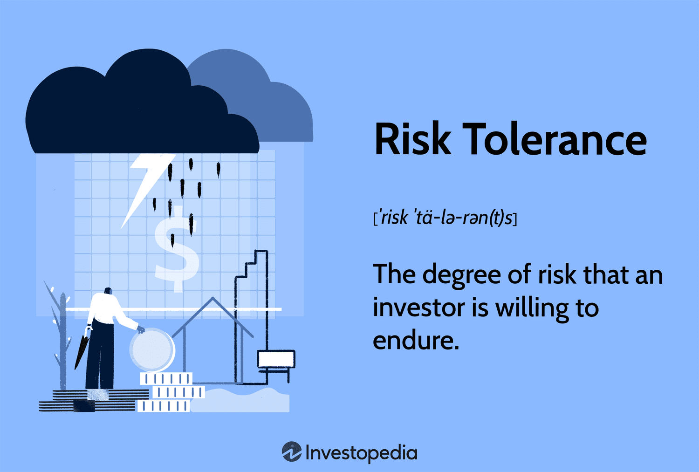

## Table of Contents

## What is risk tolerance?

Risk tolerance is how much risk someone is willing to take when making decisions, especially about money. It's like deciding if you want to play a game where you could win a lot but also lose a lot, or if you'd rather play a safer game with smaller wins and losses. Everyone has a different level of risk tolerance, and it can change over time depending on things like age, money situation, and life goals.

Understanding your risk tolerance is important because it helps you make choices that you feel good about. If you take on too much risk, you might feel stressed and worried. But if you're too cautious, you might miss out on chances to grow your money. Knowing your risk tolerance can help you find a balance that works for you, whether you're saving for the future, investing, or making other big decisions.

## Why is understanding risk tolerance important in financial planning?

Understanding risk tolerance is really important when you're planning your finances because it helps you pick the right investments and savings plans. If you know how much risk you can handle, you won't end up with investments that make you lose sleep at night. For example, if you can't stand the idea of losing money, you'll probably want to stick with safer options like savings accounts or bonds, instead of riskier things like stocks.

Also, knowing your risk tolerance helps you set realistic goals for your money. If you're okay with taking bigger risks, you might aim for bigger rewards, like investing in the stock market. But if you're more cautious, you might be happier with smaller, steadier growth. By matching your financial plans with your risk tolerance, you can feel more confident and comfortable with your choices, and that makes it easier to stick with your plan over time.

## How does risk tolerance differ from risk capacity?

Risk tolerance is about how much risk you're comfortable with emotionally. It's like asking yourself, "Can I handle it if my investment goes down?" If the thought of losing money makes you really nervous, you have a low risk tolerance. But if you're okay with ups and downs and you can sleep at night even if your investments drop, you have a higher risk tolerance. It's all about your feelings and how much stress you can take.

Risk capacity, on the other hand, is about how much risk you can actually afford to take. It's more about your money situation and your life goals. For example, if you have a lot of money saved up and a steady job, you might have a higher risk capacity because you can afford to lose some money without it messing up your life plans. But if you're close to retirement or you don't have a lot of extra money, your risk capacity might be lower because you can't afford big losses.

So, risk tolerance is about your comfort level with risk, while risk capacity is about what you can actually handle financially. Both are important when making financial decisions, but they're different because one is about feelings and the other is about your financial situation.

## What factors influence an individual's risk tolerance?

An individual's risk tolerance is influenced by many things. One big factor is their age. Younger people often have a higher risk tolerance because they have more time to recover from any losses. As people get older, they might become more cautious because they have less time to make up for any money they lose. Another factor is their financial situation. If someone has a lot of money saved up and a steady job, they might be more willing to take risks. But if they're struggling financially, they might want to play it safe.

Emotions also play a big role in risk tolerance. Some people are just naturally more comfortable with uncertainty and change, so they have a higher risk tolerance. Others get really stressed out by the idea of losing money, so they prefer safer options. Life experiences can change how someone feels about risk too. If someone has had bad experiences with risky investments in the past, they might be more cautious in the future. On the other hand, if they've had good experiences, they might be more willing to take chances.

Lastly, personal goals and knowledge about finance can affect risk tolerance. If someone is saving for a big goal like buying a house or retiring, their risk tolerance might change depending on how close they are to reaching that goal. Also, the more someone knows about investing and money, the more comfortable they might feel taking risks. Understanding how investments work can make the idea of risk less scary.

## How can someone assess their own risk tolerance?

To assess your risk tolerance, start by thinking about how you feel about losing money. Ask yourself if the idea of your investments going down makes you really nervous or if you can handle it without losing sleep. You can also think about past experiences. Have you ever invested in something risky before? How did it make you feel? If you've had good experiences, you might have a higher risk tolerance. If bad experiences made you really stressed, you might want to be more cautious.

Another way to figure out your risk tolerance is by looking at your financial situation. Do you have a lot of savings and a steady job? If so, you might be able to take more risks because you can afford to lose some money. But if you're living paycheck to paycheck or close to retirement, you might want to play it safe. You can also take online quizzes or talk to a financial advisor. They can ask you questions and help you understand how much risk you're comfortable with.

Remember, your risk tolerance can change over time. As you get older, your feelings about risk might change. Your financial situation might change too. So, it's a good idea to check in with yourself every now and then to see if your risk tolerance is still the same. This way, you can make sure your investments and savings plans still fit with how you feel about risk.

## What are common tools or questionnaires used to measure risk tolerance?

There are several common tools and questionnaires that people use to measure their risk tolerance. One popular tool is the Risk Tolerance Questionnaire (RTQ). This is a set of questions that ask about your feelings towards risk, your financial situation, and your investment goals. The questions might ask you to imagine different scenarios, like how you would feel if your investments lost value, and then you choose answers based on how you think you would react. After answering all the questions, the tool gives you a score that shows if you have a low, medium, or high risk tolerance.

Another tool is the Financial Risk Tolerance (FRT) scale. This is a shorter questionnaire that focuses more on your emotional reactions to risk. It asks you to rate statements about risk on a scale, like how much you agree or disagree with them. For example, it might ask if you enjoy taking risks or if you prefer to avoid them. The FRT scale is quick and easy to use, and it helps you understand your comfort level with financial risk. Both the RTQ and the FRT scale are helpful because they give you a clear picture of your risk tolerance, which can guide your financial decisions.

## How does risk tolerance affect investment choices?

Risk tolerance is really important when you're picking investments. If you have a high risk tolerance, you might choose to put your money into things like stocks or cryptocurrencies, which can go up and down a lot but also have the chance to make you a lot of money. You're okay with the ups and downs because you believe in the potential for big rewards. On the other hand, if you have a low risk tolerance, you'll probably stick with safer options like savings accounts, bonds, or mutual funds that focus on stability. These choices might not grow your money as fast, but they're less likely to lose value, which makes you feel more secure.

Your risk tolerance also helps you decide how much of your money to put into different kinds of investments. Someone with a high risk tolerance might put a bigger part of their money into riskier investments, hoping for higher returns. But someone with a low risk tolerance might keep most of their money in safer places, only putting a little bit into riskier options. By matching your investments to your risk tolerance, you can feel more comfortable with your choices and stay on track with your financial goals.

## Can risk tolerance change over time? If so, why?

Yes, risk tolerance can change over time. As people get older, their feelings about risk often change. When you're young, you might be okay with taking big risks because you have a long time to make up for any losses. But as you get closer to retirement, you might want to play it safer because you don't have as much time to recover if you lose money. Your financial situation can also change your risk tolerance. If you get a better job or save more money, you might feel more comfortable taking risks. But if you lose your job or have less money, you might want to be more cautious.

Life experiences can also affect how you feel about risk. If you've had good experiences with risky investments in the past, you might be more willing to take chances in the future. But if you've had bad experiences, like losing a lot of money, you might become more cautious. Your knowledge about money and investing can change your risk tolerance too. The more you learn about how investments work, the more comfortable you might feel taking risks. So, it's a good idea to check your risk tolerance every now and then to make sure your investments still match how you feel about risk.

## How should investors adjust their portfolios based on changes in risk tolerance?

When your risk tolerance changes, you should look at your investments and see if they still match how you feel about risk. If you used to be okay with taking big risks but now you want to be safer, you might want to move some of your money out of risky things like stocks and into safer places like bonds or savings accounts. This way, you won't feel as worried about losing money. On the other hand, if you feel more comfortable taking risks now, you might want to put more money into things like stocks or even cryptocurrencies, which can go up and down a lot but also have the chance to make you more money.

It's a good idea to check your risk tolerance every now and then, maybe once a year or when big things change in your life, like getting a new job or getting closer to retirement. By keeping an eye on how you feel about risk, you can make sure your investments still fit with your feelings and your financial goals. This can help you feel more confident and comfortable with your money choices, and it can help you stay on track with your plans for the future.

## What are the psychological aspects of risk tolerance?

Risk tolerance isn't just about numbers and money; it's also about how you feel inside. Some people are naturally more okay with taking risks. They might enjoy the excitement of not knowing what will happen and feel good about the chance to win big. These people might not get too upset if they lose some money because they see it as part of the game. On the other hand, some people get really nervous when they think about losing money. They might feel stressed and worried, even if the chance of losing is small. This is all about emotions and how comfortable you are with uncertainty.

Life experiences can change how you feel about risk too. If you've had good experiences with risky investments in the past, you might be more willing to take chances in the future. But if you've lost money before, you might be more cautious because you remember how bad it felt. Your personality also plays a big role. Some people are just more cautious by nature, while others are more adventurous. Understanding your own feelings and reactions can help you make better choices about money and investments.

## How do cultural and societal factors impact risk tolerance?

Cultural and societal factors can really change how people feel about taking risks with their money. In some cultures, people might be taught to be very careful and save their money instead of taking chances. They might see taking risks as something that could lead to big problems, so they stick to safe choices. In other cultures, people might be encouraged to take risks and try new things. They might see risk-taking as a way to grow and succeed, so they're more okay with the ups and downs of investing.

Society also plays a big role in how people think about risk. If everyone around you is talking about how great it is to invest in the stock market, you might feel more comfortable doing it too. But if people are always warning about how risky it is, you might be more cautious. Things like the economy and what's happening in the news can also affect how people feel about risk. If the economy is doing well, people might be more willing to take risks. But if there's a lot of uncertainty or bad news, people might want to play it safe.

## What advanced strategies can be employed to manage risk tolerance in complex investment scenarios?

In complex investment scenarios, one advanced strategy to manage risk tolerance is to use a diversified portfolio. This means spreading your money across different types of investments, like stocks, bonds, real estate, and even things like commodities or cryptocurrencies. By doing this, you can balance out the risk. If one investment goes down, another might go up, which can help protect your money. You can also use something called asset allocation, where you decide how much of your money to put into each type of investment based on how much risk you're okay with. As your feelings about risk change, you can adjust your asset allocation to keep your portfolio in line with your comfort level.

Another strategy is to use risk management tools like stop-loss orders and hedging. A stop-loss order is like a safety net that automatically sells an investment if it drops to a certain price, which can help limit your losses. Hedging is when you make another investment that goes up when your main investment goes down, kind of like insurance. These tools can help you feel more in control and less worried about big losses. It's also a good idea to regularly review and rebalance your portfolio. This means checking to see if your investments still match your risk tolerance and making changes if they don't. By doing this, you can keep your investments in line with how you feel about risk, even as things change.

## How do investment risk and financial behavior relate to each other?

Financial behavior is significantly impacted by an individual's perception of investment risk and their risk tolerance level. Risk tolerance is a critical consideration when making investment decisions, as it defines an investor's ability to endure fluctuations and potential losses in the financial markets. Behavioral finance has shown that cognitive biases often skew the perception of risk, leading to decisions that may not align with an individual's financial goals.

Cognitive biases, such as overconfidence, loss aversion, and the herd mentality, can lead individuals to make irrational investment decisions. Overconfidence might compel an investor to underestimate risk, leading to overly aggressive investment choices. Meanwhile, loss aversion may result in an exaggerated fear of potential losses, causing an investor to adopt an overly conservative strategy. Moreover, the herd mentality can cause investors to follow market trends without a thorough analysis of their personal risk profiles.

To mitigate the effects of these biases, understanding and managing risk correctly is essential. Risk management strategies involve a comprehensive evaluation of both market risks and personal risk tolerance levels. Quantitative measures, such as the Sharpe ratio or the capital asset pricing model (CAPM), can provide insights into expected investment returns in relation to risk.

For example, the Sharpe ratio, given by the formula:

$$
\text{Sharpe Ratio} = \frac{{R_p - R_f}}{{\sigma_p}}
$$

where $R_p$ is the portfolio return, $R_f$ is the risk-free rate, and $\sigma_p$ is the standard deviation of the portfolio's excess return, helps investors determine if the returns can justify the risks taken.

Furthermore, adopting a disciplined approach to investment, such as maintaining a diversified portfolio and regularly reviewing one's investment strategy in line with changing risk perceptions, can help in aligning investment decisions with personal and financial goals. Utilizing financial tools and resources to gain a better understanding of one's risk tolerance can reduce the influence of irrational behavior and improve investment outcomes.

Therefore, integrating insights from behavioral finance into risk management practices enables more rational decision-making, which is essential in navigating the complexities of financial markets efficiently. This approach not only enhances the ability to manage perceived risk but also aligns financial behavior with rational investment strategy, ultimately leading to more stable financial outcomes.

## References & Further Reading

[1]: Bergstra, J., Bardenet, R., Bengio, Y., & Kégl, B. (2011). ["Algorithms for Hyper-Parameter Optimization."](https://dl.acm.org/doi/10.5555/2986459.2986743) Advances in Neural Information Processing Systems 24.

[2]: ["Advances in Financial Machine Learning"](https://www.amazon.com/Advances-Financial-Machine-Learning-Marcos/dp/1119482089) by Marcos Lopez de Prado

[3]: ["Evidence-Based Technical Analysis: Applying the Scientific Method and Statistical Inference to Trading Signals"](https://www.amazon.com/Evidence-Based-Technical-Analysis-Scientific-Statistical/dp/0470008741) by David Aronson

[4]: ["Machine Learning for Algorithmic Trading"](https://github.com/stefan-jansen/machine-learning-for-trading) by Stefan Jansen

[5]: ["Quantitative Trading: How to Build Your Own Algorithmic Trading Business"](https://www.amazon.com/Quantitative-Trading-Build-Algorithmic-Business/dp/1119800064) by Ernest P. Chan