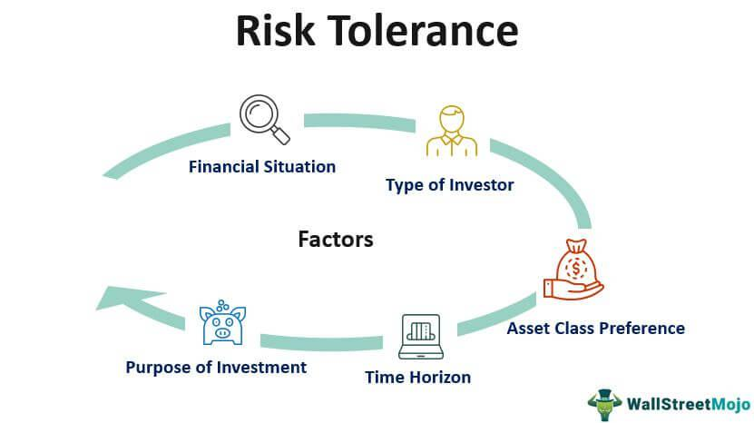

Understanding risk tolerance is crucial in the financial world, as it significantly influences investment decisions, asset allocation, and portfolio management. Risk tolerance is fundamentally the degree to which an investor is comfortable with the uncertainty and potential losses associated with investing. Recognizing and assessing risk tolerance can aid investors in choosing investments that align with their comfort level, thus fostering better financial outcomes.

In financial planning and wealth management, risk tolerance determines how a portfolio is structured. A high-risk tolerance may lead an investor to allocate a larger portion of their portfolio to equities, which generally offer higher returns at greater risk. Conversely, a low-risk tolerance might drive an investor towards bonds or money market instruments, traditionally seen as lower-risk investments.



This article explores the interplay between risk tolerance, financial behavior, investment risk, and algorithmic trading. It examines how these elements influence investor strategies and outcomes. The discussion includes factors influencing risk tolerance such as age, income, and financial experience, and emphasizes the pivotal role of financial behavior shaped by both rational analysis and cognitive biases. Additionally, the article investigates the burgeoning field of algorithmic trading, highlighting how it utilizes automated strategies to manage risk effectively.

The integration of technology and evolving methodologies, like artificial intelligence and machine learning, is transforming investment risk management. These tools provide new dimensions for assessing and aligning risk tolerance with investment strategies. As markets become more complex and interconnected, a thorough understanding of risk tolerance and its implications becomes indispensable for both individual and institutional investors. This comprehension allows for navigating market volatility with confidence and attaining long-term financial success.

## Table of Contents

## Defining Risk Tolerance

Risk tolerance is a fundamental concept in finance, signifying an individual's capacity and readiness to sustain potential fluctuations in the market and endure possible losses in investments. It is a multifaceted attribute, integrating emotional, financial, and situational components that collectively steer investment decisions. Specifically, risk tolerance is the degree of variability in investment returns an individual is willing to withstand in their investment portfolio.

Emotionally, risk tolerance is influenced by an individual's psychological comfort with uncertainty and potential loss, commonly referred to as risk aversion. Financially, it encompasses the available resources and future income prospects that an investor can leverage, which directly impacts their ability to withstand potential financial setbacks without compromising their financial stability. Situationally, factors such as the investor's life stage, goals, and timelines play substantial roles. For instance, younger investors with longer investment horizons may afford greater market volatility compared to those nearing retirement.

Understanding one's personal risk tolerance is imperative for developing an informed and customized investment strategy. This awareness ensures that selected investments align with the investor's comfort level and financial capacity, thereby reducing the probability of emotionally-driven decisions during market turmoils. Investors often assess their risk tolerance through self-reflection and formal evaluations using surveys and questionnaires, which quantitatively estimate their risk preferences.

In investment planning, harmonious alignment between risk tolerance and portfolio strategy is crucial. For example, an investor with high risk tolerance might allocate more of their portfolio to stocks, known for their [volatility](/wiki/volatility-trading-strategies) and higher potential returns. Conversely, a risk-averse investor might focus on bonds or other fixed-income securities, which generally offer lower returns but greater stability. This strategic alignment helps in optimizing returns while maintaining the investor's peace of mind concerning financial decisions.

## Factors Influencing Risk Tolerance

Risk tolerance is shaped by various factors, which include age, income level, and investment goals. Generally, younger investors tend to have a higher risk tolerance as they have more time to recover from potential losses. Conversely, older investors may prefer less risky investments as they approach retirement and prioritize capital preservation.

Income level also plays a fundamental role in determining risk tolerance. Individuals with higher income levels and more disposable income may exhibit greater risk tolerance, as they have more financial cushion to absorb potential losses. In contrast, individuals with lower incomes may prioritize financial security, leading to a more conservative approach to investing.

Investment goals significantly affect an individual's risk tolerance. For instance, those with long-term objectives, such as retirement or building wealth over several decades, may opt for riskier asset classes, such as equities or real estate, considering the potential for higher returns over time. Short-term goals, like saving for a house down payment, may drive individuals towards less volatile investments.

Experience in investment and past financial performance also critically impact risk tolerance. Experienced investors, familiar with market fluctuations, are often more adept at managing risk and may have a higher tolerance for it. In contrast, individuals who have experienced significant financial losses or have limited investing experience may adopt more conservative strategies to avoid repeating past mistakes.

Personal disposition towards risk and market perception significantly contribute to risk tolerance levels. Risk-averse individuals may naturally gravitate towards stable investments, whereas risk-seekers are more inclined to explore volatile opportunities. Additionally, market perception plays a role; during periods of market optimism, investors might exhibit higher risk tolerance, while bearish markets often lead to more cautious behavior.

Understanding these factors allows investors to tailor their strategies in alignment with their risk profiles, ensuring that they can achieve their financial objectives while comfortably managing market uncertainties.

## Investment Risk and Financial Behavior

Financial behavior is significantly impacted by an individual's perception of investment risk and their risk tolerance level. Risk tolerance is a critical consideration when making investment decisions, as it defines an investor's ability to endure fluctuations and potential losses in the financial markets. Behavioral finance has shown that cognitive biases often skew the perception of risk, leading to decisions that may not align with an individual's financial goals.

Cognitive biases, such as overconfidence, loss aversion, and the herd mentality, can lead individuals to make irrational investment decisions. Overconfidence might compel an investor to underestimate risk, leading to overly aggressive investment choices. Meanwhile, loss aversion may result in an exaggerated fear of potential losses, causing an investor to adopt an overly conservative strategy. Moreover, the herd mentality can cause investors to follow market trends without a thorough analysis of their personal risk profiles.

To mitigate the effects of these biases, understanding and managing risk correctly is essential. Risk management strategies involve a comprehensive evaluation of both market risks and personal risk tolerance levels. Quantitative measures, such as the Sharpe ratio or the capital asset pricing model (CAPM), can provide insights into expected investment returns in relation to risk.

For example, the Sharpe ratio, given by the formula:

$$
\text{Sharpe Ratio} = \frac{{R_p - R_f}}{{\sigma_p}}
$$

where $R_p$ is the portfolio return, $R_f$ is the risk-free rate, and $\sigma_p$ is the standard deviation of the portfolio's excess return, helps investors determine if the returns can justify the risks taken.

Furthermore, adopting a disciplined approach to investment, such as maintaining a diversified portfolio and regularly reviewing one's investment strategy in line with changing risk perceptions, can help in aligning investment decisions with personal and financial goals. Utilizing financial tools and resources to gain a better understanding of one's risk tolerance can reduce the influence of irrational behavior and improve investment outcomes.

Therefore, integrating insights from behavioral finance into risk management practices enables more rational decision-making, which is essential in navigating the complexities of financial markets efficiently. This approach not only enhances the ability to manage perceived risk but also aligns financial behavior with rational investment strategy, ultimately leading to more stable financial outcomes.

## Algorithmic Trading and Risk Management

Algorithmic trading has become a pivotal aspect of modern financial markets, employing automated systems and predefined strategies to capitalize on market opportunities. This approach aims to reduce the impact of human bias, which often affects decision-making processes in traditional trading.

A crucial component of [algorithmic trading](/wiki/algorithmic-trading) is risk management, which involves several methods designed to mitigate potential financial losses. Diversification is one of these key strategies, spreading investments across various assets to minimize the effect of a loss in any single asset. This concept can be mathematically represented through the calculation of a portfolio's expected return and standard deviation, employing the covariance between asset returns to reduce overall risk.

Stop-loss orders are another vital tool in algorithmic trading risk management. These orders automatically execute a sell action once an asset's price falls to a specified level, thereby limiting potential losses. For example, a trader might set a stop-loss order at 5% below the purchase price of a stock. If the stock's price drops to that threshold, the trading algorithm will automatically sell the stock, protecting the trader from further losses.

Quantitative risk assessments such as Value at Risk (VaR) are extensively used in algorithmic trading to estimate the potential loss in the value of an asset or portfolio. VaR is expressed as a percentage or an amount of loss over a defined period, given normal market conditions. The calculation of VaR involves complex statistical methods, often facilitated by algorithmic systems to provide timely risk estimates. A Python code snippet to calculate VaR might involve using historical data to simulate potential future losses:

```python
import numpy as np

def calculate_var(returns, confidence_level=0.95):
    # Sort returns and convert confidence level to percentile
    sorted_returns = np.sort(returns)
    var_index = int((1 - confidence_level) * len(sorted_returns))

    # VaR is the return at the specified percentile
    value_at_risk = sorted_returns[var_index]
    return value_at_risk

# Example usage with mock returns data
mock_returns = np.random.normal(0, 1, 1000)  # Normally distributed returns
var_95 = calculate_var(mock_returns, confidence_level=0.95)
```

Implementing robust risk management techniques in algorithmic trading serves primarily to preserve capital and minimize potential losses. By coupling automated trading systems with effective risk management strategies, traders can enhance their decision-making process, protect their investments, and potentially increase their returns. This structured approach to trading not only reduces emotional involvement but also promotes disciplined financial management, essential for success in volatile markets.

## Aligning Risk Tolerance with Investment Strategy

Aligning investment strategies with an individual's risk tolerance is a fundamental component of effective portfolio management. The objective is to ensure that investors' long-term financial goals are achieved by creating a personalized investment approach that reflects their unique risk profile. This process begins with accurately assessing the individual's risk tolerance, which can be accomplished using various tools and questionnaires designed to gauge a person's comfort level with risk.

Risk assessment tools often utilize questions to evaluate factors such as financial goals, time horizon, income level, and emotional responses to market fluctuations. These questionnaires translate qualitative data into quantitative scores, categorizing risk tolerance into levels such as conservative, moderate, or aggressive. Understanding these categories allows investors and financial advisors to guide asset allocation strategically, balancing equities, fixed income, and alternative investments according to the investor's risk profile.

Moreover, the dynamic nature of financial markets and individual life circumstances necessitates a flexible approach to managing investment strategies. As an investor's risk tolerance evolves due to changes in income, age, market conditions, or personal circumstances, it is crucial to adjust the portfolio accordingly. Such adjustments help in maintaining alignment with the investor's risk capacity and preferences.

For example, a simple algorithmic approach to adjust the equity portion of a portfolio could function as follows in Python:

```python
def adjust_portfolio(equity_allocation, risk_tolerance_level):
    risk_tolerance_multipliers = {
        'conservative': 0.7,
        'moderate': 1.0,
        'aggressive': 1.3
    }

    adjusted_equity_allocation = equity_allocation * risk_tolerance_multipliers.get(risk_tolerance_level, 1)
    return adjusted_equity_allocation

# Example usage
current_equity_allocation = 0.6  # 60% of the portfolio in equities
risk_tolerance = 'moderate'

new_equity_allocation = adjust_portfolio(current_equity_allocation, risk_tolerance)
print(f"Adjusted Equity Allocation: {new_equity_allocation:.2f}")
```

In this example, the function `adjust_portfolio` utilizes predefined multipliers for different risk tolerance levels to recommend a revised equity allocation. Such models, while simplistic, underscore the importance of continuously refining investment strategies.

Successful alignment between risk tolerance and investment strategy serves to not only optimize performance but also enhance investor confidence and peace of mind. By employing structured assessment techniques and embracing flexibility in portfolio management, investors can better navigate the complexities of financial markets, adapting efficiently to both personal changes and evolving economic landscapes.

## The Future of Investment Risk Management

Technological advancements are dramatically transforming risk assessment and management methodologies within the financial sector. Innovations in [artificial intelligence](/wiki/ai-artificial-intelligence) (AI) and [machine learning](/wiki/machine-learning) have enabled the development of customized solutions for managing investment risks, influencing how investors make decisions and allocate assets.

AI systems can process and analyze vast amounts of financial data, identifying patterns and trends that may indicate potential risks or opportunities. For example, machine learning algorithms can predict market movements by analyzing historical data and current market conditions, offering traders insights that were previously unattainable. These technologies enable the creation of models that adjust risk assessments in real-time, enhancing their accuracy and reliability.

Machine learning techniques, such as supervised learning, can be used to create predictive models for risk assessment. These models utilize historical data to learn the relationship between various financial indicators and market outcomes. Specifically, regression analysis or classification models can predict potential risks based on input variables like market volatility, interest rates, and geopolitical events. Python libraries such as scikit-learn and TensorFlow are widely used for implementing these models, given their robust capabilities and ease of use.

```python
import numpy as np
from sklearn.model_selection import train_test_split
from sklearn.linear_model import LinearRegression
from sklearn.metrics import mean_squared_error

# Sample data
market_volatility = np.array([1.2, 2.3, 3.4, 4.5, 5.6])
interest_rates = np.array([2.5, 2.6, 2.7, 2.8, 2.9])
geopolitical_factors = np.array([0.1, 0.2, 0.3, 0.4, 0.5])
risks = np.array([0.5, 1.0, 1.5, 2.0, 2.5])  # Target variable

# Prepare dataset
X = np.stack((market_volatility, interest_rates, geopolitical_factors), axis=1)
y = risks

# Train test split
X_train, X_test, y_train, y_test = train_test_split(X, y, test_size=0.2, random_state=42)

# Linear regression model
model = LinearRegression()
model.fit(X_train, y_train)

# Predictions
predictions = model.predict(X_test)

# Evaluate model
mse = mean_squared_error(y_test, predictions)
print(f"Mean Squared Error: {mse}")
```

Moreover, portfolio optimization, which traditionally relied on mean-variance analysis, has benefited from AI-driven improvements. Techniques such as [reinforcement learning](/wiki/reinforcement-learning) enable the optimization process to include dynamic feedback loops, where the investment strategy continuously adapts based on the evolving market conditions.

Investors are encouraged to stay informed about these emerging technologies and trends, as they provide significant advantages in aligning investment strategies with modern risk management techniques. Understanding these advancements ensures that investors can maintain a competitive edge in increasingly complex financial markets. Furthermore, staying updated allows investors to leverage cutting-edge tools that enhance their ability to predict risks and implement effective mitigation strategies. 

In conclusion, the integration of AI and machine learning into risk management is a promising development that offers increased precision, adaptability, and robustness in managing investment portfolios. As these technologies evolve, they will continue to redefine the standards and practices of risk management in finance.

## Conclusion

Understanding risk tolerance and effectively managing investment risk are fundamental for investors aiming to navigate financial markets with confidence. Risk tolerance defines the level of volatility an investor is willing to accept in their investment portfolio, which is instrumental in guiding asset allocation and decision-making processes. A personalized understanding of risk can enable investors to construct strategies that not only align with their financial objectives but also adapt to market fluctuations.

Algorithmic trading plays a pivotal role in structured risk management by utilizing predefined strategies to mitigate human error and emotional bias. These algorithms can execute trades at speeds and frequencies beyond human capability, often using sophisticated models to predict market movements. By employing techniques such as diversification, stop-loss orders, and quantitative risk assessments like Value at Risk (VaR), algorithmic trading systems can manage and control the extent of potential losses, leading to more disciplined financial decision-making.

Adaptability to changing personal risk tolerance and dynamic market conditions is crucial for investors to achieve long-term success. As market environments evolve and individual circumstances change, investors must be prepared to reassess and realign their investment strategies accordingly. This adaptability ensures that investment portfolios remain optimized and consistent with the investor's risk profile, maximizing potential returns while minimizing unnecessary risks.

In conclusion, an in-depth understanding of risk tolerance combined with efficient risk management strategies serves as the cornerstone for achieving financial stability and growth. By incorporating both disciplined approaches through algorithmic trading and flexibility in strategy adjustment, investors can better position themselves to successfully navigate the complexities of the financial markets.

## References & Further Reading

[1]: Bergstra, J., Bardenet, R., Bengio, Y., & Kégl, B. (2011). ["Algorithms for Hyper-Parameter Optimization."](https://dl.acm.org/doi/10.5555/2986459.2986743) Advances in Neural Information Processing Systems 24.

[2]: ["Advances in Financial Machine Learning"](https://www.amazon.com/Advances-Financial-Machine-Learning-Marcos/dp/1119482089) by Marcos Lopez de Prado

[3]: ["Evidence-Based Technical Analysis: Applying the Scientific Method and Statistical Inference to Trading Signals"](https://www.amazon.com/Evidence-Based-Technical-Analysis-Scientific-Statistical/dp/0470008741) by David Aronson

[4]: ["Machine Learning for Algorithmic Trading"](https://github.com/stefan-jansen/machine-learning-for-trading) by Stefan Jansen

[5]: ["Quantitative Trading: How to Build Your Own Algorithmic Trading Business"](https://www.amazon.com/Quantitative-Trading-Build-Algorithmic-Business/dp/1119800064) by Ernest P. Chan