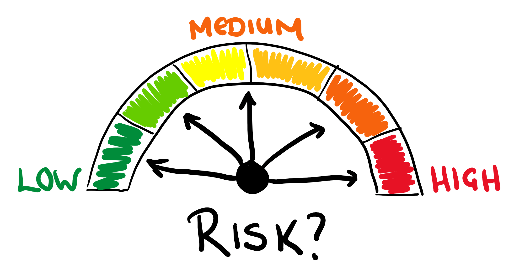

## Table of Contents

## What is risk?

Risk is the chance that something bad might happen. It's like when you're not sure if it will rain, but you know it might. In life, risks are everywhere. For example, when you ride a bike, there's a risk you might fall. When you start a new job, there's a risk it might not work out. Understanding risk helps us make better choices.

We can manage risk by thinking about what could go wrong and trying to stop it. For example, wearing a helmet when biking can lower the risk of getting hurt. Businesses also think about risk. They might buy insurance to protect against things like fires or theft. By planning for risks, we can feel safer and be ready for surprises.

In short, risk is a normal part of life. It's important to know about risks so we can take steps to protect ourselves and make smart decisions. Whether it's in our personal lives or at work, thinking about risk helps us live more safely and confidently.

## What are the different types of risk?

There are many types of risks that we face every day. One type is financial risk, which is the chance that you might lose money. This can happen when you invest in stocks or start a business. Another type is health risk, like the chance of getting sick or hurt. For example, smoking increases the risk of lung cancer. There's also personal risk, which includes things like losing your job or having a car accident. These risks can affect our daily lives and well-being.

Another important type of risk is operational risk, which businesses face when their day-to-day activities might go wrong. This could be because of human errors, system failures, or even fraud. Environmental risk is also critical, as it involves dangers from natural disasters like earthquakes or floods, which can harm people and property. Lastly, there's strategic risk, which happens when a company's plans don't work out as expected. This can lead to financial losses or a drop in market share.

Understanding these different types of risks helps us prepare better. We can take steps to lower the chances of bad things happening, like saving money to cover financial risks or following safety rules to reduce health risks. By knowing about the various risks, we can make smarter choices and live safer lives.

## How can risk be measured?

Measuring risk can be tricky, but there are some common ways to do it. One way is to use numbers and data. For example, if you're looking at financial risk, you might look at how much a stock's price goes up and down. This is called [volatility](/wiki/volatility-trading-strategies). The more it moves, the riskier it is. Another way is to use a scale from 1 to 10, where 1 is very safe and 10 is very risky. This helps people understand the risk level quickly.

Another way to measure risk is by looking at how likely something bad is to happen and how bad it could be if it does. For example, if you're thinking about health risks, doctors might look at how common a disease is and how serious it can be. They might say there's a 10% chance of getting sick, and if you do, you might need to stay in the hospital for a week. This helps people understand both the chance and the impact of the risk.

Sometimes, people use tools like risk assessments or risk matrices to measure risk. These tools help break down the risk into parts, like how likely it is and how bad it could be. By putting these parts together, you get a clearer picture of the overall risk. This can be really helpful for making decisions, like whether to start a new project or buy insurance.

## What are common strategies for managing risk?

One common way to manage risk is by avoiding it. If something is too risky, you might choose not to do it at all. For example, if a road is icy, you might decide to stay home instead of driving. Another way is to reduce the risk. This means taking steps to make the bad thing less likely to happen or less bad if it does. Wearing a seatbelt in a car reduces the risk of getting hurt in an accident. Sharing the risk is also a strategy. This is when you get others to help [carry](/wiki/carry-trading) the risk, like when you buy insurance. The insurance company agrees to pay if something bad happens, so you don't have to face the risk alone.

Another strategy is to accept the risk. Sometimes, the risk is worth it, and you decide to go ahead anyway. Starting a new business is risky, but if you believe in the idea, you might accept the risk and move forward. You can also transfer the risk, which is similar to sharing it but means passing it on to someone else. For example, a company might hire a contractor to do a dangerous job, so the contractor takes on the risk. Finally, you can mitigate the risk, which means taking actions to lessen its impact. Saving money for emergencies is a way to mitigate financial risk because it helps you handle unexpected costs.

## How does risk affect decision-making in personal finance?

Risk plays a big role in how we make choices about our money. When you're thinking about saving, investing, or spending, you have to think about what could go wrong. For example, if you want to invest in stocks, you know there's a chance you could lose money. That's a risk. So, you might decide to put your money in a savings account instead because it's safer, even though you won't earn as much. Understanding risk helps you decide how much you're willing to take a chance with your money.

Also, risk affects how you plan for the future. If you're worried about losing your job, you might save more money to be ready for that risk. Or, if you're thinking about buying a house, you'll think about the risks like not being able to pay the mortgage. These worries can make you choose to wait or look for a cheaper home. By thinking about risk, you can make smarter choices that help you feel more secure about your money.

## What is the relationship between risk and return in investments?

In investing, risk and return are closely linked. When you put your money into something risky, like stocks, you have a chance to make more money. This is called a higher return. But, there's also a bigger chance you could lose money. So, if you want to grow your money quickly, you might choose riskier investments. But you have to be okay with the possibility of losing some or all of your money.

On the other hand, if you choose safer investments, like a savings account, the risk of losing money is low. But the return, or the money you earn, is also low. This means your money will grow slowly. So, when you're thinking about where to put your money, you have to decide how much risk you're willing to take. If you don't want to lose money, you'll pick safer options with smaller returns. If you're okay with taking chances, you might go for riskier options with the hope of bigger returns.

## How do businesses assess and mitigate operational risks?

Businesses assess operational risks by looking at what could go wrong in their daily work. They do this by using tools like risk assessments and audits. These tools help them find problems like human errors, system failures, or fraud. They might ask questions like, "What could stop us from doing our job?" or "What could hurt our business?" By answering these questions, they can see where the risks are and how big they might be. This helps them plan better and be ready for surprises.

To mitigate these risks, businesses take steps to make bad things less likely to happen or less bad if they do. For example, they might train their workers to do their jobs better and follow safety rules. They could also use technology to watch for problems and fix them quickly. Another way is to have backup plans, like having extra machines or people ready to step in if something goes wrong. By doing these things, businesses can lower the chance of operational risks hurting their work and keep things running smoothly.

## What role does risk play in strategic planning for organizations?

Risk plays a big part in how organizations plan for the future. When a company makes a strategic plan, they think about what they want to achieve and how to get there. But they also have to think about what could go wrong. These risks could be things like new competitors coming into the market, changes in what customers want, or even problems with their own plans not working out. By understanding these risks, a company can make better choices and be ready for surprises. They might decide to go slower with a new project or spend more time researching before they start.

To manage these risks, organizations often use tools like risk assessments and scenario planning. They look at different things that could happen and how bad they might be. This helps them figure out what to do to make those bad things less likely or less harmful. For example, if they see a risk of losing customers, they might start a new marketing plan to keep them happy. By thinking about risks, a company can make a stronger plan that helps them reach their goals while being ready for anything that might come their way.

## How can risk management practices be integrated into corporate governance?

Risk management is a key part of how a company is run, and it fits right into corporate governance. Corporate governance is all about making sure a company is run well and responsibly. It includes things like setting rules, making decisions, and watching over the business. When a company thinks about risks, they're looking at what could go wrong and how to stop it. By putting risk management into corporate governance, a company can make sure everyone knows about the risks and works together to handle them. This means the board of directors and top managers need to talk about risks often, set up clear rules for dealing with them, and make sure everyone follows those rules.

Having risk management in corporate governance helps a company be ready for surprises and make better choices. It's like having a safety net that keeps the business safe. The board can set up special groups to watch for risks and make plans to deal with them. They can also make sure the company has enough money saved up for emergencies and that they're always checking to see if their plans are working. By doing all this, a company can run smoothly and keep growing, even when things go wrong.

## What are advanced quantitative methods used in risk analysis?

Advanced quantitative methods in risk analysis help businesses understand risks better by using math and numbers. One common method is called Value at Risk (VaR). VaR tells you the most money you could lose in a certain time, like a day or a month, with a certain chance, like 5%. It's like saying, "There's a 5% chance you could lose this much money tomorrow." Another method is Monte Carlo simulation. This method uses computers to run many different scenarios of what could happen. It helps businesses see all the possible outcomes and understand how likely each one is. These methods give businesses a clearer picture of the risks they face and help them make smarter decisions.

Another important method is stress testing. This involves looking at what would happen if something really bad happened, like a big drop in the stock market or a sudden increase in interest rates. By doing stress tests, businesses can see if they would survive these tough situations. Then there's [factor](/wiki/factor-investing) analysis, which looks at how different things, like the economy or interest rates, affect the business. This helps businesses understand which risks are the most important to watch. Using these advanced methods, companies can plan better and be ready for whatever might come their way.

## How do global economic factors influence risk assessment?

Global economic factors can change how businesses think about risk. Things like how well other countries' economies are doing, changes in money exchange rates, or big events like a worldwide health crisis can make risks bigger or smaller. For example, if the economy in another country slows down, it might mean fewer people will buy a company's products. This makes the risk of losing money higher. Also, if the value of one country's money goes down compared to another's, it can make it more expensive for a company to buy things from that country, adding to the risk of higher costs.

To handle these global risks, companies need to keep a close eye on what's happening around the world. They might use special reports or data to see how these big events could affect them. For instance, if they see that a big economic change is coming, they might decide to change their plans or save more money to be ready. By understanding how global economic factors can change risks, businesses can make better choices and be more prepared for surprises.

## What are emerging trends in risk management and how might they shape future practices?

Emerging trends in risk management are changing how businesses think about and handle risks. One big trend is using technology, like [artificial intelligence](/wiki/ai-artificial-intelligence) (AI) and big data, to spot risks faster and more accurately. AI can look at huge amounts of information to find patterns and warn businesses about possible problems before they happen. Another trend is focusing more on environmental and social risks, like climate change or how a company treats its workers. Companies are starting to see that these risks can affect their business a lot, so they're putting more effort into understanding and managing them.

These trends are likely to shape future practices by making risk management more proactive and connected. Instead of just reacting to problems, businesses will use AI and big data to predict risks and stop them before they start. This means they'll be able to make better decisions and be more prepared for surprises. Also, as more attention goes to environmental and social issues, companies will need to think about these risks in all their plans. This will help them be more responsible and sustainable, which can also make them more successful in the long run.

## What are the Risk Management Strategies for Algo Trading?

Algorithmic trading, while advantageous in terms of speed and efficiency, introduces unique risks that necessitate robust risk management strategies. Implementing technical solutions such as 'kill switches' and circuit breakers is pivotal in mitigating operational and market risks. Kill switches enable traders to halt trading activities instantaneously during abnormal market conditions, preventing further losses. Circuit breakers, on the other hand, are mechanisms that temporarily pause trading when extreme volatility or unusual trading activity is detected, allowing the market time to stabilize. These tools help protect against catastrophic trading errors and market disruptions.

Risk management in algo trading also involves advanced tools and algorithms designed for volatility prediction. These algorithms analyze historical price data and market trends to forecast future volatility, enabling traders to adjust their positions dynamically. One popular model is the GARCH (Generalized Autoregressive Conditional Heteroskedasticity) model, which predicts volatility by considering past variances and error terms. Mathematically, it can be represented as:

$$
\sigma_t^2 = \alpha_0 + \alpha_1 \epsilon_{t-1}^2 + \beta_1 \sigma_{t-1}^2
$$

where $\sigma_t^2$ is the current volatility, $\alpha_0$ is a constant, $\epsilon_{t-1}^2$ is the previous period's squared residual, and $\sigma_{t-1}^2$ is the previous period's volatility.

Moreover, the role of [backtesting](/wiki/backtesting) and real-time risk evaluation cannot be understated. Backtesting involves simulating an algorithm's performance on historical data to assess its potential profitability and risk profile before deployment. This process helps in identifying any weaknesses or anomalies in the trading strategy under varying market conditions. Real-time risk evaluation, facilitated by ongoing data analysis and monitoring, ensures that the trading algorithm adapts to present market dynamics, promptly identifying and mitigating emerging risks.

By integrating these solutions and methodologies, traders can enhance their risk management practices, effectively shielding themselves from potential losses while capitalizing on profitable opportunities within the volatility of financial markets.

## References & Further Reading

[1]: Aite Group. (Year unavailable). Statistics on algorithmic trading volume. Retrieved from industry reports and publications.

[2]: "Flash Crash of 2010." U.S. Securities and Exchange Commission (SEC) Report. Retrieved from https://www.sec.gov/reportspubs/special-studies/research-effect-may-6-2010-market-structure.htm

[3]: Aldridge, I. (2013). ["High-Frequency Trading: A Practical Guide to Algorithmic Strategies and Trading Systems"](https://www.wiley.com/en-us/High+Frequency+Trading%3A+A+Practical+Guide+to+Algorithmic+Strategies+and+Trading+Systems%2C+2nd+Edition-p-9781118343500). Wiley.

[4]: Markets in Financial Instruments Directive (MiFID II). European Securities and Markets Authority (ESMA). Official documentation available at https://www.esma.europa.eu/policy-rules/mifid-ii-and-mifir

[5]: Knight Capital Incident. U.S. Securities and Exchange Commission (SEC) Report. Retrieved from https://www.sec.gov/litigation/admin/2013/34-70694.pdf