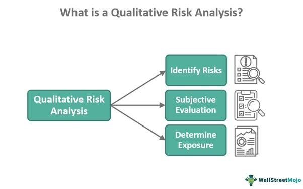

Algorithmic trading, often abbreviated as algo trading, refers to the use of computer algorithms to automate trading strategies in financial markets. These algorithms are designed to execute orders based on a set of predefined rules and criteria, which may include timing, price, quantity, or other mathematical models. The primary purpose of algorithmic trading is to enhance trading efficiency by leveraging computational speed and precision, thereby outperforming human capabilities in fast-paced market environments.

The prevalence of algo trading has seen substantial growth, particularly with advancements in technology and the increasing complexity of financial markets. According to a study by Aite Group, algorithmic trading accounted for approximately 60-70% of the overall trading volume in major equity markets as of recent years. This growth can be attributed to the significant advantages algo trading offers, such as increased order execution speed, reduced transaction costs, and the ability to manage large volumes of data to identify trading opportunities more swiftly.

Algorithmic trading appeals to a wide range of traders—from individual retail investors to large institutional players. Its popularity is driven by the promise of reduced human errors, minimized emotional bias, and enhanced ability to process and react to market information at speeds unattainable by humans. For traders and investors, this represents a profound shift in the pursuit of competitive advantages within financial markets.

However, with the benefits of algorithmic trading also comes the necessity to consider and manage associated risks. The complexity of the algorithms, coupled with the fast-paced nature of executions, introduces various risks. Understanding these risks is critical for traders and investors, as failures can lead to significant financial losses and market disruptions. Risks in algorithmic trading can range from technical issues—such as software bugs and connectivity failures—to more systemic concerns, like amplifying market volatility, which can sometimes culminate in catastrophic events like flash crashes.

In conclusion, while algorithmic trading provides substantial efficiency and strategic advantages in financial markets, it also necessitates meticulous attention to risk management to safeguard against potential adverse impacts.

## Table of Contents

## Understanding Algorithmic Trading

Algorithmic trading, commonly known as algo trading, is the process of executing trading orders using pre-programmed and automated instructions. These instructions consider various variables such as time, price, and [volume](/wiki/volume-trading-strategy) to initiate and complete trades. The automation involved in algo trading enables these processes to occur at speeds and frequencies that are impractical for human traders.

Algorithmic trading operates on a series of complex computations and algorithms that scan various market variables to identify opportunities. Once a potential trading opportunity is flagged, the algorithm autonomously places buy or sell orders in fractions of a second. The mechanisms of algo trading are built upon historical data analysis, quantitative models, and market insights encoded into algorithmic programs.

There are various types of algorithms used in this form of trading. The primary types include:

1. **Trend-following algorithms**: These are based on moving averages, channel breakouts, and related techniques. The basic idea is to follow existing market trends, and these algorithms do not incorporate predictive data analytics.

2. **Arbitrage opportunities**: These algorithms are designed to identify and capitalize on the price difference of an asset in different markets. For instance, if a stock is priced differently in two stock exchanges, the algorithm buys at the lower price and sells at the higher price.

3. **Mean Reversion**: This strategy is based on the concept that the high and low prices of an asset are temporary and tend to revert to their mean value over time. The algorithm identifies and exploits discrepancies between current prices and the calculated average.

4. **Market-making algorithms**: These involve simultaneous buy and sell orders at the current price, establishing a 'market' for an asset while earning a spread. 

Algorithmic trading encompasses a wide array of assets, including stocks, futures, options, [forex](/wiki/forex-system), and commodities. 

The benefits of algo trading are numerous. Firstly, trading happens at optimal speeds and efficiencies unparalleled by human capability. This speed offers competitive advantages, especially in high-frequency trading ([HFT](/wiki/high-frequency-trading-strategies)), where decisions and executions in microseconds can impact profitability. Secondly, algo trading reduces market impact by executing larger orders in small segments throughout the trading day, thereby minimizing slippage. Thirdly, it eliminates the human emotional [factor](/wiki/factor-investing), allowing for objective and rational trade executions free from biases or panic that can skew decision-making. This level of consistency is essential for maintaining a steady investment strategy in dynamic markets.

In summary, [algorithmic trading](/wiki/algorithmic-trading) leverages advanced technological solutions to enhance trading performance, providing speed, efficiency, and automation, which far surpass human skills. Such advancements have fundamentally transformed financial markets, making them more liquid and accessible, while presenting significant opportunities for profit maximization.

## Major Risks in Algorithmic Trading

Algorithmic trading, while offering numerous advantages, presents several significant risks that traders and investors must carefully manage. One of the foremost concerns is systemic risk, which refers to the possibility that a failure in a single element of the financial system could trigger widespread disruptions. Algorithmic trading can amplify systemic risks due to its reliance on automated and interconnected processes. The rapid execution and vast integration of markets heighten the potential for a localized issue to escalate into a broader market disruption. For instance, a malfunction in one algorithm could lead to cascading failures across different trading platforms, influencing market stability and investor confidence.

Market risks in algorithmic trading include increased [volatility](/wiki/volatility-trading-strategies) and the potential for flash crashes. Algorithms can execute thousands of orders in milliseconds, sometimes causing unintended consequences such as sharp price swings. Flash crashes, characterized by an abrupt and substantial drop in asset prices followed by a swift recovery, underscore this risk. These events are often driven by a sudden mismatch in [liquidity](/wiki/liquidity-risk-premium), where sell orders overwhelm buy orders, leading to dramatic price declines. The Flash Crash of 2010 stands as a prime example, where the Dow Jones Industrial Average plunged nearly 1,000 points within minutes due to algorithmic trading strategies reacting to market anomalies.

Technical risks encompass software bugs, data inaccuracies, and connectivity issues. Software bugs can occur due to errors in the code, leading to unintended trading behaviors that may disrupt markets or incur significant financial losses. Data inaccuracies can arise from faulty data feeds, resulting in decisions based on incorrect information. Furthermore, connectivity issues between trading systems and exchanges can delay order transmission or lead to execution errors. Such technical problems can undermine the reliability and integrity of algorithmic trading operations, emphasizing the need for rigorous testing and robust system architectures.

Overall, the risks associated with algorithmic trading necessitate proactive management strategies. These include implementing real-time monitoring systems to detect anomalies, developing robust error-handling procedures, and maintaining infrastructure redundancy to mitigate connectivity failures. Addressing these risks is vital for ensuring that the benefits of algorithmic trading are realized without compromising market integrity and stability.

## Case Studies of Algorithmic Trading Failures

Algorithmic trading, while offering numerous advantages, has historically been associated with several significant market failures. One of the most notable incidents is the Flash Crash of May 6, 2010. During this event, the U.S. stock markets witnessed a swift and severe drop in equity prices, with the Dow Jones Industrial Average plunging nearly 1,000 points in a matter of minutes. Investigations revealed that algorithmic trading played a crucial role in exacerbating this volatility. The triggering event was a large sale of E-mini S&P 500 futures contracts, initiated by an algorithm designed to manage risk in an orderly manner. However, the algorithm inadvertently contributed to a feedback loop, engaging high-frequency trading algorithms across the market, which reacted by withdrawing liquidity. This amplified the market's instability and led to the rapid decline in prices before a swift recovery.

Another significant failure in algorithmic trading occurred on August 1, 2012, involving Knight Capital Group. The firm experienced a loss of $460 million in under an hour due to software malfunction. The problem arose from an outdated software code that was inadvertently deployed during a systems upgrade. Upon activation, the faulty algorithm began to execute trades rapidly, disrupting the prices of 148 different stocks. Knight Capital's incident is a stark reminder of the technical risks associated with algorithmic trading—how a single errant algorithm can lead to massive financial losses and affect market prices.

Apart from these incidents, other notable algorithmic trading failures include the $7 billion loss faced by Société Générale in 2008, attributed to unauthorized and disastrous trades by a rogue trader whose operations were facilitated by corporate algorithmic strategies and risk management lapses. These cases emphasize the potential systemic impact of algorithmic trading errors, highlighting the intricate nature of technical, operational, and market risks involved.

In each instance, the repercussions were significant, influencing market stability, investor confidence, and prompting regulatory scrutiny. The Flash Crash led to the introduction of circuit breakers to mitigate such sudden market moves, while the Knight Capital incident emphasized the necessity for robust software testing and deployment protocols. These cases underscore the importance of developing comprehensive risk management strategies and ensuring strict regulatory compliance in algorithmic trading.

## Risk Management Strategies for Algo Trading

Algorithmic trading, while advantageous in terms of speed and efficiency, introduces unique risks that necessitate robust risk management strategies. Implementing technical solutions such as 'kill switches' and circuit breakers is pivotal in mitigating operational and market risks. Kill switches enable traders to halt trading activities instantaneously during abnormal market conditions, preventing further losses. Circuit breakers, on the other hand, are mechanisms that temporarily pause trading when extreme volatility or unusual trading activity is detected, allowing the market time to stabilize. These tools help protect against catastrophic trading errors and market disruptions.

Risk management in algo trading also involves advanced tools and algorithms designed for volatility prediction. These algorithms analyze historical price data and market trends to forecast future volatility, enabling traders to adjust their positions dynamically. One popular model is the GARCH (Generalized Autoregressive Conditional Heteroskedasticity) model, which predicts volatility by considering past variances and error terms. Mathematically, it can be represented as:

$$
\sigma_t^2 = \alpha_0 + \alpha_1 \epsilon_{t-1}^2 + \beta_1 \sigma_{t-1}^2
$$

where $\sigma_t^2$ is the current volatility, $\alpha_0$ is a constant, $\epsilon_{t-1}^2$ is the previous period's squared residual, and $\sigma_{t-1}^2$ is the previous period's volatility.

Moreover, the role of [backtesting](/wiki/backtesting) and real-time risk evaluation cannot be understated. Backtesting involves simulating an algorithm's performance on historical data to assess its potential profitability and risk profile before deployment. This process helps in identifying any weaknesses or anomalies in the trading strategy under varying market conditions. Real-time risk evaluation, facilitated by ongoing data analysis and monitoring, ensures that the trading algorithm adapts to present market dynamics, promptly identifying and mitigating emerging risks.

By integrating these solutions and methodologies, traders can enhance their risk management practices, effectively shielding themselves from potential losses while capitalizing on profitable opportunities within the volatility of financial markets.

## The Role of Regulation and Compliance in Algo Trading

Algorithmic trading, characterized by the use of automated systems to execute trades at high speed and frequency, operates within a stringent regulatory framework designed to ensure market stability and integrity. These frameworks, enforced by financial regulators worldwide, seek to mitigate risks associated with such trading practices, including systemic risks and market abuse.

Regulatory bodies such as the U.S. Securities and Exchange Commission (SEC), the Commodity Futures Trading Commission (CFTC), and the European Securities and Markets Authority (ESMA) have established guidelines to oversee algorithmic trading activities. These guidelines include measures for pre-trade risk controls, real-time monitoring, and post-trade transparency to prevent market manipulation and ensure fair trading practices. In the United States, the SEC's Regulation National Market System (Reg NMS) and the CFTC's regulations on automated trading are pivotal in governing these trades. Meanwhile, MiFID II (Markets in Financial Instruments Directive) provides a comprehensive framework for algo trading in Europe, emphasizing enhanced transparency and investor protection.

The impact of these regulations on trading strategies is profound. By mandating high standards for algorithm performance and stability, regulators aim to prevent erratic trading behaviors that could lead to market disruptions. Algorithmic traders are required to implement robust risk management systems to comply with these standards. Regulated entities must also maintain comprehensive records of their algorithmic trading activities, facilitating oversight and accountability. Additionally, the introduction of circuit breakers and other safeguards helps maintain market fairness by automatically halting trading during extreme volatility, thereby protecting participants from undue losses.

However, maintaining compliance presents several challenges, particularly for firms operating across multiple jurisdictions. Different regulatory environments can impose varying requirements for algo trading operations, from reporting obligations to specific risk management protocols. This inconsistency necessitates adaptable compliance strategies and may increase operational complexity and costs. For instance, a trading firm active in both the U.S. and Europe must align its practices with the SEC’s and ESMA’s requirements, which might not always be congruent.

Firms must continuously update their compliance practices to adapt to evolving regulations and technological changes in trading. Effective compliance not only mitigates the risk of legal penalties but also enhances the firm's reputation and contributes to the overall health of financial markets. This underscores the critical role of regulatory frameworks in shaping the landscape of algorithmic trading, ensuring that while traders explore opportunities for profit, they do so within a secure and equitable market infrastructure.

## Conclusion

Understanding and managing risks in algorithmic trading are crucial for ensuring both profitability and sustainability in financial markets. Algorithmic trading, while offering significant advantages in terms of speed, efficiency, and cost reduction, also introduces complex risk dimensions, including systemic, market, and technical risks. These risks, if not properly managed, can lead to severe market disturbances, such as flash crashes and other significant trading disruptions. Traders must remain vigilant to these potential pitfalls and adopt a balanced approach that fully leverages the opportunities provided by algorithmic trading while effectively mitigating associated risks.

The balance between exploiting opportunities through algorithmic trading and minimizing risks is fundamental. This requires a dynamic risk management strategy that incorporates both pre-emptive strategies, such as comprehensive backtesting and real-time risk evaluation, and reactive measures, like implementing kill switches and circuit breakers. The key is to achieve a harmonious integration of advanced technology and risk management practices to assure stability and consistency in trading performance.

As the landscape of financial markets continues to evolve with advancements in technology, the call to action for traders and investors is clear: prioritize robust risk management practices as an integral component of your algorithmic trading strategies. By doing so, traders not only safeguard their investments but also contribute to the overall health and integrity of the financial markets. Adapting to regulatory changes and employing comprehensive compliance strategies further fortifies these practices, ensuring that algorithmic trading remains an efficient and reliable mechanism for engaging with today’s complex markets.

## References & Further Reading

[1]: Aite Group. (Year unavailable). Statistics on algorithmic trading volume. Retrieved from industry reports and publications.

[2]: "Flash Crash of 2010." U.S. Securities and Exchange Commission (SEC) Report. Retrieved from https://www.sec.gov/reportspubs/special-studies/research-effect-may-6-2010-market-structure.htm

[3]: Aldridge, I. (2013). ["High-Frequency Trading: A Practical Guide to Algorithmic Strategies and Trading Systems"](https://www.wiley.com/en-us/High+Frequency+Trading%3A+A+Practical+Guide+to+Algorithmic+Strategies+and+Trading+Systems%2C+2nd+Edition-p-9781118343500). Wiley.

[4]: Markets in Financial Instruments Directive (MiFID II). European Securities and Markets Authority (ESMA). Official documentation available at https://www.esma.europa.eu/policy-rules/mifid-ii-and-mifir

[5]: Knight Capital Incident. U.S. Securities and Exchange Commission (SEC) Report. Retrieved from https://www.sec.gov/litigation/admin/2013/34-70694.pdf