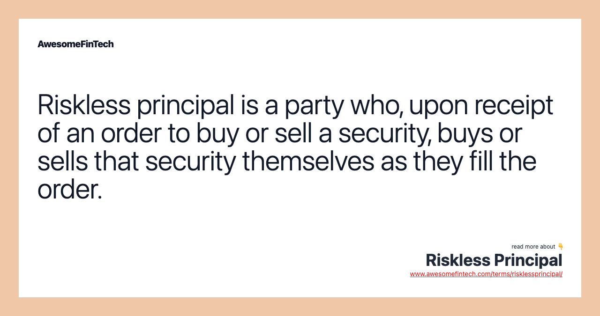

## Table of Contents

## What is a riskless principal transaction?

A riskless principal transaction is a type of trade where a broker buys a security from a dealer and immediately sells it to a customer. The broker doesn't keep the security but acts as a middleman. The goal is to make the trade without taking any risk. The price the customer pays includes the broker's fee.

This kind of transaction is important because it helps brokers serve their clients quickly. If a customer wants to buy a stock, the broker can get it from a dealer and pass it on right away. This is different from other trades where the broker might hold the security for a while and face price changes. In a riskless principal transaction, the broker avoids this risk by completing the buy and sell almost at the same time.

## How does the NASD Notice relate to riskless principal transactions?

The NASD Notice to Members 99-93 talks about how brokers should handle riskless principal transactions. It says that when a broker does a riskless principal trade, they need to report it in a special way. This means they have to show the price they paid for the security and the price they sold it for, including their fee. This helps keep things clear and fair for everyone.

The notice also says that brokers need to keep good records of these trades. They should be able to show that the buy and sell happened at the same time, so they really didn't take any risk. This is important because it helps make sure that brokers are following the rules and not hiding any risks they might be taking.

## What are the key components of a riskless principal trade?

A riskless principal trade happens when a broker buys a security from a dealer and then quickly sells it to a customer. The broker acts like a middleman and doesn't keep the security. The key part is that the broker does not take any risk because they buy and sell the security almost at the same time. The customer pays a price that includes the broker's fee, which is how the broker makes money.

To make sure everything is clear and fair, the broker has to report the trade in a special way. They need to show the price they paid for the security and the price they sold it for, including their fee. This helps everyone see that the broker did not take any risk. Also, the broker needs to keep good records to prove that the buy and sell happened at the same time. This is important for following the rules and keeping the trade honest.

## What are the regulatory requirements for executing riskless principal transactions?

When a broker does a riskless principal trade, they have to follow some rules set by the regulators. The main rule is that they need to report the trade in a special way. This means they have to show the price they paid for the security and the price they sold it for, including their fee. This helps everyone see that the broker did not take any risk during the trade. The broker also needs to make sure that the buy and sell happen at the same time, so they can prove they did not hold onto the security and face any price changes.

Another important rule is that brokers need to keep good records of these trades. They should be able to show that the buy and sell happened almost at the same time, which proves they did not take any risk. Keeping good records is important because it helps regulators check that brokers are following the rules and not hiding any risks they might be taking. This makes the whole process clear and fair for everyone involved.

## How does the NASD Notice impact the reporting of riskless principal transactions?

The NASD Notice to Members 99-93 tells brokers how they should report riskless principal transactions. It says that brokers need to show the price they paid for a security and the price they sold it for, including their fee. This way, everyone can see that the broker did not take any risk because they bought and sold the security almost at the same time. This helps keep everything clear and fair for the customers and the regulators.

The notice also says that brokers need to keep good records of these trades. They should be able to prove that the buy and sell happened at the same time, so they really did not take any risk. This is important because it helps regulators check that brokers are following the rules and not hiding any risks they might be taking. By doing this, the NASD Notice makes sure that riskless principal transactions are done the right way and everyone can trust the process.

## Can you explain the difference between a riskless principal and an agency transaction?

A riskless principal transaction is when a broker buys a security from a dealer and then quickly sells it to a customer. The broker acts like a middleman and doesn't keep the security. The key part is that the broker does not take any risk because they buy and sell the security almost at the same time. The customer pays a price that includes the broker's fee, which is how the broker makes money.

An agency transaction is different. In this case, the broker acts as an agent for the customer and does not buy the security themselves. Instead, they find a seller for the customer and help them buy the security directly from that seller. The broker earns a commission for helping with the trade but does not take any ownership of the security. The main difference is that in an agency transaction, the broker does not take any risk because they never own the security, while in a riskless principal transaction, the broker briefly owns the security but sells it right away to avoid risk.

## What are the common challenges faced by firms when complying with NASD Notice requirements?

Firms often find it hard to comply with the NASD Notice requirements because they need to report trades in a very specific way. They have to show the price they paid for a security and the price they sold it for, including their fee. This can be tricky because they need to make sure all the numbers are right and match up with the records. If there's a mistake, it could cause problems with regulators and make the firm look like it's not following the rules.

Another challenge is keeping good records. Firms need to prove that they bought and sold the security at the same time, so they didn't take any risk. This means they have to keep track of everything very carefully. It can be hard to do this all the time, especially if the firm does a lot of trades. If they don't keep good records, it can be tough to show that they followed the rules, and this can lead to trouble with regulators.

## How do firms typically document and report riskless principal transactions to meet NASD standards?

Firms usually keep detailed records to show they did riskless principal trades the right way. They write down the exact time they bought the security from a dealer and the exact time they sold it to a customer. They also keep track of the prices they paid and the prices they sold for, including their fee. This helps them prove that they bought and sold the security at the same time, so they did not take any risk. They use special computer systems to keep all these records neat and easy to check.

When it's time to report these trades, firms follow the NASD rules carefully. They fill out special forms that show the price they paid for the security and the price they sold it for, including their fee. They send these forms to the regulators to show that they did everything the right way. By doing this, they make sure everyone can see that the trades were fair and that they followed all the rules.

## What are the potential penalties for non-compliance with NASD Notice regarding riskless principal transactions?

If a firm does not follow the NASD Notice rules for riskless principal transactions, they could face some serious penalties. These might include fines from the regulators. The fines can be big, depending on how bad the mistake was and how often it happened. The firm might also get a warning or a note on their record, which can make it harder for them to do business in the future.

Another possible penalty is that the firm could lose their license to do trades. This would be a big problem because it would stop them from making money. Regulators might also make the firm fix any mistakes they made and pay back any money they got unfairly. All of these penalties can hurt the firm's business and reputation, so it's important for them to follow the rules carefully.

## How has the interpretation of NASD Notice evolved over time in relation to riskless principal trades?

Over time, the way people understand the NASD Notice about riskless principal trades has changed a bit. At first, the main focus was on making sure brokers reported the trades correctly and kept good records. They had to show the price they paid for a security and the price they sold it for, including their fee. This was to make sure everyone could see that the broker did not take any risk because they bought and sold the security almost at the same time.

As time went on, regulators started to look more closely at how firms were keeping their records. They wanted to make sure that the records were not just good enough but were very clear and detailed. This meant firms had to be even more careful about writing down the exact times of the buy and sell and making sure all the numbers matched up. The goal was to keep everything fair and honest, and to make sure firms were really following the rules the right way.

## What advanced strategies can firms employ to optimize their riskless principal transactions within the NASD framework?

Firms can use special computer systems to make their riskless principal trades better and follow the NASD rules more easily. These systems can keep track of the exact times when they buy and sell securities, making sure they do it at the same time to avoid any risk. They can also help make sure the numbers are right and match up with the records. By using these systems, firms can report their trades quickly and correctly, which helps them stay out of trouble with the regulators.

Another way firms can optimize their trades is by training their workers well. When everyone knows the rules and how to follow them, it's easier to do the trades the right way. Firms can have regular meetings and classes to teach their workers about the NASD Notice and how to keep good records. This helps make sure that everyone does their job correctly and that the firm stays compliant with the rules. By doing these things, firms can make their riskless principal transactions smoother and more efficient.

## How do technological advancements assist in ensuring compliance with NASD Notice for riskless principal transactions?

Technological advancements help firms follow the NASD Notice rules for riskless principal transactions by using special computer systems. These systems keep track of the exact times when firms buy and sell securities, making sure they do it at the same time to avoid any risk. They also help make sure all the numbers are right and match up with the records. By using these systems, firms can report their trades quickly and correctly, which helps them stay out of trouble with the regulators. The systems can also alert firms if something looks wrong, so they can fix it before it becomes a big problem.

Another way technology helps is by making it easier to keep good records. Firms can use software that automatically saves all the details of their trades, including the prices they paid and sold for, and their fees. This makes it simple for firms to show that they followed the rules if regulators come to check. Technology also lets firms train their workers better. They can use online classes and tools to teach everyone about the NASD Notice and how to keep good records. This helps make sure that everyone does their job correctly and that the firm stays compliant with the rules.

## References & Further Reading

[1]: ["NASD Notice to Members 99-65"](https://www.finra.org/rules-guidance/notices/99-65) - FINRA website detailing guidelines for riskless principal transactions.

[2]: ["NASD Notice to Members 00-79"](https://www.finra.org/rules-guidance/notices/00-79) - FINRA notice outlining disclosure requirements for markups and markdowns.

[3]: ["Algorithmic Trading and DMA: An introduction to Direct Access Trading Strategies"](https://www.amazon.com/Algorithmic-Trading-DMA-introduction-strategies/dp/0956399207) by Barry Johnson - A book discussing various algorithmic trading strategies, including the role of riskless principal trades.

[4]: ["Securities Dealers and FINRA: An Overview"](https://en.wikipedia.org/wiki/Financial_Industry_Regulatory_Authority) - Investopedia article providing an overview of the Financial Industry Regulatory Authority and its role in the securities market.