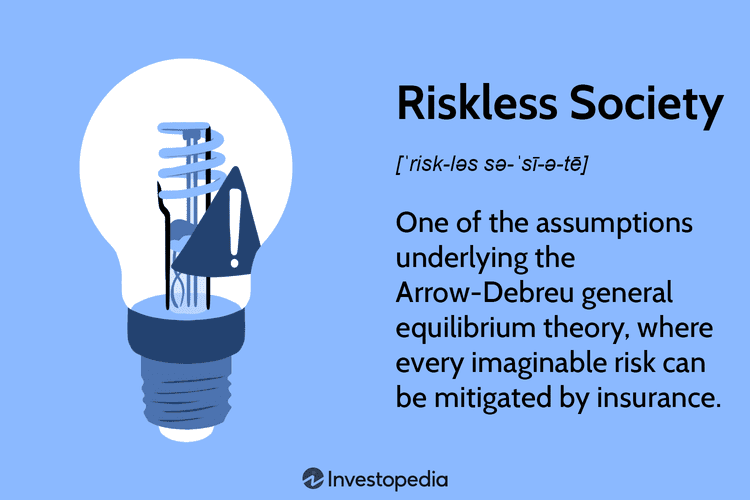

The concept of a 'riskless society' has captured the imagination of economists and policy-makers, who envision an ideal state where all conceivable risks are managed or entirely eliminated. This idea is appealing largely due to the potential stability and security it promises, allowing for economic and social environments devoid of uncertainty. However, the practicality and actual impact of such a vision have been significantly criticized. Critics argue that not only is a completely riskless society unfeasible, but the very attempt to eliminate all risks may lead to unintended consequences and systemic vulnerabilities.

In the pursuit of a riskless society, one might anticipate the extensive use of risk management tools and techniques. Indeed, risk management represents a crucial aspect of modern economic strategies, aiming to identify, assess, and prioritize risks, followed by the application of resources to minimize or control the likelihood and impact of unforeseen events. Despite these efforts, the idea of completely eliminating risk remains controversial. The variability and unpredictability inherent in economic systems and human behavior inherently limit the extent to which risks can be managed.

This article explores what constitutes a riskless society, examining its criticisms and implications on social risk management and algorithmic trading. The parallels between algorithmic trading, a field keenly focused on minimizing financial risk, and the broader economic theories concerning risk, highlight the challenges and limitations of pursuing a risk-free environment. By analyzing these areas, the discussion aims to shed light on how society grapples with the balance between managing risks and embracing the uncertainties that are an intrinsic part of human life.

## Table of Contents

## Understanding a Riskless Society

The concept of a riskless society finds its roots in the Arrow-Debreu model, a fundamental construct in economic theory. This model, developed by Kenneth Arrow and Gerard Debreu in the 1950s, provides a framework for understanding a world where every conceivable risk can be insured, hence supporting a perfectly competitive market in general equilibrium. The Arrow-Debreu model postulates a complete system of markets, including futures markets for all goods under all conditions. In such an environment, individuals and firms can hedge against future uncertainties perfectly, thereby eliminating economic risk as a decision-making [factor](/wiki/factor-investing).

In a hypothetical riskless society, risks would ostensibly be regulated or replaced by market solutions and sophisticated financial instruments. For instance, derivatives like options and futures could theoretically cover every possible eventuality, allowing individuals and organizations to engage in trades that neutralize risk entirely. Such markets would be capable of pricing all risks accurately, ensuring that any potential adverse outcome has been accounted for and mitigated through insurance or other financial products.

The theoretical benefits of a riskless society are significant. It proposes an environment where resources are allocated efficiently because all participants can make decisions without needing to account for risk contingencies. This would lead to an optimal allocation of resources, maximizing social welfare as envisioned in the general equilibrium theory. In such a society, the stability and predictability of economic outcomes would likely foster growth and innovation, as uncertainty, a significant barrier to investment, is removed.

However, critics often highlight that this model serves more as an idealized abstraction rather than a practical representation of market function. Real-world markets are characterized by imperfections such as transaction costs, information asymmetries, and behavioral biases that deviate from the assumptions underpinning the Arrow-Debreu model. Thus, while the notion of a riskless society serves as a valuable theoretical construct aiding the understanding of market efficiencies, the practical implementation remains largely elusive. 

Furthermore, the assumption that every risk can be insured ignores the complexity and dynamism inherent in economic systems, where new, unforeseen risks can emerge, challenging the resilience of such a model. Thus, while the concept of a riskless society offers insight into potential efficiencies within financial markets, it is often critiqued for its lack of real-world applicability and the challenges in reconciling theory with the inherent unpredictability of economic life.

## Criticism of a Riskless Society

Critics of the concept of a riskless society often point to the disconnect between this theoretical model and the complex realities of the global economy. Empirical economic data consistently demonstrate that markets are heavily influenced by both human behavior and unexpected events, factors that are not easily mitigated through theoretical constructs or financial instruments. Behavioral finance, a field that studies the effects of psychological influences on market outcomes, underscores this point by illustrating how investor emotions can lead to irrational decision-making, causing market [volatility](/wiki/volatility-trading-strategies) that defies predictions. 

The 2008 financial crisis serves as a stark example of how attempting to manage all risks can result in overcomplexity and systemic failures. In the years leading up to the crisis, the excessive reliance on complex financial instruments, such as mortgage-backed securities and credit default swaps, was believed to diffuse risk across the global financial system. However, these tools' interdependencies and opaque nature led to unforeseen vulnerabilities, ultimately triggering a catastrophic collapse.

A riskless society could inadvertently elevate long-term risks by fostering an over-reliance on similar financial instruments intended to mitigate every conceivable threat. This reliance may create a false sense of security, leading to complacency and inadequate preparation for unpredictable, high-impact scenarios. 

The ongoing debate surrounding a riskless society involves evaluating the practicality and desirability of such a model. While some argue that complete risk elimination is inherently flawed, it still serves as a useful framework for enhancing our understanding of risk management. This critique emphasizes that while reducing risk is crucial, embracing some level of inherent uncertainty is necessary for fostering resilient and adaptive systems.

## Social Risk Management and Regulation

The concept of a 'riskless society' extends beyond theoretical economic models and influences the domain of social risk management and regulatory practices. Governments worldwide have long grappled with devising policies and regulations to diminish risks and enhance societal safety. This endeavor finds expression in various legislative measures, such as environmental protection laws, workplace safety standards, and public health regulations, all designed to shield citizens from potential hazards and foster more secure environments.

For instance, environmental laws aim to reduce risks associated with pollution and unsustainable resource usage, ultimately striving for ecological balance and public health safety. Workplace safety regulations, implemented through standards like OSHA (Occupational Safety and Health Administration) in the United States, endeavor to protect workers from occupational hazards by mandating safety practices and enforcing compliance.

However, the pursuit of a society devoid of risk through stringent regulations brings forth criticism, particularly concerning issues of personal freedom and economic implications. Critics argue that excessive regulation can infringe on individual liberties and stifle innovation, leading to diminished competitiveness and economic growth. This critique emphasizes that while regulations are essential for managing risk, overregulation may paradoxically engender new challenges by imposing bureaucratic burdens and hindering adaptive responses to unforeseen circumstances.

Efforts to create a safer society also spark debates about the efficacy of regulations in eliminating risk. A primary concern is that absolute safety or a ‘riskless society’ may remain an unattainable ideal. Despite thorough regulatory frameworks, not all risks can be predicted or maintained, as the dynamic nature of societal and environmental factors introduces levels of unpredictability that no amount of regulation can fully control.

The balance between essential risk management and avoiding excessive regulatory impositions is crucial. Governments and policymakers are thus tasked with navigating complex trade-offs, ensuring that regulations effectively mitigate risks without encroaching on vital economic activities or individual rights. This nuanced approach involves regular assessments of regulatory impacts, stakeholder engagement in policy-making processes, and adaptiveness to emerging risks and challenges.

## Algorithmic Trading: A Modern Parallel

Algorithmic trading represents a significant advancement in the financial industry, allowing for rapid transaction execution and potentially reducing certain types of financial risks through precise and automated decision-making processes. At its core, [algorithmic trading](/wiki/algorithmic-trading) uses pre-set rules and mathematical models to execute orders in financial markets at speeds and volumes that are impossible for human traders to achieve.

The primary advantage of algorithmic trading lies in its ability to capitalize on momentary market inefficiencies, effectively reducing some risks associated with slower, human-driven trading. Algorithms are designed to analyze vast amounts of data and identify optimal trading opportunities within milliseconds, theoretically enhancing market efficiency.

Despite these benefits, algorithmic trading does not eliminate all market risks. One of the most notable events highlighting the vulnerabilities of such systems is the 2010 Flash Crash. On May 6, 2010, the U.S. stock market experienced a severe disruption, with the Dow Jones Industrial Average plummeting about 1,000 points in mere minutes, only to recover most of the loss within the same day. Investigations revealed that a large order executed by an algorithm inadvertently led to a feedback loop with other algorithms, resulting in extreme volatility. This incident demonstrated that even sophisticated trading systems could contribute to systemic risks and market instability, challenging the notion of a riskless environment.

Algorithmic trading models often assume that past market data can reliably predict future conditions, a premise criticized in the context of a riskless society. The complexity of financial markets, influenced by myriad unpredictable factors such as geopolitical events or sudden shifts in investor sentiment, frequently defies these assumptions. Moreover, reliance on algorithmic trading can contribute to herding behavior, where multiple algorithms, trained on similar data sets, make uniform decisions, potentially exacerbating market swings.

The principles of a riskless society, aimed at the complete eradication of risk, find criticism in the realm of algorithmic trading due to the inherent unpredictability of market dynamics. While algorithms enhance efficiency and certain controls, they introduce new risks that arise from technological complexities, such as software bugs, data inaccuracies, and cybersecurity threats. Thus, traders and regulators must focus not solely on minimizing risks through technological advancements but also on building robust systems capable of handling unforeseen challenges.

In conclusion, while algorithmic trading adopts some theoretical ideals of a riskless society by seeking to mitigate specific market risks, it exposes the financial system to new forms of risk. Acknowledging and managing these evolving challenges is crucial for maintaining the integrity and stability of financial markets in an increasingly automated era.

## Conclusion

The concept of a riskless society remains an intriguing yet elusive goal within economic theory and policy-making. At its core, it embodies a vision where all forms of risk—be they financial, societal, or environmental—are anticipated and managed with precision. Such an idea, ambitious as it may be, serves more as a guiding principle rather than a feasible end state. Despite advances in risk management strategies and technologies, the complete eradication of risk is far from attainable. Rather, acknowledging this limitation can drive improvements in how risks are approached and regulated.

Algorithmic trading is a prime example where the pursuit of risk minimization meets the challenge of inherent market uncertainties. Algorithms can process vast amounts of data at unprecedented speeds, potentially reducing specific types of risk. However, events like the 2010 Flash Crash demonstrate the limitations of this technology. Market risks, often stemming from human behaviors and unforeseen dynamics, resist elimination. Thus, the financial sector continually strives to strike a balance between mitigating risk through technological means and understanding the unpredictable nature of markets.

The broader discourse on a riskless society encourages a reevaluation of how risks are managed across various sectors. Rather than the impossible task of eradicating risks entirely, focus shifts to enhancing resilience and adaptability. This involves crafting regulations, deploying technology, and promoting practices that aim to buffer the impact of risks while recognizing the role they play in driving innovation and growth. Ultimately, this perspective fosters a more realistic and pragmatic approach to the complexities that define human society, leading to more robust structures capable of withstanding the unpredictable tides of change.

## References & Further Reading

[1]: Arrow, K. J., & Debreu, G. (1954). ["Existence of an Equilibrium for a Competitive Economy."](https://web.stanford.edu/class/msande314/arrow-debreu.pdf) Econometrica, 22(3), 265-290.

[2]: Hull, J. C. (2017). ["Options, Futures, and Other Derivatives."](https://www.semanticscholar.org/paper/Options%2C-Futures%2C-and-Other-Derivatives-Hull/89bdee500c8623864fc9eb7a471546aa713acc44) Pearson Education.

[3]: The Economist. (2009). ["The Origins of the Financial Crisis: Crash Course."](https://www.economist.com/schools-brief/2013/09/07/crash-course)

[4]: Shiller, R. J. (2005). ["Irrational Exuberance."](https://www.jstor.org/stable/j.ctt7st4s) Princeton University Press.

[5]: Mandelbrot, B., & Hudson, R. L. (2004). ["The (Mis)Behavior of Markets: A Fractal View of Risk, Ruin, and Reward."](https://archive.org/details/misbehaviorofmar0000mand) Basic Books.

[6]: U.S. Securities and Exchange Commission. (2010). ["Findings Regarding the Market Events of May 6, 2010."](https://www.sec.gov/news/studies/2010/marketevents-report.pdf) 

[7]: Kahneman, D. (2013). ["Thinking, Fast and Slow."](https://www.amazon.com/Thinking-Fast-Slow-Daniel-Kahneman/dp/0374533555) Farrar, Straus and Giroux.

[8]: Haldane, A. G. (2009). ["Rethinking the Financial Network."](https://www.bankofengland.co.uk/speech/2009/rethinking-the-financial-network) Speech at the Financial Student Association, Amsterdam. Bank of England.