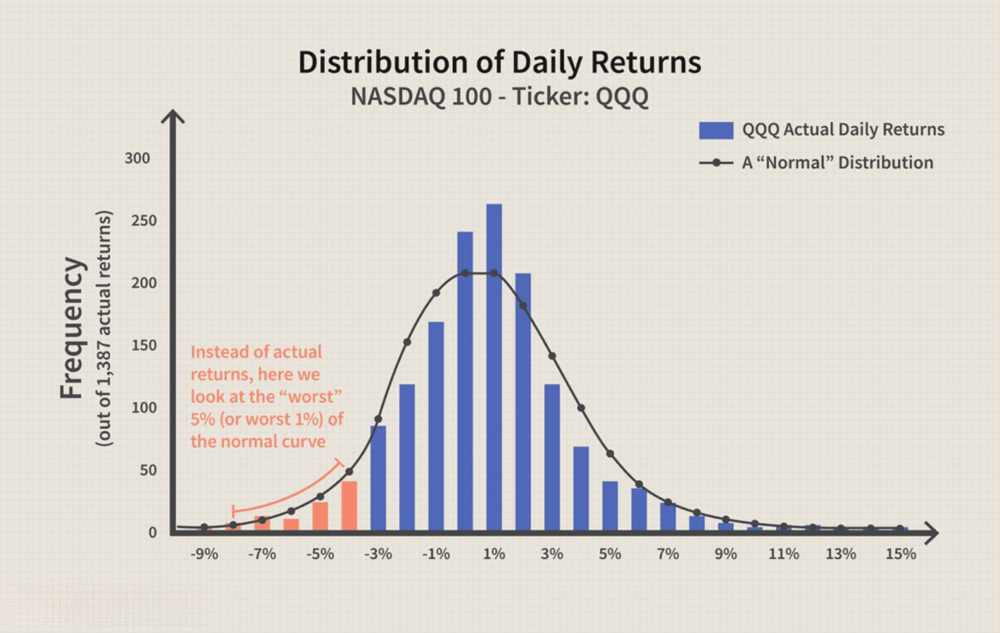

Value at Risk (VaR) plays a crucial role in financial markets as a risk management tool, offering a quantitative assessment of potential losses an investment portfolio might incur. It provides investors and financial institutions with an estimate grounded in historical data to anticipate potential risks and manage their exposure more effectively. By setting a confidence level, VaR helps in understanding the worst-case loss scenario within a specified timeframe under normal market conditions.

The RiskMetrics VaR methodology, developed by J.P. Morgan, represents a significant advancement in the field of risk management. Introduced to enhance transparency, it uses statistical models to improve the estimation of market risk, offering a clear framework for identifying and quantifying potential hazards in asset portfolios. RiskMetrics focuses on using volatility and correlation data to refine the accuracy of these risk projections.



In algorithmic trading, the application of RiskMetrics VaR methodology is particularly beneficial. Algorithmic trading systems require rigorous risk management strategies to minimize potential financial losses. By utilizing VaR, traders can assess the risk associated with various trading strategies and adjust their algorithms to optimize performance while maintaining a defined risk level. This article investigates how RiskMetrics VaR is applied within algorithmic trading contexts, underlining its effectiveness in managing and mitigating market risks efficiently.

## Table of Contents

## Understanding Value at Risk (VaR)

Value at Risk (VaR) is a statistical measure used to estimate the potential loss in value of a portfolio over a defined period for a given confidence interval. It is a vital tool in risk management, helping financial institutions to quantify and manage the level of financial risk they are exposed to. For example, a one-day VaR at a 95% confidence level of $1 million implies that there is a 5% chance that the portfolio will lose more than $1 million in a single day.

Globally, banks and financial institutions employ VaR to meet regulatory requirements and to optimize risk-adjusted returns. Regulators like the Basel Committee on Banking Supervision (BCBS) use VaR in determining capital reserve requirements under the Basel Accords, thereby influencing how much capital banks must hold against potential losses.

The calculation of VaR commonly involves several assumptions. First, it presumes normality of returns, meaning that asset returns are normally distributed. This assumption simplifies the mathematical modeling but may not always align with real-world data where returns often exhibit fat tails, leading to underestimation of risk in turbulent markets.

Second, VaR calculations assume standard market conditions, meaning they rely on historical data and past market behavior to predict future risk. This reliance on historical data can be a limitation during periods of structural change in the markets, where past data may not accurately forecast future risks.

Mathematically, VaR can be expressed as:

$$
\text{VaR}_{\alpha} = -\mu + Z_{\alpha} \times \sigma
$$

Where:
- $\mu$ is the expected return of the portfolio,
- $\sigma$ is the standard deviation of returns,
- $Z_{\alpha}$ is the Z-score corresponding to the desired confidence level $\alpha$.

In Python, a simple VaR calculation for a normally distributed portfolio can be implemented as follows:

```python
import numpy as np
from scipy.stats import norm

def calculate_var(portfolio_mean, portfolio_std, confidence_level):
    z_score = norm.ppf(confidence_level)
    var = -portfolio_mean + z_score * portfolio_std
    return var

# Example parameters
mean_return = 0.001  # Expected portfolio return
std_deviation = 0.02  # Standard deviation of portfolio returns
confidence = 0.95  # Desired confidence level

# Calculate VaR
value_at_risk = calculate_var(mean_return, std_deviation, confidence)
print("Value at Risk (VaR):", value_at_risk)
```

This Python code leverages the `scipy.stats.norm` function to determine the Z-score for the specified confidence level, allowing for the calculation of VaR. By understanding the fundamental aspects of VaR, financial professionals can better manage and mitigate the risks inherent in their portfolios.

## RiskMetrics VaR Methodology

RiskMetrics, developed by J.P. Morgan in the mid-1990s, is a methodology for calculating Value at Risk (VaR), which leverages [volatility](/wiki/volatility-trading-strategies) and correlation data to estimate the potential downside risk of a portfolio. The RiskMetrics approach assumes that asset returns are normally distributed, allowing financial institutions to quantify the level of risk held within their portfolios more transparently and efficiently.

At the core of the RiskMetrics VaR method is the use of a variance-covariance matrix, which captures the volatilities and correlations of the assets in the portfolio. This matrix is fundamental for calculating the portfolio variance, a critical component in the VaR calculation. The formula to estimate the VaR for a portfolio using the variance-covariance method is given by:

$$
\text{VaR} = Z \times \sigma_p
$$

where:
- $Z$ represents the Z-score corresponding to the desired confidence level (e.g., 1.65 for 95% confidence, 2.33 for 99% confidence),
- $\sigma_p$ is the standard deviation of the portfolio, derived from the variance-covariance matrix.

The normal distribution assumption simplifies the VaR computation, enabling straightforward application to diverse portfolios under standard market conditions. This assumption facilitates the calculation using linear algebra techniques, ensuring that financial institutions can efficiently implement risk management practices.

RiskMetrics’ reliance on the normal distribution implies that extreme events or "fat tails" present in actual market returns might not be accurately captured. Despite this limitation, its transparency and ease of application have led to widespread adoption across global financial markets. It allows financial professionals to systematically quantify market hazards and integrate these metrics into their risk management frameworks.

This methodology benefits from its adaptability to various trading environments, though practitioners must remain aware of its assumptions, particularly in volatile or non-normal market scenarios. Adjustments such as accounting for skewness and kurtosis or employing supplementary measures like stress testing are often necessary to ensure comprehensive risk assessment.

## Application in Algorithmic Trading

Algorithmic trading, characterized by the use of computer algorithms to automate trading decisions, necessitates precise and robust risk management practices. This precision is critical as these algorithms operate at high speed and volumes, exposing traders to increased market and operational risks. RiskMetrics VaR provides a systematic approach to quantify and manage these risks effectively. By estimating the maximum potential loss of an investment portfolio with a specified confidence level over a particular timeframe, VaR helps algorithmic traders set appropriate risk limits and hedge against adverse market movements.

Employing RiskMetrics VaR allows traders to tailor risk management across diverse algorithmic strategies, each with unique time horizons and risk profiles. For instance, a high-frequency trading algorithm, which executes hundreds of trades per second, might seek to minimize intra-day volatility through a short-term VaR model. Conversely, a trend-following algorithm, which holds positions over several days or weeks, might employ a longer-term VaR model to capture potential risks over extended periods.

The adaptability of VaR in [algorithmic trading](/wiki/algorithmic-trading) is enhanced by its ability to incorporate different asset classes and geographical markets into its calculations. This integration is facilitated by the RiskMetrics model, which utilizes a variance-covariance matrix to compute the portfolio’s potential losses based on the volatilities and correlations of individual assets. Such a detailed risk quantification encourages strategic diversification, reducing idiosyncratic risk and stabilizing returns.

To illustrate the application in algorithmic trading, consider a sample Python code for calculating VaR using the variance-covariance method:

```python
import numpy as np
import scipy.stats as stats

def calculate_var(portfolio_value, mean_return, volatility, confidence_level=0.95):
    # Determine the z-score for the specified confidence level
    z_score = stats.norm.ppf(confidence_level)

    # Calculate the potential loss using the VaR formula
    potential_loss = portfolio_value * (mean_return - z_score * volatility)

    return potential_loss

# Example usage:
portfolio_value = 1_000_000  # portfolio value in dollars
mean_return = 0.001  # mean daily return
volatility = 0.02  # daily volatility
var_95 = calculate_var(portfolio_value, mean_return, volatility)
print(f"Value at Risk (95% confidence): ${var_95:.2f}")
```

In this code, the z-score translates the confidence level into a quantifiable risk metric, enabling traders to gauge their exposure under standard market conditions. VaR's integration within algorithmic trading thus empowers traders with a rigorous framework to mitigate potential capital losses, adapting dynamically to varied algorithmic strategies and market environments. However, traders must recognize VaR's limitations and supplement it with complementary risk management practices to ensure comprehensive protection against unforeseen market events.

## Advantages and Limitations of VaR

Value at Risk (VaR) is advantageous due to its straightforward computation and adaptability, making it suitable for diverse trading strategies. Its calculation generally involves basic statistical measures, making it accessible for financial analysts. Analysts can quickly determine the VaR of a portfolio by leveraging well-defined mathematical frameworks such as the variance-covariance method. This involves calculating the standard deviation and expected returns based on the normal distribution model, which simplifies the process. The formula is expressed as:

$$
\text{VaR} = \mu - Z \times \sigma
$$

where $\mu$ is the expected return, $\sigma$ is the standard deviation of the returns, and $Z$ is the Z-score corresponding to the confidence level.

However, VaR has notable limitations. One significant drawback is its reliance on historical data that may not accurately predict future risks, especially during abnormal market conditions. The assumption of normality in return distributions can fail to account for extreme events or tail risks, leading to an underestimation of potential losses. Such limitations become evident during financial crises when market conditions deviate significantly from historical norms.

Furthermore, VaR provides no information about the magnitude of losses exceeding the VaR threshold. It only measures potential losses up to a certain confidence level, leaving tail-end risks unexplored. This weakness necessitates augmenting VaR with other measures such as Expected Shortfall, which accounts for the average loss in scenarios where losses exceed the VaR estimate.

To overcome these limitations, VaR should be integrated into a broader risk management strategy that includes diversification and stress testing. Diversification involves spreading investments across various assets to reduce exposure to risk from any single asset. Stress testing, on the other hand, assesses how extreme circumstances could impact a portfolio, providing a more comprehensive risk overview beyond the assumptions of standard VaR calculations.

By blending VaR with a comprehensive risk management approach, traders and financial institutions can better navigate market uncertainties, continuously adapting to changing economic landscapes while managing potential capital losses effectively.

## Calculating VaR in Algorithmic Trading

Value at Risk (VaR) is a crucial metric in risk management that can be calculated using various methodologies, each with distinct assumptions and complexity levels. In algorithmic trading, automation and precision are paramount, making the choice of a VaR calculation method significant. 

The variance-covariance method, also known as the parametric method, simplifies VaR calculation by assuming that asset returns follow a normal distribution. This assumption allows analysts to apply statistical measures, such as the mean and standard deviation, to estimate potential losses. The VaR is computed using:

$$
VaR = Z \times \sigma \times \sqrt{T}
$$

where $Z$ is the Z-score corresponding to the desired confidence level, $\sigma$ is the standard deviation of portfolio returns, and $T$ represents the time period. This method is favored for its computational ease and ability to handle large portfolios quickly.

Alternatively, the Monte Carlo simulation represents a more flexible approach as it does not rely on the normality assumption. This method involves generating a large number of random scenarios for asset price movements, then calculating the portfolio's value under these scenarios to estimate potential losses. Despite its robustness and higher accuracy in capturing tail risks, the computational intensity can be a drawback.

The historical simulation method is another popular alternative, which utilizes actual historical returns data to simulate potential future losses. It requires no distributional assumptions, providing a realistic perspective on risk based on past market behaviors.

For algorithmic trading, implementing these methods efficiently in Python can significantly enhance risk estimation automation. Using libraries like SciPy in Python, one can streamline the process as follows:

```python
import numpy as np
from scipy.stats import norm

# Parameters
portfolio_value = 1000000  # example portfolio value
confidence_level = 0.95
daily_sigma = 0.02  # example daily standard deviation of returns
time_horizon = 1  # in days

# Variance-Covariance VaR
z_score = norm.ppf(confidence_level)
var = portfolio_value * z_score * daily_sigma * np.sqrt(time_horizon)

print(f"Variance-Covariance VaR: {var}")

# Historical Simulation (assuming a list of historical returns is available)
historical_returns = np.random.normal(0, daily_sigma, 1000)  # example data
historical_var = portfolio_value * np.percentile(historical_returns, (1-confidence_level)*100)

print(f"Historical Simulation VaR: {historical_var}")
```

In this code snippet, the `norm.ppf` function from SciPy is used to determine the Z-score, and pseudo-historical returns are simulated for the historical method example. Algorithmic traders can extend these scripts by using actual market data to enhance prediction accuracy and support strategic decision-making.

## Conclusion

RiskMetrics VaR is a pivotal tool in the landscape of algorithmic trading, providing a structured method to estimate potential losses under standard market conditions. This methodology, grounded in statistical analysis of market data, enables traders to quantify exposure and make informed decisions about risk management. By calculating the Value at Risk with a specified confidence level and time horizon, traders can better prepare for unfavorable market movements and protect their capital.

Despite its utility, VaR is not without limitations. It assumes normal market conditions and normal distribution of returns, which can lead to underestimation of risk during times of market volatility or black swan events. Additionally, VaR is inherently backward-looking, relying on historical data that may not capture future market dynamics or unforeseen events.

To address these limitations, integrating VaR with other risk management techniques can provide a more comprehensive approach. This includes diversification, stress testing, and the use of derivative instruments to hedge against potential losses. By employing a multifaceted strategy, traders can strengthen their resilience against market fluctuations and better safeguard their portfolios.

Furthermore, exploring advanced risk measures like Expected Shortfall (ES) can enhance the breadth of risk assessment. While VaR provides an estimate of the maximum loss over a given period, Expected Shortfall offers insight into the average loss beyond the VaR threshold. This allows traders to assess the severity of potential losses more accurately and formulate robust risk management strategies.

In conclusion, RiskMetrics VaR is an essential component of risk management in algorithmic trading. Its use, combined with a diverse array of supplementary techniques and advanced measures, can significantly bolster the resilience of trading strategies against diverse market conditions.

## References & Further Reading

[1]: Jorion, P. (2007). ["Value at Risk: The New Benchmark for Managing Financial Risk."](https://link.springer.com/article/10.1007/s11408-007-0057-3) McGraw-Hill.

[2]: Linsmeier, T. J., & Pearson, N. D. (2000). ["Value at Risk."](https://www.tandfonline.com/doi/abs/10.2469/faj.v56.n2.2343) Financial Analysts Journal, 56(2), 47-67.

[3]: Morgan, J. P. (1996). ["RiskMetrics Technical Document."](https://www.msci.com/documents/10199/5915b101-4206-4ba0-aee2-3449d5c7e95a) J.P. Morgan/Reuters.

[4]: Glasserman, P. (2004). ["Monte Carlo Methods in Financial Engineering."](https://link.springer.com/book/10.1007/978-0-387-21617-1) Springer.

[5]: Alexander, C. (2008). ["Market Risk Analysis Volume IV: Value at Risk Models."](https://pdfs.semanticscholar.org/afba/364297b19e15f646f9964a7f319225984fe9.pdf) Wiley.