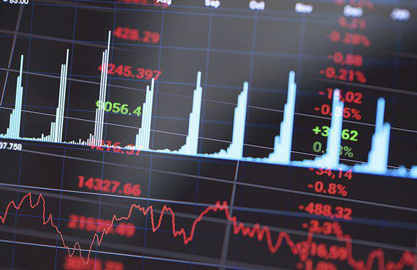

Algorithmic trading and high-frequency trading (HFT) have transformed the landscape of financial markets over recent decades, becoming influential mechanisms for executing trades with speed and precision. These technologically driven methods utilize advanced computer algorithms capable of processing vast quantities of data to execute trades in fractions of a second. The primary allure of algorithmic and HFT lies in their ability to enhance trading efficiency, reduce transaction costs, and capitalize on fleeting market opportunities that human traders might miss.

Despite their benefits, algorithmic trading and HFT present a complex array of challenges and risks. Their rapid and automated nature can exacerbate market volatility and amplify systemic risks, which was notably seen during events such as the Flash Crash of 2010. Errant algorithms and unethical practices, including spoofing, further contribute to the potential for significant financial disturbances.



Understanding and mitigating these risks is crucial for traders, investors, and financial institutions. A thorough grasp of the intricacies of algorithmic and HFT strategies enables market participants to manage their operations effectively, safeguard against potential losses, and preserve market integrity. As the financial sector continues to evolve, ongoing evaluation of these trading methods, along with adaptive regulatory frameworks, will be essential in balancing technological advancement and market stability.

## Table of Contents

## What Is Algorithmic and High-Frequency Trading?

Algorithmic trading refers to the use of computer algorithms to automate trading decisions and execute trades in financial markets. These algorithms are designed to determine optimal trading strategies by analyzing vast amounts of market data, seeking to identify trends, pricing inefficiencies, or arbitrage opportunities faster than human traders. High-frequency trading (HFT) is a subset of algorithmic trading that emphasizes executing a large number of trades at very high speeds. HFT firms typically hold positions for very short durations, often milliseconds or seconds.

The evolution of algorithmic trading is closely tied to technological advancements in computing and telecommunications. Initially, trading was primarily manual, conducted via telephones and trading floors, with decisions based largely on human judgment and intuition. As computer technology advanced, financial firms began developing sophisticated software to assist traders by automating repetitive tasks and enabling the analysis of market data in real-time.

Algorithmic and high-frequency trading became prominent in the late 20th century with the adoption of electronic trading platforms and exchanges. These systems facilitated the rapid transmission of trade orders and market data, enabling traders to operate with much greater speed and efficiency. The significance of algorithmic and HFT in modern financial markets cannot be overstated; they are responsible for the majority of trading volume across major exchanges. For example, it's estimated that as much as 70%-80% of equity trades in the U.S. are executed through algorithmic or high-frequency trading.

Unlike traditional trading methods, which rely heavily on manual decision-making and execution, [algorithmic trading](/wiki/algorithmic-trading) leverages pre-programmed strategies to make trade decisions devoid of human emotion. This can lead to more consistent and disciplined trading strategies. In traditional trading, a human trader manually analyzes market data and places orders, which inherently takes more time and can be subject to human error or emotional bias. Conversely, algorithmic trading employs quantitative models to evaluate market variables, such as price movements, trading [volume](/wiki/volume-trading-strategy), and historical data, to inform real-time decision-making.

Algorithmic trading strategies often incorporate statistical and mathematical models, as demonstrated in the Python snippet below, which illustrates a simple moving average crossover strategy:

```python
# Example of a moving average crossover strategy
import pandas as pd

# Assume 'data' is a DataFrame with a column 'close' for closing prices
def moving_average_crossover_strategy(data, short_window=40, long_window=100):
    data['short_mavg'] = data['close'].rolling(window=short_window, min_periods=1).mean()
    data['long_mavg'] = data['close'].rolling(window=long_window, min_periods=1).mean()

    # Generate signals
    data['signal'] = 0
    data['signal'][short_window:] = (data['short_mavg'][short_window:] > data['long_mavg'][short_window:]).astype(int)
    data['positions'] = data['signal'].diff()

    return data

# Example usage:
# data = pd.DataFrame({'close': closing_prices})
# result = moving_average_crossover_strategy(data)
```

[HFT](/wiki/high-frequency-trading-strategies) strategies often focus on exploiting minute market inefficiencies, high bid-ask spreads, or latency advantages. While highly profitable, both algorithmic and HFT pose significant challenges, such as increased market complexity, potential systemic risks, and regulatory scrutiny. Understanding these intricacies is essential for market participants aiming to navigate the rapidly evolving financial landscape.

## Systemic Risks in Algorithmic HFT

Algorithmic trading and high-frequency trading (HFT) facilitate rapid executions of trades using computer algorithms, significantly increasing the speed at which financial transactions occur across global markets. While these technologies present opportunities for efficiency and [liquidity](/wiki/liquidity-risk-premium), they also introduce systemic risks. One key risk is the amplification of systemic shocks through interlinked financial markets. With HFT, a disruption in one market can quickly transmit to others, given the interconnections and synchronization of trading activities.

The concept of market inter-linkages, crucial in these discussions, refers to the interconnected nature of financial markets, where the performance and condition of one market can influence another. This connectivity is facilitated by HFT through algorithms designed to operate across multiple markets simultaneously. Consequently, a disturbance in one market, such as a sharp price movement, can create a cascade of reactions across other markets, propagating shocks rapidly.

The Flash Crash of 2010 serves as a poignant example of such systemic risks posed by HFT. On May 6, 2010, the U.S. stock market experienced an unprecedented crash, where the Dow Jones Industrial Average plunged nearly 1,000 points within minutes, only to recover a significant portion shortly after. Investigations revealed that algorithmic trading played a critical role in exacerbating this event. A large order to sell e-mini futures contracts by a mutual fund company triggered a cascade of automated selling by various HFT algorithms. These algorithms, designed to capitalize on minute price movements, began a series of rapid trades that flooded the market, overwhelming liquidity and amplifying the price decline. As liquidity providers withdrew, the selling pressure increased, highlighting the vulnerabilities in market infrastructure and inter-linkages.

The Flash Crash demonstrated that HFT could magnify systemic risks by transmitting localized disruptions through interconnected financial systems. This event underlined the potential for HFT activities to challenge market stability, necessitating measures to mitigate risks and safeguard financial market integrity.

## Errant Algorithms and Market Volatility

Errant algorithms in algorithmic and high-frequency trading (HFT) present significant risks, particularly due to their capacity for processing and executing large volumes of trades in microseconds. A notable example of these risks is the Knight Capital incident in August 2012, where a malfunctioning trading algorithm led to severe financial losses. Knight Capital deployed a flawed software code that resulted in the erroneous buying and selling of millions of shares over 45 minutes. This incident cost the firm approximately $440 million, eventually leading to its acquisition by another firm to avert bankruptcy. Such cases underscore how swiftly errant algorithms can cause catastrophic financial outcomes.

Algorithmic HFT can also exacerbate market [volatility](/wiki/volatility-trading-strategies) by facilitating rapid price fluctuations. High-frequency traders, operating with substantial leverage and speed, can move in and out of positions with remarkable velocity. This can lead to exaggerated price movements as they collectively react to market signals, often based on similar algorithms. These rapid and large-scale trades can be particularly destabilizing in markets that are already volatile, leading to increased uncertainty for other investors. As a result, market participants might struggle to discern stable trends, making informed investment decisions more challenging.

The activation of stop-loss orders during such volatile periods can create a negative feedback loop, exacerbating downward market spirals. A stop-loss order is designed to limit an investor's loss on a position by selling the asset when it reaches a certain price. However, in a highly volatile market fueled by algorithmic trading, stop-loss orders can be triggered en masse, leading to significant sell-offs. This can cause further price declines, triggering additional stop-loss orders across the market. The resultant selling pressure intensifies market downturns, escalating price volatility and uncertainty. This cascading effect can destabilize financial markets, making it crucial for traders and institutions to implement robust risk management strategies and develop algorithms that account for such scenarios.

## Unethical Practices in High-Frequency Trading

High-frequency trading (HFT), while providing significant liquidity and efficiency to financial markets, has been scrutinized for certain unethical practices that exploit the market. One predominant practice is spoofing, which involves placing large orders to buy or sell securities with the intent to cancel them before execution. This manipulates market prices and investor behavior, creating an illusion of demand or supply. The Dodd-Frank Act defines spoofing as "bidding or offering with the intent to cancel the bid or offer before execution,"[1] and regulators have imposed hefty fines on firms found engaging in this practice.

Spoofing can distort market [statistics](/wiki/bayesian-statistics) and lead to a lack of transparency, thereby undermining market integrity. By influencing the perceived market depth, investors and other market participants might make suboptimal trading decisions, affecting their confidence. For example, a trader might place an order for 1,000 shares of a stock they do not intend to purchase. Once market prices shift in response to this apparent demand, the trader cancels their order and simultaneously executed transactions that benefit from the artificially inflated prices.

Regulatory bodies like the U.S. Securities and Exchange Commission (SEC) have implemented measures to counter these practices. The Market Information Data Analytics System (MIDAS) is one such initiative. It collects and processes vast quantities of data to detect anomalous trading activities, including potential spoofing incidents. MIDAS allows the SEC to monitor high-frequency trading patterns with precision, aiding in the identification and prosecution of unethical trading practices[2].

The impact of these unethical practices extends beyond individual traders to the broader market environment. Market manipulation challenges the core tenets of fair trading and transparency, further eroding investor trust. When market participants perceive such irregularities as routine, it can lead to reduced participation and capital allocation inefficiencies.

Efforts to curb spoofing and other manipulative practices are essential to maintaining the credibility and integrity of financial markets. Regulatory interventions, improved surveillance systems, and punitive actions have worked to some extent, but the ever-evolving nature of algorithmic trading strategies requires continuous adaptation and vigilance. Balancing innovation with regulatory oversight is crucial to ensure that markets serve their intended purpose – facilitating genuine price discovery and efficient capital allocation.

---

### References
1. [U.S. Commodity Futures Trading Commission, Spoofing and Layering](https://www.cftc.gov/LawRegulation/DoddFrankAct/AntidisruptivePracticesRule.html)
2. [U.S. Securities and Exchange Commission, MIDAS: SEC’s Market Information Datas Analytics System](https://www.sec.gov/marketstructure/midas)

## Measures to Combat Algorithmic HFT Risks

Regulatory initiatives to mitigate the risks associated with algorithmic and high-frequency trading (HFT) have gained prominence in recent years due to their potential to disrupt financial markets. Measures such as circuit breakers and Nasdaq's "kill switch" have been introduced to curtail these risks and ensure stability.

### Circuit Breakers

Circuit breakers serve as a preventive mechanism to temporarily halt trading in the event of significant market declines. These systems are designed to cool off markets during extreme volatility by pausing trading, thus preventing panic-induced sell-offs. A notable implementation occurred after the Flash Crash of 2010, when the U.S. Securities and Exchange Commission (SEC) mandated market-wide circuit breakers. These consist of three levels, based on the S&P 500 Index drop by 7%, 13%, and 20%, resulting in trading halts of 15 minutes to the end of the trading day, depending on the severity of the drop.

### Nasdaq's Kill Switch

Another safeguard is Nasdaq's "kill switch," which allows trading firms to preemptively set parameters that automatically stop their trading activities once a certain risk threshold is crossed. This can prevent firms from incurring catastrophic losses due to errant algorithms executing unintended trades. Companies are empowered with the ability to quickly disconnect from the marketplace if their trading patterns show signs of instability or if they experience operational issues.

### International Regulatory Frameworks

Globally, the role of international regulations is crucial in mitigating algorithmic and HFT risks. For instance, the European Union introduced the Markets in Financial Instruments Directive II (MiFID II) in 2018, which imposes stringent requirements on algorithmic trading, such as the need for firms to have effective systems and controls, and to test algorithms under various scenarios. MiFID II also mandates the registration of high-frequency traders, increasing market transparency and accountability.

The International Organization of Securities Commissions (IOSCO) provides guidelines for regulators worldwide, promoting consistent standards and reducing [arbitrage](/wiki/arbitrage) opportunities across different jurisdictions. These regulatory measures enhance the resilience of financial markets by ensuring that safeguards are in place internationally to counteract the potential negative effects of high-frequency trading.

### Balancing Technology and Market Stability

The challenge for regulators and market participants is to strike a balance between leveraging technology's benefits and safeguarding market stability. While algorithmic and HFT contribute to market efficiency and liquidity, unchecked, they can lead to systemic risks. The introduction of technologies, such as [machine learning](/wiki/machine-learning) and [artificial intelligence](/wiki/ai-artificial-intelligence), raises new questions about reliability and oversight.

Market stability can be maintained by adopting comprehensive risk management strategies, including regular audits of algorithms, real-time monitoring, and stringent compliance checks. Collaboration between regulatory bodies, exchanges, and market participants is key to maintaining this equilibrium. As technology continues to evolve, a dynamic regulatory approach ensures that the potential of algorithmic and high-frequency trading can be harnessed without compromising the integrity of financial markets.

## The Future of Algorithmic and High-Frequency Trading

Algorithmic and high-frequency trading (HFT) are continually reshaping the financial markets. These trading methodologies are expected to experience significant growth, particularly in emerging markets where the adoption of advanced trading technologies is still in its nascent stages. As these regions develop, they present a fertile ground for the expansion of algorithmic strategies.

Technological advancements such as machine learning, artificial intelligence, and quantum computing are enhancing the capabilities of trading algorithms. These technologies enable algorithms to process vast datasets more efficiently, recognize complex patterns, and execute trades with minimal latency. Moreover, cloud computing and improved data bandwidth are facilitating real-time data processing and analysis, crucial for the success of HFT strategies. For example, algorithms can now integrate sentiment analysis from social media to anticipate market fluctuations.

Emerging technologies pose both opportunities and challenges for future trading strategies. The ability to leverage big data analytics can lead to more informed and accurate trading decisions, potentially increasing profitability. However, the complexity of these technologies requires significant investment in infrastructure and expertise, which could be a barrier for some firms.

Regulatory frameworks are also poised for change as authorities seek to address the risks associated with HFT. Stricter regulations may be introduced to ensure market stability and protect investor interests. Potential measures could include tighter controls on algorithmic transparency, systematic risk assessment protocols, and enhanced monitoring to prevent manipulative practices. These regulations could increase operational costs and compliance burdens for trading firms, potentially stifling smaller players who may not have the resources to adapt.

As the financial landscape evolves, there is also an increasing call for global regulatory harmonization. Cross-border trading and interconnected markets mean that unilateral changes in one jurisdiction can have international repercussions. Coordinated regulatory efforts could help in maintaining a level playing field and ensuring the stability of the global financial system.

In summary, while algorithmic and HFT have the potential to revolutionize trading, they require careful navigation of technological innovations and regulatory environments to be effectively harnessed. The future will likely see a blend of technological integration and strategic regulation, ensuring these methods contribute positively to market dynamics.

## Conclusion

Algorithmic and high-frequency trading (HFT) present a set of substantial risks for financial markets, primarily due to their potential to amplify systemic risks, escalate market volatility, and encourage unethical trading practices. Algorithmic and HFT strategies, which execute trades based on sophisticated algorithms at rapid speeds, can lead to unforeseen errors with significant financial repercussions. Events such as the Flash Crash of 2010 and the Knight Capital incident exemplify how errant algorithms and technical glitches can trigger cascading failures across markets, resulting in massive financial losses and heightened investor uncertainty.

Understanding these risks is essential to preserving market integrity and ensuring that financial systems operate smoothly. Mitigating these risks involves a combination of robust regulatory measures, such as the implementation of circuit breakers and surveillance systems like the SEC's MIDAS, along with the technological frameworks provided by exchanges, like Nasdaq's 'kill switch'. These tools help prevent extreme market movements and ensure a fair trading environment.

Continued dialogue and research are vital to adapting to the fast-evolving landscape of algorithmic and HFT. The financial community, including traders, regulators, and technologists, must work collaboratively to refine strategies and regulatory measures. This includes monitoring technological advancements and assessing their implications for future trading. By fostering an environment of awareness and proactive risk management, the industry can effectively balance the benefits of innovative trading technologies with the imperative to maintain market stability.

## References & Further Reading

[1]: Bergstra, J., Bardenet, R., Bengio, Y., & Kégl, B. (2011). ["Algorithms for Hyper-Parameter Optimization."](https://dl.acm.org/doi/10.5555/2986459.2986743) Advances in Neural Information Processing Systems 24.

[2]: ["Advances in Financial Machine Learning"](https://www.amazon.com/Advances-Financial-Machine-Learning-Marcos/dp/1119482089) by Marcos Lopez de Prado

[3]: ["Evidence-Based Technical Analysis: Applying the Scientific Method and Statistical Inference to Trading Signals"](https://www.amazon.com/Evidence-Based-Technical-Analysis-Scientific-Statistical/dp/0470008741) by David Aronson

[4]: ["Machine Learning for Algorithmic Trading"](https://github.com/stefan-jansen/machine-learning-for-trading) by Stefan Jansen

[5]: ["Quantitative Trading: How to Build Your Own Algorithmic Trading Business"](https://www.amazon.com/Quantitative-Trading-Build-Algorithmic-Business/dp/1119800064) by Ernest P. Chan