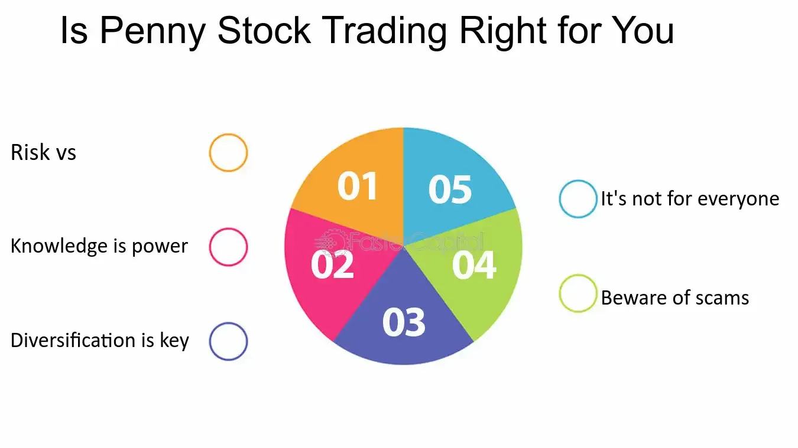

## Table of Contents

## What are penny stocks?

Penny stocks are stocks that trade at a very low price, usually less than a dollar. They are often from small companies that are just starting out or are not doing very well. Because they are cheap, some people think they can make a lot of money by buying them. But penny stocks can be risky because the companies might not have a lot of information available about them, and their stock prices can go up and down a lot.

Investing in penny stocks can be exciting because if the company does well, the stock price can go up a lot. But it's also easy to lose money because the companies can fail or the stock price can drop suddenly. It's important to do a lot of research before buying penny stocks and to only invest money that you can afford to lose. Many experts suggest that penny stocks are not a good choice for people who are new to investing.

## Why are penny stocks attractive to investors?

Penny stocks are attractive to investors because they are very cheap. You can buy a lot of shares for a little bit of money. This means if the stock price goes up even a little bit, you could make a big profit. For example, if you buy a stock for 10 cents and it goes up to 20 cents, you've doubled your money. This idea of making a lot of money quickly is what draws many people to penny stocks.

Another reason people like penny stocks is the excitement. The prices can change a lot in a short time, which can feel like a thrilling game. Some investors enjoy the challenge of finding the next big company before it becomes well-known. They think that if they pick the right penny stock, they could see huge returns. However, this excitement comes with a lot of risk, and many people end up losing money instead of making it.

## What are the potential rewards of investing in penny stocks?

Investing in penny stocks can lead to big rewards. If you pick the right company, the stock price could go up a lot. Since penny stocks are cheap, even a small increase in the price can mean a big return on your investment. For example, if you buy a stock for 10 cents and it goes up to 50 cents, you've made a lot of money. This is why some people like to take the risk with penny stocks; they hope to find the next big company before anyone else does.

Another reward is the excitement of the investment. Penny stocks can move a lot in a short time, which can feel like a fun game. If you enjoy following the stock market and trying to predict what will happen next, penny stocks can be very engaging. Some investors get a thrill from the challenge of finding a hidden gem among all the small companies. While this excitement is a big part of the appeal, it's important to remember that the risks are high, and you could lose money just as easily as you could make it.

## What are the common risks associated with penny stocks?

Penny stocks can be risky because they are from small companies that might not have a lot of money or a good business plan. These companies might not share much information about how they are doing, so it's hard to know if they are a good investment. Also, because penny stocks are cheap, they can be easy targets for people who want to trick others into buying them. These people might spread false information to make the stock price go up, and then sell their shares before the price drops again.

Another big risk is that penny stocks can go up and down a lot in price. This means you could lose a lot of money quickly if the stock price drops. It's hard to predict what will happen with penny stocks because they are not as stable as bigger, more established companies. If the company fails or runs into problems, the stock could become worthless. Because of these risks, many people think penny stocks are not a good choice for people who are new to investing or who can't afford to lose their money.

## How can beginners identify legitimate penny stock opportunities?

Beginners can identify legitimate penny stock opportunities by doing a lot of research. They should look for companies that have clear business plans and good financial reports. It's important to read news about the company and see what experts say about it. Websites like the Securities and Exchange Commission (SEC) can help you find information about the company's finances and any problems they might have. If a company is open about its business and shares a lot of information, it might be a good sign that it's a legitimate opportunity.

Another way to find good penny stocks is to look at the company's management team. If the people running the company have experience and a good track record, it could mean the company has a better chance of doing well. Beginners should also be careful of stocks that seem too good to be true. If someone is promising big returns with no risk, it's probably a scam. It's always a good idea to talk to a financial advisor before investing in penny stocks to make sure you understand the risks and are making a smart choice.

## What role does market volatility play in penny stock investments?

Market volatility means that prices can change a lot and quickly. For penny stocks, this is really important because their prices can go up and down even more than other stocks. When the market is volatile, penny stocks can be very exciting but also very risky. If you buy a penny stock and the market goes up, you might make a lot of money fast. But if the market goes down, you could lose a lot of money just as fast.

Because penny stocks are from small companies, they don't have as much money or as many customers as big companies. This makes them even more affected by market changes. When the market is volatile, it's harder to predict what will happen with penny stocks. So, if you're thinking about investing in penny stocks, you need to be ready for big ups and downs and understand that you could lose money. It's a good idea to only invest money that you can afford to lose and to do a lot of research before you buy.

## How does liquidity affect penny stock trading?

Liquidity means how easy it is to buy or sell a stock without changing its price too much. For penny stocks, liquidity can be a big problem. These stocks are often from small companies, so not many people are buying and selling them. This means if you want to sell your penny stocks, you might have to wait a long time to find someone who wants to buy them. Also, if you do find a buyer, you might have to sell your stocks for less money than you wanted because there aren't many people interested.

Because of low liquidity, penny stocks can be hard to trade. If a lot of people suddenly want to sell their penny stocks, the price can drop a lot because there aren't enough buyers. On the other hand, if a lot of people want to buy, the price can go up quickly. This makes penny stocks even more risky because their prices can change a lot. It's important to think about liquidity when you're deciding if penny stocks are right for you. If you need to get your money out quickly, penny stocks might not be a good choice.

## What are the regulatory concerns surrounding penny stocks?

Penny stocks can be risky because they are not watched as closely by the government as bigger stocks. The Securities and Exchange Commission (SEC) has rules to protect investors, but penny stocks can be harder to keep an eye on. Some people might try to trick others into buying penny stocks by spreading false information. This is called a "pump and dump" scheme, where they make the stock price go up and then sell their shares before the price drops again. The SEC tries to stop these schemes, but it can be hard because penny stocks are from small companies that don't have to share as much information.

Because of these risks, the government has special rules for penny stocks. For example, brokers have to give investors a lot of information before they can sell penny stocks. This is to make sure people understand the risks. Also, some penny stocks are traded on what's called the "pink sheets," which means they don't have to follow the same rules as stocks on bigger exchanges. This can make it even harder for the government to protect investors. So, if you're thinking about buying penny stocks, it's important to know about these regulatory concerns and be careful.

## How can investors mitigate risks when investing in penny stocks?

Investors can lower the risks of penny stocks by doing a lot of research before they buy. They should look for companies that share clear information about their business and money. Reading news and what experts say about the company can help too. Websites like the SEC can give you important details about the company's finances and any problems they might have. If a company is open and shares a lot of information, it might be a good sign that it's a safer investment. Also, talking to a financial advisor can help you understand the risks better and make smarter choices.

Another way to reduce risks is to only invest money that you can afford to lose. Penny stocks can go up and down a lot, so you need to be ready for that. It's also a good idea to spread your money out among different investments, not just penny stocks. This way, if one stock does badly, you won't lose all your money. Being patient and not trying to make quick money can help too. Remember, if something sounds too good to be true, it probably is. So, always be careful and take your time when thinking about buying penny stocks.

## What advanced strategies can experts use to maximize returns from penny stocks?

Experts can use a strategy called "momentum trading" to make money from penny stocks. This means they watch the stock prices closely and buy when they see the price starting to go up fast. They hope to sell the stock before the price goes down again. This can be risky because penny stocks can change a lot, but if they time it right, they can make a big profit. Experts also use technical analysis, which means they look at charts and patterns to guess where the stock price might go next. This helps them decide when to buy and sell.

Another strategy is to do a lot of research and find penny stocks that are undervalued. This means the stock price is lower than what the company is really worth. Experts look at the company's financial reports, business plans, and what's happening in the market to find these hidden gems. If they find a good company that's not well-known yet, they can buy the stock before other people do and make money when the price goes up. This takes a lot of time and knowledge, but it can lead to big rewards if they pick the right stocks.

## How do penny stocks fit into a diversified investment portfolio?

Penny stocks can be part of a diversified investment portfolio, but they should only be a small part. Diversifying means spreading your money across different types of investments, like stocks, bonds, and real estate. This helps lower your risk because if one investment does badly, the others might do well and balance it out. Penny stocks are very risky, so experts say you should only put a little bit of your money into them. This way, you can try to make money from them without risking too much.

When you include penny stocks in your portfolio, you need to be careful and do a lot of research. Look for companies that share a lot of information and have good business plans. It's also important to keep an eye on your investments and be ready to sell if the stock starts to do badly. By keeping penny stocks as a small part of your overall investments, you can enjoy the excitement of trying to find the next big company without putting all your money at risk.

## What are the long-term prospects and sustainability of investing in penny stocks?

Investing in penny stocks can be exciting, but it's hard to say if they are good for the long term. Penny stocks are from small companies that might not have a lot of money or a solid business plan. This means they can fail or go out of business, which would make your investment worthless. Also, because penny stocks are so risky, it's hard to predict what will happen to them over many years. If you want to invest for the long term, like saving for retirement, penny stocks might not be the best choice because they are not as stable as bigger, more established companies.

On the other hand, if you pick the right penny stock, it could grow into a big company over time. This means you could make a lot of money if you hold onto the stock for a long time. But finding these winners is very hard and takes a lot of research. Most penny stocks don't turn into big successes, so it's important to be careful and only invest money that you can afford to lose. If you do decide to invest in penny stocks for the long term, it's a good idea to keep them as a small part of your overall investment plan to lower your risk.

## References & Further Reading

[1]: ["Investing in Penny Stocks: A Guide"](https://www.marketbeat.com/learn/how-to-start-investing-in-penny-stocks/) from Investopedia

[2]: Lopez de Prado, M. (2018). ["Advances in Financial Machine Learning"](https://www.amazon.com/Advances-Financial-Machine-Learning-Marcos/dp/1119482089) Wiley.

[3]: Chan, E. P. (2008). ["Quantitative Trading: How to Build Your Own Algorithmic Trading Business"](https://github.com/ftvision/quant_trading_echan_book) Wiley.

[4]: Jansen, S. (2020). ["Machine Learning for Algorithmic Trading"](https://github.com/stefan-jansen/machine-learning-for-trading) Packt Publishing.

[5]: Aronson, D. (2007). ["Evidence-Based Technical Analysis: Applying the Scientific Method and Statistical Inference to Trading Signals"](https://www.amazon.com/Evidence-Based-Technical-Analysis-Scientific-Statistical/dp/0470008741) Wiley.

[6]: U.S. Securities and Exchange Commission. ["Invest Wisely: An Introduction to Penny Stocks"](https://www.sec.gov/)

[7]: Bergstra, J., Bardenet, R., Bengio, Y., & Kégl, B. (2011). ["Algorithms for Hyper-Parameter Optimization."](https://dl.acm.org/doi/10.5555/2986459.2986743) Advances in Neural Information Processing Systems 24.