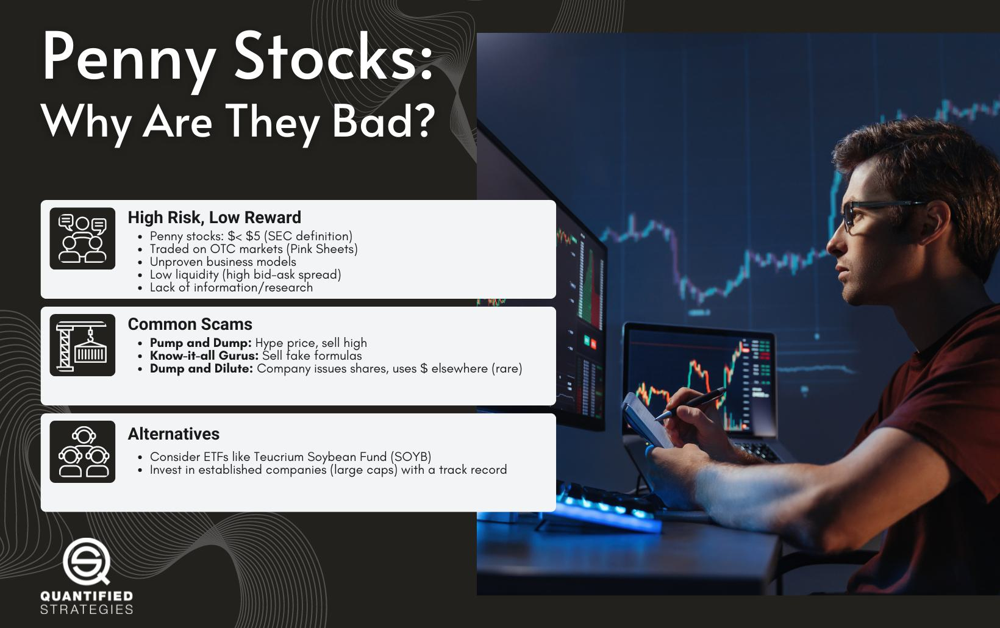

The world of stock market investments is both expansive and diverse, presenting a landscape replete with opportunities for both substantial gains and significant losses. In this intricate ecosystem, understanding the nuances and risks involved is crucial for any investor wishing to maximize their financial endeavors. This article shines a spotlight on two particularly high-risk areas of the stock market: penny stocks and algorithmic trading. 

Penny stocks, characterized by their low price and limited market capitalization, often attract investors with the allure of significant returns from relatively modest investments. However, the apparent promise of quick profits is accompanied by a set of risks that are unique to these low-priced securities. From market manipulation to inadequate financial information, investing in penny stocks requires careful consideration and informed decision-making.



On the other hand, algorithmic trading represents a technological advancement in the trading realm. Algorithms can execute trades with speed and efficiency, potentially capitalizing on small market inefficiencies. Yet, these same systems can amplify volatility and cause abrupt market shifts, adding another layer of complexity to the trading environment.

The purpose of this article is to provide a comprehensive understanding of the risks associated with penny stocks and the role algorithmic trading plays in either mitigating or exacerbating these risks. As an investor, being aware of potential pitfalls and understanding these fundamental aspects is essential for making prudent investment decisions. By the conclusion, you'll be better equipped with the knowledge and strategies needed to navigate the lucrative yet risky waters of penny stocks and algorithmic trading.

## Table of Contents

## Understanding Penny Stocks

Penny stocks are typically characterized as shares trading for less than $5, as per the U.S. Securities and Exchange Commission (SEC). These stocks often belong to smaller companies and lack the liquidity and regulatory oversight associated with larger, more established firms. Penny stocks primarily trade on platforms like Pink Sheets or the OTC Bulletin Board, which do not require stringent regulatory compliance. This minimal oversight contributes to the high-risk nature of investing in penny stocks.

One of the main attractions of penny stocks is their potential for high returns from relatively low investments. The low cost per share allows investors to acquire a significant number of shares without a substantial financial commitment. However, this potential for significant returns comes with a commensurate level of risk. The risk is amplified due to the higher likelihood of price manipulation and the prevalence of scams associated with penny stock trading.

Scams and fraudulent practices are rampant within the penny stock market due to its lower visibility and reduced regulatory environment. Common fraudulent activities include pump-and-dump schemes, where the stock price is artificially inflated before being sold off by the manipulators, causing significant losses for unsuspecting investors. As a result, investors must exercise caution and conduct thorough research before investing in these stocks.

The inherent [volatility](/wiki/volatility-trading-strategies) of penny stocks can result in substantial price fluctuations. This volatility is influenced by the limited availability of reliable financial information, the smaller size of the companies, and fewer investors analyzing these stocks compared to those of larger companies. Therefore, investors should be aware that while penny stocks offer the allure of significant returns, they come with considerable risk, necessitating careful evaluation and due diligence.

## Risks Associated with Penny Stocks

Penny stocks, typically defined as shares trading for less than $5 by the U.S. Securities and Exchange Commission (SEC), present unique risks that stem largely from their low [liquidity](/wiki/liquidity-risk-premium), susceptibility to market manipulation, a dearth of reliable financial information, high volatility, and lack of institutional ownership.

Low liquidity in penny stocks means that there is a relatively small number of shares being traded on the exchanges. As a result, significant trades can dramatically impact stock prices, leading to sharp and unexpected movements. This market characteristic highlights the difficulty investors may encounter when trying to buy or sell large quantities of shares without affecting the market value.

Market manipulation, particularly through schemes such as pump-and-dump, is a significant risk associated with penny stocks. In these schemes, fraudsters artificially inflate the price of a stock through misleading positive statements, only to sell off their shares once prices reach a certain level, leaving subsequent investors with devalued stocks. The inherent characteristics of penny stocks—such as low trading volumes and relatively limited investor awareness—make them ideal candidates for such manipulative tactics.

Investors often find it challenging to obtain reliable financial information about penny stock companies. Many of these firms are smaller and not subject to the same rigorous reporting standards imposed on larger public companies. This lack of transparency can prevent investors from making informed decisions and assessing the true value and potential of their investments.

High volatility is another hallmark of penny stocks, compounded by the factors mentioned above. These stocks can experience rapid and extreme price fluctuations, influenced by market sentiment, speculative buying, or sell-offs. This volatility can lead to significant financial loss if investors are not prepared for sudden price movements.

The lack of institutional ownership further complicates the investment landscape for penny stocks. Institutions typically [carry](/wiki/carry-trading) out comprehensive analyses and due diligence before investing in public companies. Their absence in the penny stock market means there are fewer professional insights and analyses available to guide individual investors. This deficiency leaves investors to navigate these waters without the benefit of expert validation and scrutiny.

When considering penny stocks, investors should remain cognizant of these risks and exercise due diligence, weighing potential gains against the evident hazards.

## Algorithmic Trading in Penny Stocks

Algorithmic trading, or algo trading, employs computer algorithms to execute trades based on predetermined conditions. In the context of penny stocks, this approach carries unique characteristics and risks. Penny stocks are known for their high volatility and susceptibility to market fluctuations. Algorithmic trading can harness these fluctuations to achieve favorable trade execution in penny stock markets.

Algorithms in penny stock trading can identify and exploit market inefficiencies efficiently. For instance, a trading algorithm may be designed to detect pricing discrepancies between different exchanges or platforms where a penny stock is listed. By executing rapid buy or sell orders when these discrepancies are identified, the algorithm can capitalize on short-term [arbitrage](/wiki/arbitrage) opportunities. However, this requires precise timing and optimal parameters to function as intended. The following Python code snippet demonstrates a simplified example of how a trading algorithm might be structured to monitor such discrepancies:

```python
import time
import numpy as np

def check_price_discrepancy(stock, exchange1, exchange2):
    price1 = exchange1.get_price(stock)
    price2 = exchange2.get_price(stock)

    if np.abs(price1 - price2) > threshold:
        execute_trade(stock, exchange1, exchange2, price1, price2)

def execute_trade(stock, exchange1, exchange2, price1, price2):
    if price1 > price2:
        # Buy from exchange2, sell on exchange1
        exchange2.buy(stock, amount)
        exchange1.sell(stock, amount)
    else:
        # Buy from exchange1, sell on exchange2
        exchange1.buy(stock, amount)
        exchange2.sell(stock, amount)

# Simulate continuous monitoring
while True:
    check_price_discrepancy('PENNY_STOCK', Exchange1, Exchange2)
    time.sleep(1)
```

While [algorithmic trading](/wiki/algorithmic-trading) can mitigate some risks associated with penny stocks by offering quick reaction times and efficient execution, it can also unintentionally contribute to increased market volatility. The fast-paced nature of algorithms may exacerbate price swings, particularly when multiple algorithms act simultaneously in response to the same market signals. This can lead to flash crashes, where a stock's price plummets rapidly before recovering just as quickly.

To mitigate these risks, investors using algorithmic trading must implement robust risk management protocols. This may include strategies such as stop-loss orders, which automatically sell a stock if its price falls below a certain threshold; carefully tuned algorithmic parameters to prevent over-trading; and liquidity assessments to ensure that trades can be executed without significantly impacting the stock price.

Overall, while algorithmic trading can be a powerful tool for navigating penny stock markets, it necessitates a cautious approach. Investors must continuously monitor their algorithms and market conditions, adjusting strategies as needed to safeguard against potential pitfalls inherent in trading low-priced, volatile stocks.

## Avoiding Scams and Fraud in Penny Stocks

Penny stocks, due to their volatile nature and lack of regulatory oversight, often attract deceptive practices. One of the primary red flags for potential scams is promotional materials that masquerade as research reports. These documents commonly promise extraordinary returns with little to no risk, enticing uninformed investors. To avoid falling prey to such schemes, it is crucial to authenticate the credibility of these materials. 

Verifying the credentials and track record of a company's management team is another essential precaution. A reputable team should have a history of transparency and ethical practices. The presence of questionable or unverified team members can often be a signal of potential fraud.

Financial transparency is a key [factor](/wiki/factor-investing) in making informed investment decisions. Before committing funds to penny stocks, reviewing a company's financial disclosures is vital. Reliable companies will frequently update their financial statements and make them accessible to investors. In contrast, a lack of transparency or irregularities in financial reports can indicate potential fraud.

Investors should also be wary of stocks labeled with warning signs, such as the 'Caveat Emptor' symbol, which signals caution. This designation is often used by the OTC Markets Group to identify stocks with limited or suspect information available. It serves as a cautionary flag for investors to conduct further investigation before investing.

Thorough due diligence is perhaps the most effective method to distinguish between scams and legitimate opportunities. This process involves gathering comprehensive information about the company, understanding the business model, assessing the competitive landscape, and reviewing recent news and public filings. By conducting a meticulous evaluation, investors are better positioned to identify red flags and make informed decisions.

In summary, avoiding scams in penny stocks requires vigilance, skepticism of overly promotional materials, verification of management teams, scrutiny of financial transparency, awareness of cautionary symbols, and exhaustive due diligence. Together, these strategies greatly reduce the risk of encountering fraudulent investments.

## Best Practices for Investing in Penny Stocks

Diversifying your investments is fundamental in reducing risk exposure when dealing with penny stocks. By spreading investments across various stocks, sectors, or asset classes, you minimize the impact of negative performance from any single stock. This strategy helps balance potential losses in one area with gains in another, thus stabilizing your portfolio. 

Utilizing stop-loss orders can be crucial for protecting your investments from unexpected price declines. A stop-loss order automatically sells a stock when it reaches a pre-determined price, limiting your losses. This is particularly important in the volatile penny stock market, where prices can fluctuate drastically.

Limiting the allocation of your portfolio to penny stocks is another best practice. Investing only a small, manageable percentage of your overall portfolio in these high-risk stocks can protect your finances from severe losses. A common approach is the "5% rule," which suggests not investing more than 5% of your portfolio in high-risk assets like penny stocks.

Focusing on stocks with high liquidity and adequate trading volumes is essential. High liquidity means that the stock can be bought or sold quickly without a significant impact on its price, making it easier to enter and [exit](/wiki/exit-strategy) positions. Stocks with higher trading volumes tend to be more stable and less prone to manipulation, which is prevalent in low-[volume](/wiki/volume-trading-strategy) penny stocks.

Staying informed about market conditions and trends is vital for making informed investment decisions. Monitor financial news, economic indicators, and regulatory changes that could affect the stock market. Tools such as market reports and financial analysis software can provide valuable insights.

Incorporating these practices helps investors navigate the penny stock market more safely and increases the chances of achieving favorable returns.

## Conclusion

Penny stocks and algorithmic trading strategies present opportunities for substantial returns but come with inherent risks that require careful consideration. Investors must maintain a cautious and well-informed approach, recognizing that these markets are not for the risk-averse. Understanding the intricate dynamics of penny stocks, characterized by their high volatility and susceptibility to manipulation, is crucial in making sound investment decisions.

Implementing best practices, such as diversifying investments, employing risk management tools like stop-loss orders, and focusing on stocks with high liquidity, can significantly enhance the likelihood of success in this volatile environment. Furthermore, algorithmic trading, while offering sophisticated strategies to exploit market inefficiencies, demands robust risk management protocols to mitigate the dangers of sudden market shifts or technical glitches.

Thorough research and strategic planning are vital to navigating the complexities of this sector, ensuring that any investment decisions are informed and calculated. It is also advisable to seek guidance from financial professionals who can offer personalized advice tailored to your specific investment goals and risk tolerance. By combining informed insights with strategic execution, investors can improve their chances of capitalizing on the potential rewards while minimizing exposure to the significant risks that accompany penny stocks and algorithmic trading.

## References & Further Reading

[1]: ["Investing in Penny Stocks: A Guide"](https://www.marketbeat.com/learn/how-to-start-investing-in-penny-stocks/) from Investopedia

[2]: Lopez de Prado, M. (2018). ["Advances in Financial Machine Learning"](https://www.amazon.com/Advances-Financial-Machine-Learning-Marcos/dp/1119482089) Wiley.

[3]: Chan, E. P. (2008). ["Quantitative Trading: How to Build Your Own Algorithmic Trading Business"](https://github.com/ftvision/quant_trading_echan_book) Wiley.

[4]: Jansen, S. (2020). ["Machine Learning for Algorithmic Trading"](https://github.com/stefan-jansen/machine-learning-for-trading) Packt Publishing.

[5]: Aronson, D. (2007). ["Evidence-Based Technical Analysis: Applying the Scientific Method and Statistical Inference to Trading Signals"](https://www.amazon.com/Evidence-Based-Technical-Analysis-Scientific-Statistical/dp/0470008741) Wiley.

[6]: U.S. Securities and Exchange Commission. ["Invest Wisely: An Introduction to Penny Stocks"](https://www.sec.gov/)

[7]: Bergstra, J., Bardenet, R., Bengio, Y., & Kégl, B. (2011). ["Algorithms for Hyper-Parameter Optimization."](https://dl.acm.org/doi/10.5555/2986459.2986743) Advances in Neural Information Processing Systems 24.