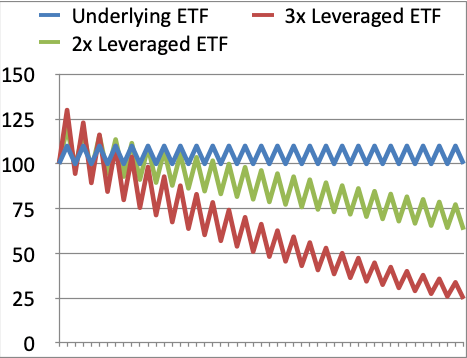

## Table of Contents

## What are 3x ETFs and how do they work?

3x ETFs, or triple-leveraged exchange-traded funds, are investment vehicles designed to deliver three times the daily performance of a specific index or benchmark. If the index goes up by 1%, a 3x ETF aims to go up by 3%. However, if the index goes down by 1%, the 3x ETF will aim to go down by 3%. These funds use financial derivatives and debt to achieve this amplified effect, making them highly sensitive to market movements.

Because of their structure, 3x ETFs are best suited for short-term trading rather than long-term investment. Over longer periods, the effects of daily rebalancing and compounding can lead to significant deviations from the expected three times return of the underlying index. This means that even if the index stays flat over time, the 3x ETF could lose value due to the volatility and the way it resets daily. As a result, these funds carry a high level of risk and are generally recommended for experienced investors who understand and can manage these complexities.

## How do 3x ETFs differ from regular ETFs?

3x ETFs and regular ETFs are both types of funds you can buy and sell on the stock market. The main difference is how they track the performance of something like a stock index. A regular ETF tries to match the performance of that index exactly. If the index goes up by 1%, the regular ETF will also try to go up by 1%. But a 3x ETF aims to give you three times the daily performance of the index. So if the index goes up by 1%, a 3x ETF will try to go up by 3%.

Because 3x ETFs aim to give you three times the daily performance, they use special financial tools and borrowing to make this happen. This makes them much riskier than regular ETFs. Regular ETFs are usually safer because they don't use these extra tools. Also, 3x ETFs are better for short-term trading because their value can change a lot from day to day. If you hold them for a long time, they might not perform as you expect because of how they reset every day. Regular ETFs are often better for long-term investing because they track the index more steadily over time.

## What are the potential benefits of investing in 3x ETFs?

One potential benefit of investing in 3x ETFs is the chance to make more money in a short time. If you think a stock index will go up, a 3x [ETF](/wiki/etf-trading-strategies) can give you three times the gain of that index in one day. This can be really helpful if you are good at guessing short-term market moves and want to make quick profits.

Another benefit is that 3x ETFs can help you make money even when the market is going down. If you think an index will drop, you can buy a 3x ETF that goes up when the index goes down. This way, you can still make money even if the market is not doing well. But remember, these ETFs are very risky and can lose a lot of money just as quickly as they can make it.

## What are the general risks associated with 3x ETFs?

One big risk with 3x ETFs is that they can lose a lot of money very quickly. Because they aim to give you three times the daily performance of an index, if the index goes down by 1%, the 3x ETF will go down by 3%. This means your money can disappear fast if the market moves against you. Also, these ETFs use special financial tools and borrowing to get that three times effect, which makes them even riskier.

Another risk is that 3x ETFs are not good for long-term investing. They reset every day, so if the market goes up and down a lot, the 3x ETF might not do what you expect over time. Even if the index stays the same over a few days or weeks, the 3x ETF can still lose value because of how it works. This makes them tricky to use and better for short-term trading than holding onto them for a long time.

Lastly, 3x ETFs can be hard to understand and manage. They need a lot of attention because the market can change quickly. If you don't watch them closely and make quick decisions, you might lose a lot of money. They are not for everyone and are usually recommended for experienced investors who know how to handle the risks.

## How does daily rebalancing affect the performance of 3x ETFs?

Daily rebalancing means that 3x ETFs adjust their investments every day to make sure they keep up with their goal of giving you three times the daily performance of an index. This is important because if the ETF did not rebalance daily, it might not match the index's performance over time. But this daily adjustment can cause problems, especially if the market goes up and down a lot. If the index goes up one day and down the next, the 3x ETF will try to match these movements three times over. This can lead to bigger losses or smaller gains than you might expect.

Because of daily rebalancing, 3x ETFs are not good for long-term investing. Over time, the effects of these daily adjustments can make the ETF's performance very different from what you might think. For example, if the index stays the same over a few days but moves up and down a lot each day, the 3x ETF might lose value even though the index didn't change overall. This makes 3x ETFs risky and better for short-term trading, where you can watch the market closely and make quick decisions.

## Can you explain the impact of volatility decay on 3x ETFs?

Volatility decay, sometimes called time decay, is a big problem for 3x ETFs. It happens because these ETFs reset every day to keep up with their goal of giving you three times the daily performance of an index. When the market goes up and down a lot, this daily resetting can make the ETF lose value over time, even if the index stays the same overall. This is because the ETF has to buy and sell more often to keep up with the three times effect, and these frequent changes can eat away at the ETF's value.

Imagine the index goes up by 5% one day and then down by 5% the next day. You might think the index would be back to where it started, but for a 3x ETF, it's different. On the first day, the ETF would go up by 15%. But on the second day, it would go down by 15% from its new higher value. This means the ETF would end up lower than where it started, even though the index itself went back to its original level. This is why 3x ETFs are risky and usually not good for long-term investing.

## What are the tax implications of trading 3x ETFs?

When you trade 3x ETFs, you need to think about taxes. If you hold a 3x ETF for less than a year and then sell it, any money you make is called a short-term capital gain. The IRS taxes these gains at your regular income tax rate, which can be pretty high. So, if you make a lot of money from trading 3x ETFs quickly, you might have to pay a big tax bill.

If you hold a 3x ETF for more than a year before selling, any profit you make is called a long-term capital gain. The tax rate for these gains is usually lower than for short-term gains. But, because 3x ETFs are meant for short-term trading and can lose value over time, it's not common to hold them for a long time. So, most of the time, you'll be dealing with short-term gains and higher taxes when trading 3x ETFs.

## How does the time horizon affect the risk of investing in 3x ETFs?

The time horizon is really important when you think about the risk of investing in 3x ETFs. These ETFs are made for short-term trading, like a day or a few days. They try to give you three times the daily performance of an index, so if you're good at guessing what the market will do in the short term, you might make a lot of money quickly. But, they are very risky because they can lose a lot of money just as fast if the market moves the wrong way. So, if you're looking to trade for just a short time, you need to watch the market closely and be ready to make quick decisions.

If you hold a 3x ETF for a long time, like weeks or months, the risk goes up a lot. These ETFs reset every day to keep up with their goal, and over time, this can make them lose value even if the index stays the same. This is called [volatility](/wiki/volatility-trading-strategies) decay, and it means that the longer you hold a 3x ETF, the more likely it is to lose money. So, if you're thinking about investing for the long term, 3x ETFs are not a good choice because they are too risky and can lead to big losses over time.

## What are the liquidity risks associated with 3x ETFs?

Liquidity risk is a big deal when you trade 3x ETFs. It means how easy it is to buy or sell the ETF without the price changing a lot. If a 3x ETF is not very liquid, it can be hard to sell it quickly when you want to. This can be a problem if the market is moving fast, and you need to get out of your position to avoid losing money. So, if you're thinking about trading 3x ETFs, you need to check how liquid they are before you start.

Some 3x ETFs might not have as many buyers and sellers as regular ETFs, which can make them less liquid. If there aren't enough people trading the ETF, the price can jump around a lot when you try to buy or sell it. This can make it harder to trade at the price you want, and you might end up losing more money than you planned. That's why it's important to look at how many shares are traded each day and how easy it is to buy and sell a 3x ETF before you decide to invest in it.

## How do market conditions influence the risks of 3x ETFs?

Market conditions can make 3x ETFs much riskier. When the market is moving a lot, up or down, 3x ETFs can swing even more because they aim to give you three times the daily performance of an index. If the market is going up, you might make a lot of money quickly with a 3x ETF. But if the market goes down, you can lose a lot of money just as fast. This makes them really risky during times when the market is not stable.

In calm markets, 3x ETFs can still be risky because of something called volatility decay. Even if the market stays the same over time but goes up and down a little each day, the 3x ETF can lose value because it resets every day. This means that even in a steady market, holding a 3x ETF for a long time can lead to losses. So, no matter what the market is doing, 3x ETFs are always risky and need a lot of attention and quick decisions to trade safely.

## What are some strategies to mitigate the risks of 3x ETFs?

One way to lower the risks of 3x ETFs is to use them for short-term trading only. These ETFs are meant to give you three times the daily performance of an index, so they work best when you're trying to make quick profits. Keep a close eye on the market and be ready to buy and sell quickly. Don't hold onto them for a long time because they can lose value over time due to something called volatility decay. If you're good at guessing short-term market moves, you might make money, but always be ready to get out if the market turns against you.

Another strategy is to use stop-loss orders. This means setting a price at which you will automatically sell the ETF if it starts to drop too much. This can help you limit your losses if the market goes down suddenly. Also, make sure to check how liquid the 3x ETF is before you buy it. If it's not very liquid, it can be hard to sell it quickly when you need to. So, always look at how many shares are traded each day to see if you can buy and sell easily.

## Can you discuss case studies of significant losses or gains with 3x ETFs?

In early 2020, a lot of people saw big losses with 3x ETFs because of the COVID-19 market crash. One example is the Direxion Daily Financial Bull 3X Shares (FAS), which aims to give three times the daily performance of the Russell 1000 Financial Services Index. When the market started to drop fast in March 2020, FAS lost a lot of value. If you bought FAS at the start of March and held onto it for just a few weeks, you could have lost more than half your money. This shows how risky 3x ETFs can be when the market goes down quickly.

On the other hand, some people made big gains with 3x ETFs during the market recovery later in 2020. The Direxion Daily S&P 500 Bull 3X Shares (SPXL) tries to give three times the daily performance of the S&P 500. When the market started to go back up in April and May, SPXL went up a lot. If you bought SPXL at the right time and sold it a few weeks later, you could have made a lot of money. But you had to be good at guessing when to buy and sell because the market was still moving a lot. These examples show how 3x ETFs can be really good or really bad, depending on what the market does and when you trade them.

## What are High Expense Ratios?

Leveraged Exchange-Traded Funds (ETFs), particularly those with a 3x leverage [factor](/wiki/factor-investing), typically entail higher expense ratios than their traditional counterparts. Expense ratios represent the annual fees that fund companies charge investors to manage an ETF, expressed as a percentage of the invested amount. For 3x ETFs, these ratios are often substantially greater due to the complexity and additional costs involved in maintaining the leverage, such as higher trading costs and derivative expenses. 

Over time, even a modest difference in expense ratios can substantially erode returns. For example, consider an investor choosing between a traditional ETF with an expense ratio of 0.1% and a 3x ETF with a ratio of 1%. Over a period of several years, this difference can compile significantly, reducing the investment's overall profitability.

To illustrate, let's assume an annual return of 10% before expenses for an investment amount of $10,000:

For the traditional ETF:

$$
\text{After Expenses Return} = 10,000 \times (1 + 0.1 - 0.001)^n
$$

For the 3x ETF:

$$
\text{After Expenses Return} = 10,000 \times (1 + 0.1 - 0.01)^n
$$

where $n$ represents the number of years. Running these calculations over a ten-year period highlights the compounded impact of differing expense ratios:

```python
initial_investment = 10000
annual_return = 0.10
trad_expense_ratio = 0.001
leveraged_expense_ratio = 0.01
years = 10

traditional_etf_value = initial_investment * (1 + annual_return - trad_expense_ratio)**years
leveraged_etf_value = initial_investment * (1 + annual_return - leveraged_expense_ratio)**years

traditional_etf_value, leveraged_etf_value
```

The output would demonstrate how much less profitable the 3x ETF becomes over an extended period compared to a traditional ETF, solely based on the higher expense ratio.

Investors considering 3x ETFs must recognize that while these funds can offer significant short-term returns, the higher expense ratios can diminish gains, especially for those unwittingly employing these ETFs in a long-term investment strategy. Thus, it is crucial for investors to evaluate and compare expense ratios rigorously, recognizing their substantial impact on overall returns and aligning decisions with their investment time frame and financial goals.

## What is the Bottom Line?

3x ETFs offer investors the potential for amplified returns by promising triple the daily performance of their benchmark indices. This leverage can generate substantial profits over short periods, especially in trending markets. However, these financial instruments are accompanied by significant risks that necessitate careful evaluation and understanding before investment.

Firstly, the risks involve both market volatility and the compounding effect. Due to the daily reset mechanism, 3x ETFs may deviate from expected returns, particularly in volatile markets. For example, if a benchmark index gains 1% on one day and loses 1% the next, a 3x ETF might end up with a net loss due to the way percentage changes interact with leverage and compounding. As a formula, the net gain or loss of a 3x ETF over two days can be expressed as:

$$
\text{Final Value} = \left(1 + 3 \times r_1\right) \times \left(1 + 3 \times r_2\right) \times \text{Initial Value}
$$

where $r_1$ and $r_2$ are the daily returns of the benchmark index. This calculation illustrates how volatile swings can lead to unanticipated outcomes.

Additionally, the complex financial derivatives underlying these funds introduce market, counterparty, [liquidity](/wiki/liquidity-risk-premium), and interconnection risks not typically present in traditional ETFs. Moreover, 3x ETFs often feature higher expense ratios, which can erode potential gains, especially if held over longer periods.

For investors and traders considering these ETFs, it is essential to weigh these considerable risks and costs against potential benefits. Aligning investment strategies with individual risk tolerance is paramount. Risk-averse investors might find the volatility unsettling, whereas those with a higher risk appetite might incorporate these tools within a broader, diversified trading strategy. Ultimately, understanding the intrinsic properties and risks of 3x ETFs will enable investors to manage their positions more effectively and potentially harness their benefits while mitigating adverse impacts.

## References & Further Reading

[1]: Cheng, M., & Madhavan, A. (2009). ["The Dynamics of Leveraged and Inverse Exchange-Traded Funds."](https://papers.ssrn.com/sol3/papers.cfm?abstract_id=1393995) The Journal of Investment Management, 7(1).

[2]: Gagnon, L., & Karolyi, G. A. (2009). ["Multifactor Explanations of Asset Pricing Anomalies in Financial Markets."](https://www.jstor.org/stable/40505976) SSRN Electronic Journal.

[3]: Avellaneda, M., & Zhang, S. (2010). ["Path-Dependence of Leveraged ETF Returns."](https://math.nyu.edu/~avellane/SIAMLETFS.pdf.pdf) International Journal of Theoretical and Applied Finance, 13(3).

[4]: Charupat, N., & Miu, P. (2011). ["The Pricing and Performance of Leveraged Exchange-Traded Funds."](https://www.sciencedirect.com/science/article/pii/S0378426610003444) Financial Analysts Journal, 67(4).

[5]: ["Exchange-Traded Funds and Investment Strategies"](https://www.investopedia.com/articles/01/082901.asp) by F. J. Fabbrini

[6]: ["Leveraged ETFs: Are They Right for You?"](https://www.forbes.com/advisor/investing/best-leveraged-etfs/) by Ken Tysiac, Journal of Accountancy

[7]: ["Leveraged ETFs and Their Antecedents: Real Consequence of Financial Innovation."](https://www.nasdaq.com/articles/leveraged-etfs-longer-term-investors) by Alon Brav, J. B. Heaton

[8]: Cheng, M., & Madhavan, A. (2009). ["The Dynamics of Leveraged and Inverse Exchange-Traded Funds."](https://papers.ssrn.com/sol3/papers.cfm?abstract_id=1393995) Barclays Global Investors.
