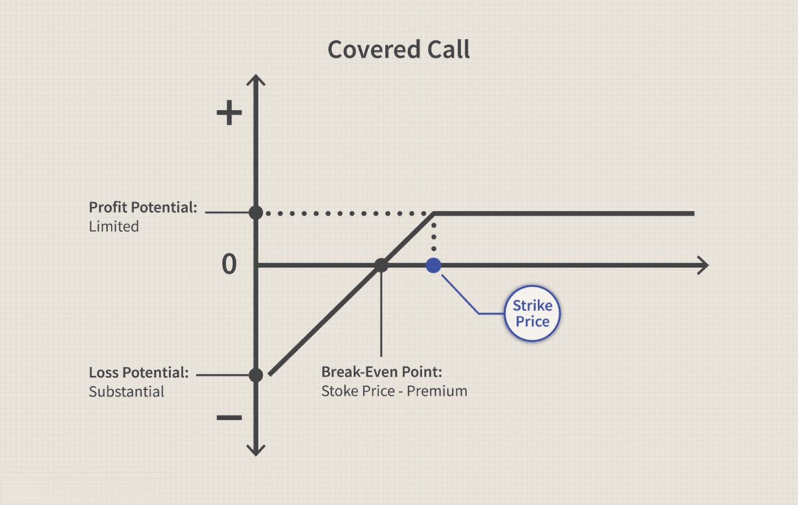

Options trading is a significant aspect of the financial markets, offering traders extensive flexibility in developing and implementing various strategies. The core of options trading revolves around two fundamental types of contracts: call and put options. Each type presents unique risks that investors must understand to effectively manage potential losses. Call options provide the buyer with the right, but not the obligation, to purchase an underlying asset at a specified strike price within a particular timeframe. Conversely, put options grant the holder the right to sell the underlying asset at a predetermined price before the contract expires. These options are instrumental for traders seeking to hedge risks or engage in speculative activities, thereby enhancing their portfolio strategy.

It is crucial for both novice and experienced investors to comprehend the inherent risks associated with call and put options. This understanding not only aids in the prevention of possible financial setbacks but also in the optimization of trading outcomes. An added complexity in the landscape of options trading is the emergence of algorithmic trading, often referred to as algo trading. This method leverages pre-defined criteria to execute trades automatically, offering increased speed and efficiency. However, it also brings its own set of risk management challenges.

This article examines the spectrum of risks linked to trading call and put options. Moreover, it highlights important considerations for traders who utilize algorithmic trading strategies, focusing on the interplay between technological advancements and traditional risk factors in options trading.

## Table of Contents

## Understanding Call and Put Options

Call options and put options are integral components of options trading, serving as fundamental instruments for investors aiming to benefit from movements in asset prices. A call option grants the holder the right, but not the obligation, to purchase a specified quantity of an asset at a predetermined strike price on or before a specified expiration date. This contractual right enables investors to capitalize on potential increases in the asset's market price. Should the market price exceed the strike price at expiration, the call option holder can exercise the option to buy the asset at the lower strike price, thus realizing a profit. However, if the market price remains below the strike price, the option will likely expire worthless, with the investor's loss being limited to the premium paid for acquiring the option.

Conversely, a put option bestows upon the holder the right, without the obligation, to sell a particular quantity of an asset at a designated strike price before or on its expiration date. This type of option is advantageous for investors anticipating a decline in the asset's price. If the market price falls below the strike price, the put option can be exercised to sell the asset at the higher strike price, securing a profit for the holder. Conversely, if the market price stays above the strike price, the put option will generally expire without value, with the holder's financial exposure confined to the premium paid.

Both call and put options provide investors with mechanisms for hedging against existing portfolio positions and for speculation, leveraging market forecasts to potentially enhance returns. Options are favored among traders due to their flexibility, enabling diverse strategies such as protective puts for hedging long positions or writing covered calls to generate income. Understanding the fundamental mechanics of these options is crucial for investors looking to utilize options as part of a robust trading strategy catering to various market conditions.

## Risks of Investing in Call Options

Owning call options involves several inherent risks, primarily centered around the potential for the option to expire worthless. When an investor purchases a call option, they acquire the right, but not the obligation, to buy an underlying asset at a specified strike price within a predetermined timeframe. If the market price of the underlying asset does not exceed the strike price by expiration, the call option holds no intrinsic value, resulting in a complete loss of the premium paid.

Mathematically, the loss for a call option buyer can be expressed as:

$$
\text{Loss} = \text{Premium Paid}
$$

This scenario happens when $S_T \leq K$, where $S_T$ is the spot price at expiration and $K$ is the strike price.

Investors engaging in 'naked call' positions, where they sell call options without holding the underlying asset, face considerable risks. Unlike buyers, who risk only the premium, writers of naked calls are exposed to unlimited loss potential since the price of the underlying asset can theoretically rise indefinitely. The loss for a naked call writer can be represented as:

$$
\text{Loss} = \max(0, S_T - K) - \text{Premium Received}
$$

If the market price $S_T$ substantially surpasses the strike price $K$, the losses could accumulate, as there is no upper limit to how high the asset price can rise. Consequently, naked call writers shoulder considerable risk as they must potentially buy the underlying asset at the elevated market price to fulfill their obligation, should the call option be exercised by the buyer.

To mitigate these risks, call option investors often employ strategies such as covered calls, where the writer owns the underlying asset, thus providing a cushion against adverse price movements. Understanding these risks and implementing robust strategies is essential for mitigating potential losses in call options trading.

## Risks of Investing in Put Options

Put options offer traders the right to sell an asset at a specified strike price within a given timeframe. However, they [carry](/wiki/carry-trading) a distinct set of risks for both buyers and sellers, primarily tied to market dynamics and price movements of the underlying assets.

For buyers, the primary risk is the option expiring worthless, which occurs if the underlying asset's price remains above the strike price at expiration. In this scenario, the put option buyer would lose the premium paid for the option. Hence, for a put option to be profitable, the underlying asset's price must decline sufficiently below the strike price to at least cover the cost of the premium.

To illustrate this concept, consider a put option with a strike price $K$ and a premium $P_r$. For the buyer to make a profit, the asset's price at expiration, $S_T$, must satisfy the following inequality:

$$
K - S_T > P_r
$$

If this condition is not met, the buyer's loss is capped at the premium paid, $P_r$.

On the other hand, writing (or selling) put options can expose the seller to significant risks. In the event that the underlying asset's price drops dramatically below the strike price, the losses for the option seller can far exceed the premium received. The potential loss for an option writer is calculated as:

$$
(Loss) = K - S_T - P_r
$$

Here, the loss is theoretically unlimited because the asset's price can drop to zero, except it is offset by the premium received, which is relatively small compared to potential declines in the asset's value.

Effective management of these risks involves carefully assessing market conditions, monitoring price movements, and understanding one's risk tolerance. Engaging in strategies such as protective puts or spreads can also help mitigate potential losses for traders involved in put options. Regularly reviewing positions and maintaining awareness of macroeconomic factors influencing market trends are vital practices to safeguard against these risks.

## Risk Management in Options Trading

Understanding the 'Greeks' in options trading is fundamental for investors to assess both risk exposure and the potential changes in the value of their options positions. The 'Greeks'—Delta, Gamma, Theta, and Vega—are key metrics that help traders quantify the sensitivity of an option's price to various factors. 

**Delta** measures the sensitivity of an option's price to a $1 change in the price of the underlying asset, indicating how much the option's price is expected to move. A Delta value of 0.5 suggests that for every $1 increase in the price of the underlying asset, the option's price could increase by $0.50. This makes Delta a valuable tool for understanding price movement exposure.

**Gamma** is the rate of change of Delta with respect to changes in the price of the underlying asset. It helps traders understand how Delta will change as the market moves, providing insight into how the price sensitivity of an option might evolve, especially for short-term price movements.

**Theta** measures the rate of time decay of an option, reflecting the decrease in the option's value as it approaches expiration. Theta is particularly crucial for options sellers since it provides an understanding of how an option's price will erode over time. A high Theta can indicate rapid time decay, impacting strategies involving long option holdings.

**Vega** indicates the sensitivity of an option's price to changes in the volatility of the underlying asset. A higher Vega means the option's price will significantly change with increased volatility, making it an essential measure for understanding the impact of volatile markets on an options position.

Beyond understanding the Greeks, diversification and risk tolerance assessments play a critical role in effective risk management. Diversification involves spreading investments across different assets or options strategies to minimize the risk associated with any single asset's adverse performance. This approach can protect a portfolio from significant losses due to specific market movements.

Risk tolerance assessments involve evaluating an investor's ability to absorb potential losses, guiding the selection and adjustment of options strategies. Investors with a lower risk tolerance might prefer conservative strategies, such as covered calls, which involve selling call options on owned stock to generate income and provide a hedge.

Implementing protective strategies like covered calls can help in risk mitigation. For example, a covered call strategy enhances income potential while providing a buffer against minor declines in the price of the underlying asset. These strategies can be pivotal for safeguarding positions, especially in volatile markets.

Regularly monitoring market conditions, [volatility](/wiki/volatility-trading-strategies), and position sizes is another critical component of risk management. Changes in market trends or unexpected volatility spikes can drastically affect options positions. Investors should maintain vigilance over these factors, adjusting their strategies to align with evolving market scenarios to minimize adverse outcomes.

In summary, a comprehensive understanding of the Greeks, combined with strategic diversification, risk tolerance assessments, and protective strategies, can significantly mitigate the risks associated with options trading. This proactive risk management approach empowers traders to navigate the complexities of the market more effectively, aligning their positions with their investment goals and risk profiles.

## Algorithmic Trading and Its Risks

Algorithmic trading, often referred to as algo trading, relies on automated systems to execute trades based on pre-determined criteria. This method harnesses the power of computer algorithms to analyze market data and implement trading strategies with greater precision and efficiency than human traders could typically achieve. By automating the execution process, traders can react almost instantaneously to market conditions, potentially capturing opportunities that might otherwise be missed due to latency.

However, the complexity of these algorithms introduces a range of risks that must be carefully managed. One significant risk is the potential for technological failures. This can include software bugs, system crashes, or network outages, all of which can disrupt trading operations. For example, if an algorithm is designed to trade based on minute-by-minute stock price movements, even a minor system glitch could result in substantial financial loss or missed opportunities.

Misinterpretations of data or algorithmic errors are also critical concerns. An algorithm might be programmed with incorrect assumptions or flawed logic, leading to unintended trading behaviors. For instance, if an algorithm is based on regression models or [machine learning](/wiki/machine-learning) predictions, inaccuracies in these models can lead to poor trading decisions. Ensuring the robustness of algorithms through rigorous testing and validation is thus critical.

Market conditions also play a pivotal role in the success or failure of [algorithmic trading](/wiki/algorithmic-trading) strategies. Rapid changes in market dynamics, such as those triggered by breaking news or economic reports, can challenge even the most well-designed algorithms. In highly volatile environments, algorithms may execute trades that were optimal under previous conditions but are suboptimal in the current context. Similarly, low [liquidity](/wiki/liquidity-risk-premium) can amplify the risks associated with algorithmic trading. In a market with few buyers and sellers, orders may not be filled at expected prices, resulting in slippage or increased transaction costs.

To manage these risks, continuous oversight and adjustment of algorithmic strategies are necessary. Traders must regularly review and optimize their algorithms to adapt to changing market conditions and ensure alignment with their overall risk management strategies. This often involves sophisticated monitoring systems to track algorithm performance in real-time and make necessary adjustments promptly.

In conclusion, while algorithmic trading offers significant advantages in terms of speed and precision, it also brings a unique set of challenges that require careful management. The success of algorithmic trading not only hinges on the underlying technology but also on the trader's ability to anticipate and respond to the diverse risks inherent in dynamic financial markets.

## Conclusion

Options trading is a nuanced segment of the financial markets that offers significant opportunities for portfolio enhancement through diversification and strategic positioning. However, the potential for profit comes hand-in-hand with considerable risks, necessitating a comprehensive understanding and strategic approaches tailored to individual risk tolerance and market conditions.

Effective risk management is paramount in options trading. Investors need to implement structured strategies such as the use of protective puts, covered calls, or collars to safeguard their positions against adverse price movements. Informed decision-making also plays a crucial role in enhancing profitability. Traders should leverage analytical tools and financial models to evaluate potential trades accurately and determine appropriate entry and [exit](/wiki/exit-strategy) points. By incorporating quantitative assessments and technical analysis, traders can achieve a more refined approach to market movements and price predictions.

Continuous education and adaptability are integral for both novice and experienced traders. The fast-paced evolution of market instruments and trading technologies requires traders to constantly update their skills and methodologies. Algorithmic trading, characterized by its rapid execution capabilities and systematic approach, is an area where continuous learning is particularly beneficial. As algorithms become increasingly sophisticated, understanding and managing their inherent risks—such as system failures or unanticipated market behaviors—will be critical. 

In conclusion, while options trading and algorithmic strategies present formidable avenues for capital growth, they demand diligent risk assessment and management. Sustainable success in this domain is achievable through the cultivation of expertise, vigilance in market analysis, and a proactive approach to risk mitigation. By embracing these principles, traders can navigate the complexities of options trading and harness its potential to achieve their financial goals.

## References & Further Reading

[1]: Hull, J.C. (2017). ["Options, Futures, and Other Derivatives"](https://books.google.com/books/about/Options_Futures_and_Other_Derivatives.html?id=yfr0DQAAQBAJ) (9th Edition). Pearson.

[2]: Black, F. & Scholes, M. (1973). ["The Pricing of Options and Corporate Liabilities."](https://www.cs.princeton.edu/courses/archive/fall09/cos323/papers/black_scholes73.pdf) Journal of Political Economy, 81(3), 637-654.

[3]: Lopez de Prado, M. (2018). ["Advances in Financial Machine Learning"](https://www.amazon.com/Advances-Financial-Machine-Learning-Marcos/dp/1119482089). Wiley.

[4]: Chan, E.P. (2008). ["Quantitative Trading: How to Build Your Own Algorithmic Trading Business"](https://github.com/ftvision/quant_trading_echan_book). Wiley.

[5]: Euan Sinclair (2010). ["Volatility Trading"](https://onlinelibrary.wiley.com/doi/book/10.1002/9781118662724). Wiley.

[6]: Jarrow, R.A. & Turnbull, S.M. (1996). ["Derivative Securities"](https://archive.org/details/derivativesecuri0000jarr_r8m0). South-Western College Publishing.