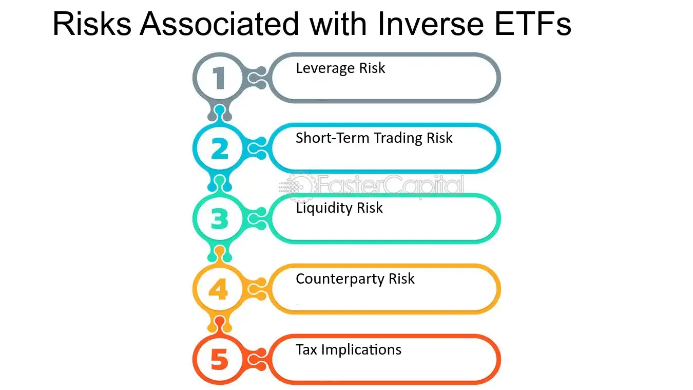

## Table of Contents

## What are Inverse ETFs?

Inverse ETFs, or exchange-traded funds, are a type of investment that aims to make money when the market goes down. They are designed to move in the opposite direction of a specific index or asset, like the S&P 500. This means if the S&P 500 goes down by 1%, an inverse ETF tracking it would go up by about 1%. People use inverse ETFs to protect their investments or to bet on a market decline.

Inverse ETFs can be useful, but they also come with risks. They often use complex financial strategies, like derivatives, to achieve their goals. This can make them more expensive and harder to understand than regular ETFs. Also, because they aim to deliver the opposite performance of an index daily, holding them for a long time can lead to unexpected results due to something called "compounding." So, it's important to understand how they work before investing in them.

## How do Inverse ETFs work?

Inverse ETFs work by using special financial tools, like derivatives, to move in the opposite direction of a specific index or asset. For example, if you have an inverse ETF that tracks the S&P 500, and the S&P 500 goes down by 1% in a day, the inverse ETF should go up by about 1%. This is useful for investors who think the market is going to drop and want to make money from that drop.

However, inverse ETFs can be tricky. They are designed to give the opposite performance of an index each day, which means if you hold them for a long time, the results can be different from what you expect. This happens because of something called "compounding." Also, because they use complex strategies, inverse ETFs can be more expensive and harder to understand than regular ETFs. So, it's important to really know what you're doing before you invest in them.

## What are the basic risks associated with investing in Inverse ETFs?

Investing in inverse ETFs comes with several risks that you should know about. One big risk is that these ETFs are meant to give the opposite performance of an index each day. If you hold them for a long time, the results can be different from what you expect because of something called "compounding." This means that the gains and losses can add up in unexpected ways over time, which can lead to big losses if the market moves differently than you thought.

Another risk is that inverse ETFs often use complex financial tools, like derivatives, to achieve their goals. These tools can make the ETFs more expensive because they have higher fees. Also, because these strategies are complex, it can be hard to understand exactly how the ETF works. If you don't fully understand what you're investing in, you might make bad choices and lose money.

Lastly, inverse ETFs are often used to bet on short-term market drops. If the market doesn't go down like you expected, you could lose money quickly. These ETFs are not usually meant for long-term investing, so if you keep them for a long time, you might not get the results you want. It's important to think carefully about your investment goals and how long you plan to hold the ETF before you invest.

## Can you explain the concept of daily rebalancing in Inverse ETFs?

Daily rebalancing in inverse ETFs means that the ETF adjusts its holdings every day to make sure it keeps moving in the opposite direction of the index it's tracking. For example, if an inverse ETF is supposed to go up by 1% when the S&P 500 goes down by 1%, the ETF will change its investments each day to make sure this happens. This daily adjustment is important because it helps the ETF stay true to its goal of giving the opposite performance of the index.

However, daily rebalancing can lead to some problems over time. Because the ETF is designed to match the opposite performance of the index each day, if you hold the ETF for more than one day, the results can be different from what you expect. This is because of something called "compounding." If the market goes up and down a lot, the daily adjustments can add up in ways that might not be good for your investment. So, it's important to understand that inverse ETFs are usually meant for short-term investing, not for holding for a long time.

## How does market volatility affect Inverse ETFs?

Market volatility can really change how well inverse ETFs do. When the market moves up and down a lot, it can make the daily adjustments of inverse ETFs add up in unexpected ways. This is because inverse ETFs are designed to move in the opposite direction of the market each day. If the market is very volatile, the daily gains and losses can compound, which means they can build up and lead to results that are different from what you might expect.

Because of this, if you hold an inverse ETF during a time when the market is bouncing around a lot, you might see bigger losses or smaller gains than you thought you would. Inverse ETFs are usually meant for short-term bets on the market going down, so if you keep them for a long time during volatile periods, the effects of daily rebalancing can really hurt your investment. It's important to understand this before you decide to invest in inverse ETFs, especially when the market is moving a lot.

## What is the impact of compounding on Inverse ETF performance?

Compounding can really change how well inverse ETFs do over time. Inverse ETFs are designed to move in the opposite direction of a specific index or asset each day. But because they reset their positions every day, the gains and losses can add up in unexpected ways. If the market goes up and down a lot, the daily adjustments can make the ETF's performance different from what you might expect. This can lead to bigger losses or smaller gains than you thought you would get.

For example, if the market goes down one day and then up the next, the inverse ETF will try to match the opposite of these moves each day. But because of compounding, the daily changes can build up over time. If you hold an inverse ETF for a long time, especially during periods when the market is moving a lot, the effects of daily rebalancing can really hurt your investment. That's why it's important to understand that inverse ETFs are usually meant for short-term bets on the market going down, not for holding for a long time.

## How do Inverse ETFs perform over the long term compared to the short term?

Inverse ETFs are designed to make money when the market goes down. They work best over the short term, like a day or a few days. If you think the market will drop tomorrow, an inverse ETF can help you make money from that drop. They adjust their investments every day to make sure they move in the opposite direction of the market. This daily adjustment helps them match the opposite performance of the market each day.

Over the long term, inverse ETFs can be risky. They are not meant to be held for a long time because of something called compounding. Compounding means the daily gains and losses can add up in unexpected ways. If the market goes up and down a lot over weeks or months, the inverse ETF's performance can be very different from what you expect. This can lead to big losses if you keep them for a long time. So, it's important to use inverse ETFs for short-term bets on the market, not for long-term investing.

## What are the tax implications of trading Inverse ETFs?

Trading inverse ETFs can have different tax implications compared to trading regular ETFs. When you make money from inverse ETFs, it's usually considered a short-term capital gain if you hold the ETF for less than a year. Short-term capital gains are taxed at your regular income tax rate, which can be higher than the tax rate for long-term gains. This is because inverse ETFs are often used for short-term trading, so the profits are usually taxed as if you made them quickly.

If you do hold an inverse ETF for more than a year, any profit you make would be considered a long-term capital gain. Long-term capital gains are taxed at a lower rate than short-term gains, usually 0%, 15%, or 20%, depending on your income. However, because inverse ETFs are designed for short-term trading and can be affected by daily rebalancing and compounding, it's not common to hold them for a long time. So, most of the time, you'll be dealing with short-term capital gains and the higher tax rates that come with them.

## How does liquidity affect the risks of Inverse ETFs?

Liquidity can make a big difference in how risky it is to trade inverse ETFs. When an ETF is liquid, it means a lot of people are buying and selling it, so it's easy to trade. If an inverse ETF is very liquid, you can buy or sell it quickly without the price changing a lot. This is good because it means you can get in and out of your investment easily. But if an inverse ETF is not very liquid, it can be harder to sell it when you want to. This can be a problem if the market is moving fast and you need to get out of your investment quickly.

If you're trading an inverse ETF that isn't very liquid, you might have to sell it for less than you wanted. This is called a "[liquidity](/wiki/liquidity-risk-premium) risk." It can make your losses bigger if the market goes against you and you can't sell the ETF at a good price. So, it's important to check how liquid an inverse ETF is before you buy it. If it's not very liquid, you might want to think twice about investing in it, especially if you think you might need to sell it quickly.

## What are the potential regulatory risks associated with Inverse ETFs?

Inverse ETFs can come with regulatory risks because they use complex financial tools like derivatives. Regulators might change the rules about how these tools can be used, which could make it harder for inverse ETFs to work the way they are supposed to. If the rules change, the ETF might have to change how it invests, which could affect how much money you make or lose.

Also, regulators might decide that inverse ETFs are too risky for regular investors. If that happens, they might put new rules in place that make it harder to buy or sell these ETFs. This could mean you can't use them to protect your other investments or to bet on the market going down. So, it's important to keep an eye on what regulators are doing and how it might affect your investments in inverse ETFs.

## How can leverage in Inverse ETFs increase risk exposure?

Leveraged inverse ETFs use borrowed money to try to make bigger gains when the market goes down. This can be good if the market drops like you think it will, but it can also make your losses much bigger if the market goes up instead. Because these ETFs use borrowed money, they are more sensitive to market changes. If the market moves against you, even a little bit, your losses can grow quickly.

Using leverage in inverse ETFs means you are taking on more risk. The bigger the leverage, the more you can lose if things don't go as planned. It's like betting more money on a game - you could win more, but you could also lose more. So, it's important to really think about how much risk you are okay with before you invest in leveraged inverse ETFs.

## What strategies can be used to mitigate the risks of investing in Inverse ETFs?

One way to lower the risks of investing in inverse ETFs is to use them for short periods of time. Since these ETFs are meant to move in the opposite direction of the market each day, holding them for a long time can lead to unexpected results because of compounding. If you think the market will drop tomorrow, you can buy an inverse ETF and sell it soon after. This way, you can take advantage of the market drop without the risks that come from holding the ETF for too long.

Another strategy is to pay attention to how liquid the inverse ETF is. If it's easy to buy and sell, you can get in and out of your investment quickly. This is important because if the market moves fast, you want to be able to sell your ETF without losing a lot of money. Also, make sure you understand how the ETF works and how much it costs. Some inverse ETFs use complex tools and can be expensive, so knowing these details can help you make better choices and manage your risks better.

## What are Inverse ETFs and how do they work?

Inverse ETFs, or inverse exchange-traded funds, are specialized financial instruments designed to deliver returns that are the opposite of those generated by a particular index or benchmark. This distinctive feature is achieved through the utilization of derivative securities, including swaps, futures, and options. 

### Construction and Functionality

Inverse ETFs employ derivatives to bet against the performance of an index, with the ultimate goal of achieving a negative correlation with the index's daily returns. The daily reset feature of these ETFs ensures that the inverse relationship is maintained over short-term periods. This means that if an index declines by a certain percentage in a day, an inverse [ETF](/wiki/etf-trading-strategies) designed to track that index should ideally gain that same percentage, minus fees and expenses.

The formula commonly used to calculate the daily return of an inverse ETF can be simplified as:

$$

\text{Inverse ETF Return} = -1 \times (\text{Index Return})
$$

This formula encapsulates the primary mechanism by which inverse ETFs operate, wherein the gain or loss is strictly contingent upon the daily move of the underlying index or benchmark.

### Strategic Applications

Inverse ETFs are primarily designed for short-term investment horizons, often less than a single trading day, due to their structural reset nature. This daily rebalancing can lead to a phenomenon known as [volatility](/wiki/volatility-trading-strategies) decay if held for extended periods. Consequently, investors typically deploy inverse ETFs as hedging instruments against market downturns, providing a cushion against negative market movements in broader portfolios comprised of long positions.

Using inverse ETFs for hedging requires an understanding of the specific market dynamics and investor risk tolerance, as well as an ability to execute trades timely and in response to market shifts. Their utility in a strategic context is thus twofold: they allow investors to potentially profit from declining markets and provide a method to mitigate losses in a diversified investment portfolio. 

Despite their tactical advantages, such as ease of trading on exchanges like regular stocks, inverse ETFs [carry](/wiki/carry-trading) their own set of risks. The use and reliance on derivatives introduce complexities that necessitate thorough comprehension and careful management, emphasizing the importance of understanding how these ETFs function within broader market strategies.

## What are the pros and cons of Leveraged Inverse ETFs?

Leveraged inverse ETFs are designed to provide amplified inverse returns relative to their benchmarks, typically next-day outcomes. This amplification means that if the benchmark index decreases by a certain percentage, a 2x or 3x leveraged inverse ETF might increase by two or three times that percentage on that day. These instruments offer both opportunities and challenges for traders seeking to benefit from short-term market movements.

**Advantages of Leveraged Inverse ETFs**

One significant advantage of leveraged inverse ETFs is their potential for substantial short-term gains. Due to their amplified nature, they can yield high returns when market conditions align with investors' expectations. Additionally, they serve as effective short-term hedging tools. Traders anticipating a market downturn can use these ETFs to protect existing portfolios, potentially offsetting losses in other asset classes.

**Risks Associated with Leveraged Inverse ETFs**

Despite their advantages, leveraged inverse ETFs come with considerable risks. One primary concern is volatility decay, often attributed to the compounding effects of daily resets. This is particularly evident in volatile markets where the mathematical process of daily resetting might lead to a different cumulative return than expected over an extended period. Here's an illustrative formula for this decay when leveraging factors over time:

$$
R_{\mathrm{end}} = \prod_{i=1}^{n} (1 + L \times r_i) - 1
$$

Where:
- $R_{\mathrm{end}}$ is the net return at the end,
- $L$ is the leverage factor,
- $r_i$ is the daily return of the index.

Another challenge is the necessity for precise market timing. Traders need to predict market downturns accurately to capitalize effectively on these instruments. Additionally, leveraged inverse ETFs often incur higher costs due to management fees and expenses related to maintaining derivatives positions. These higher costs can erode returns over time. Furthermore, the amplified nature of these ETFs means losses can also be magnified, potentially leading to significant financial setbacks if market movements are not correctly anticipated.

**Conclusion**

The combination of potential high rewards and elevated risks makes leveraged inverse ETFs suitable primarily for sophisticated investors who can tolerate volatility and manage the complexities of these instruments. Proper understanding and application are crucial, emphasizing the need for thorough market analysis and disciplined trading approaches. Investors should carefully consider their ability to manage these risks before incorporating leveraged inverse ETFs into their strategies.

## What are the results of backtesting inverse ETF strategies?

Backtesting inverse ETF strategies is an essential practice for traders and investors seeking to understand and optimize their investment approaches prior to actual deployment. This process allows for the analysis of how a trading strategy might have performed using historical data.

### Simulating Trades Using Historical Data

Backtesting begins with the collection of historical market data, which is crucial for conducting accurate simulations. This data should be comprehensive and include prices, volumes, and any other relevant financial information. The objective is to create a realistic environment where past market conditions are replicated. For inverse ETFs, this may involve data regarding the ETFs themselves as well as their underlying indices.

A typical simulation setup involves programming a model to execute hypothetical trades according to specific strategic rules. Python is often used for this due to its robust libraries such as `pandas` for data manipulation and `numpy` for numerical operations.

```python
import pandas as pd

# Example of setting up historical price data for backtesting
historical_data = pd.DataFrame({
    'date': ['2023-01-01', '2023-01-02', '2023-01-03'],
    'etf_price': [100, 102, 101],
    'benchmark_price': [200, 198, 199]
})
```

### Strategy Performance Evaluation

Once the historical simulation is established, key metrics are used to evaluate the strategy's performance:

- **Total Returns**: Measures the overall profitability of the strategy. This can be calculated by aggregating the returns from each trade over the backtesting period.
- **Sharpe Ratio**: An assessment of risk-adjusted returns. It is calculated as the average return earned in excess of the risk-free rate per unit of volatility or total risk. The formula is:
$$
  \text{Sharpe Ratio} = \frac{E[R] - R_f}{\sigma}

$$
  where $E[R]$ is the expected return, $R_f$ is the risk-free rate, and $\sigma$ is the standard deviation of portfolio return.
- **Drawdown Analysis**: Analysis of the peak-to-trough decline during a specific period, which helps in understanding the potential risks and losses involved in using the strategy.

### Simulation and Strategy Optimization

Backtesting also involves the optimization of strategies. This means adjusting the parameters of the trading strategy to enhance performance. Optimization is done cautiously to avoid overfitting, where a strategy might perform well on historical data but poorly in live trading due to its excessive specificity to past data. Techniques such as walk-forward optimization can be used to test the strategy on different periods of historical data to ensure its robustness.

### Benefits and Limitations

Backtesting provides traders with a framework to refine their strategies and make informed decisions before applying them in real-world scenarios. However, it is essential to understand that past performance is not indicative of future results. Changes in market dynamics, economic conditions, and geopolitical factors can all impact the effectiveness of a strategy.

In conclusion, [backtesting](/wiki/backtesting) inverse ETF strategies is a critical tool that allows for the validation and fine-tuning of trading approaches, helping to improve potential success in live markets. It emphasizes the necessity of discipline and continual reassessment in the rapidly changing financial landscape.

## References & Further Reading

[1]: ["Advances in Financial Machine Learning"](https://www.amazon.com/Advances-Financial-Machine-Learning-Marcos/dp/1119482089) by Marcos Lopez de Prado

[2]: ["Evidence-Based Technical Analysis: Applying the Scientific Method and Statistical Inference to Trading Signals"](https://www.amazon.com/Evidence-Based-Technical-Analysis-Scientific-Statistical/dp/0470008741) by David Aronson

[3]: ["Machine Learning for Algorithmic Trading"](https://github.com/stefan-jansen/machine-learning-for-trading) by Stefan Jansen

[4]: ["Quantitative Trading: How to Build Your Own Algorithmic Trading Business"](https://www.amazon.com/Quantitative-Trading-Build-Algorithmic-Business/dp/1119800064) by Ernest P. Chan

[5]: ["Inverse ETFs: A Primer"](https://www.forbes.com/advisor/investing/best-inverse-etfs/) by SEC.gov

[6]: ["Exchange-Traded Funds’ Performance: A Market Analysis"](https://papers.ssrn.com/sol3/papers.cfm?abstract_id=972690) Journal of Finance Article available on JSTOR

[7]: Avellaneda, M., & Lee, J. (2010). ["Statistical arbitrage in the US equities market."](https://papers.ssrn.com/sol3/papers.cfm?abstract_id=1153505) Statistical Analysis and Data Mining: The ASA Data Science Journal.