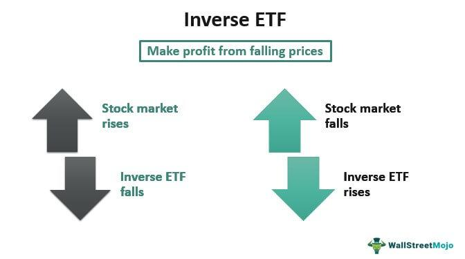

Inverse ETFs, or Inverse Exchange-Traded Funds, are unique financial instruments designed to yield returns opposing a specific index or benchmark. These tools play a significant role in the financial markets, especially during market downturns when investors seek strategies to hedge against declining asset values. Unlike traditional ETFs that track and replicate the performance of an index, inverse ETFs use derivative instruments, such as swaps, futures, and options, to achieve returns that are opposite to the daily performance of a corresponding index.

The integration of inverse ETFs into algorithmic trading strategies represents a sophisticated approach to maximizing gains and minimizing losses. Algorithmic trading, which involves the use of complex mathematical models and pre-programmed trading instructions, can effectively exploit the short-term nature of inverse ETFs. The daily reset feature of inverse ETFs means that they are primarily suitable for short-term strategies, making them a preferred choice for algorithmic traders who thrive on volatility and rapid market movements.



However, these financial instruments are not without risk. Investors must be aware of the inherent complexities and potential pitfalls associated with them. Inverse ETFs are typically more volatile and come with higher expense ratios due to the cost of the derivatives involved. As such, they require a deep understanding of both market mechanics and the specific characteristics of the ETFs in use.

In today's investment landscape, where leveraging market downturns through advanced technology has become increasingly popular, a comprehensive understanding of inverse ETFs, combined with algorithmic strategies, is crucial. This article aims to equip investors and traders with the essential knowledge required to navigate these powerful, albeit intricate, financial tools. By examining key concepts, potential benefits, and associated risks, readers can better position themselves to make informed decisions in utilizing inverse ETFs.

## Table of Contents

## Understanding Inverse ETFs

Inverse ETFs, or inverse exchange-traded funds, are specialized financial instruments designed to deliver returns that are the opposite of those generated by a particular index or benchmark. This distinctive feature is achieved through the utilization of derivative securities, including swaps, futures, and options. 

### Construction and Functionality

Inverse ETFs employ derivatives to bet against the performance of an index, with the ultimate goal of achieving a negative correlation with the index's daily returns. The daily reset feature of these ETFs ensures that the inverse relationship is maintained over short-term periods. This means that if an index declines by a certain percentage in a day, an inverse [ETF](/wiki/etf-trading-strategies) designed to track that index should ideally gain that same percentage, minus fees and expenses.

The formula commonly used to calculate the daily return of an inverse ETF can be simplified as:

$$

\text{Inverse ETF Return} = -1 \times (\text{Index Return})
$$

This formula encapsulates the primary mechanism by which inverse ETFs operate, wherein the gain or loss is strictly contingent upon the daily move of the underlying index or benchmark.

### Strategic Applications

Inverse ETFs are primarily designed for short-term investment horizons, often less than a single trading day, due to their structural reset nature. This daily rebalancing can lead to a phenomenon known as [volatility](/wiki/volatility-trading-strategies) decay if held for extended periods. Consequently, investors typically deploy inverse ETFs as hedging instruments against market downturns, providing a cushion against negative market movements in broader portfolios comprised of long positions.

Using inverse ETFs for hedging requires an understanding of the specific market dynamics and investor risk tolerance, as well as an ability to execute trades timely and in response to market shifts. Their utility in a strategic context is thus twofold: they allow investors to potentially profit from declining markets and provide a method to mitigate losses in a diversified investment portfolio. 

Despite their tactical advantages, such as ease of trading on exchanges like regular stocks, inverse ETFs [carry](/wiki/carry-trading) their own set of risks. The use and reliance on derivatives introduce complexities that necessitate thorough comprehension and careful management, emphasizing the importance of understanding how these ETFs function within broader market strategies.

## Leveraged Inverse ETFs: Pros and Cons

Leveraged inverse ETFs are designed to provide amplified inverse returns relative to their benchmarks, typically next-day outcomes. This amplification means that if the benchmark index decreases by a certain percentage, a 2x or 3x leveraged inverse ETF might increase by two or three times that percentage on that day. These instruments offer both opportunities and challenges for traders seeking to benefit from short-term market movements.

**Advantages of Leveraged Inverse ETFs**

One significant advantage of leveraged inverse ETFs is their potential for substantial short-term gains. Due to their amplified nature, they can yield high returns when market conditions align with investors' expectations. Additionally, they serve as effective short-term hedging tools. Traders anticipating a market downturn can use these ETFs to protect existing portfolios, potentially offsetting losses in other asset classes.

**Risks Associated with Leveraged Inverse ETFs**

Despite their advantages, leveraged inverse ETFs come with considerable risks. One primary concern is volatility decay, often attributed to the compounding effects of daily resets. This is particularly evident in volatile markets where the mathematical process of daily resetting might lead to a different cumulative return than expected over an extended period. Here's an illustrative formula for this decay when leveraging factors over time:

$$
R_{\mathrm{end}} = \prod_{i=1}^{n} (1 + L \times r_i) - 1
$$

Where:
- $R_{\mathrm{end}}$ is the net return at the end,
- $L$ is the leverage factor,
- $r_i$ is the daily return of the index.

Another challenge is the necessity for precise market timing. Traders need to predict market downturns accurately to capitalize effectively on these instruments. Additionally, leveraged inverse ETFs often incur higher costs due to management fees and expenses related to maintaining derivatives positions. These higher costs can erode returns over time. Furthermore, the amplified nature of these ETFs means losses can also be magnified, potentially leading to significant financial setbacks if market movements are not correctly anticipated.

**Conclusion**

The combination of potential high rewards and elevated risks makes leveraged inverse ETFs suitable primarily for sophisticated investors who can tolerate volatility and manage the complexities of these instruments. Proper understanding and application are crucial, emphasizing the need for thorough market analysis and disciplined trading approaches. Investors should carefully consider their ability to manage these risks before incorporating leveraged inverse ETFs into their strategies.

## Market Trends and Their Impact

Understanding market trends is vital for implementing successful inverse ETF strategies. These financial instruments are designed to deliver returns opposite to the direction of a specific index, and their effectiveness is heavily influenced by prevailing market conditions. Several key factors contribute to market trends, each affecting investor sentiment and inverse ETF performance.

Economic indicators such as interest rates and GDP growth significantly shape market sentiment. For instance, an increase in interest rates typically results in a bearish market as borrowing costs rise, potentially benefiting inverse ETFs. Conversely, strong GDP growth might signal a bullish trend, reducing the effectiveness of inverse ETFs. Investors should continually monitor these indicators to align their strategies with current market conditions.

News events, encompassing both geopolitical and macroeconomic developments, can lead to rapid market fluctuations. Political tensions or unexpected economic policy changes can introduce volatility, which inverse ETFs are positioned to capitalize on. However, the unpredictable nature of these events makes real-time information essential for timely strategy adjustments.

Technical analysis tools provide another layer of market insight, helping to predict potential shifts and optimize trade execution. Indicators such as moving averages, relative strength index (RSI), and Bollinger Bands can help identify trends and reversals. For instance, a trader using a simple moving average crossover strategy might enter an inverse ETF position when the short-term average crosses below the long-term average, signaling a potential decline in the index.

Python, as a programming tool, can be used to automate these analyses. Here is a simple example using Python's pandas and matplotlib libraries:

```python
import pandas as pd
import matplotlib.pyplot as plt

# Hypothetical data: let's assume we have a DataFrame 'df' with date and closing prices
# df = pd.DataFrame(...)

# Calculate moving averages
df['Short_MA'] = df['Close'].rolling(window=20).mean()
df['Long_MA'] = df['Close'].rolling(window=50).mean()

# Plot
plt.figure(figsize=(12, 6))
plt.plot(df['Date'], df['Close'], label='Close Price')
plt.plot(df['Date'], df['Short_MA'], label='20-day MA')
plt.plot(df['Date'], df['Long_MA'], label='50-day MA')
plt.xlabel('Date')
plt.ylabel('Price')
plt.title('Stock Price & Moving Averages')
plt.legend()
plt.show()
```

Successful trading strategies involve integrating diverse data sources for a comprehensive market overview. This includes not only technical analysis and economic indicators but also sentiment analysis from news and social media, providing a holistic approach to market prediction. By synthesizing these varied inputs, investors can better forecast market movements and refine their inverse ETF strategies accordingly.

In summary, a well-rounded understanding of market trends, supported by both qualitative news events and quantitative technical analysis, is essential for optimizing inverse ETF utilization. Such comprehension allows investors and traders to anticipate market dynamics and tailor their strategies to achieve desired outcomes, even in the face of complexity and uncertainty.

## Selecting the Right Inverse ETF for Your Strategy

When selecting the right inverse ETF for your strategy, it is essential to consider several key factors to ensure alignment with your investment objectives and risk tolerance. Understanding the underlying index that the ETF is designed to inversely replicate is the first step. This involves knowing the index's components, their sectoral distribution, and historical performance patterns, as these elements will influence how the inverse ETF behaves under various market conditions.

Another critical consideration is the ETF's fee structure. Management fees and other expenses can erode returns over time, even if the ETF performs well. Investors should examine the ETF's expense ratio, which represents the annual fee expressed as a percentage of average assets under management. It's important to weigh these costs against the potential benefits the ETF offers to ensure that the prospective returns justify the expenses.

Liquidity and trading [volume](/wiki/volume-trading-strategy) are also significant factors to assess. High [liquidity](/wiki/liquidity-risk-premium) implies that the ETF can be easily bought or sold without substantially affecting its price. Low liquidity may lead to higher bid-ask spreads, increasing transaction costs and the risk of slippage. Investors should examine the average daily trading volume and bid-ask spreads to gauge liquidity. A higher trading volume generally indicates better liquidity, reducing the risk of significant price impacts when executing trades.

Volatility and historical performance provide insights into how well the ETF might align with strategic goals. By analyzing historical volatility, investors can estimate the potential risk and return profile of the ETF. This analysis often includes observing the ETF's past performance in various market cycles to understand its responsiveness to market downturns or volatility spikes, thereby aiding in decision-making processes that are informed by empirical data.

Considering the ETF's trading volume is crucial for avoiding slippage, a condition where the execution price deviates from the expected price. Slippage can significantly impact returns, particularly in fast-moving markets where prices can change rapidly. By selecting ETFs with higher trading volumes, investors mitigate this risk, ensuring that market orders are filled efficiently and at prices close to their quoted levels.

Lastly, a comprehensive selection process considers the overall suitability of the ETF in the context of the investor's broader portfolio strategy. This involves aligning personal risk tolerance, investment objectives, and the anticipated economic outlook with the characteristics of the ETF. Through careful analysis and consideration of these factors, investors can select inverse ETFs that complement their investment strategies, providing effective hedging or speculative opportunities as dictated by their financial goals.

## Portfolio Diversification with Inverse ETFs

Inverse ETFs, which provide inverse returns to a given market index, can serve as an effective tool for diversification and risk mitigation during market downturns. Unlike traditional ETFs that aim to replicate the positive performance of an index, inverse ETFs are designed to increase in value when the underlying index declines. This characteristic makes them particularly appealing for investors seeking to hedge their long positions or protect their portfolios against market adversities.

By acting as a counterbalance to long positions, inverse ETFs can enhance portfolio stability. For instance, during periods of market decline, the gains from inverse ETFs might offset losses in other areas of the portfolio, thereby smoothing out overall returns. This is akin to employing a strategy of negative correlation within one’s asset allocation, where inverse ETFs contribute to overall risk management and return optimization.

However, investors must exercise caution when integrating inverse ETFs into their broader asset allocations. Given their derivative-based structure and daily resetting feature, these instruments can introduce significant volatility, especially over longer holding periods. Therefore, it is crucial for investors to align their inverse ETF usage with their risk tolerance and economic outlook. For example, an investor with a higher risk tolerance might allocate a larger portion of their portfolio to inverse ETFs during expected bear markets, whereas a more conservative investor might limit exposure to these instruments or use them only as a short-term hedge.

Successful portfolio construction involving inverse ETFs requires a careful assessment of the risks they introduce. Investors should evaluate potential risks alongside expected returns and ensure that the inclusion of inverse ETFs does not disproportionately skew their overall risk profile. Maintaining a balanced strategy is essential, and regular portfolio reviews can help identify any needed adjustments to stay aligned with long-term investment goals.

In conclusion, when managed prudently, inverse ETFs can act as a valuable component of a diversified investment strategy aimed at safeguarding against market declines while maintaining a level of exposure conducive to achieving broader financial objectives.

## Timing and Execution in Inverse ETF Trading

Proper timing and execution play a pivotal role in trading inverse Exchange-Traded Funds (ETFs), primarily due to their short-term focus. Inverse ETFs are crafted to move in the opposite direction to their underlying index or benchmark, resetting daily. This unique feature necessitates meticulous timing for entry and [exit](/wiki/exit-strategy) points, ensuring alignment with prevailing market conditions.

Economic indicators serve as critical tools in determining the most opportune moments to execute trades. Key indicators such as interest rates, unemployment data, and GDP growth can signal market trends that influence the performance of inverse ETFs. Traders often assess these indicators to adjust their positions in anticipation of market shifts. For example, an unexpected [interest rate](/wiki/interest-rate-trading-strategies) hike may trigger a market downturn, presenting a potential entry point for an inverse ETF.

Technical analysis is indispensable in enhancing timing precision for inverse ETF trades. Techniques such as moving averages, Relative Strength Index (RSI), and Bollinger Bands are commonly employed. The moving average, in particular, helps smooth price action over specific time periods, enabling traders to identify trends and potential reversal points. For instance, when the price of an index crosses below its moving average, it may suggest a declining trend, offering a viable entry point for an inverse ETF.

Aligning trades with market [momentum](/wiki/momentum) is crucial in optimizing returns and minimizing risks. Momentum refers to the rate at which prices move and can provide valuable insights into the strength and direction of a trend. Traders often use momentum indicators to confirm the robustness of a trend before executing trades. By ensuring that trades correspond with momentum, investors can capitalize on the market's natural direction, thus reducing the likelihood of adverse outcomes.

Disciplined execution is vital, emphasizing the importance of objective decision-making over speculation. Successful traders adhere to predefined rules and strategies, mitigating emotional impulses that could lead to suboptimal decisions. This disciplined approach entails setting entry and exit criteria based on comprehensive analysis rather than reacting to short-term market noise. 

In summary, effective timing and execution in inverse ETF trading necessitate a strategic and analytical approach. Traders must leverage economic indicators and technical analysis to identify optimal entry and exit points while aligning with market momentum to achieve favorable outcomes. A commitment to disciplined execution ensures that trades are systematic and not governed by speculation, thereby enhancing the probability of success in this complex trading environment.

## Risk Management in Inverse ETF Trading

Effective risk management is essential when trading inverse ETFs due to their inherent volatility and unique structural characteristics. Setting stop-loss limits is a primary technique to manage potential losses in volatile markets. A stop-loss order automatically sells the ETF when its price reaches a predetermined level, thereby limiting the loss. For instance, if an inverse ETF is purchased at $50, a stop-loss limit can be set at $45 to contain the downside risk to 10%.

Diversification of holdings is another critical aspect of mitigating risk in inverse ETF trading. By integrating inverse ETFs with an array of other asset classes, investors can buffer their portfolios against market volatility. This diversification minimizes exposure to the extreme fluctuations typical of inverse ETFs while still leveraging their potential to capitalize on market downturns.

Continuous market monitoring ensures traders can swiftly respond to changing conditions. This involves keeping track of macroeconomic indicators, such as interest rates and inflation, which can affect market sentiment and the performance of inverse ETFs. Tools and platforms that provide real-time updates and allow for the setting of alerts can help traders maintain an agile approach.

Regular risk assessments are pivotal to ensuring that trading strategies stay relevant with evolving market conditions. By periodically reevaluating risk metrics such as the beta, volatility, and correlation of inverse ETFs to other portfolio components, investors can adjust their positions to maintain strategic alignment. 

Adopting disciplined risk management practices reduces the risks associated with inverse ETFs. This includes adhering strictly to pre-defined risk tolerance levels, using technical analysis to inform entry and exit decisions, and avoiding emotional trading. By maintaining a structured approach, traders and investors can better navigate the complexities of inverse ETFs and optimize their overall portfolio stability.

## Backtesting Inverse ETF Strategies

Backtesting inverse ETF strategies is an essential practice for traders and investors seeking to understand and optimize their investment approaches prior to actual deployment. This process allows for the analysis of how a trading strategy might have performed using historical data.

### Simulating Trades Using Historical Data

Backtesting begins with the collection of historical market data, which is crucial for conducting accurate simulations. This data should be comprehensive and include prices, volumes, and any other relevant financial information. The objective is to create a realistic environment where past market conditions are replicated. For inverse ETFs, this may involve data regarding the ETFs themselves as well as their underlying indices.

A typical simulation setup involves programming a model to execute hypothetical trades according to specific strategic rules. Python is often used for this due to its robust libraries such as `pandas` for data manipulation and `numpy` for numerical operations.

```python
import pandas as pd

# Example of setting up historical price data for backtesting
historical_data = pd.DataFrame({
    'date': ['2023-01-01', '2023-01-02', '2023-01-03'],
    'etf_price': [100, 102, 101],
    'benchmark_price': [200, 198, 199]
})
```

### Strategy Performance Evaluation

Once the historical simulation is established, key metrics are used to evaluate the strategy's performance:

- **Total Returns**: Measures the overall profitability of the strategy. This can be calculated by aggregating the returns from each trade over the backtesting period.
- **Sharpe Ratio**: An assessment of risk-adjusted returns. It is calculated as the average return earned in excess of the risk-free rate per unit of volatility or total risk. The formula is:
$$
  \text{Sharpe Ratio} = \frac{E[R] - R_f}{\sigma}

$$
  where $E[R]$ is the expected return, $R_f$ is the risk-free rate, and $\sigma$ is the standard deviation of portfolio return.
- **Drawdown Analysis**: Analysis of the peak-to-trough decline during a specific period, which helps in understanding the potential risks and losses involved in using the strategy.

### Simulation and Strategy Optimization

Backtesting also involves the optimization of strategies. This means adjusting the parameters of the trading strategy to enhance performance. Optimization is done cautiously to avoid overfitting, where a strategy might perform well on historical data but poorly in live trading due to its excessive specificity to past data. Techniques such as walk-forward optimization can be used to test the strategy on different periods of historical data to ensure its robustness.

### Benefits and Limitations

Backtesting provides traders with a framework to refine their strategies and make informed decisions before applying them in real-world scenarios. However, it is essential to understand that past performance is not indicative of future results. Changes in market dynamics, economic conditions, and geopolitical factors can all impact the effectiveness of a strategy.

In conclusion, [backtesting](/wiki/backtesting) inverse ETF strategies is a critical tool that allows for the validation and fine-tuning of trading approaches, helping to improve potential success in live markets. It emphasizes the necessity of discipline and continual reassessment in the rapidly changing financial landscape.

## Conclusion and Key Takeaways

Inverse ETFs present a compelling investment choice, but they necessitate a comprehensive strategic framework. The distinctive characteristics of inverse ETFs, particularly their tendency to reset daily, introduce unique management challenges. This daily resetting can result in returns that deviate from the expected inverse of the benchmark index over longer periods, a phenomenon known as "volatility decay." Therefore, investors must exercise caution and employ a vigilant approach to manage these instruments effectively.

An essential component of successful inverse ETF trading is staying informed through continuous market analysis. This involves integrating various market indicators, technical analysis, and economic news to maintain a robust understanding of market dynamics. By consistently applying disciplined trading strategies, investors can enhance their ability to make informed decisions and potentially capitalize on market downturns.

Backtesting is another critical aspect that investors should incorporate into their strategy validation process. By simulating trades using historical data and evaluating performance against key metrics such as total returns, the Sharpe ratio, and drawdowns, investors can determine the viability and robustness of their strategies before implementing them in live markets. This practice helps in identifying strengths and weaknesses, allowing for fine-tuning and optimization of trading approaches.

The disciplined and informed application of inverse ETFs offers significant advantages, including hedging capabilities and portfolio diversification benefits. However, the intricate nature of these instruments demands a high level of strategy understanding and prudence. By acknowledging and managing the inherent risks, such as volatility and daily resetting, investors can position themselves to leverage inverse ETFs effectively, thus enhancing their overall investment outcomes.

## References & Further Reading

[1]: ["Advances in Financial Machine Learning"](https://www.amazon.com/Advances-Financial-Machine-Learning-Marcos/dp/1119482089) by Marcos Lopez de Prado

[2]: ["Evidence-Based Technical Analysis: Applying the Scientific Method and Statistical Inference to Trading Signals"](https://www.amazon.com/Evidence-Based-Technical-Analysis-Scientific-Statistical/dp/0470008741) by David Aronson

[3]: ["Machine Learning for Algorithmic Trading"](https://github.com/stefan-jansen/machine-learning-for-trading) by Stefan Jansen

[4]: ["Quantitative Trading: How to Build Your Own Algorithmic Trading Business"](https://www.amazon.com/Quantitative-Trading-Build-Algorithmic-Business/dp/1119800064) by Ernest P. Chan

[5]: ["Inverse ETFs: A Primer"](https://www.forbes.com/advisor/investing/best-inverse-etfs/) by SEC.gov

[6]: ["Exchange-Traded Funds’ Performance: A Market Analysis"](https://papers.ssrn.com/sol3/papers.cfm?abstract_id=972690) Journal of Finance Article available on JSTOR

[7]: Avellaneda, M., & Lee, J. (2010). ["Statistical arbitrage in the US equities market."](https://papers.ssrn.com/sol3/papers.cfm?abstract_id=1153505) Statistical Analysis and Data Mining: The ASA Data Science Journal.