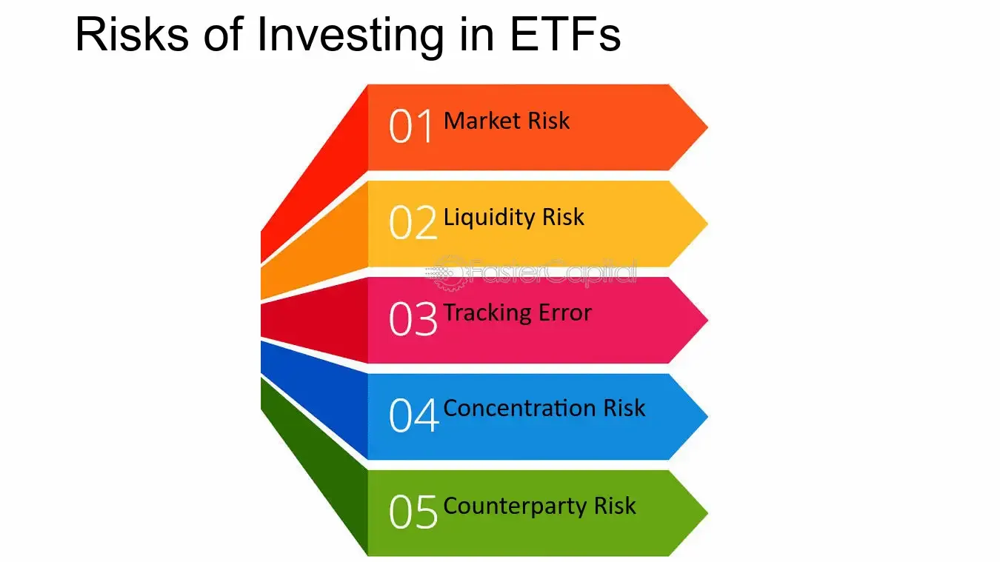

## Table of Contents

## What are ETFs and how do they work?

ETFs, or Exchange-Traded Funds, are a type of investment that combines the benefits of stocks and mutual funds. They are collections of stocks, bonds, or other assets that you can buy and sell on a stock exchange, just like individual stocks. This makes them easy to trade throughout the day at market prices, unlike mutual funds which are only priced at the end of each trading day.

When you invest in an ETF, you're essentially buying a small piece of a larger portfolio. For example, if you buy shares in an ETF that tracks the S&P 500, you're investing in all the companies in that index without having to buy each stock individually. ETFs often have lower fees than mutual funds because they are passively managed, meaning they follow a set index rather than having a manager actively picking stocks. This makes them a popular choice for investors looking to diversify their portfolio in a cost-effective way.

## What are the general risks associated with investing in ETFs?

Investing in ETFs comes with some risks that you should know about. One big risk is that the value of the ETF can go up and down because it's tied to the performance of the assets it holds. If the stocks or bonds in the ETF do poorly, the value of your investment will drop too. This is called market risk. Another risk is that ETFs that focus on a specific industry or region can be more volatile. If something bad happens in that industry or region, like a financial crisis or a natural disaster, the ETF's value can fall a lot.

There's also something called tracking error, which is when an [ETF](/wiki/etf-trading-strategies) doesn't perfectly follow the index it's supposed to mimic. This can happen because of fees, how the ETF is managed, or other factors. This means the ETF might not perform exactly as you expect. Lastly, [liquidity](/wiki/liquidity-risk-premium) risk is another concern. If an ETF isn't very popular, it might be hard to buy or sell it quickly without affecting its price. This can be a problem if you need to get your money out fast.

## How does market risk affect ETFs?

Market risk is a big deal when it comes to ETFs. It means that the value of your ETF can go up and down based on how well the stocks, bonds, or other things inside it are doing. If the market goes down, like during a big financial crisis, the value of your ETF will likely drop too. This is because ETFs hold a bunch of different investments, and if many of those investments lose value, the whole ETF loses value.

For example, if you have an ETF that follows the S&P 500, and the S&P 500 goes down because a lot of companies in it are not doing well, your ETF will also go down. This is something you have to think about when you invest in ETFs. You can't avoid market risk completely, but knowing about it can help you make smarter choices about which ETFs to buy and when to buy them.

## What is liquidity risk in the context of ETFs?

Liquidity risk with ETFs means it might be hard to buy or sell them quickly without changing their price. This can happen if not many people are trading that ETF. If you want to sell your ETF but there aren't many buyers, you might have to lower the price to find someone who wants to buy it. This can be a problem if you need your money fast.

On the other hand, if you want to buy an ETF that isn't very popular, you might have to pay more to get it. This is because there aren't many sellers, so they can ask for a higher price. So, when you're thinking about investing in ETFs, it's good to check how easy it is to trade them. ETFs that follow big, well-known indexes usually have less liquidity risk because lots of people are trading them.

## Can you explain tracking error and its impact on ETF performance?

Tracking error is when an ETF doesn't follow its target index perfectly. It's like trying to copy someone's dance moves but not getting every step right. This can happen because of fees the ETF charges, how the ETF is managed, or other little things. When the ETF doesn't match the index exactly, it can perform a bit differently than you might expect. 

This difference might not seem like a big deal, but it can add up over time. If an ETF is supposed to follow the S&P 500 but it's always a bit off, you might end up with returns that are a little higher or lower than the index. This can affect how much money you make or lose from your investment. So, when you're [picking](/wiki/asset-class-picking) an ETF, it's good to look at its tracking error to see how closely it follows its index.

## What are the tax implications of investing in ETFs?

When you invest in ETFs, you need to think about taxes. ETFs can be more tax-friendly than mutual funds because of how they work. When you sell an ETF, you might have to pay capital gains tax. This tax depends on how long you held the ETF. If you held it for more than a year, you'll pay a long-term capital gains tax, which is usually lower than the short-term tax you'd pay if you held it for less than a year.

Another thing to know is that ETFs often create fewer taxable events than mutual funds. This is because of how they handle buying and selling the stocks inside them. When people want to sell their shares of an ETF, the ETF can give them the actual stocks instead of selling them and causing a taxable event. This can help you keep more of your money. But remember, you should always talk to a tax advisor to understand how ETFs will affect your taxes because everyone's situation is different.

## How does the structure of an ETF (physical vs. synthetic) influence its risk profile?

The structure of an ETF can make a big difference in how risky it is. Physical ETFs own the actual stocks, bonds, or other assets they are supposed to track. This means they have less risk because they are directly tied to the performance of those assets. If something goes wrong with one of the companies in the ETF, it will affect the ETF's value, but you can see exactly what's in it and how it's doing. This kind of ETF is usually seen as safer because it's more straightforward.

On the other hand, synthetic ETFs use financial contracts like swaps to mimic the performance of an index without actually owning the assets. This can make them riskier because they depend on the other party in the swap to pay up. If that party can't or won't pay, the ETF could lose a lot of money. Also, synthetic ETFs can be more complex and harder to understand, which adds another layer of risk. So, when you're choosing an ETF, it's good to know if it's physical or synthetic to understand the risks better.

## What are the risks associated with leveraged and inverse ETFs?

Leveraged and inverse ETFs are a bit trickier than regular ETFs. Leveraged ETFs aim to give you returns that are two or three times what the index they track does. This means if the index goes up, your ETF goes up a lot more, but if it goes down, your ETF goes down a lot more too. This can be really risky because the market can be unpredictable, and big losses can happen fast. Inverse ETFs, on the other hand, are designed to go up when the index they track goes down. They're like betting against the market. But just like with leveraged ETFs, if you guess wrong, you can lose a lot of money quickly.

Another thing to watch out for with these ETFs is that they're meant for short-term trading, not long-term investing. If you hold them for a long time, the daily resetting of their leverage can lead to something called "[volatility](/wiki/volatility-trading-strategies) decay." This means even if the market stays the same over time, the value of your ETF can still go down. So, if you're thinking about investing in leveraged or inverse ETFs, make sure you understand these risks and are ready to keep a close eye on your investments.

## How do sector-specific and thematic ETFs carry unique risks?

Sector-specific ETFs focus on a single industry, like technology or healthcare. This can be risky because if something bad happens to that industry, like new laws or a big company going bankrupt, the value of your ETF can drop a lot. For example, if you invest in a tech ETF and there's a big cyber attack that hurts tech companies, your investment could lose value quickly. These ETFs are not as spread out as ones that follow a broad index, so they can go up and down more.

Thematic ETFs are similar but they focus on trends or themes, like clean energy or [artificial intelligence](/wiki/ai-artificial-intelligence). The risk here is that the theme might not catch on as expected or could fall out of favor. If people lose interest in the theme, like if they start to doubt the future of electric cars, the ETF's value can go down. Also, these themes can be hard to define clearly, so what's in the ETF might change a lot, making it harder to predict how it will do. Both sector-specific and thematic ETFs can be exciting, but they come with extra risks because they're not as diversified as broad market ETFs.

## What role does the management fee play in the overall risk and return of an ETF?

The management fee is like a small charge you pay for someone to look after your ETF. This fee can make a big difference in how much money you make from your investment. If the fee is high, it means less money goes into your pocket because it's taken out of the ETF's returns. Over time, even a small fee can add up and eat into your profits. So, when you're choosing an ETF, it's smart to look at the management fee to see how it might affect your returns.

But the management fee also plays a part in the risk of an ETF. ETFs with lower fees are often the ones that just follow an index, which means they're less risky because they're not trying to beat the market. On the other hand, ETFs with higher fees might be trying to do better than the market by picking certain stocks or using fancy strategies. This can be riskier because it might not work out, and you're paying more for the chance that it might. So, the management fee can tell you a lot about both the risk and the return of an ETF.

## How can international ETFs introduce currency risk to an investor's portfolio?

When you invest in international ETFs, you're not just betting on how well companies in other countries will do. You're also dealing with currency risk. This means that the value of your investment can change because of changes in exchange rates between your home currency and the currency of the countries where the ETF invests. For example, if you're from the U.S. and you invest in a European ETF, and the euro gets weaker compared to the dollar, the value of your investment in dollars will go down, even if the companies in the ETF are doing well.

This currency risk can add another layer of uncertainty to your investment. If the currency of the country where the ETF invests goes down a lot, it can wipe out any gains you might have made from the companies doing well. On the other hand, if the currency gets stronger, it can boost your returns. So, when you're thinking about investing in international ETFs, it's important to keep an eye on what's happening with exchange rates and understand how they might affect your money.

## What are some advanced strategies to mitigate risks when investing in ETFs?

One way to lower the risks when investing in ETFs is to spread your money around. Instead of putting all your money into one ETF, you can invest in a few different ones. This way, if one ETF does badly, the others might do well and balance things out. You can pick ETFs that focus on different things, like different countries, industries, or types of investments. This is called diversification, and it can help protect your money from big losses.

Another smart move is to keep an eye on how your ETFs are doing and be ready to make changes. If you see that an ETF is not doing well or if something big happens in the market, you might want to sell it and buy a different one. This is called active management. It's also a good idea to look at the fees of the ETFs you're thinking about. Lower fees mean more money stays in your pocket, which can help your investment grow over time. By staying on top of things and being willing to adjust your investments, you can better handle the ups and downs of the market.

## What are the common risks associated with ETF investments?

Exchange-Traded Funds (ETFs) are popular investment vehicles because of their ability to diversify portfolios. However, like all investments, ETFs come with various risks that investors must fully understand to make informed decisions.

**Market Risk:** ETFs, being traded on stock exchanges, are susceptible to market risk, which involves the potential for loss due to fluctuations in market prices. For instance, during periods of high market volatility, the value of ETFs can decline, leading to potential financial losses for investors. This risk is intrinsic to any market-traded security and underscores the importance of market analysis and timing.

**Tracking Error:** A tracking error arises when an ETF's performance doesn't exactly match its benchmark index. This discrepancy might occur due to factors such as management fees, imperfect replication of the index, or corporate actions affecting the index constituents. Tracking error is a critical measure for investors to assess how well an ETF aligns with its intended benchmark. A formula often used for calculating tracking error is:

$$
\text{Tracking Error} = \sqrt{\frac{1}{n-1} \sum_{i=1}^{n}(R_i - B_i - \bar{d})^2}
$$

where $R_i$ is the ETF's return, $B_i$ is the benchmark return, and $\bar{d}$ is the average difference between $R$ and $B$.

**Liquidity Risk:** While ETFs are generally known for their liquidity, some may exhibit lower trading volumes, leading to liquidity risk. This situation can result in higher transaction costs or difficulty in executing large buy or sell orders without affecting the market price significantly. Investors should consider the average daily trading volume and market depth of an ETF as indicators of its liquidity.

**Operational Risks:** These risks stem from potential mishaps in the management or administration of the ETF. Operational risks can include incorrect pricing or valuation of the underlying assets, fund management errors, or technological glitches impacting trades and transactions. Such issues can adversely affect the ETF's performance and investor returns.

**Regulatory Risks:** Changes in regulations can significantly influence the ETF market. New financial legislative measures, tax law adjustments, or alterations in compliance requirements can impact how ETFs are structured, managed, and utilized within investment portfolios. Regulatory changes can also affect investor returns and the overall ETF landscape, making it essential for investors to stay informed about legal developments in the financial market.

## References & Further Reading

[1]: Walters, Mark. "The Costs of Investing in Mutual Funds vs. ETFs." Financial Planning Review, vol. 28, no. 4, 2021, pp. 246-255.

[2]: ["Quantitative Risk Management: Concepts, Techniques and Tools"](https://press.princeton.edu/books/hardcover/9780691166278/quantitative-risk-management) by Alexander J. McNeil, Rüdiger Frey, and Paul Embrechts

[3]: Vayanos, Dimitri, and Jiang Wang. "Market Liquidity: Theory and Empirical Evidence." Journal of Financial Markets, vol. 48, 2019, pp. 1-34. [DOI:10.1016/j.finmar.2019.04.006](http://web.mit.edu/wangj/www/pap/VayanosWang12Empirical.pdf)

[4]: Khandani, Amir E., and Andrew W. Lo. "What Happened To The Quants In August 2007?: Evidence from Factors and Transactions Data." Journal of Financial Markets, vol. 14, no. 1, 2011, pp. 1-46. [DOI:10.1016/j.finmar.2010.07.005](https://www.nber.org/papers/w14465)

[5]: ["High-Frequency Trading: A Practical Guide to Algorithmic Strategies and Trading Systems"](https://www.ahmetbeyefendi.com/wp-content/uploads/2020/07/High-Frequency-Trading-Irene-Aldridge.pdf) by Irene Aldridge

[6]: "The Flash Crash: The Impact of High-Frequency Trading on an Electronic Market." The Journal of Finance, vol. 67, no. 3, 2012, pp. 1451-1486. [DOI:10.1111/j.1540-6261.2012.01776.x](https://www.semanticscholar.org/paper/The-Flash-Crash%3A-The-Impact-of-High-Frequency-on-an-Kirilenko/8b1ffc3141994bf9a294f984ca2c6311fc14b1ac)