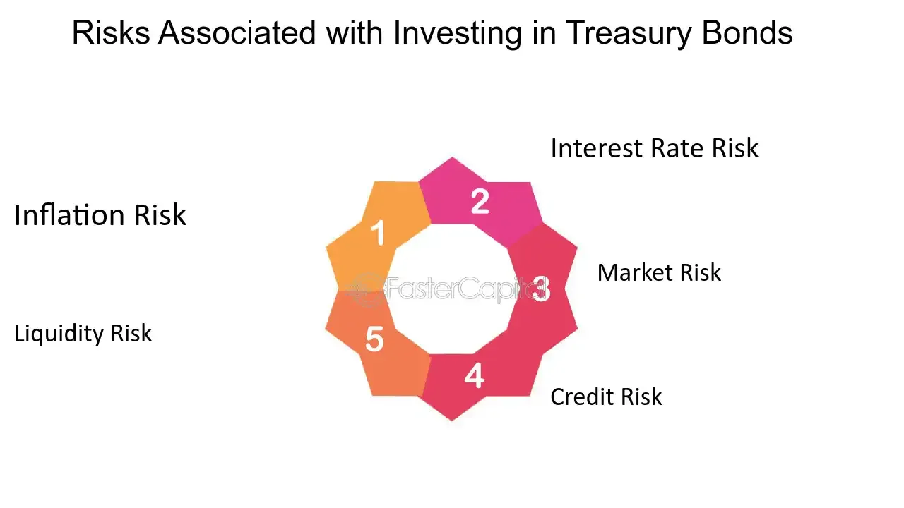

## Table of Contents

## What are Treasury bonds and how do they work?

Treasury bonds are a type of loan you give to the government. When you buy a Treasury bond, you're lending money to the U.S. government, and in return, they promise to pay you back with interest over time. These bonds are considered very safe because they are backed by the full faith and credit of the U.S. government, meaning the government is highly likely to pay you back.

When you buy a Treasury bond, you get regular interest payments, usually every six months, until the bond matures. The maturity date is when the government pays you back the full amount you loaned them. Treasury bonds usually have long terms, often 20 or 30 years. You can hold onto the bond until it matures, or you can sell it to someone else before it matures if you need your money back sooner.

## What are the basic risks involved in investing in Treasury bonds?

Investing in Treasury bonds is generally seen as safe, but there are still some risks to consider. One main risk is interest rate risk. This means that if interest rates go up after you buy a bond, the value of your bond might go down. If you need to sell your bond before it matures, you might get less money than you paid for it. This happens because new bonds being sold will have higher interest rates, making your older bond less attractive to buyers.

Another risk is inflation risk. Inflation is when the prices of things you buy go up over time. If inflation goes up a lot, the interest you earn on your bond might not keep up with the rising prices. This means that the money you get back when your bond matures might not be worth as much as when you first invested it. So, even though you get your money back, it might not buy as much as it used to.

Lastly, there's also the risk that you might need your money back before the bond matures. Treasury bonds are meant to be held until they mature, but if you have to sell them early, you might lose money, especially if interest rates have gone up or if the bond market is not doing well at that time. So, it's important to think about how long you can afford to have your money tied up in these bonds.

## How does interest rate risk affect Treasury bond investments?

Interest rate risk is a big deal when you invest in Treasury bonds. It means that if interest rates go up after you buy a bond, the value of your bond can go down. Here's why: when new bonds are issued with higher interest rates, they look better to investors than your older bond with a lower rate. If you want to sell your bond before it matures, you might have to sell it for less than what you paid for it. This is because people will pay more for the new bonds that give them more interest.

Let's say you bought a bond that pays 2% interest, but then interest rates go up to 3%. If you try to sell your 2% bond, no one will want to buy it at the price you paid because they can get a new bond that pays more. So, you might have to lower the price of your bond to make it attractive to buyers. This is how [interest rate](/wiki/interest-rate-trading-strategies) risk can affect the value of your Treasury bond investment if you need to sell it before it matures.

## What is inflation risk and how does it impact the returns on Treasury bonds?

Inflation risk is when the prices of things you buy go up over time. If inflation goes up a lot, the interest you earn on your Treasury bonds might not keep up with those rising prices. This means the money you get back when your bond matures might not buy as much as it could when you first invested it. So, even though you get your money back, it might not be worth as much because everything costs more.

For example, if you bought a Treasury bond that pays you 2% interest each year, but inflation goes up to 3% each year, the buying power of your money is actually going down. After a year, the money you get from the bond can buy less than it could before. This is how inflation risk can make the returns on your Treasury bonds less valuable over time.

## Can you explain credit risk in relation to Treasury bonds?

Credit risk is the chance that the borrower won't be able to pay back the money they borrowed. When it comes to Treasury bonds, credit risk is very low. This is because Treasury bonds are loans to the U.S. government, and the government has a strong ability to pay back its debts. The U.S. government can raise money through taxes and can also print more money if it really needs to. So, people trust that the government will pay back what it owes, which makes Treasury bonds very safe.

However, even though the risk is low, it's not zero. There have been times in history when people worried about the U.S. government's ability to pay its debts, like during debates over raising the debt ceiling. If the government ever failed to make payments on its bonds, that would be a big problem. But these events are very rare, and most investors feel safe because of the government's strong track record and its power to manage its finances.

## How does reinvestment risk influence the overall yield of Treasury bonds?

Reinvestment risk is when you get your interest payments from Treasury bonds and have to put that money back into new investments. If interest rates have gone down since you bought your original bond, you'll have to reinvest your money at a lower rate. This can mean you end up with less money overall than if you could have kept reinvesting at the higher rate you started with.

For example, imagine you bought a Treasury bond that pays 3% interest every year. If after a few years, interest rates drop to 1%, the money you get from your bond's interest payments will only earn 1% when you reinvest it. This can lower the total amount of money you make from your investment over time because you're not getting as much interest on the interest you've earned.

## What is liquidity risk and how might it affect Treasury bond investments?

Liquidity risk is the chance that you might not be able to sell your Treasury bond quickly or at a good price when you need to. Treasury bonds are usually pretty easy to sell, but sometimes the market can be slow or not many people want to buy them. If you need to sell your bond fast and there aren't many buyers, you might have to sell it for less money than you wanted.

This risk can affect your investment because if you have to sell your bond at a lower price, you lose money. It's important to think about how soon you might need your money back. If you can hold onto your bond until it matures, you don't have to worry about [liquidity](/wiki/liquidity-risk-premium) risk as much. But if you might need to sell it early, you need to be ready for the possibility that you won't get as much money as you hoped.

## How do market conditions and economic cycles influence the risks of investing in Treasury bonds?

Market conditions and economic cycles can really change the risks of investing in Treasury bonds. When the economy is doing well, people might want to invest in things that could give them more money, like stocks. This can make interest rates go up because the government has to offer more to get people to buy their bonds. If you already own a bond with a lower interest rate, its value might go down because new bonds look better to buyers. Also, if the economy is booming, inflation might go up, which can make the money you get from your bond worth less over time.

On the other hand, when the economy is not doing so well, people might see Treasury bonds as a safe place to put their money. This can make interest rates go down because a lot of people want to buy bonds. If you own a bond with a higher interest rate, its value might go up because it's more attractive to buyers. But if you need to sell your bond in a bad economy and the bond market is not doing well, you might still have trouble finding buyers and have to sell at a lower price. So, the ups and downs of the economy can make the risks of investing in Treasury bonds go up or down.

## What are the tax implications of investing in Treasury bonds and how do they affect the net return?

When you invest in Treasury bonds, you have to think about taxes. The good news is that the interest you get from Treasury bonds is not taxed by states or local governments. This means you don't have to pay state or local taxes on the interest you earn. But, you still have to pay federal taxes on that interest. So, if you live in a place with high state taxes, Treasury bonds can be a good choice because you save money on those taxes.

The tax rules can affect how much money you really make from your investment. Since you don't pay state or local taxes on the interest, your net return might be better than if you invested in something else that gets taxed by all levels of government. But remember, you still have to pay federal taxes, so you need to figure out how much those taxes will take away from your earnings. This can help you decide if Treasury bonds are the best choice for you based on your tax situation.

## How can duration and convexity be used to assess and manage risks in Treasury bond portfolios?

Duration and convexity are important tools that help you understand and manage the risks in your Treasury bond portfolio. Duration measures how sensitive your bond's price is to changes in interest rates. If a bond has a high duration, its price will change a lot when interest rates go up or down. This helps you see how much risk you're taking with your bonds. For example, if you think interest rates might go up, you might want to choose bonds with a lower duration to protect your investment from big price drops.

Convexity adds another layer to this by showing how the duration changes when interest rates move. It's like a fine-tuning tool for your risk management. If a bond has high convexity, it means its price will not fall as much as you might expect when interest rates go up, and it might go up more than expected when rates go down. By looking at both duration and convexity, you can pick bonds that fit your risk comfort level and help you plan better for different interest rate scenarios.

## What are the advanced strategies for mitigating risks associated with Treasury bonds?

One advanced strategy for managing risks in Treasury bonds is using a laddering approach. This means you buy bonds that mature at different times, like having some that mature in one year, some in five years, and some in ten years. By spreading out when your bonds mature, you can lower the risk of having to reinvest all your money at once when interest rates are low. It also gives you a steady stream of money as bonds mature, which you can then use to buy new bonds or for other needs. This way, you're less affected by sudden changes in interest rates and can plan better for the future.

Another strategy is using interest rate derivatives, like interest rate swaps or options, to hedge against interest rate risk. These tools let you protect your bond portfolio from big losses if interest rates move against you. For example, if you think rates might go up and hurt the value of your bonds, you can use a swap to lock in a better rate or buy an option that pays off if rates rise. This can be a bit more complicated and might need help from a financial advisor, but it can be a powerful way to manage the risks in your Treasury bond investments.

## How do global economic factors and geopolitical events impact the risk profile of Treasury bond investments?

Global economic factors and geopolitical events can really shake up the risks of investing in Treasury bonds. When things are unstable around the world, like during a big conflict or a financial crisis in another country, people often look for safe places to put their money. Treasury bonds are seen as very safe because they are backed by the U.S. government. So, when there's trouble elsewhere, more people might want to buy these bonds, which can drive up their prices and lower their yields. But if the U.S. economy is also affected by these global issues, like through trade or financial connections, it can make the risks go up because people might worry about the U.S. government's ability to pay back its debts.

On the other hand, if the global economy is doing well, interest rates might go up as more people invest in riskier assets like stocks. This can make the value of your existing Treasury bonds go down because new bonds will offer higher interest rates. Also, big changes in the world, like a sudden increase in oil prices or a major political shift, can cause inflation to rise. If inflation goes up a lot, the interest you earn on your bonds might not keep up with the rising prices, making your investment less valuable over time. So, keeping an eye on what's happening around the world can help you understand and manage the risks in your Treasury bond investments.

## References & Further Reading

[1]: Investopedia. ["Treasury Bonds."](https://www.investopedia.com/terms/t/treasurybond.asp) Provides an overview of treasury bonds including their structure, advantages, and associated risks.

[2]: PIMCO. ["Risks in Bond Investing."](https://www.pimco.com/us/en/resources/education/bonds-103-considering-the-risks-of-bond-investing) Discusses various investment risks in bonds, emphasizing interest rate risk, credit risk, and the importance of understanding these factors for better portfolio management.

[3]: U.S. Securities and Exchange Commission (SEC). ["Treasury Securities."](https://www.sec.gov/newsroom/press-releases/2023-247) Explains the types, functions, and regulatory aspects of treasury bonds and securities.

[4]: Lopez de Prado, M. ["Advances in Financial Machine Learning."](https://www.amazon.com/Advances-Financial-Machine-Learning-Marcos/dp/1119482089) Book that explores using machine learning in financial markets, which is relevant for understanding algorithmic trading in bond markets.

[5]: Chan, E. P. ["Quantitative Trading: How to Build Your Own Algorithmic Trading Business."](https://github.com/ftvision/quant_trading_echan_book) Provides insights into building algorithmic trading strategies that can be applied in bond markets.