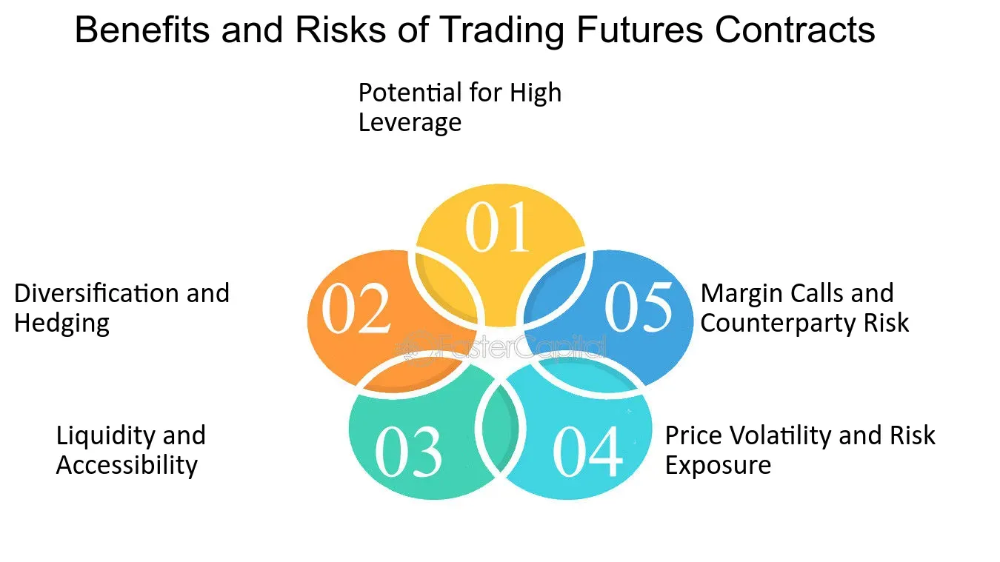

## Table of Contents

## What is the futures market and how does it work?

The futures market is a place where people can buy and sell contracts for things they will get or deliver in the future. These things can be anything from corn and oil to financial products like stock indexes. When someone buys a futures contract, they agree to buy the product at a certain price on a specific date in the future. Similarly, the seller agrees to deliver the product at that price on that date. This market helps farmers, businesses, and investors manage the risk of price changes.

In the futures market, people often trade without planning to actually take or deliver the product. Instead, they might buy and sell contracts to make money from price changes. For example, if someone thinks the price of oil will go up, they can buy a futures contract now and sell it later at a higher price. This kind of trading can be risky but also profitable. The futures market is regulated to make sure trading is fair and to prevent big problems.

## What are the basic types of risks involved in trading futures?

Trading futures involves several types of risks. One main risk is market risk, which means the price of the futures contract can go up or down. If the price goes against what you expected, you could lose money. For example, if you buy a futures contract hoping the price will go up, but it goes down instead, you will lose money when you sell it.

Another risk is leverage risk. Futures trading often uses leverage, which means you can control a big contract with a small amount of money. This can make your gains bigger, but it also makes your losses bigger if the market moves against you. It's like borrowing money to invest; it can help you a lot if things go well, but it can hurt a lot if they don't.

There's also liquidity risk, which means you might not be able to buy or sell your futures contract easily. If not many people are trading the contract you want, it can be hard to get out of your position quickly. This can be a problem if you need to sell fast to avoid bigger losses.

## How can market volatility affect futures trading?

Market volatility means the prices in the futures market can change a lot and very quickly. This can be good or bad for people trading futures. If you think prices will go up and they do, you can make a lot of money fast. But if prices go down instead, you can lose a lot of money just as fast. Because futures trading often uses leverage, small price changes can lead to big wins or losses.

Volatility can also make it harder to predict what will happen next. When prices are moving a lot, it's tough to know if they will keep going up or down. This uncertainty can make traders nervous and lead to more buying and selling, which can make the market even more volatile. So, traders need to be ready for big swings and have a plan to handle them.

## What is leverage and how does it increase risk in futures trading?

Leverage in futures trading means you can control a big contract with just a small amount of money. It's like borrowing money to buy something. For example, if you want to buy a futures contract worth $10,000, you might only need to put down $1,000. This makes it easier to trade because you don't need a lot of money to start.

But leverage also makes trading riskier. If the price of the futures contract goes up, you can make a lot more money because you're controlling a bigger amount with less money. But if the price goes down, you can lose a lot more money too. Since you're using borrowed money, even a small drop in price can wipe out your $1,000 and leave you owing more. So, while leverage can help you make big gains, it can also lead to big losses if the market moves against you.

## What are margin calls and how do they impact futures traders?

Margin calls happen when the money you put down to trade futures, called margin, isn't enough to cover your losses. When the price of your futures contract goes down, the value of your account goes down too. If it drops below a certain level, the futures exchange will ask you to add more money to your account. This is called a margin call. You have to add the money quickly, or the exchange might close your position to limit their risk.

Margin calls can be stressful for futures traders because they might have to come up with more money fast. If you can't meet the margin call, the exchange will sell your futures contract to cover the loss. This can mean you lose money and miss out on any chance of the price going back up. So, traders need to keep an eye on their accounts and be ready to add more money if the market moves against them.

## How does liquidity risk affect futures market participants?

Liquidity risk in the futures market means it might be hard to buy or sell a futures contract quickly. If not many people are trading the contract you want, you might have to wait or accept a worse price to get out of your position. This can be a big problem if you need to sell fast to avoid bigger losses. For example, if you see the price of your contract going down a lot and you want to sell it to stop losing money, but there aren't many buyers, you might have to sell it for less than you hoped.

This risk can make traders nervous because they know it might be hard to get out of a bad trade. It can also make the market less attractive to new traders who want to be able to buy and sell easily. If a futures contract is not very liquid, it might not be as popular, and this can make the problem worse because fewer people will want to trade it. So, traders need to think about how easy it will be to trade a futures contract before they start.

## What role does counterparty risk play in futures trading?

Counterparty risk in futures trading is the chance that the person or company you're trading with won't be able to keep their promise. In futures trading, you're making a deal to buy or sell something in the future. If the other person can't pay or deliver what they promised, you could lose money. This risk is there because you're counting on the other side to do what they said they would do.

To lower this risk, futures markets use something called a clearinghouse. The clearinghouse steps in between buyers and sellers, making sure that if one side can't pay, the other side still gets what they were supposed to. This makes trading safer because you're not just relying on the other trader. But even with a clearinghouse, there's still a small chance of problems if the clearinghouse itself has issues. So, while counterparty risk is managed well in futures trading, it's still something traders need to think about.

## How can geopolitical events influence futures market risks?

Geopolitical events, like wars or trade disagreements between countries, can shake up the futures market a lot. When these events happen, they can change how much things cost or how easy it is to get them. For example, if two countries that make a lot of oil start fighting, the price of oil futures might go up because people worry there won't be enough oil. This can make the market more risky because prices can jump around a lot, and it's hard to guess what will happen next.

These events can also make traders more nervous. When there's a lot of uncertainty, people might want to sell their futures contracts to avoid losing money. This can make the market less liquid, meaning it's harder to buy or sell quickly. Plus, if a big country puts new rules or taxes on trading, it can change how much people want to trade futures. So, geopolitical events add another layer of risk that traders need to watch out for.

## What are the regulatory risks associated with futures trading?

Regulatory risks in futures trading mean that the rules and laws about trading can change. Governments and organizations that watch over trading can make new rules or change old ones. This can affect how much it costs to trade, what you're allowed to do, and how much money you might make or lose. For example, if a new rule makes trading more expensive or limits what you can trade, it might make futures trading less profitable or harder to do.

These changes can also make the market less predictable. Traders need to keep up with new rules and adjust their plans. If they don't, they might break the law by accident or miss out on chances to make money. So, staying informed about regulatory changes is important for anyone trading futures, because it can help them manage the risks better.

## How do different trading strategies mitigate or increase risks in the futures market?

Different trading strategies in the futures market can either help lower risks or make them bigger. One common strategy to lower risk is called hedging. This is when someone who makes or uses a product, like a farmer or a company, buys or sells futures contracts to protect against price changes. For example, a farmer might sell wheat futures to lock in a price for their crop. This way, if the price of wheat goes down, they won't lose as much money. Hedging can help make prices more predictable and protect against big losses, but it might also mean missing out on big gains if prices move in the right direction.

On the other hand, some strategies can increase risks. Speculative trading, where people buy and sell futures contracts to make money from price changes, can be very risky. Traders who use this strategy often use leverage, which means they can control big contracts with a small amount of money. This can lead to big wins if prices move the right way, but it can also lead to big losses if they don't. Another risky strategy is day trading, where people buy and sell contracts within the same day to take advantage of small price changes. This can be exciting and profitable, but it's also very risky because the market can be unpredictable, and quick decisions can lead to big losses.

## What advanced risk management techniques should experienced traders use in futures trading?

Experienced traders in the futures market can use advanced risk management techniques to better handle the ups and downs of trading. One important technique is using stop-loss orders. This means setting a price at which a trade will automatically close if the market moves against you. It helps limit how much money you can lose on a single trade. Another technique is diversifying, which means not putting all your money into one type of futures contract. By trading different kinds of contracts, like oil, corn, and stock indexes, traders can spread out their risk. If one market goes down, the others might go up or stay the same, balancing out the losses.

Another advanced technique is using options on futures. Options give traders the right, but not the obligation, to buy or sell a futures contract at a set price. This can be a way to protect against big losses while still being able to make money if the market moves in the right direction. Traders can also use technical analysis to predict market movements. This involves looking at past price patterns and using charts to guess where prices might go next. While it's not perfect, it can help traders make more informed decisions and manage their risks better. By combining these techniques, experienced traders can navigate the futures market more safely and effectively.

## How can algorithmic trading and high-frequency trading impact risk in the futures market?

Algorithmic trading and high-frequency trading can change the risks in the futures market a lot. These methods use computers to buy and sell futures contracts very quickly, often in just a few seconds. This can make the market more liquid, meaning it's easier to buy and sell contracts. But it can also make the market more volatile because prices can change very fast. If many computers are trading at the same time, small changes can turn into big price swings. This can be good for traders who want to make money from these quick changes, but it can also be risky if the market moves against them.

Also, high-frequency trading can sometimes lead to problems like flash crashes, where prices drop suddenly and then bounce back just as fast. These events can be scary for traders because they can lose a lot of money in a short time. To manage these risks, traders need to be ready for quick price changes and have plans to protect their money. Using stop-loss orders and other risk management tools can help, but it's still important to understand how these fast trading methods can affect the market.

## References & Further Reading

[1]: Bergstra, J., Bardenet, R., Bengio, Y., & Kégl, B. (2011). ["Algorithms for Hyper-Parameter Optimization."](https://papers.nips.cc/paper/4443-algorithms-for-hyper-parameter-optimization) Advances in Neural Information Processing Systems 24.

[2]: ["Advances in Financial Machine Learning"](https://www.amazon.com/Advances-Financial-Machine-Learning-Marcos/dp/1119482089) by Marcos Lopez de Prado

[3]: ["Evidence-Based Technical Analysis: Applying the Scientific Method and Statistical Inference to Trading Signals"](https://www.amazon.com/Evidence-Based-Technical-Analysis-Scientific-Statistical/dp/0470008741) by David Aronson

[4]: ["Machine Learning for Algorithmic Trading"](https://github.com/stefan-jansen/machine-learning-for-trading) by Stefan Jansen

[5]: ["Quantitative Trading: How to Build Your Own Algorithmic Trading Business"](https://www.amazon.com/Quantitative-Trading-Build-Algorithmic-Business/dp/1119800064) by Ernest P. Chan