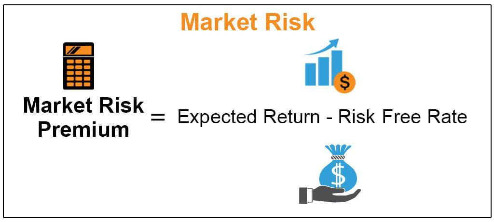

The futures market is a highly dynamic environment where contracts for the future delivery of commodities, currencies, indexes, and other financial instruments are actively traded. These contracts obligate the parties involved to transact at a predetermined price and date, making futures trading a unique aspect of the financial markets. Over recent decades, the introduction and advancement of algorithmic trading, often termed 'algo trading', have significantly reshaped the strategies that traders employ in this market. By utilizing sophisticated algorithms and advanced technology, traders can analyze vast amounts of market data and execute trades with precision and speed that far surpasses human capability.

While the potential for high returns in futures trading is attractive, it is important to acknowledge the financial risks that come with it. Futures trading can lead to significant gains; however, it also poses the risk of substantial losses. This volatility stems from several factors, including leveraged positions, rapid price swings, and the complexity of predicting market movements. Effective risk management, therefore, becomes paramount for anyone engaged in futures trading.



This article will examine the intersection of financial risk, investment strategies, the futures market, and the role of algorithmic trading. It will highlight the significant benefits that algos bring, such as improved trade execution and risk mitigation, while also addressing the challenges, such as technical reliance and regulatory considerations. For both seasoned traders and newcomers, gaining a thorough understanding of these components is vital for successfully navigating the complexities of futures trading. The insights provided aim to equip traders with the knowledge needed to adapt and thrive in the constantly evolving landscape of financial markets.

## Table of Contents

## Understanding Financial Risks in the Futures Market

Futures trading is characterized by its intrinsic use of leverage, a mechanism that allows traders to control a substantial contract value with a relatively small amount of capital. This leverage can significantly enhance potential profits but also dramatically increases the possibility of financial loss, making an understanding of financial risk indispensable for participants in the market.

Several key financial risks are inherent to futures trading. Market risk is perhaps the most prominent, characterized by the possibility of financial loss due to unfavorable movement in market prices. Given the volatile nature of futures markets, where prices can fluctuate rapidly based on various factors, traders are exposed to this risk consistently. Effective risk management strategies, such as stop-loss orders, are crucial to mitigate potential losses due to sudden market shifts.

Liquidity risk is another critical consideration, referring to the risk that a trader may not be able to enter or exit a position quickly at a desirable price due to a lack of market participants. This becomes particularly significant during periods of extreme market conditions when liquidity can dry up rapidly, causing increased slippage and potential financial setbacks.

Interest rate risk represents the potential for losses caused by fluctuations in the interest rates, which can affect the pricing and valuation of futures contracts, particularly those involving financial instruments like bonds. Changes in interest rates can alter the expectations of market participants, thereby impacting futures prices and contract valuations.

Credit risk, though less frequently discussed, poses challenges primarily when trading in less regulated or over-the-counter markets where counterparty default could lead to substantial financial losses. In regulated futures exchanges, the clearinghouse typically mitigates this risk; however, traders must remain vigilant in their risk assessments and strategies.

Algorithmic trading, also known as algo trading, has emerged as a vital tool in managing these financial risks in the futures markets. By utilizing pre-programmed algorithms, traders can automate the execution of trades, optimizing entry and [exit](/wiki/exit-strategy) points based on market data analysis. These systems can quickly execute trades at opportune moments, potentially reducing the impact of human error and emotion-driven decisions. However, traders must recognize that algorithms are not infallible. They require continuous monitoring and fine-tuning to adapt to the evolving market landscape. Moreover, the potential for technical malfunctions or unforeseen market anomalies necessitates the integration of traditional risk management practices, such as diversification across asset classes, to ensure a comprehensive approach to mitigating financial risks in futures trading.

## Investing in the Futures Market with Algorithms

Algorithmic trading, commonly known as algo trading, revolutionizes the investment landscape within the futures market by automating the trade execution process through pre-programmed instructions. Its primary objective is to maximize profits while minimizing the inherent risks associated with trading futures contracts, which encompass commodities, currencies, indexes, and other financial instruments. By leveraging sophisticated technologies including [machine learning](/wiki/machine-learning) and [artificial intelligence](/wiki/ai-artificial-intelligence), algo trading systems analyze vast amounts of market data to predict trends and execute trades at optimal times and prices.

### Leveraging Technology in Algo Trading

Machine learning algorithms play a crucial role in [algorithmic trading](/wiki/algorithmic-trading) by sifting through historical and real-time market data to identify patterns and predict future movements. These algorithms can process complex datasets much faster and more accurately than human traders, potentially uncovering subtle trends that may otherwise go unnoticed. For instance, a machine learning algorithm may employ techniques such as regression analysis or neural networks to forecast price movements. A simple example of a Python implementation for a linear regression model to predict future prices based on historical data is:

```python
import numpy as np
from sklearn.linear_model import LinearRegression

# Sample data: historical prices
prices = np.array([100, 102, 105, 107, 110]).reshape(-1, 1)
# Sample data: time intervals
time_intervals = np.array([1, 2, 3, 4, 5]).reshape(-1, 1)

model = LinearRegression().fit(time_intervals, prices)
predicted_price = model.predict(np.array([[6]]))  # Predict the price at the next time interval
print(predicted_price)
```

### Benefits of Algo Trading

Algo trading significantly enhances decision-making by eliminating human emotions and biases, which often lead to irrational trading decisions. By relying on data-driven insights and predefined strategies, traders can make consistent decisions based on logic rather than emotion. However, to fully exploit this potential, substantial investment in technology infrastructure and specialized expertise is required. Modern algo trading systems often involve robust computing resources, data storage solutions, and advanced analytical capabilities.

Importantly, investors need a comprehensive understanding of the algorithms and the market indicators they employ. Familiarity with components such as technical indicators, statistical models, and data feeds is necessary to configure algorithms that can operate effectively. Traders must have the competency to adjust parameters and refine algorithms continuously to adapt to changing market conditions.

### Challenges in Algorithmic Trading

Despite its advantages, algorithmic trading presents its own set of challenges. Developing and maintaining algo trading systems demand not only a significant financial investment but also a commitment to regularly updating software and ensuring compliance with regulatory standards. Additionally, understanding the limitations of predictive models and the potential impact of unforeseen external factors is critical. While algorithms can analyze data efficiently, unexpected market events or technical glitches can lead to substantial financial consequences if not managed properly.

In conclusion, algorithmic trading presents a sophisticated and data-driven approach to investing in the futures market, enabling traders to execute strategies with precision and efficiency. However, a deep understanding of both the technological and market aspects is essential to harness its full potential effectively.

## Managing Financial Risks with Algo Trading

Algorithmic trading serves as a crucial tool in managing financial risks within the futures market, primarily by enabling the execution of stop-loss and limit orders with precision. By utilising algorithms, traders can automate these processes to ensure that trades are executed promptly without the delays inherent in manual interventions. This automation is particularly beneficial during times of high market [volatility](/wiki/volatility-trading-strategies), where rapid decision-making is essential.

Advanced algorithms enhance this capability by continuously monitoring market conditions in real time. They can adjust trading strategies based on incoming data, which helps in mitigating potential losses. For instance, an algorithm might incorporate machine learning techniques to identify patterns suggesting a market downturn, triggering protective actions such as initiating stop-loss orders.

However, relying solely on algorithms introduces its own risks. Technical failures, such as software bugs or connectivity issues, can result in substantial financial setbacks. Likewise, unforeseen market events, like sudden geopolitical incidents, may lead to algorithmic misjudgements, as algorithms primarily react to programmed data patterns rather than context.

To address these vulnerabilities, traders are advised to implement traditional risk management techniques alongside algorithmic strategies. Combining algorithms with methods like diversification, which involves spreading investments across various financial instruments, helps mitigate idiosyncratic risks unique to specific assets. Additionally, hedging strategies can be employed, using derivatives to offset potential losses in primary investment positions. 

For example, a trader might use Python to develop an algorithmic strategy that calculates optimal hedge ratios. Here is a simple illustration:

```python
import numpy as np

# Expected returns and covariance matrix of portfolio assets
expected_returns = np.array([0.05, 0.07, 0.1])
cov_matrix = np.array([
    [0.005, -0.001, 0.004],
    [-0.001, 0.002, 0.001],
    [0.004, 0.001, 0.006]
])

# Inverse of covariance matrix
inverse_cov_matrix = np.linalg.inv(cov_matrix)

# Portfolio weights for minimum variance
ones = np.ones(len(expected_returns))
portfolio_weights = np.dot(inverse_cov_matrix, ones)
portfolio_weights /= np.sum(portfolio_weights)

print("Optimal Portfolio Weights:", portfolio_weights)
```

In this code, we calculate optimal portfolio weights that minimize variance, a fundamental aspect of hedging. Such tools prove indispensable when seeking to manage risk effectively.

While algorithmic trading provides a technological edge in risk management, it remains vital for traders to integrate these tools within a broader strategy that considers both technological and traditional approaches. This ensures a robust framework for navigating the complexities and uncertainties inherent in the futures market.

## Challenges and Considerations

While algorithmic trading provides a host of advantages, it also poses several challenges that traders must address to ensure effective operations. One significant challenge is the necessity of constant monitoring. Algorithms require continuous oversight to ensure they function correctly and adapt to real-time market conditions. This ongoing supervision is essential for identifying errors or irregularities that could lead to financial losses.

Another concern is the potential for market manipulation. Algorithmic systems, particularly those used in high-frequency trading ([HFT](/wiki/high-frequency-trading-strategies)), can be exploited for manipulative practices, such as 'quote stuffing', which can distort market information and create artificial volatility. This risk emphasizes the need for stringent control mechanisms and ethical considerations to preserve market integrity.

High-frequency trading, as a subset of algorithmic trading, contributes to systemic risks. By executing a large number of orders in fractions of a second, HFT can impact market stability. Instances of flash crashes, where rapid price declines occur within minutes, highlight the potential disruptions HFT can cause. Such events can erode investor confidence and pose challenges to the financial system's resilience.

Regulation plays a crucial role in mitigating these challenges. Regulatory frameworks are essential to ensure transparency and fairness in algorithmic trading. These regulations often involve establishing guidelines to prevent manipulative practices and standardizing latency measurements to provide equal competitive opportunities. Traders need to be aware of evolving regulatory landscapes and adhere to ethical standards to maintain a level playing field.

Finally, traders must stay informed about technological advancements. As trading technologies advance, staying competitive requires ongoing education and adaptation. This involves not only understanding new technologies but also integrating them effectively into existing trading strategies. Failing to keep pace with technological developments can lead to obsolescence and loss of competitive edge.

In summary, while algorithmic trading offers the potential for enhanced trading efficiency and profitability, it necessitates careful consideration of challenges related to monitoring, regulation, market manipulation, and technological advancements. Balancing these considerations is crucial for leveraging the benefits of algorithmic trading while mitigating associated risks.

## Conclusion

The integration of algorithmic trading within the futures market offers significant opportunities for financial investors, while also posing certain risks. The use of advanced algorithms allows traders to execute strategies more efficiently, potentially increasing profitability. By incorporating sophisticated tools, such as machine learning and artificial intelligence, traders can better analyze market trends and make informed decisions.

Key to success in this integration is the understanding and management of financial risks associated with futures trading. Risks in futures markets, such as market volatility and [liquidity](/wiki/liquidity-risk-premium) risk, can be substantial. Algorithmic trading can assist in mitigating these risks by enabling the execution of stop-loss and limit orders automatically, but it also introduces its own set of challenges, including the possibility of technical glitches or adverse market conditions that can lead to significant losses.

As the futures market continues to evolve, it is essential for investors to continuously learn and adapt to new technologies and market trends. This involves not only staying abreast of technological advancements but also understanding regulatory frameworks and ethical considerations that govern algorithmic trading. Investors should remain vigilant about these changes to maintain a competitive edge and ensure compliance with industry standards.

Regardless of the method employed, whether algorithmic or traditional, an effective risk management plan is indispensable in futures trading. This might include diversification, hedging, and a thorough analysis of algorithmic strategies to prevent over-reliance on automated systems. By incorporating these strategies, investors can effectively manage risk, thereby enhancing their trading performance and ensuring market sustainability.

## References & Further Reading

[1]: Bergstra, J., Bardenet, R., Bengio, Y., & Kégl, B. (2011). ["Algorithms for Hyper-Parameter Optimization."](https://papers.nips.cc/paper/4443-algorithms-for-hyper-parameter-optimization) Advances in Neural Information Processing Systems 24.

[2]: ["Advances in Financial Machine Learning"](https://www.amazon.com/Advances-Financial-Machine-Learning-Marcos/dp/1119482089) by Marcos Lopez de Prado

[3]: ["Evidence-Based Technical Analysis: Applying the Scientific Method and Statistical Inference to Trading Signals"](https://www.amazon.com/Evidence-Based-Technical-Analysis-Scientific-Statistical/dp/0470008741) by David Aronson

[4]: ["Machine Learning for Algorithmic Trading"](https://github.com/stefan-jansen/machine-learning-for-trading) by Stefan Jansen

[5]: ["Quantitative Trading: How to Build Your Own Algorithmic Trading Business"](https://www.amazon.com/Quantitative-Trading-Build-Algorithmic-Business/dp/1119800064) by Ernest P. Chan