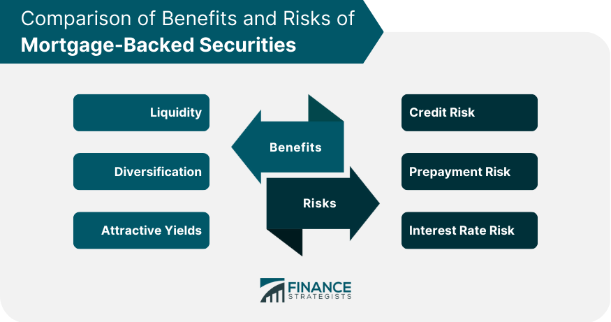

## Table of Contents

## What are mortgage-backed securities (MBS)?

Mortgage-backed securities (MBS) are a type of investment where a bunch of home loans are grouped together and sold to investors. When people take out loans to buy houses, those loans are collected by banks or other financial institutions. These loans are then sold to another company, which puts them into a big pool with other loans. This pool of loans is then divided into smaller pieces, called securities, and sold to investors. The investors earn money from the monthly payments that homeowners make on their loans.

MBS can be a good investment because they offer a steady stream of income from the interest on the loans. However, they also come with risks. If a lot of homeowners can't pay their loans and default, the value of the MBS can go down. This happened during the 2008 financial crisis when many people couldn't pay their mortgages, causing a big drop in the value of MBS. So, while MBS can be a way to earn money, they also need to be carefully managed to avoid big losses.

## How do mortgage-backed securities work?

Mortgage-backed securities (MBS) work by taking a bunch of home loans and turning them into something that investors can buy. When people get loans to buy houses, these loans are collected by banks or other financial companies. These companies then sell the loans to another company, which puts them all together into a big pool. This pool of loans is then split into smaller pieces, called securities, and sold to investors. The money that homeowners pay each month on their loans goes to the investors who bought these securities.

The investors earn money from the interest that homeowners pay on their loans. This can be a good way to make money because the payments are usually steady and predictable. But there are risks too. If a lot of homeowners can't pay their loans and default, the value of the MBS can drop. This happened during the 2008 financial crisis when many people couldn't pay their mortgages, causing big problems for investors who owned MBS. So, while MBS can be a way to earn money, they need to be carefully watched to avoid big losses.

## What are the different types of mortgage-backed securities?

There are a few main types of mortgage-backed securities (MBS). The first type is called a pass-through MBS. In this type, the payments that homeowners make on their loans are passed directly to the investors. If a homeowner pays their mortgage, that money goes straight to the investor. This type is pretty straightforward, but it can be risky if a lot of homeowners can't pay their loans.

Another type is called a collateralized mortgage obligation (CMO). CMOs are a bit more complex. They take the pool of loans and split it into different pieces, called tranches. Each tranche has a different level of risk and return. Some tranches get paid back first and are safer, while others get paid back later and are riskier but can offer higher returns. This way, investors can choose the level of risk they are comfortable with.

The third type is called a stripped MBS. In a stripped MBS, the interest and principal payments from the loans are separated into two different securities. One security gets all the interest payments, and the other gets all the principal payments. This can be useful for investors who want to focus on one type of payment over the other. Each type of MBS has its own benefits and risks, so it's important for investors to understand them before buying.

## What are the basic risks associated with investing in MBS?

Investing in mortgage-backed securities (MBS) comes with some risks. One big risk is that homeowners might not be able to pay their loans. If a lot of people default on their mortgages, the value of the MBS can drop a lot. This is called credit risk. During the 2008 financial crisis, many people couldn't pay their loans, and it caused huge problems for investors who had bought MBS.

Another risk is interest rate risk. When interest rates go up, the value of existing MBS can go down. This is because new loans will have higher interest rates, making the older loans with lower rates less attractive. Also, if interest rates drop, homeowners might decide to refinance their loans at the lower rate, which means the MBS investors might get their money back sooner than expected. This can be a problem if they planned to get income from those loans for a longer time.

Lastly, there's also the risk of prepayment. If a lot of homeowners pay off their loans early, either by selling their homes or refinancing, the investors in MBS might get their money back sooner than they expected. This can be good if they can reinvest that money at a good rate, but it can be bad if they were counting on a steady stream of income from those loans. So, while MBS can be a way to make money, these risks need to be carefully managed.

## How does interest rate risk affect mortgage-backed securities?

Interest rate risk is a big deal for mortgage-backed securities (MBS). When interest rates go up, the value of existing MBS can go down. This happens because new loans will have higher interest rates, making the older loans with lower rates less attractive to investors. So, if someone wants to sell their MBS when interest rates have gone up, they might have to sell it for less money than they paid for it.

On the other hand, when interest rates drop, homeowners might decide to refinance their loans at the lower rate. This means the investors in MBS might get their money back sooner than they expected. This can be a problem because they were planning to get income from those loans for a longer time. If they can't find a good place to reinvest the money they get back, they might end up making less money than they hoped. So, interest rate changes can really shake things up for people who invest in MBS.

## What is prepayment risk and how does it impact MBS?

Prepayment risk is when homeowners pay off their loans earlier than expected. This can happen if they sell their house, refinance their loan, or just decide to pay it off quickly. When this happens, the investors who own the mortgage-backed securities (MBS) get their money back sooner than they planned. This can be a problem because they were expecting to get a steady stream of income from those loans for a longer time.

If the money comes back early, the investors have to find a new place to put it. If they can't find a good investment with a similar return, they might end up making less money than they hoped. So, prepayment risk can mess up their plans and affect how much money they make from their MBS.

## How does credit risk influence the safety of mortgage-backed securities?

Credit risk is a big worry when it comes to mortgage-backed securities (MBS). It means that there's a chance that the homeowners who took out the loans might not be able to pay them back. If a lot of people can't pay their mortgages, it can cause big problems for the MBS. The value of the MBS can drop a lot because the investors won't get the money they were expecting. This is what happened during the 2008 financial crisis when many people couldn't pay their loans, and it caused huge losses for people who had invested in MBS.

To manage credit risk, investors and companies that create MBS look at how likely it is that homeowners will pay their loans. They check things like the homeowners' credit scores and how much they owe compared to how much they earn. If the risk seems too high, they might not buy the MBS or they might charge more for it to cover the risk. But even with these checks, credit risk can still be a big problem because it's hard to predict exactly what will happen with so many different loans.

## What role did mortgage-backed securities play in the 2008 financial crisis?

Mortgage-backed securities (MBS) played a big part in the 2008 financial crisis. Banks and other companies were giving out a lot of loans to people who wanted to buy houses, even if those people might not be able to pay them back. These risky loans were then bundled together into MBS and sold to investors. Everyone thought these MBS were safe and would make them a lot of money. But, when a lot of people couldn't pay their loans, the value of the MBS dropped a lot. This caused big problems for the investors who had bought them, and it started to shake the whole financial system.

As the value of MBS fell, many big banks and financial companies that had invested in them started to lose a lot of money. This made people scared, and they stopped trusting banks and stopped lending money to each other. The problems spread quickly, and it turned into a huge financial crisis. The government had to step in to help fix things, but it was a tough time for a lot of people and businesses. So, the risky MBS were a big reason why the 2008 financial crisis happened.

## How are mortgage-backed securities rated and what does this mean for investors?

Mortgage-backed securities (MBS) are rated by special companies called credit rating agencies. These agencies look at how likely it is that the homeowners will pay back their loans. They give the MBS a grade, like AAA, AA, A, or BBB. A higher grade, like AAA, means the MBS is seen as safer and less likely to have problems. A lower grade, like BBB, means it's riskier and there's a bigger chance that the homeowners won't pay their loans.

For investors, these ratings are important because they help them decide if an MBS is a good investment. If an MBS has a high rating, like AAA, investors might feel more comfortable buying it because they think it's safer. But if it has a low rating, like BBB, they might want a higher return to take on the extra risk. During the 2008 financial crisis, many MBS that were thought to be safe turned out to be risky, which caused big problems for investors who trusted the ratings.

## What are some advanced strategies for managing risks in MBS investments?

One way to manage risks in MBS investments is to diversify. This means not putting all your money into one type of MBS. Instead, you can spread your money across different types of MBS, like pass-throughs, CMOs, and stripped MBS. You can also invest in MBS that have different ratings, from high-rated AAA to lower-rated ones. By doing this, if one type of MBS has problems, the others might still be okay, and it can help balance out the risk.

Another strategy is to use hedging. This is like buying insurance for your MBS investments. You can use financial tools like interest rate swaps or options to protect against changes in interest rates or other risks. For example, if you're worried about interest rates going up and hurting the value of your MBS, you can use an interest rate swap to help offset that risk. Hedging can be a bit complicated, but it can help protect your investment from big losses.

Lastly, staying informed and keeping an eye on the market is really important. This means watching things like interest rates, the economy, and how homeowners are doing with their loans. If you see signs that a lot of people might not be able to pay their loans, you might want to sell your MBS or not buy more. Also, working with a good financial advisor who knows a lot about MBS can help you make smarter choices and manage your risks better.

## How do regulatory changes affect the risks associated with MBS?

Regulatory changes can make a big difference in the risks of investing in mortgage-backed securities (MBS). When the government makes new rules, it can change how banks and companies handle loans and MBS. For example, after the 2008 financial crisis, the government made new rules to make sure banks were more careful about giving out loans. These rules made it harder for people to get risky loans, which meant the MBS made from those loans were safer. But, if the rules are too strict, it might be harder for some people to get loans at all, which can affect the MBS market.

Also, regulations can change how MBS are rated and sold. If the rules say that MBS need to be checked more carefully before they can be sold, it can make them safer for investors. But, if the rules change a lot, it can be hard for investors to know what to expect. They might be more careful about buying MBS because they're not sure if the rules will change again. So, keeping an eye on regulatory changes is important for anyone investing in MBS because it can affect how safe their investment is.

## What are the future trends and potential new risks in the MBS market?

The future of the MBS market might see some big changes because of new technology and how people are buying homes. More people are using online tools to get loans and invest in MBS, which can make things faster and easier. But it also means there might be new risks, like cyber attacks or problems with the technology. Also, as interest rates change and the economy goes up and down, it can affect how many people want to buy homes and how safe MBS are. If a lot of people start using new types of loans that are harder to predict, it could make MBS riskier.

Another trend might be more rules from the government to make sure MBS are safer. After the 2008 financial crisis, the government made a lot of new rules to stop banks from giving out too many risky loans. But as time goes on, these rules might change again, which could affect how safe MBS are. If the rules get stricter, it might make MBS safer, but it could also make it harder for some people to get loans. If the rules get looser, it might make it easier for people to get loans, but it could also make MBS riskier if a lot of those loans are hard to pay back. So, keeping an eye on these trends and new risks is important for anyone thinking about investing in MBS.

## References & Further Reading

[1]: Fabozzi, F. J. (Ed.). (2016). ["Handbook of Mortgage-Backed Securities."](https://academic.oup.com/book/7943) Oxford University Press.

[2]: Gorton, G. B. (2012). ["Misunderstanding Financial Crises: Why We Don’t See Them Coming."](https://archive.org/details/misunderstanding0000gort) Oxford University Press.

[3]: Merton, R. C. (1977). ["An Analytic Derivation of the Cost of Deposit Insurance and Loan Guarantees."](https://www.sciencedirect.com/science/article/pii/0378426677900152) Journal of Banking & Finance, 1(1), 3-11.

[4]: ["The Dodd-Frank Act: A Cheat Sheet."](https://www.riskdata.com/wp-content/uploads/The-Dodd-Frank-Act_Morrison-Foerster.pdf) Morrison & Foerster LLP.

[5]: Mullins, D. W. (1982). ["Does the Capital Asset Pricing Model Work?"](https://hbr.org/1982/01/does-the-capital-asset-pricing-model-work) Harvard Business Review.

[6]: Glasserman, P., & Young, H. P. (2016). ["Contagion in Financial Networks."](https://www.aeaweb.org/articles?id=10.1257/jel.20151228) Journal of Economic Literature, 54(3), 779-831.

[7]: Tobias, A., & Kiyotaki, N. (2010). ["Liquidity and Financial Cycles."](https://www.bis.org/publ/work256.htm) Journal of Economic Perspectives, 24(1), 51-76.