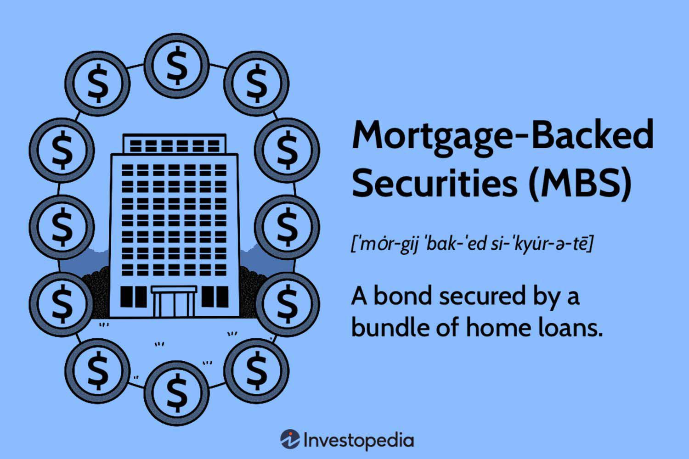

Mortgage-backed securities (MBS) have been integral components of the U.S. financial landscape for many years, serving as both investment opportunities and tools for capital redistribution. These complex financial instruments are constructed from bundles of mortgage loans sold to investors, essentially transferring the risk from the initial lenders to the financial markets. As such, understanding MBS is pivotal for grasping their dual nature of potential benefits and inherent risks to the broader economy.

The structure of MBS allows for the pooling of various mortgage loans, which are then sold as securities to investors. This process offers financial institutions the advantage of converting illiquid assets into liquid ones, thereby freeing up capital to finance additional loans. While this contributes positively by promoting liquidity and stability, it also carries the risks of incentivizing unsafe lending practices, as was evident during the lead-up to the 2008 financial crisis. Therefore, potential risks such as prepayment and credit risks become paramount considerations for investors and the economy alike.



Further complicating the landscape, the advent of algorithmic trading has dramatically altered market dynamics. By leveraging computer algorithms to automate trading decisions, algorithmic trading offers speed and efficiency but also increases the risk of market volatility, particularly during rapid market sell-offs. This interaction between MBS and algorithmic trading underscores the need for keen scrutiny and robust management of financial risks.

This article aims to provide a comprehensive exploration of the aspects of MBS and their associated risks, particularly in conjunction with algorithmic trading. We will discuss their economic implications, assess the potential threats they pose to market stability, and consider how regulatory frameworks and technological advancements are shaping their future. In doing so, we hope to elucidate the intricacies of MBS to better inform investors and stakeholders about these pivotal instruments in modern financial markets.

## Table of Contents

## Understanding Mortgage-Backed Securities

Mortgage-backed securities (MBS) are financial instruments that are backed by a pool of mortgages. These securities transform the periodic loan repayments made by homeowners into investment returns. An MBS is created when a financial institution, often a bank, bundles together a group of mortgages and sells them to investors as a single security. This process of securitization provides a mechanism by which illiquid assets, such as individual home loans, can be converted into liquid, tradable financial products.

### Structure and Features of MBS

The structure of an MBS involves several key components. Firstly, the underlying pool of mortgages is crucial, as it dictates the cash flow potential and risk profile of the MBS. These pools can consist of various types of residential mortgages, including conforming and non-conforming loans. The performance of the MBS largely depends on the aggregate behavior of the homeowners whose mortgages comprise the pool.

Investors receive periodic payments derived from the mortgage payments made by homeowners within the pool. This income comes in the form of interest and principal repayments, and the rate of return for investors is influenced by the prevailing [interest rate](/wiki/interest-rate-trading-strategies) environment and the credit quality of the mortgage pool. These factors are integral in assessing the valuation and perceived risk of an MBS.

### Economic Impact and Risks

MBS have facilitated capital flow within the banking system. By purchasing MBS, investors provide banks with fresh capital, allowing these financial institutions to issue new loans. This mechanism has contributed to increased [liquidity](/wiki/liquidity-risk-premium) in the housing market but has also been implicated in encouraging risky lending practices. During periods of heightened demand for MBS, banks might relax lending standards to generate more mortgages for securitization, elevating systemic financial risk.

Understanding the intricate features and structure of MBS is essential for investors, as these characteristics determine the potential risks associated with the securities. Investors must evaluate prepayment risk, interest rate risk, and credit risk to effectively manage their investments. Prepayment risk, for instance, arises when borrowers pay off their mortgages earlier than expected, leading to a potential reduction in the anticipated income stream from the MBS.

### Conclusion

In summary, mortgage-backed securities are powerful financial instruments with the ability to enhance market liquidity but also introduce various risks. Investors must have a comprehensive understanding of their structure and economic functions to navigate the complexities and mitigate risks inherent in these securities. This knowledge ultimately contributes to more informed investment decisions and potentially more stable financial markets.

## Financial Risks Associated with MBS

Mortgage-backed securities (MBS) are complex financial instruments that harbor several inherent risks. Understanding these risks is essential for investors to make informed decisions. 

One primary risk associated with MBS is prepayment risk. This occurs when borrowers choose to pay off their mortgage loans ahead of schedule, which can significantly disrupt the expected cash flow for MBS investors. Since MBS are structured to provide regular payments derived from mortgage repayments, early repayment can lead to a lower overall yield than initially anticipated. 

Interest rate fluctuations present another critical risk [factor](/wiki/factor-investing) for MBS. Changes in interest rates impact the market value and yield of these securities. For example, when interest rates rise, the value of existing MBS tends to decrease because new issuances might offer higher yields, making older securities less attractive.

Credit risk is also a concern for MBS investors. This risk involves the possibility of default by the borrowers of the underlying mortgages. If a significant number of homeowners within an MBS pool default on their loans, the resulting loss in expected cash flows can adversely affect the security's value and the investor's return. Analyzing borrowers' creditworthiness and understanding the credit enhancement features of an MBS can provide some level of risk mitigation.

In conclusion, the risks associated with MBS, such as prepayment risk, interest rate fluctuation, and credit risk, necessitate careful analysis and risk management by investors. Proper assessment of these risks is critical in evaluating the potential return and stability of an investment in mortgage-backed securities.

## Lessons from the 2008 Financial Crisis

The 2008 financial crisis underscored the inherent systemic risks associated with mortgage-backed securities (MBS), which were amplified by the proliferation of subprime mortgages. These high-risk loans, often extended to borrowers with questionable creditworthiness, were bundled into complex MBS products. This packaging gave an illusion of security and enabled substantial investment flows into the housing market, contributing significantly to inflating a housing bubble.

Subprime mortgages were attractive initially due to their higher yield, enticing investors seeking increased returns. However, when these borrowers began defaulting on loan payments due to rising interest rates and other economic pressures, the ripple effects were catastrophic. As defaults surged, the value of MBS plummeted, sparking a widespread financial panic that severely affected global markets. 

The crisis also revealed profound deficiencies in the risk management practices for MBS. Financial institutions and investors alike had relied heavily on Computerized Resource Management (CRM) systems, which at the time, inadequately assessed the layered risks of combined loan portfolios within MBS. Many CRM approaches failed to account for the correlation between mortgage defaults, assuming instead that defaults were independent events. This oversight led to underestimating the true risk exposure.

To illustrate, according to the Gaussian copula model commonly used to price MBS at the time, the joint distribution of default probabilities was not adequately reflective of the economic chain reactions among loan holders. This discrepancy emphasized the need for robust and comprehensive risk management models capable of dynamically adjusting to market conditions and borrower behaviors.

The aftermath of the crisis prompted a reevaluation of risk management policies concerning MBS trading. It highlighted the necessity for financial entities to implement more sophisticated analytical techniques and stress-testing procedures, precisely modeling default correlations and being more cautious of underlying asset qualities.

## Algorithmic Trading and Its Impact

Algorithmic trading employs sophisticated computer algorithms to execute orders at speeds and frequencies that are impossible for human traders. This methodology has vastly transformed the landscape of modern financial markets, including the mortgage-backed securities (MBS) sector. By leveraging algorithms, traders can engage in high-frequency trading, [arbitrage](/wiki/arbitrage) opportunities, and even execute complex strategies based on predictive analytics and [machine learning](/wiki/machine-learning) models.

The integration of [algorithmic trading](/wiki/algorithmic-trading) into the MBS market offers considerable advantages in speed and efficiency. Algorithms can analyze large datasets quickly, identifying optimal buying or selling opportunities within milliseconds. This capability allows for the swift execution of trades that may respond to tiny price movements, thus, capitalizing on short-term market inefficiencies. However, the rapid pace can also introduce significant [volatility](/wiki/volatility-trading-strategies), especially during market sell-offs or when unexpected economic news prompts sudden shifts in market sentiment. Algorithmically-driven mass selling can trigger a domino effect, exacerbating price declines and liquidity challenges, and potentially destabilizing MBS pricing.

As algorithms drive decisions based on pre-set criteria, their actions can contribute to or counteract broader market trends. For example, a sudden increase in interest rates might prompt algorithms, programmed to minimize risk exposure, to offload MBS holdings rapidly. This can amplify market reactions, leading to a sharp repricing of MBS assets.

Furthermore, algorithmic trading interacts with MBS by utilizing advanced machine learning techniques to assess the creditworthiness and default probabilities of the underlying mortgages. Algorithms can dynamically adjust portfolios by incorporating changes in borrower behavior or economic indicators, thereby refining risk profiles. Python, with libraries such as NumPy, pandas, and scikit-learn, is instrumental in developing algorithms capable of such real-time assessments.

An illustrative Python example for predicting MBS price movements might involve:

```python
import numpy as np
from sklearn.ensemble import RandomForestRegressor

# Sample data: historical MBS prices and features
X_train = np.random.rand(100, 5)  # 5 predictive features
y_train = np.random.rand(100)     # MBS price changes

# Instantiate and train the model
model = RandomForestRegressor(n_estimators=100, random_state=42)
model.fit(X_train, y_train)

# Predict future price changes
X_test = np.random.rand(20, 5)
predictions = model.predict(X_test)
```

Despite the benefits and advanced capabilities provided by algorithmic trading, its role in the MBS market necessitates a comprehensive understanding of both its automated processes and the potential for market volatility. As such, regulators and financial institutions must remain vigilant, balancing innovation with oversight to mitigate systemic risks.

## Regulatory Changes and the Future of MBS

Following the 2008 financial crisis, regulators worldwide intensified their scrutiny of mortgage-backed securities (MBS) to address the systemic risks they posed. One of the most significant regulatory measures implemented in the United States was the Dodd-Frank Wall Street Reform and Consumer Protection Act, enacted in 2010. This comprehensive legislation aimed to reduce risks in the financial system, increase transparency in financial markets, and protect consumers.

### Dodd-Frank Act

The Dodd-Frank Act introduced various provisions directly impacting MBS markets. One crucial element was the introduction of risk retention requirements, often referred to as "skin in the game." This mandate required issuers of asset-backed securities, including MBS, to retain at least 5% of the credit risk of the assets they securitized. The objective was to ensure that issuers had a vested interest in the performance of the underlying assets, thereby promoting higher-quality lending and enhanced due diligence.

Additionally, the Act led to the establishment of the Consumer Financial Protection Bureau (CFPB), tasked with overseeing and regulating consumer financial products and services. The CFPB implemented rules to enhance the transparency and fairness of mortgage lending practices, indirectly influencing the quality of mortgages that could be securitized into MBS.

### Other Regulatory Frameworks

Beyond Dodd-Frank, other regulatory frameworks have also shaped the future of MBS. The Basel III framework, developed by the Basel Committee on Banking Supervision, introduced stricter capital and liquidity requirements for banks, influencing how they engage in MBS trading and securitization. Basel III's emphasis on higher capital ratios and liquidity coverage improved banks' resilience to financial shocks, indirectly benefiting the stability of MBS markets by ensuring that banks involved in MBS activities maintain sufficient capital buffers.

### Importance of Ongoing Monitoring

Regulatory reforms post-crisis have proven critical in restructuring the MBS landscape; however, the dynamic nature of financial markets necessitates continuous monitoring and adaptation of these regulations. As financial innovations and market conditions evolve, regulators must remain vigilant to identify new risks and ensure that existing frameworks remain effective. This involves adapting to technological advances, such as algorithmic trading, which could introduce new challenges to MBS markets.

### Future Outlook

With the prospect of changing interest rates and emerging financial technologies, the future of MBS will be intimately tied to regulatory practices that respond timely to potential threats. Ongoing dialogue between regulators, financial institutions, and market participants is essential to fostering a stable environment where MBS can continue to be valuable components of investment portfolios without posing undue risk to the financial system.

The evolution of regulatory frameworks in the post-crisis era underscores the importance of a proactive stance in financial oversight. Effective regulation not only mitigates risks but also contributes to the sustainable growth of markets, ensuring stability and confidence in financial instruments such as mortgage-backed securities.

## Current Trends and Market Prospects

As of 2023, mortgage-backed securities (MBS) remain pivotal investment instruments within the U.S. financial markets. The development of new products and technologies is significantly influencing MBS's role, especially in terms of refining risk management practices. Technological advancements, including machine learning and big data analytics, are particularly instrumental in enhancing the assessment accuracy of borrower risk. These technologies enable investors to analyze vast datasets efficiently, offering insights into borrower behavior, economic conditions, and market trends that were previously difficult to quantify.

The ongoing evaluation of Federal Reserve interest rate policies is crucial in determining the trajectory of MBS markets. Changes in interest rates have profound impacts on MBS yields, as they influence borrower behavior and the valuation of underlying mortgage assets. An increase in interest rates typically leads to a decrease in prepayments, as homeowners are less likely to refinance at higher rates, potentially stabilizing the cash flow of MBS. However, higher rates could also lead to a reduction in mortgage originations, impacting the supply of new MBS.

Conversely, if the Federal Reserve opts to lower interest rates, the opposite effects could be anticipated. An environment with lower rates might encourage refinancing activities, increasing prepayment speeds that can shorten MBS durations and alter expected cash flows for investors. The sensitivity of MBS to these rate changes necessitates sophisticated modeling tools and investor strategies to hedge against potential risks effectively.

Current trends also reflect a growing emphasis on sustainable investing, with some MBS products starting to incorporate environmental, social, and governance ([ESG](/wiki/esg-investing)) criteria. This inclusion aligns them with broader investment themes and enhances their appeal to a socially-conscious investor base.

In summary, the future market prospects of MBS are intricately linked to technological progress in risk assessment and the Federal Reserve's monetary policy direction. Investors and institutions engaged in MBS trading and investment continue to adapt strategies to navigate these dynamic landscapes, focusing on both innovation and regulatory compliance to optimize returns and manage associated risks.

## Conclusion

Mortgage-backed securities (MBS) persist as both lucrative and perilous investment vehicles, requiring diligent assessment by investors. The potential for high returns attracts a diverse array of market participants, yet these securities also pose significant risks. These risks are amplified by algorithmic trading, which introduces evolving challenges in financial risk management. Understanding the ramifications of algorithmic dynamics on MBS trading activities is essential for investors seeking to mitigate unforeseen market fluctuations.

One critical avenue for managing these risks is through the implementation of forward-thinking regulatory, technological, and educational strategies. Regulatory bodies have historically intervened to curtail excessively risky practices within the MBS market, as evidenced by the Dodd-Frank Act's introduction post-2008 crisis. However, as the financial landscape evolves, so too must these regulations adapt, ensuring they remain relevant and effective in mitigating new forms of risk.

Technological advancements continue to offer tools for more precise risk assessment and better risk management frameworks. Enhanced data analytics, machine learning, and real-time monitoring systems provide investors with the capability to analyze borrower behavior and market conditions with greater accuracy. These technologies can help forecast potential disruptions, enabling preemptive measures to protect investment returns.

Investor education remains a cornerstone of financial stability. As MBS products evolve and become increasingly complex, it is imperative that investors are equipped with a thorough understanding of the inherent risks and rewards. Programs designed to enhance financial literacy and provide up-to-date information on market trends can empower investors to make informed decisions, ultimately fostering a more resilient economic environment.

Synchronizing efforts in regulation, technology, and education ensures a comprehensive approach to managing the economic implications of MBS. Proactive engagement in these areas will bolster the ability of market participants to navigate the challenges posed by MBS and algorithmic trading, thereby contributing to a more stable and secure financial system.

## References & Further Reading

[1]: Fabozzi, F. J. (Ed.). (2016). ["Handbook of Mortgage-Backed Securities."](https://academic.oup.com/book/7943) Oxford University Press.

[2]: Gorton, G. B. (2012). ["Misunderstanding Financial Crises: Why We Don’t See Them Coming."](https://archive.org/details/misunderstanding0000gort) Oxford University Press.

[3]: Merton, R. C. (1977). ["An Analytic Derivation of the Cost of Deposit Insurance and Loan Guarantees."](https://www.sciencedirect.com/science/article/pii/0378426677900152) Journal of Banking & Finance, 1(1), 3-11.

[4]: ["The Dodd-Frank Act: A Cheat Sheet."](https://www.riskdata.com/wp-content/uploads/The-Dodd-Frank-Act_Morrison-Foerster.pdf) Morrison & Foerster LLP.

[5]: Mullins, D. W. (1982). ["Does the Capital Asset Pricing Model Work?"](https://hbr.org/1982/01/does-the-capital-asset-pricing-model-work) Harvard Business Review.

[6]: Glasserman, P., & Young, H. P. (2016). ["Contagion in Financial Networks."](https://www.aeaweb.org/articles?id=10.1257/jel.20151228) Journal of Economic Literature, 54(3), 779-831.

[7]: Tobias, A., & Kiyotaki, N. (2010). ["Liquidity and Financial Cycles."](https://www.bis.org/publ/work256.htm) Journal of Economic Perspectives, 24(1), 51-76.