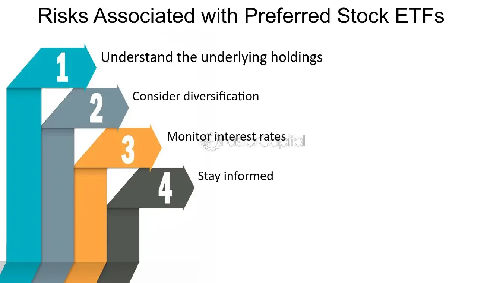

## Table of Contents

## What is a preferred stock ETF?

A preferred stock ETF is a type of exchange-traded fund that invests in preferred stocks. Preferred stocks are a special kind of stock that acts a bit like a bond. They usually pay a fixed dividend and have priority over common stocks when it comes to receiving dividends or assets if a company goes bankrupt. This makes them less risky than common stocks but more risky than bonds.

People might choose to invest in a preferred stock ETF because it offers a way to get income from the dividends while also spreading out the risk. Instead of buying individual preferred stocks, which can be hard to buy and sell, an ETF lets you own a little bit of many different preferred stocks all at once. This can make it easier and less risky to invest in preferred stocks.

## How do preferred stock ETFs differ from common stock ETFs?

Preferred stock ETFs and common stock ETFs are different in some important ways. Preferred stock ETFs invest in preferred stocks, which are like a mix between stocks and bonds. They usually pay a fixed dividend, which means you get a steady income from them. This makes them less risky than common stocks but more risky than bonds. On the other hand, common stock ETFs invest in common stocks, which are the regular stocks most people think of when they hear the word "stock." Common stocks can go up or down a lot in value, and their dividends can change or even stop.

Another big difference is how they handle dividends and what happens if a company goes bankrupt. With preferred stock ETFs, the dividends are usually fixed and paid out before any dividends go to common stockholders. If a company goes bankrupt, preferred stockholders get paid back before common stockholders. This gives preferred stock ETFs a bit more safety. Common stock ETFs, however, depend more on the company doing well. If the company does great, common stockholders can make a lot more money because their dividends can grow and the stock price can go up a lot. But if the company does badly, common stockholders might lose more money.

## What are the general risks associated with investing in ETFs?

Investing in ETFs comes with some risks that you should know about. One big risk is that the value of the [ETF](/wiki/etf-trading-strategies) can go up and down. This happens because the ETF holds a bunch of different stocks or other investments, and if those go down in value, so does the ETF. Also, ETFs that focus on one type of investment, like tech stocks or a certain country, can be riskier because if that area does badly, the whole ETF can lose value.

Another risk is something called tracking error. This is when the ETF doesn't follow its index as well as it should. It might happen because of fees or how the ETF is managed. This can make the ETF perform differently than you expect. Also, there's the risk of [liquidity](/wiki/liquidity-risk-premium). Sometimes, it can be hard to buy or sell the ETF quickly, especially if it's not very popular. This can be a problem if you need to get your money out fast.

Lastly, there's the risk of market risk, which is just the general ups and downs of the market. Even if you pick a good ETF, the whole market can go down, and that will affect your investment. And don't forget about fees. ETFs have fees that can eat into your returns over time. So, it's important to look at all these risks before you decide to invest in an ETF.

## What specific risks are associated with preferred stock ETFs?

Preferred stock ETFs come with some special risks. One big risk is [interest rate](/wiki/interest-rate-trading-strategies) risk. Preferred stocks are kind of like bonds, and when interest rates go up, the value of these stocks can go down. This means if you own a preferred stock ETF, its value might drop if interest rates rise. Another risk is credit risk. This means the companies that issued the preferred stocks might have trouble paying their dividends or might even go bankrupt. If that happens, the value of your ETF could go down a lot.

Another risk to think about is call risk. Some preferred stocks can be "called" back by the company that issued them, which means the company can pay you back your money and stop paying dividends. If this happens, you might have to find a new place to invest your money, and you might not get as good a deal. Also, preferred stock ETFs might not grow as much as common stock ETFs. Preferred stocks usually don't go up in value as much as common stocks, so if you're looking for big growth, a preferred stock ETF might not be the best choice.

## How does interest rate risk affect preferred stock ETFs?

Interest rate risk is a big deal for preferred stock ETFs. When interest rates go up, the value of preferred stocks usually goes down. This happens because preferred stocks are kind of like bonds, and when new bonds come out with higher interest rates, the old ones with lower rates don't look as good. So, people might sell their preferred stocks to buy the new bonds, which makes the price of the preferred stocks drop. If you own a preferred stock ETF, this means the value of your investment could go down when interest rates rise.

On the other hand, when interest rates go down, the value of preferred stocks can go up. This is because the fixed dividends from preferred stocks look more attractive compared to the lower interest rates on new bonds. But, it's important to remember that interest rates can change a lot, and if you're not ready for your ETF's value to go up and down because of these changes, you might want to think twice about investing in a preferred stock ETF.

## What is the impact of credit risk on preferred stock ETFs?

Credit risk is a big worry for people who invest in preferred stock ETFs. This risk comes from the chance that the companies that issued the preferred stocks might not be able to pay their dividends or might even go bankrupt. If a company can't pay its dividends, the value of the preferred stock ETF that holds those stocks can drop a lot. This is because investors might start selling their shares in the ETF, making its price go down.

Preferred stock ETFs are more sensitive to credit risk than common stock ETFs because preferred stocks are higher up in line to get paid if a company has money troubles, but they are still not as safe as bonds. If a company goes bankrupt, preferred stockholders get paid before common stockholders but after bondholders. So, if you're thinking about investing in a preferred stock ETF, you need to think about how strong the companies are that the ETF is invested in. If those companies are not doing well, the ETF could lose value because of credit risk.

## How does liquidity risk influence the performance of preferred stock ETFs?

Liquidity risk can affect how well a preferred stock ETF does. This risk is about how easy or hard it is to buy or sell the ETF. If an ETF doesn't have a lot of people trading it, it can be hard to sell your shares quickly. This can be a problem if you need your money fast. Also, if not many people want to buy the ETF, you might have to sell your shares for less money than you thought, which can make your investment worth less.

This risk can be bigger for preferred stock ETFs because preferred stocks themselves can be less liquid than common stocks. Sometimes, it's harder to find buyers for preferred stocks, so the ETF might have a harder time selling them if it needs to. If the ETF can't sell its holdings easily, it might not be able to give you your money back quickly or at a good price. So, when you're thinking about investing in a preferred stock ETF, it's good to check how easy it is to trade it and how liquid the stocks it holds are.

## What role does call risk play in preferred stock ETFs?

Call risk is a special kind of risk that can affect preferred stock ETFs. It happens when the companies that issued the preferred stocks decide to buy them back. This is called "calling" the stocks. If a company calls its preferred stocks, it pays you back your money and stops paying dividends. This can be bad for you because you might have to find a new place to invest your money, and you might not find one that pays as well.

This risk can make preferred stock ETFs less predictable. If a lot of the stocks in the ETF get called, the ETF might have to buy new stocks to replace them. This can change how much money the ETF makes and how it performs. So, when you're thinking about investing in a preferred stock ETF, it's good to know about call risk and how it might affect your investment.

## How can sector concentration risk impact a preferred stock ETF?

Sector concentration risk can make a big difference in how a preferred stock ETF does. This risk happens when the ETF has a lot of its money in one type of business or industry. If something bad happens to that industry, like a new law or a drop in demand, the value of the ETF can go down a lot. For example, if an ETF has a lot of preferred stocks from banks and the banking industry has problems, the ETF's value could drop.

This risk is important to think about because preferred stocks are often from certain industries like finance or utilities. If the ETF is focused on just a few sectors, it might do really well when those sectors are doing great, but it can also lose a lot if those sectors run into trouble. So, it's a good idea to check what industries the ETF is invested in before you decide to put your money in it.

## What are the tax implications of investing in preferred stock ETFs?

When you invest in a preferred stock ETF, you need to think about taxes. The dividends you get from preferred stocks are usually taxed at a different rate than the dividends from common stocks. Most of the time, preferred stock dividends are taxed as ordinary income, which can be higher than the tax rate for qualified dividends from common stocks. This means you might have to pay more in taxes on the money you make from a preferred stock ETF.

Another thing to know is that if you sell your shares in a preferred stock ETF, you might have to pay capital gains tax. This tax depends on how long you held the ETF before selling it. If you held it for less than a year, you'll pay short-term capital gains tax, which is the same as your regular income tax rate. If you held it for more than a year, you'll pay long-term capital gains tax, which is usually lower. So, it's good to think about these tax rules when you're deciding whether to invest in a preferred stock ETF.

## How do market conditions affect the performance of preferred stock ETFs?

Market conditions can really change how well a preferred stock ETF does. When the economy is doing well, and companies are making more money, preferred stocks might do better because the companies can keep paying their dividends. But if the economy is not doing well, and companies are struggling, they might not be able to pay their dividends, and the value of the preferred stock ETF could go down. Also, if people think the economy might get worse, they might start selling their preferred stocks and buying safer things like bonds, which can make the price of the ETF drop.

Interest rates are another big part of market conditions that affect preferred stock ETFs. When interest rates go up, new bonds start paying more, and the old preferred stocks with lower dividends don't look as good. This can make people sell their preferred stocks, which makes the ETF's value go down. But when interest rates go down, the fixed dividends from preferred stocks look better compared to the new bonds, and the ETF's value might go up. So, it's important to keep an eye on what's happening with the economy and interest rates if you're thinking about investing in a preferred stock ETF.

## What advanced strategies can be used to mitigate risks in preferred stock ETFs?

One way to lower the risks when you invest in preferred stock ETFs is to spread your money around. This means not putting all your money in just one ETF, but also investing in other types of ETFs or even different kinds of investments like bonds or real estate. By doing this, if the preferred stock ETF goes down because of something like rising interest rates or a company not paying its dividends, you won't lose all your money because your other investments might still be doing well. Another strategy is to look at the ETF's holdings and see if it's too focused on one industry. If it is, you might want to choose an ETF that has a mix of different industries to avoid sector concentration risk.

Another strategy is to keep an eye on interest rates and the economy. If you think interest rates are going to go up, you might want to wait before buying a preferred stock ETF or maybe sell some of your shares to avoid losing money. Also, paying attention to how well the companies in the ETF are doing can help you avoid credit risk. If you see that a lot of the companies are struggling, it might be a good idea to move your money to a different investment. Finally, think about how long you plan to keep your money in the ETF. If you're okay with holding onto it for a long time, you might not need to worry as much about short-term ups and downs, but if you might need your money soon, you should be more careful and maybe choose a different investment.

## References & Further Reading

[1]: Bergstra, J., Bardenet, R., Bengio, Y., & Kégl, B. (2011). ["Algorithms for Hyper-Parameter Optimization."](https://proceedings.neurips.cc/paper/2011/file/86e8f7ab32cfd12577bc2619bc635690-Paper.pdf) Advances in Neural Information Processing Systems 24.

[2]: ["Advances in Financial Machine Learning"](https://www.amazon.com/Advances-Financial-Machine-Learning-Marcos/dp/1119482089) by Marcos Lopez de Prado.

[3]: ["Evidence-Based Technical Analysis: Applying the Scientific Method and Statistical Inference to Trading Signals"](https://www.amazon.com/Evidence-Based-Technical-Analysis-Scientific-Statistical/dp/0470008741) by David Aronson.

[4]: ["Machine Learning for Algorithmic Trading"](https://github.com/stefan-jansen/machine-learning-for-trading) by Stefan Jansen.

[5]: ["Quantitative Trading: How to Build Your Own Algorithmic Trading Business"](https://www.amazon.com/Quantitative-Trading-Build-Algorithmic-Business-ebook/dp/B097QGPVND) by Ernest P. Chan.