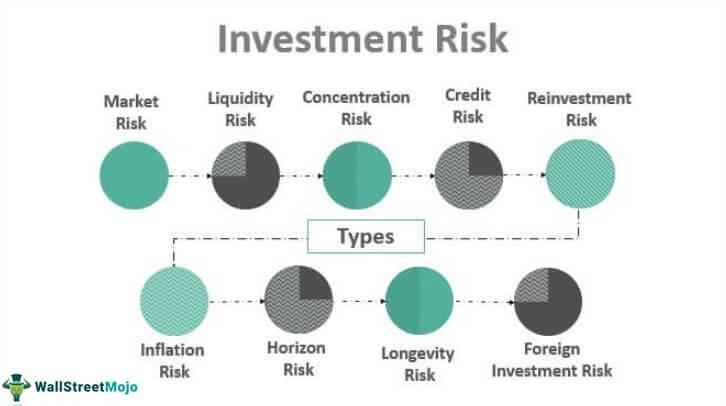

Real estate investing has emerged as a popular avenue for individuals and institutions aiming to diversify their portfolios and generate consistent income. This popularity is particularly evident in the growth of Real Estate Investment Trusts (REITs), which have become a staple for investors seeking exposure to real estate markets without the direct complexities and capital requirements of owning physical properties.

REITs are structured to provide a medium for investing in a portfolio of real estate assets, including commercial spaces, residential properties, and industrial complexes. They offer investors the opportunity to earn dividends from real estate investments without having to buy, manage, or finance any properties themselves. This makes them an attractive investment vehicle, especially for those looking to balance risk and reward while ensuring liquidity. 

The integration of algorithmic trading in real estate investments represents a novel paradigm shift. Traditionally associated with stocks and forex markets, algorithmic trading leverages complex algorithms to automate and potentially improve trading decisions. In the context of real estate, this innovation promises to streamline trading processes, optimize investment returns, and manage risks more effectively.

This article aims to provide readers with a comprehensive understanding of the risks associated with REIT investments and the transformative role algorithmic trading could play in mitigating these risks. By examining the dynamics of REITs and the potential of algorithmic strategies, readers will gain insight into how these investment tools can be used to enhance their real estate portfolios.

Key topics covered include an analysis of the risks inherent in REITs, such as market volatility and interest rate sensitivity, as well as a look into investment trust alternatives and the application of algorithmic trading strategies within this field. As readers progress through the article, they will be equipped with the knowledge to evaluate personal investment goals against the backdrop of these financial innovations.

## Table of Contents

## Understanding REITs: A Primer

Real Estate Investment Trusts (REITs) are companies that own, operate, or finance income-generating real estate across a range of property sectors. They provide a way for individual investors to earn a share of the income produced through commercial real estate ownership, without actually having to buy, manage, or finance any properties themselves. REITs were created in the United States in the 1960s to enable individual investors to participate in large-scale, income-producing real estate.

## Definition and Types of REITs

REITs can generally be categorized into three main types:

1. **Equity REITs**: These REITs invest in and own properties. Their revenues are primarily obtained through leasing space, collecting rents from properties, and eventually selling properties that have appreciated in value.

2. **Mortgage REITs (mREITs)**: mREITs provide financing for income-producing real estate by purchasing or originating mortgages and mortgage-backed securities. Their income is primarily generated from the interest earned on loans.

3. **Hybrid REITs**: These entities combine the investment strategies of both equity REITs and mortgage REITs.

## Functionality and Attraction of REITs

REITs function by pooling capital from numerous investors; this capital is then used to purchase or finance properties under the trust’s management. The primary attraction of REITs lies in their dividend-based income and potential for capital appreciation. Investors in REITs receive dividends in the form of a significant share of the income produced, considering that they are legally obligated to distribute at least 90% of their taxable income to shareholders.

## Types of Properties in REITs

REITs typically invest in a variety of property sectors which include:

- **Residential**: Apartments, single-family rental homes, and condominiums.
- **Commercial**: Office buildings, shopping centers, hotels, healthcare facilities, and warehouses.
- **Industrial**: Factories, logistics centers, and research and development facilities.

## Historical Performance

Historically, REITs have been known to offer returns competitive with other stocks, potentially providing a hedge against inflation. Over decades, REITs have significantly outperformed many common stock indices, notably owing to their unique combination of high dividends and potential for capital growth. For example, REITs have offered an average annual total return of around 12% since the 1970s when compared to other real estate investment methods.

## Benefits of Investing in REITs

The benefits of REIT investments include:

1. **Liquidity**: Unlike direct real estate investments, publicly traded REITs are listed on major stock exchanges and can be bought and sold with ease.

2. **Diversification**: REITs provide investors with access to diverse real estate portfolios, reducing the risk inherent in single property investments.

3. **Income Generation**: Due to their structure, REITs are required to distribute at least 90% of their taxable income, offering reliable dividend income.

In summary, REITs offer a way for investors to gain exposure to the real estate market with the advantages of [liquidity](/wiki/liquidity-risk-premium), income generation, and diversification, making them an attractive option for many investors.

## The Risks of Investing in REITs

Real Estate Investment Trusts (REITs) have grown in popularity as they offer individuals the ability to invest in real estate portfolios without purchasing properties directly. However, like any investment, REITs [carry](/wiki/carry-trading) inherent risks that investors must consider before committing their resources. Key risk factors include market [volatility](/wiki/volatility-trading-strategies), [interest rate](/wiki/interest-rate-trading-strategies) sensitivity, economic downturns, leverage risks, and geographic and sector concentration.

### Market Volatility

REITs are susceptible to market volatility, which can significantly affect their valuations. The value of a REIT is driven by the underlying real estate holdings, which can fluctuate based on market demand, property values, and occupancy rates. Sudden market shifts or events can cause a downward spiral in REIT prices, negatively impacting investors. For instance, a decline in consumer confidence or an economic disruption can lead to reduced demand for commercial spaces, affecting rental income and, in turn, REIT performance.

### Interest Rate Sensitivity

REITs are particularly sensitive to changes in interest rates. When interest rates rise, the cost of borrowing increases, which can impact a REIT's profitability. Moreover, higher interest rates often lead to an attractive bond market, causing investors to shift their focus from REITs to bonds, perceived as safer investments. The relationship between interest rates and REIT valuations is often inversely proportional: as rates increase, REIT valuations tend to decrease. The formula for the present value of future cash flows $( \text{PV} = \frac{\text{CF}}{(1 + r)^n} )$ illustrates how increased 'r' (interest rate) causes 'PV' (present value) to fall.

### Economic Downturns

Economic contractions pose significant risks to REITs, as they rely on the health of the economy for stable occupancy and rent collection. During downturns, businesses may downsize or close, leading to higher vacancy rates in commercial properties. Additionally, tenants may struggle to meet rental obligations, causing cash flow disruptions for REITs. Historical data has shown that during economic recessions, REITs can underperform compared to other investment vehicles due to their reliance on consistent rental income and property values.

### Leverage Risks

Many REITs use leverage, or borrowed funds, to finance property purchases, which can amplify both returns and risks. A high debt level can be problematic if the REIT cannot generate sufficient income to cover interest payments, leading to financial distress or insolvency. The Debt-to-Equity ratio $\left( \frac{\text{Total Debt}}{\text{Total Equity}} \right)$ is a critical metric to assess leverage risk. Higher ratios indicate greater leverage and potentially higher risk, particularly in a rising interest rate environment where borrowing costs increase.

### Geographic and Sector Concentration

Non-diversification in terms of geography or sector can expose REITs to significant risks. Geographic concentration means the REIT's performance is heavily influenced by local real estate market conditions. If a REIT predominantly invests in a single region, adverse local economic changes, such as a natural disaster or industry downturn, could adversely affect its portfolio. Similarly, sector concentration risk arises when a REIT specializes in a particular type of property, such as retail, office, or healthcare. Economic or policy changes affecting that sector can disproportionately impact the REIT.

In summary, while REITs offer an accessible entry point into real estate investment, they are not without risks. Understanding these risks — market volatility, interest rate sensitivity, economic downturns, leverage, and concentration — is crucial for investors to make informed decisions and mitigate potential losses.

## Investment Trusts: More Than Just REITs

Real Estate Investment Trusts (REITs) are well-known for providing exposure to real estate markets with liquidity akin to stocks. However, REITs are not the only type of investment trust that can be used to diversify a portfolio. It's important to compare REITs with other real estate investment trusts and funds to understand the full spectrum of opportunities available in real estate investment.

Investment trusts, in general, are companies that invest their resources in financial assets, generating returns for their shareholders. While REITs specifically invest in real estate assets and are structured to distribute at least 90% of their taxable income as dividends to shareholders, other forms of real estate investment trusts or funds, such as mutual funds and Exchange-Traded Funds (ETFs), offer unique approaches to investing in real estate.

1. **Comparison Between REITs and Other Investment Trusts:**
   Real estate mutual funds and ETFs are common alternatives to direct REIT investment. These funds pool investments from multiple investors to purchase diversified real estate holdings, including REITs themselves, developer stocks, real estate-related debt instruments, and sometimes direct property holdings. Unlike individual REITs which might focus on specific property types or markets, mutual funds and ETFs offer broader diversification, increasing exposure across different sectors and geographies within the real estate market.

2. **Types of Investment Trusts and Portfolio Diversification:**
   A well-diversified portfolio often includes various asset combinations to reduce risk. Alongside REITs, investors can look into specialized real estate mutual funds, which may focus on residential, commercial, retail, or other property sectors worldwide. Real estate ETFs, on the other hand, provide liquidity and simplicity in trading similar to stocks, while still offering diverse real estate exposure. The inclusion of development companies or companies providing real estate services within these funds further spreads the risk.

3. **Alternative Investment Trust Opportunities in Real Estate:**
   Beyond traditional REITs, investors might consider funds that focus on alternative real estate investments. This includes infrastructure funds, timberland investments, and funds targeting emerging markets and real estate within technological or healthcare sectors. These alternatives can provide higher growth potential but often come with increased risk or volatility.

4. **Roles of Mutual Funds and ETFs in Real Estate Investment:**
   Real estate mutual funds and ETFs play significant roles by pooling resources to invest in a range of real estate securities. ETFs, for instance, allow investors to trade these investments on exchanges like stocks, affording real-time pricing and liquidity. These investment vehicles track both indices of REITs and broader real estate markets, giving investors exposure to diversified real estate ventures without the need to directly purchase properties or manage real estate assets.

5. **Risk Assessment of Investment Trusts Outside of REITs:**
   While diversification via mutual funds and ETFs can mitigate some risks, these investments are not without their own challenges. Market risk remains since these funds are subject to fluctuations in interest rates, economic cycles, and property market dynamics. Evaluating liquidity risk is also critical; while ETFs typically offer high liquidity, some investment trusts and mutual funds might have lock-in periods, restricting immediate access to capital. Furthermore, sector-specific or geographically concentrated funds may carry heightened risk if their focus areas underperform.

In summary, investors have numerous options beyond traditional REITs to diversify and potentially enhance their real estate portfolios. However, assessing the varying risk factors and aligning with personal investment goals is crucial for informed decision-making in this multifaceted landscape.

## Algorithmic Trading in the Realm of Real Estate Investment

Algorithmic trading, commonly referred to as algo trading, involves using computer algorithms to execute trading strategies at high speed and [volume](/wiki/volume-trading-strategy), minimizing human intervention. It leverages complex mathematical models and computational algorithms to make decisions, which often involves automatically trading on various financial markets based on pre-defined conditions. This paradigm shift has markedly influenced the financial markets by enhancing the speed and efficiency of executing trades while reducing transaction costs.

In the context of real estate investments and Real Estate Investment Trusts (REITs), [algorithmic trading](/wiki/algorithmic-trading) is increasingly being adopted to optimize portfolio performance and manage risks. By applying algorithms that analyze large sets of data, investors can systematically evaluate market trends, asset valuations, and investment opportunities. This data-driven approach enables investors to make informed decisions based on quantitative analysis rather than qualitative judgment alone.

There are several benefits to incorporating algorithmic strategies in real estate trading. One of the most significant advantages is the enhanced ability to process vast datasets, which may include real estate pricing trends, economic indicators, or REIT-specific financial data, to identify patterns that are not immediately apparent to human traders. This efficiency allows for better timing of trades, improved asset allocation, and predictive analysis of market movements, which can significantly enhance returns on investment.

However, algorithmic trading in real estate also faces several potential pitfalls and challenges. Real estate markets are often less liquid and more heterogeneous compared to traditional equity markets, which can make algorithmic models less effective if not adapted adequately. The inconsistency and lack of uniformity in real estate data can complicate the development and application of robust algorithms. Additionally, over-reliance on algorithmic models, especially those that lack flexibility or adaptive learning, can lead to substantial financial losses if market conditions suddenly change or if there are systemic errors in algorithmic predictions.

Despite these challenges, future trends indicate a growing importance of algorithmic trading in real estate investments. The integration of [artificial intelligence](/wiki/ai-artificial-intelligence) (AI) and [machine learning](/wiki/machine-learning) is paving the way for more sophisticated trading models that can adapt in real time to new information, effectively learning from market dynamics and historical data to enhance prediction accuracy. Furthermore, the continued digitalization of real estate data and the development of platforms specifically designed for algorithmic trading in this sector are likely to improve accessibility and usability for institutional and individual investors.

In conclusion, while algorithmic trading presents both opportunities and challenges within real estate investments, it remains a pivotal tool for modern portfolio management, enabling automation, enhanced decision-making, and improved risk management. As technology advances, it is likely to play an increasingly crucial role in shaping the strategies of real estate investors, particularly those focusing on REITs.

## Mitigating Risks through Algorithmic Trading

Algorithmic trading is increasingly being adopted as a strategy to mitigate risks associated with Real Estate Investment Trusts (REITs). By leveraging quantitative models, investors can better respond to market fluctuations and optimize their portfolios.

### Strategies for Using Algorithms to Hedge Against REIT Risks

To effectively hedge against REIT risks, algorithms are designed to analyze market data and identify patterns that traditional methods may overlook. For instance, algorithms can be programmed to monitor interest rate changes, economic indicators, and real estate market trends, thus providing actionable insights. One common strategy is to use statistical [arbitrage](/wiki/arbitrage), where algorithms seek out price inefficiencies between correlated REITs to make short-term profits, thereby hedging against potential losses.

### Real-World Examples of Successful Algo Trading in Real Estate Investment

One notable example of algorithmic trading in real estate investment is the use of machine learning models by large investment firms to forecast real estate price movements. For instance, firms have developed models that predict price changes in commercial real estate markets by integrating data sources like economic forecasts, interest rates, and rental yields. These models have outperformed traditional investment approaches by providing more accurate predictions, allowing for strategic investment decisions.

### Tools and Platforms Available for Algorithmic Trading in Real Estate

There are various tools and platforms available for conducting algorithmic trading in the real estate market. Examples include Python-based libraries such as pandas and scikit-learn for data analysis and machine learning model development. Additionally, platforms like QuantConnect and Alpaca offer infrastructure for developing, testing, and deploying trading algorithms. Many of these platforms provide access to real-time market data, which is crucial for executing trades based on algorithmic strategies.

### Role of AI and Machine Learning in Enhancing Algo Trading

AI and machine learning significantly enhance the capabilities of algorithmic trading by enabling the development of predictive models that can discern complex patterns in vast datasets. For instance, neural networks and [deep learning](/wiki/deep-learning) models can process and learn from historical price data, news articles, and social media sentiment to anticipate market trends and adjust investment strategies accordingly. These advancements allow traders to refine their algorithms continually and adapt to new market conditions.

### Limitations and Legal Considerations

Despite its advantages, algorithmic trading is not without limitations. One major concern is the risk of overfitting, where models become too tailored to historical data and fail to generalize to new data. Furthermore, the reliance on algorithms can introduce systemic risks if multiple algorithms respond similarly to market events, leading to significant market disruptions.

Legal considerations also play a critical role in algorithmic trading. Regulations may require compliance with specific standards to ensure fair practices and avoid market manipulation. Traders must be aware of the legal landscape, including requirements set out by financial regulatory bodies like the Securities and Exchange Commission (SEC) in the United States.

In conclusion, while algorithmic trading offers robust opportunities for mitigating REIT risks, traders must navigate technical challenges and regulatory requirements, balancing innovation with compliance to succeed in this evolving landscape.

## Conclusion

In summary, this article has explored the dynamic landscape of real estate investing, particularly focusing on Real Estate Investment Trusts (REITs) and the role of algorithmic trading in this domain. Real estate investing through REITs provides a balance between potential rewards and inherent risks. Investors are drawn to REITs for their promising liquidity and steady income generation, but they must remain vigilant to challenges such as market volatility, interest rate fluctuations, and economic downturns. By understanding these risks, investors can better navigate the ever-shifting real estate market.

Algorithmic trading is progressively shaping the future of real estate investments, offering sophisticated tools and strategies to manage risks effectively. Through its capacity for rapid analysis and execution, algorithmic trading presents opportunities to enhance decision-making processes and bolster portfolio performance. However, it is essential to recognize the potential pitfalls and legal considerations associated with its use.

Readers are encouraged to critically assess their personal investment goals and strategies. A tailored approach, aligning one's risk tolerance and financial objectives with the characteristics of REITs and algorithmic trading capabilities, is crucial for long-term success. As the convergence of technology and real estate investment intensifies, a proactive stance on learning and adaptation is advisable. By staying informed and exploring further educational resources, readers can optimize their investment strategies in real estate and leverage the advancing tools of algorithmic trading effectively.

## References & Further Reading

[1]: Ling, D. C., & Naranjo, A. (2015). ["The Dynamics of REIT Capital Flows and Returns."](https://onlinelibrary.wiley.com/doi/full/10.1111/1540-6229.00071) Journal of Financial Economics, 116(3), 585-595.

[2]: Lopez de Prado, M. (2018). ["Advances in Financial Machine Learning."](https://www.amazon.com/Advances-Financial-Machine-Learning-Marcos/dp/1119482089) Wiley.

[3]: Chan, E. (2009). ["Quantitative Trading: How to Build Your Own Algorithmic Trading Business."](https://github.com/ftvision/quant_trading_echan_book) Wiley.

[4]: Geltner, D., Miller, N., Clayton, J., & Eichholtz, P. (2014). ["Commercial Real Estate Analysis & Investments."](https://www.researchgate.net/publication/245702364_Commercial_Real_Estate_Analysis_and_Investments) OnCourse Learning.

[5]: Jansen, S. (2020). ["Machine Learning for Algorithmic Trading."](https://github.com/stefan-jansen/machine-learning-for-trading) Packt Publishing.

[6]: Block, R., & Rispoli, M. (2020). ["Investing in REITs: Real Estate Investment Trusts."](https://www.amazon.com/Investing-REITs-Estate-Investment-Trusts/dp/1118004450) Wiley.