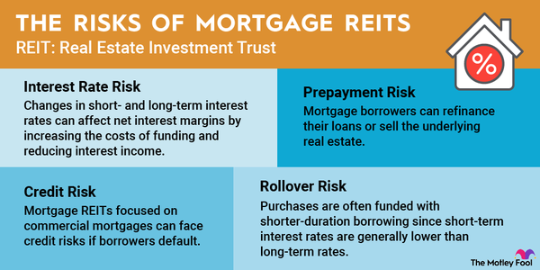

## Table of Contents

## What is a Real Estate Investment Trust (REIT)?

A Real Estate Investment Trust, or REIT, is a company that owns, operates, or finances income-generating real estate. It's like a mutual fund for real estate, where investors can buy shares and earn dividends from the property income without having to buy or manage the properties themselves. REITs can include various types of properties, such as apartments, shopping centers, offices, and hotels.

REITs are required by law to pay out at least 90% of their taxable income as dividends to shareholders. This makes them attractive to investors looking for regular income. They are also a way for people to invest in large-scale, income-producing real estate without needing a lot of money to start. By investing in a REIT, you can benefit from the profits of real estate without the hassle of being a landlord.

## What are the basic types of REITs?

There are three main types of REITs: equity, mortgage, and hybrid. Equity REITs own and manage real estate properties. They make money by renting out these properties and collecting rent from tenants. This is the most common type of REIT, and people often invest in them to get regular income from the rent payments.

Mortgage REITs, on the other hand, don't own physical properties. Instead, they invest in mortgages or mortgage-backed securities. They earn money from the interest on these loans. This type of REIT can be riskier because it depends a lot on interest rates and the health of the housing market.

Hybrid REITs are a mix of both equity and mortgage REITs. They own some properties and also invest in mortgages. This gives investors a bit of both worlds: income from rent and interest from loans. Hybrid REITs try to balance the risks and rewards of the other two types.

## What are the potential benefits of investing in REITs?

Investing in REITs can be a good way to earn regular income. REITs are required to pay out at least 90% of their taxable income as dividends to shareholders. This means if you own shares in a REIT, you can get money regularly, kind of like getting rent from tenants but without the hassle of managing properties yourself. This regular income can be especially helpful for people who are retired or looking for a steady stream of money.

Another benefit of REITs is that they let you invest in real estate without needing a lot of money. Buying a property on your own can be expensive, but with REITs, you can buy shares for much less. This makes it easier for more people to get into real estate investing. Plus, because REITs own many different properties, your investment is spread out, which can help reduce risk compared to owning just one property.

## What are the general risks associated with REIT investments?

Investing in REITs can be risky because the real estate market can go up and down. If the economy is not doing well, people might not be able to pay rent, or property values might drop. This can hurt the income that REITs make and lower the dividends they can pay to shareholders. Also, if interest rates go up, it can make it more expensive for REITs to borrow money, which can affect their profits.

Another risk is that REITs can be affected by changes in laws or regulations. For example, if the government changes tax rules, it could impact how much money REITs can keep or pay out as dividends. Plus, since REITs are traded on stock exchanges, their share prices can be volatile. This means the value of your investment can go up and down a lot, which might be stressful if you need to sell your shares quickly.

In summary, while REITs can offer good income and a way to invest in real estate without buying properties directly, they come with risks tied to the real estate market, interest rates, and changes in laws. It's important to think about these risks before deciding to invest in REITs.

## How does interest rate risk affect REITs?

Interest rate risk can have a big impact on REITs. When interest rates go up, it becomes more expensive for REITs to borrow money. Many REITs use loans to buy or develop properties, so higher interest rates mean they have to pay more in interest, which can reduce their profits. Also, when interest rates rise, other investments like bonds might start to look more attractive to investors because they offer higher returns. This can make people sell their REIT shares, which can cause the price of the REIT to go down.

On the flip side, when interest rates go down, it can be good for REITs. Lower interest rates mean cheaper borrowing costs, which can help REITs make more money from their properties. But, it's not always simple. If interest rates are very low for a long time, it might mean the economy is not doing well, which can hurt the real estate market and the income REITs make from rents. So, interest rate changes can have both good and bad effects on REITs, depending on the situation.

## What is the impact of market risk on REITs?

Market risk affects REITs because the real estate market can go up and down. If the economy is not doing well, people might lose their jobs and not be able to pay rent. This can make it hard for REITs to earn money from their properties. Also, if a lot of people want to sell their properties at the same time, the value of those properties might go down. This can lower the value of the REIT's portfolio and hurt the price of its shares.

Another way market risk impacts REITs is through changes in how people use real estate. For example, if more people start working from home, they might not need office spaces as much. This can lead to higher vacancy rates in office buildings owned by REITs, which means less rent money coming in. Also, if there's a big event like a natural disaster or a health crisis, it can change how people live and work, which can affect the demand for different types of properties. All these things can make it harder for REITs to make money and can cause their share prices to go up and down.

## How does liquidity risk influence REIT investments?

Liquidity risk can affect REIT investments because it's about how easy it is to buy or sell shares. If a REIT isn't very popular or if the market is not doing well, it might be hard to find someone who wants to buy your shares quickly. This means you might have to wait a long time to sell or sell them for less money than you wanted. This can be a problem if you need your money fast or if you want to change your investments.

Also, some REITs might own properties that are hard to sell quickly, like big shopping centers or office buildings. If the REIT needs to sell these properties to get cash, it might take a long time. This can make it harder for the REIT to pay dividends or meet other financial needs. So, when thinking about investing in REITs, it's good to consider how easy it might be to turn your investment into cash if you need to.

## What role does tenant risk play in REIT performance?

Tenant risk is important for REITs because it affects how much money they can make from their properties. If the tenants in a REIT's buildings can't pay rent on time or leave, it can hurt the REIT's income. This is a big deal because REITs need to collect rent to pay dividends to their investors. If a lot of tenants have problems, like losing their jobs or their businesses not doing well, it can lead to more empty spaces in the REIT's properties. This means less money coming in, which can make the REIT's share price go down.

Also, some types of tenants can be riskier than others. For example, if a REIT owns a lot of shopping centers and many of the stores go out of business, it can be hard to find new tenants quickly. This can leave the REIT with empty stores for a long time, which is bad for their income. On the other hand, if a REIT has a lot of tenants with long leases, like big companies in office buildings, it might be less risky because those tenants are more likely to keep paying rent. So, the kind of tenants a REIT has can make a big difference in how well it does.

## How can regulatory changes impact REITs?

Regulatory changes can have a big effect on REITs. If the government changes the rules about taxes, it can change how much money REITs can keep or pay out to investors. For example, if new tax laws make it harder for REITs to deduct certain expenses, their profits might go down. This means they might not be able to pay as much in dividends, which can make investors unhappy and cause the REIT's share price to drop.

Also, changes in laws about real estate can impact REITs. If the government makes new rules about how properties can be used or what kinds of buildings can be built, it can change how much money REITs can make from their properties. For instance, if new laws make it harder to build apartments, a REIT that owns a lot of apartment buildings might have trouble growing its business. All these regulatory changes can make it harder for REITs to plan for the future and can affect how much money they make and how well they do overall.

## What are the tax implications of investing in REITs?

Investing in REITs has some special tax rules. When you get dividends from a REIT, they are usually taxed as ordinary income, not as the lower tax rate you might get on qualified dividends from other stocks. This can mean you pay more in taxes on the money you get from REITs. Also, if you sell your REIT shares for more than you paid for them, you might have to pay capital gains tax on the profit.

Another thing to know is that some of the dividends from REITs might be considered return of capital. This part of the dividend isn't taxed right away. Instead, it reduces the cost basis of your investment, which can affect how much tax you pay when you sell your shares. It's a good idea to keep track of these details and maybe talk to a tax advisor to understand how investing in REITs will affect your taxes.

## How do economic cycles affect REIT performance?

Economic cycles can really change how well REITs do. When the economy is doing well, people and businesses have more money to spend on rent. This means REITs can charge more for their properties and have fewer empty spaces. More rent money coming in helps REITs pay bigger dividends to their investors, which can make the REIT's share price go up. Also, when the economy is good, it's easier for REITs to borrow money to buy more properties or fix up the ones they have, which can help them grow.

But when the economy is not doing well, it can be hard for REITs. If people lose their jobs or businesses close down, they might not be able to pay rent. This can lead to more empty spaces in the REIT's buildings, which means less money coming in. When REITs make less money, they might have to cut their dividends, which can make investors unhappy and cause the REIT's share price to drop. Also, if it's hard to borrow money during a bad economy, REITs might not be able to buy new properties or make improvements, which can slow down their growth.

## What advanced strategies can be used to mitigate risks in REIT investing?

One way to lower risks when investing in REITs is to spread your money around. Instead of putting all your money into one REIT, you can invest in a few different ones. This way, if one REIT has problems, like tenants not paying rent or property values going down, you won't lose all your money. You can also look at REITs that own different types of properties, like apartments, shopping centers, and offices. This can help because if one type of property is not doing well, the others might still be okay.

Another strategy is to pay attention to the economy and interest rates. When the economy is doing well, REITs usually do better because people can afford to pay rent. But if you think the economy might get worse, you might want to be careful about buying more REITs or even sell some of what you have. Also, since interest rates can affect REITs a lot, it's good to keep an eye on them. If you think interest rates are going to go up, you might want to wait before investing more in REITs because higher rates can make it harder for them to make money.

Lastly, it's a good idea to do a lot of research before you invest in REITs. Look at the history of the REIT, how well it's been doing, and what kinds of properties it owns. Some REITs are managed better than others, so it's important to pick ones that have a good track record. Also, talking to a financial advisor can help. They can give you advice that fits your own money goals and how much risk you're okay with taking.

## References & Further Reading

[1]: Ling, D. C., & Naranjo, A. (2015). ["The Dynamics of REIT Capital Flows and Returns."](https://onlinelibrary.wiley.com/doi/full/10.1111/1540-6229.00071) Journal of Financial Economics, 116(3), 585-595.

[2]: Lopez de Prado, M. (2018). ["Advances in Financial Machine Learning."](https://www.amazon.com/Advances-Financial-Machine-Learning-Marcos/dp/1119482089) Wiley.

[3]: Chan, E. (2009). ["Quantitative Trading: How to Build Your Own Algorithmic Trading Business."](https://github.com/ftvision/quant_trading_echan_book) Wiley.

[4]: Geltner, D., Miller, N., Clayton, J., & Eichholtz, P. (2014). ["Commercial Real Estate Analysis & Investments."](https://www.researchgate.net/publication/245702364_Commercial_Real_Estate_Analysis_and_Investments) OnCourse Learning.

[5]: Jansen, S. (2020). ["Machine Learning for Algorithmic Trading."](https://github.com/stefan-jansen/machine-learning-for-trading) Packt Publishing.

[6]: Block, R., & Rispoli, M. (2020). ["Investing in REITs: Real Estate Investment Trusts."](https://www.amazon.com/Investing-REITs-Estate-Investment-Trusts/dp/1118004450) Wiley.