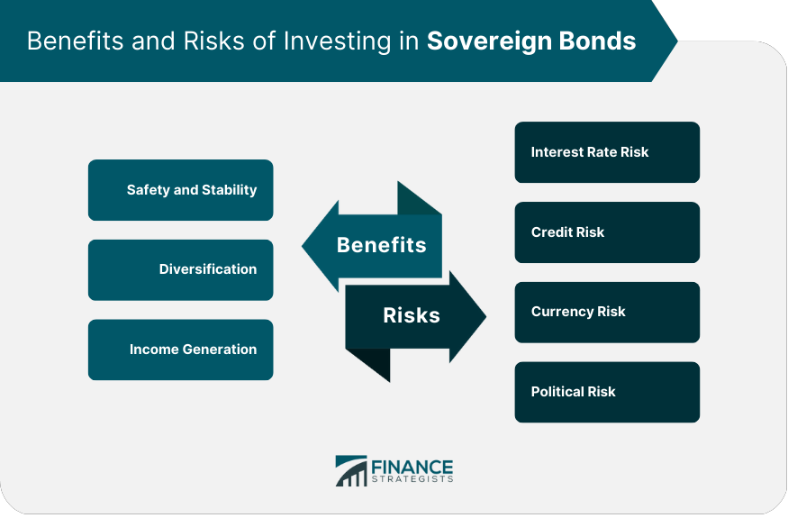

## Table of Contents

## What are sovereign bonds?

Sovereign bonds are debt securities issued by a government to raise money from investors. When you buy a sovereign bond, you are lending money to the government, and in return, the government promises to pay you back the amount you lent, plus interest, over a certain period of time. These bonds are considered safe investments because they are backed by the government, which has the power to tax its citizens and print money to repay its debts.

Sovereign bonds are used by governments to finance their spending, such as building roads, schools, and hospitals, or to cover budget deficits. Investors like sovereign bonds because they provide a steady stream of income through interest payments, and they can be bought and sold in financial markets. The interest rate on these bonds can vary depending on the country's economic health and creditworthiness; countries with strong economies and stable governments usually offer lower interest rates, while those with weaker economies or higher risks might have to offer higher rates to attract investors.

## Why do countries issue sovereign bonds?

Countries issue sovereign bonds to borrow money from investors. This money helps them pay for big projects like building roads, schools, and hospitals. It also helps them cover their budget when they spend more money than they earn from taxes. By selling bonds, a government can get the money it needs without raising taxes right away.

Sovereign bonds are a popular way for governments to borrow because they can be sold to many different people and organizations around the world. This spreads out the risk and makes it easier for the government to find people willing to lend them money. Plus, investors like buying these bonds because they get regular interest payments and feel safe knowing the government will pay them back.

## What are the basic risks associated with investing in sovereign bonds?

Investing in sovereign bonds has some risks. One main risk is that the government might not be able to pay back the money it borrowed. This can happen if the country's economy gets really bad or if the government spends too much money. If this happens, investors might lose some or all of their money. This risk is called default risk, and it's bigger for countries that are not very rich or stable.

Another risk is that the value of the bond can go up and down. If interest rates go up after you buy a bond, the value of your bond might go down because new bonds will pay more interest. This is called [interest rate](/wiki/interest-rate-trading-strategies) risk. Also, changes in the economy or politics of the country can make the bond's value change. This is called market risk. Even though sovereign bonds are usually seen as safe, these risks can still affect how much money you make or lose.

In some cases, inflation can also be a risk. If the prices of things go up a lot, the money you get back from the bond might not be worth as much as when you first invested. This is called inflation risk. So, even though sovereign bonds are often a safe choice, it's good to think about these risks before you decide to invest.

## How does a country's credit rating affect the risk of its sovereign bonds?

A country's credit rating is like a report card that tells investors how safe it is to lend money to that country. If a country has a high credit rating, it means the country is seen as reliable and likely to pay back its debts. This makes its sovereign bonds less risky because investors believe they will get their money back with interest. Countries with high credit ratings can borrow money at lower interest rates because investors feel more secure.

On the other hand, if a country has a low credit rating, it means there is more risk that the country might not be able to pay back its debts. This makes its sovereign bonds riskier to invest in. Because of the higher risk, investors will want a higher interest rate to lend money to these countries. So, a low credit rating can make it more expensive for a country to borrow money through sovereign bonds.

## What is sovereign default risk and how does it impact bondholders?

Sovereign default risk is the chance that a country won't be able to pay back the money it borrowed through its bonds. This can happen if the country's economy is doing very badly or if it spends too much money. When a country defaults, it means it can't pay back the bondholders on time or at all. This is a big problem for investors because they might lose some or all of the money they lent to the country.

When a country is at risk of defaulting, it can make the value of its bonds go down a lot. Investors get worried and might want to sell their bonds quickly, which makes the price drop even more. If a default actually happens, bondholders might have to wait a long time to get any money back, and they might only get a small part of what they were owed. This is why investors look at a country's credit rating and economic health to decide how risky it is to buy its bonds.

## How do interest rate changes influence the value of sovereign bonds?

When interest rates go up, the value of existing sovereign bonds usually goes down. This happens because new bonds that are issued will have higher interest rates, making them more attractive to investors. If you have an old bond with a lower interest rate, it becomes less valuable because people would rather buy the new bonds that pay more. So, if you want to sell your old bond, you might have to sell it for less money than you paid for it.

On the other hand, when interest rates go down, the value of existing sovereign bonds usually goes up. This is because the interest rates on new bonds will be lower, making your old bond with a higher interest rate more attractive to investors. People will be willing to pay more for your bond because it pays more interest than the new ones. This means if you decide to sell your bond, you might be able to sell it for more money than you originally paid.

## What role does inflation play in the risks of holding sovereign bonds?

Inflation can make holding sovereign bonds riskier. When prices go up because of inflation, the money you get back from your bond might not be worth as much as when you first invested. If you bought a bond that pays you back $100 in the future, but inflation makes everything more expensive, that $100 won't buy as much as it used to. This means the real value of your investment goes down, even if you get all your money back.

To deal with this, some countries issue special bonds called inflation-linked bonds. These bonds change the amount of money they pay you based on how much prices have gone up. This way, the money you get back is worth about the same as when you first invested, even if there's inflation. But not all countries offer these special bonds, so if you're holding regular sovereign bonds, you need to think about how inflation might affect what your money can buy in the future.

## Can geopolitical events increase the risk of sovereign bonds?

Yes, geopolitical events can make sovereign bonds riskier. When there's tension or conflict between countries, it can shake up the economy of the country that issued the bonds. For example, if there's a war or a big political change, people might worry that the country won't be able to pay back its debts. This worry can make the value of the bonds go down because investors want to sell them quickly.

These events can also make it harder for a country to borrow money. If investors think a country is risky because of what's happening in the world, they might not want to buy its bonds unless they get a higher interest rate. This means the country has to pay more to borrow money, which can make its financial situation even worse. So, geopolitical events can add a lot of uncertainty and risk to holding sovereign bonds.

## How do currency fluctuations affect the returns on foreign sovereign bonds?

When you invest in foreign sovereign bonds, the value of the money you get back can change because of currency fluctuations. If the currency of the country where you bought the bond gets weaker compared to your own currency, your returns will be worth less when you convert them back to your home currency. For example, if you bought a bond in euros and the euro gets weaker against the dollar, you'll get fewer dollars back when you exchange your euros.

On the other hand, if the foreign currency gets stronger, your returns can be worth more when you convert them back. So, if the euro gets stronger against the dollar, you'll get more dollars for your euros. This means that currency fluctuations add another layer of risk to investing in foreign sovereign bonds because the value of your investment can change based on what happens with exchange rates, not just the bond itself.

## What are the differences in risk between developed and emerging market sovereign bonds?

Sovereign bonds from developed countries, like the United States or Germany, are usually seen as less risky than bonds from emerging markets, like Brazil or India. Developed countries often have strong and stable economies, which means they are more likely to pay back their debts. They also have good credit ratings, so investors feel safer lending them money. This makes the interest rates on developed market bonds lower because there is less risk involved.

On the other hand, emerging market sovereign bonds can be riskier. These countries might have weaker economies or more political problems, which can make it harder for them to pay back what they owe. Because of this higher risk, investors want more interest to lend money to these countries. So, emerging market bonds usually offer higher interest rates, but they also come with a bigger chance that the country might not be able to pay back the money. This means that while you could earn more money with these bonds, you also have to be ready for the possibility of losing some or all of your investment.

## How can investors mitigate the risks associated with sovereign bonds?

Investors can reduce the risks of sovereign bonds by diversifying their investments. This means not putting all their money into bonds from one country, but spreading it out across different countries. If one country has problems paying back its debts, the investor won't lose all their money because they have bonds from other countries too. Another way to lower risk is by looking at a country's credit rating. Countries with high credit ratings are less likely to default on their bonds, so choosing bonds from these countries can make investments safer.

Investors can also think about the time they plan to keep their bonds. If they might need their money back soon, they should be careful about buying long-term bonds because they can lose value if interest rates go up. Instead, they might choose short-term bonds, which are less affected by interest rate changes. Lastly, some investors use special bonds called inflation-linked bonds to protect against inflation. These bonds adjust their payouts based on inflation rates, which helps keep the value of the investment steady even if prices go up.

## What advanced strategies can be used to hedge against sovereign bond risks?

One advanced strategy to hedge against sovereign bond risks is using currency hedging. When you buy bonds from another country, changes in that country's currency can affect how much money you get back. To protect against this, you can use financial tools like currency forwards or options. These tools help lock in exchange rates so that even if the foreign currency gets weaker, you still get the amount of money you expected in your home currency. This way, you can focus more on the bond's performance without worrying too much about currency changes.

Another strategy is using interest rate swaps. Interest rates can change and affect the value of your bonds. With an interest rate swap, you can exchange the interest payments from your bond with someone else. For example, if you have a bond that pays a fixed interest rate but you think rates might go up, you can swap those payments for payments that change with interest rates. This can help protect your investment from losing value if rates go up. By using these swaps, you can manage the risk of interest rate changes and keep your investment more stable.

Lastly, diversification across different types of bonds and markets can be an advanced hedging strategy. Instead of just buying sovereign bonds from one country, you can invest in bonds from many different countries, including both developed and emerging markets. You can also mix in other types of bonds, like corporate bonds or municipal bonds. This way, if one type of bond or one country runs into trouble, the other parts of your investment might still do well. By spreading your money out, you can reduce the overall risk of your bond portfolio and protect against the specific risks of any single bond or market.

## References & Further Reading

[1]: ["Advances in Financial Machine Learning"](https://www.amazon.com/Advances-Financial-Machine-Learning-Marcos/dp/1119482089) by Marcos Lopez de Prado

[2]: ["Quantitative Trading: How to Build Your Own Algorithmic Trading Business"](https://www.amazon.com/Quantitative-Trading-Build-Algorithmic-Business/dp/1119800064) by Ernest P. Chan

[3]: ["Evidence-Based Technical Analysis: Applying the Scientific Method and Statistical Inference to Trading Signals"](https://www.amazon.com/Evidence-Based-Technical-Analysis-Scientific-Statistical/dp/0470008741) by David Aronson

[4]: ["Algorithmic Trading: Winning Strategies and Their Rationale"](https://books.google.com/books/about/Algorithmic_Trading.html?id=WAlFDwAAQBAJ) by Ernest P. Chan

[5]: ["Currency Risk Management: Forecasting and Managing Hedging Strategies"](https://www.cambridge.org/highereducation/books/international-financial-management/B7138AAA17C384543182C3AA48892984/risk-management-and-the-foreign-currency-hedging-decision/BFDFDE4617BCF82F59C9CF7C322B29AB) by E. Banks

[6]: ["Sovereign Risk and Financial Crises"](https://link.springer.com/book/10.1007/978-3-662-09950-6) by Michael Bordo and Harold James, National Bureau of Economic Research (NBER) Working Paper No. 3241

[7]: ["The Handbook of Fixed Income Securities"](https://www.amazon.com/Handbook-Fixed-Income-Securities-Ninth/dp/1260473899) edited by Frank J. Fabozzi