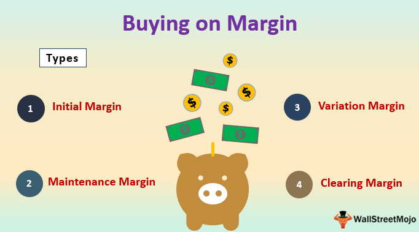

## Table of Contents

## What is buying stocks on margin?

Buying stocks on margin means borrowing money from a broker to buy stocks. Instead of using only your own money, you use a combination of your money and the borrowed money. The borrowed money is called a margin loan, and you have to pay interest on it. This allows you to buy more stocks than you could with just your own money.

However, buying on margin can be risky. If the value of the stocks you bought goes down, you could lose more money than you initially invested. You might have to sell your stocks at a loss to pay back the loan, or add more money to your account. It's important to understand these risks before deciding to buy stocks on margin.

## How does margin trading work?

Margin trading is when you borrow money from a broker to buy stocks or other investments. You use your own money as a down payment, and the broker lends you the rest. This lets you buy more stocks than you could with just your own money. The amount you borrow is called a margin loan, and you have to pay interest on it. The down payment you make is called the margin requirement, and it's usually a percentage of the total cost of the stocks.

But margin trading can be risky. If the value of your stocks goes down, you could lose more money than you put in. If that happens, you might have to sell your stocks at a loss to pay back the loan. Or, you might have to add more money to your account to meet the margin requirement. This is called a margin call. It's important to understand these risks before you start margin trading.

## What are the basic requirements to start trading on margin?

To start trading on margin, you need to open a margin account with a brokerage firm. This is different from a regular cash account because it lets you borrow money to buy stocks. You'll need to fill out an application and agree to the terms and conditions of the margin account. The brokerage firm will also check your financial situation to make sure you can handle the risks of margin trading.

Once your margin account is set up, you'll need to meet the minimum margin requirement, which is usually a percentage of the total cost of the stocks you want to buy. For example, if the margin requirement is 50%, and you want to buy $10,000 worth of stocks, you'll need to put in $5,000 of your own money, and the broker will lend you the other $5,000. Remember, you'll have to pay interest on the money you borrow, and you'll need to keep enough money in your account to meet the margin requirement at all times.

## What are the potential benefits of buying stocks on margin?

Buying stocks on margin can help you make more money if the stock prices go up. When you use margin, you can buy more stocks than you could with just your own money. This means that if the stock price goes up, your profits could be bigger because you own more stocks. It's like using a lever to lift something heavy; a little bit of effort can move a lot more weight.

However, margin trading also has risks. If the stock prices go down, you could lose more money than you put in. You might have to sell your stocks at a lower price to pay back the money you borrowed from the broker. It's important to understand these risks and make sure you can handle them before you start trading on margin.

## What are the common risks associated with margin trading for beginners?

Margin trading can be risky, especially for beginners. One big risk is that you could lose more money than you put in. When you buy stocks on margin, you borrow money to buy more stocks than you could with just your own money. If the stock prices go down, you might have to sell your stocks at a loss to pay back the loan. This means you could end up owing more money than you started with.

Another risk is getting a margin call. This happens when the value of your stocks goes down and you don't have enough money in your account to meet the margin requirement. When you get a margin call, you have to put more money into your account or sell some of your stocks to cover the difference. If you can't do this quickly, the broker might sell your stocks without asking you, which could mean selling at a bad time and losing more money.

It's also important to remember that you have to pay interest on the money you borrow. This can add up over time and eat into your profits. If you're not careful, the interest could end up being more than the money you make from your stocks. So, it's really important to understand these risks and be ready to handle them before you start trading on margin.

## How can margin calls affect your investments?

A margin call can really shake up your investments. It happens when the value of your stocks drops and you don't have enough money in your account to meet the margin requirement. When you get a margin call, you have to put more money into your account or sell some of your stocks to cover the difference. If you can't do this quickly, the broker might sell your stocks without asking you. This can be a big problem because they might sell at a bad time, when the prices are low, and you could lose a lot of money.

Dealing with a margin call can also mess up your investment plans. If you have to sell stocks to meet the margin call, you might have to let go of stocks you wanted to keep for a long time. This can throw off your whole investment strategy. Plus, the stress of getting a margin call can make it hard to think clearly about what to do next. So, it's really important to understand how margin calls work and be ready to handle them before you start trading on margin.

## What is the impact of interest rates on margin accounts?

Interest rates have a big impact on margin accounts. When you borrow money from a broker to buy stocks, you have to pay interest on that borrowed money. If interest rates go up, the cost of borrowing that money also goes up. This means you'll have to pay more interest over time, which can eat into your profits. If you're not making enough money from your stocks to cover the higher interest costs, you could end up losing money.

On the other hand, if interest rates go down, it can be good for your margin account. Lower interest rates mean you'll pay less to borrow money, so more of your profits can stay in your pocket. But remember, interest rates can change, and you need to keep an eye on them. If rates go up and you're not ready for it, it could make your investments more expensive and risky.

## How does market volatility increase the risks of margin trading?

Market [volatility](/wiki/volatility-trading-strategies) can make margin trading a lot riskier. When the market is volatile, stock prices can go up and down a lot in a short time. If you're trading on margin, this means the value of your stocks can change quickly. If the prices drop suddenly, you might not have enough money in your account to meet the margin requirement. This could lead to a margin call, where you have to put more money in or sell your stocks at a loss to cover the difference.

Dealing with a margin call during volatile times can be really stressful. If you can't meet the margin call fast enough, the broker might sell your stocks without asking you. They might have to sell at a bad time when the prices are low, which means you could lose a lot more money than you expected. So, when the market is volatile, the risks of margin trading go up because everything can change so quickly and you might not have time to react properly.

## What are the advanced strategies for managing risks in margin trading?

One advanced strategy for managing risks in margin trading is to use stop-loss orders. A stop-loss order is like a safety net that automatically sells your stocks if they drop to a certain price. This can help you limit your losses if the market goes against you. By setting a stop-loss order, you can make sure you don't lose more money than you're willing to risk. It's a good way to protect yourself from big drops in stock prices, especially during volatile times.

Another strategy is to keep a close eye on your margin account and be ready to add more money if you get a margin call. This means you should always have extra money saved up that you can quickly put into your account if you need to. By being prepared, you can avoid having your broker sell your stocks at a bad time. It's also smart to keep your margin use low, so you don't borrow too much money. The less you borrow, the less risk you take on, and the easier it is to handle any problems that come up.

Lastly, diversifying your investments can help manage risk in margin trading. Instead of putting all your money into one stock, you can spread it out across different stocks or even different types of investments. This way, if one stock goes down, you won't lose everything. Diversification can help balance out the ups and downs of the market and make your margin trading safer. It's all about not putting all your eggs in one basket.

## How do regulatory changes affect margin trading?

Regulatory changes can have a big impact on margin trading. When rules change, it can affect how much money you can borrow to buy stocks. For example, if the government decides to increase the margin requirement, you might need to put more of your own money into your account before you can borrow. This can make it harder to trade on margin because you need more cash upfront. On the other hand, if the margin requirement goes down, you might be able to borrow more with less of your own money, but that can also mean more risk.

These changes can also affect the interest rates you pay on your margin loans. If new rules make it more expensive for brokers to lend money, they might raise the interest rates they charge you. Higher interest rates mean you'll pay more to borrow money, which can eat into your profits. Keeping an eye on regulatory changes is important because they can change the rules of the game and affect how much risk you're taking on when you trade on margin.

## What are the psychological impacts of trading on margin?

Trading on margin can make you feel stressed and worried. When you use margin, you borrow money to buy stocks, and if the stock prices go down, you could lose more money than you put in. This can make you feel nervous all the time because you might have to pay back the loan even if you lose money. You might also get a margin call, which means you have to put more money in your account fast or sell your stocks at a bad time. All this pressure can make it hard to think clearly and make good choices about your investments.

On top of that, trading on margin can make you feel really excited when things go well. If the stock prices go up, you can make more money because you borrowed to buy more stocks. This can make you feel like you're winning and want to take more risks. But it's important to remember that the bigger the win, the bigger the risk. So, you need to be careful and not let the excitement make you do things that could lead to big losses. Keeping your emotions in check is really important when you're trading on margin.

## How can one mitigate the risks of margin trading at an expert level?

At an expert level, managing the risks of margin trading starts with using stop-loss orders smartly. A stop-loss order is like a safety net that sells your stocks automatically if they drop to a certain price. This helps you limit how much money you can lose if the market goes against you. By setting these orders, you can make sure you don't lose more than you're ready to risk. It's also important to keep a close watch on your margin account and be ready to add more money if you get a margin call. Having extra money saved up means you can quickly put it into your account if you need to, avoiding the risk of your broker selling your stocks at a bad time.

Another key strategy is to keep your margin use low. The less money you borrow, the less risk you take on, and the easier it is to handle any problems that come up. It's also smart to spread your investments across different stocks or even different types of investments. This way, if one stock goes down, you won't lose everything. Diversifying your investments can help balance out the ups and downs of the market and make your margin trading safer. It's all about not putting all your eggs in one basket and being ready to act quickly if things don't go as planned.

## References & Further Reading

[1]: ["Margin Trading and Its Risks."](https://www.fidelity.com/learning-center/trading-investing/trading/understanding-benefits-risks-margin) Investopedia. 

[2]: Brandon, R. (2021). ["Flash Crash: A Trading Savant, a Global Manhunt, and the Most Mysterious Market Crash in History."](https://www.amazon.com/Flash-Crash/dp/0008270430) William Morrow.

[3]: Kissell, R. (2013). ["The Science of Algorithmic Trading and Portfolio Management."](https://www.sciencedirect.com/book/9780124016897/the-science-of-algorithmic-trading-and-portfolio-management) Academic Press.

[4]: Vayanos, D., & Woolley, P. (2013). ["An Institutional Theory of Momentum and Reversal."](https://www.nber.org/papers/w14523) The Review of Financial Studies, 26(5), 1087-1145.

[5]: Johnson, B., & Foster, E. (2020). ["Corporate Finance and Algorithmic Trading."](https://www.sciencedirect.com/science/article/abs/pii/S0378426621000480) CreateSpace Independent Publishing Platform.