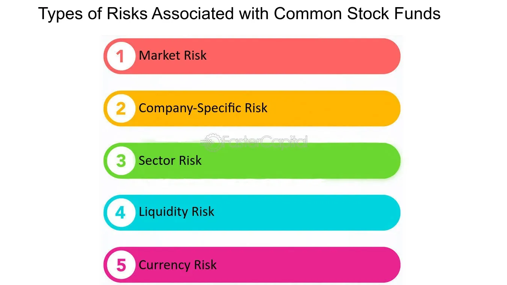

## Table of Contents

## What are stocks and why do people invest in them?

Stocks are pieces of a company that you can buy. When you buy a stock, you own a small part of that company. The price of a stock can go up or down based on how well the company is doing and what people think about it. If the company does well, the stock price might go up, and if it does badly, the stock price might go down.

People invest in stocks because they hope to make money. If the stock price goes up after they buy it, they can sell it for more than they paid. This is called a profit. Also, some companies pay their stockholders a part of their earnings, which is called a dividend. By investing in stocks, people can grow their money over time, but it also comes with risks because the stock price can go down and they might lose money.

## What is meant by 'risk' in the context of stock investments?

In the context of stock investments, 'risk' means the chance that you might lose some or all of the money you put into stocks. When you buy a stock, its price can go up or down. If it goes down and you sell it for less than you paid, you lose money. This is the main risk of investing in stocks. Different stocks have different levels of risk. Some companies are more likely to do well and grow, while others might struggle and their stock prices might drop a lot.

Another part of risk is that the stock market can be unpredictable. Things like the economy, news, and what people think about a company can all change quickly and affect stock prices. This means that even if you do a lot of research, you can't be sure what will happen. Because of this uncertainty, investing in stocks can be risky. But, over a long time, many people find that the chance to make money from stocks is worth the risk, as long as they are careful and don't put all their money into just one or two stocks.

## What are the basic risks that affect all stocks?

One basic risk that affects all stocks is market risk. This means that the whole stock market can go up or down because of things like the economy, interest rates, or big news events. When the market goes down, most stocks will go down too, even if the companies are doing well. So, even if you pick good companies, you can still lose money if the market has a bad day, month, or year.

Another basic risk is inflation risk. Inflation is when the prices of things go up over time. If inflation goes up a lot, the money you make from your stocks might not be worth as much as you thought. This can make it harder for your investments to grow in value in real terms.

Lastly, there's liquidity risk. This means that sometimes it can be hard to sell your stocks quickly without losing money. If a lot of people want to sell their stocks at the same time, the price can drop fast. So, if you need your money back quickly, you might have to sell your stocks for less than you wanted.

## How does market volatility impact stock prices?

Market volatility means that stock prices can go up and down a lot in a short time. It's like a roller coaster for the stock market. When the market is volatile, it can be scary because you never know if your stocks will be worth more or less the next day. This can make people nervous and they might decide to sell their stocks quickly, which can make the prices drop even more.

But market volatility isn't always bad. Sometimes, if you're patient and don't panic, you can buy stocks when they're cheaper because of the ups and downs. If you believe in the company and hold onto the stock, it might go back up later. So, while volatility can make things feel risky, it can also give you chances to make money if you're willing to wait and stay calm.

## What is the relationship between interest rates and stock performance?

Interest rates can have a big effect on how stocks do. When interest rates go up, it can make borrowing money more expensive for companies. This means they might have less money to grow their business or pay dividends to people who own their stocks. Also, when interest rates are high, people might choose to put their money in savings accounts or bonds instead of stocks because they can get a good return without the risk. This can make stock prices go down because fewer people want to buy them.

On the other hand, when interest rates are low, borrowing money is cheaper for companies. They can use this money to grow their business or invest in new projects, which can make their stock prices go up. Low interest rates also make stocks more attractive to investors because they can't get a good return from savings accounts or bonds. So, more people might buy stocks, pushing their prices higher. In short, interest rates can influence how much people want to invest in stocks and how well companies can do, which in turn affects stock performance.

## How can inflation affect the value of stocks?

Inflation is when the prices of things go up over time. This can affect stocks because if inflation is high, the money you get from your stocks might not be worth as much. For example, if you get $100 in dividends but the price of everything has gone up, that $100 might not buy as much as it used to. So, even if your stocks are doing well, high inflation can make it harder for your money to grow in value.

Also, inflation can change how people and companies act. If people think prices will keep going up, they might spend more money now instead of saving or investing in stocks. Companies might also have to raise their prices to keep up with inflation, which can make their profits go down if people don't want to pay more. This can make stock prices go down because investors might worry about the company's future. So, inflation can make stocks less valuable in two ways: by making the money you get from them worth less, and by changing how people and companies behave.

## What role does economic recession play in stock market risks?

An economic recession is when the economy is doing badly for a while. During a recession, people might lose their jobs, and companies might make less money. This can make stock prices go down because investors get worried about the future. When people are scared, they might sell their stocks quickly, which can make the prices drop even more. So, a recession can make the stock market more risky because there's a bigger chance that you could lose money.

But not all stocks are affected the same way during a recession. Some companies, like those that sell things people always need, like food or medicine, might do okay even when the economy is bad. Their stock prices might not go down as much. On the other hand, companies that sell things people can live without, like fancy cars or vacations, might see their stock prices drop a lot. So, while a recession can make the stock market riskier, it's important to look at which companies you're investing in because some might be safer than others.

## How do geopolitical events influence stock market risks?

Geopolitical events, like wars or big changes in government, can make the stock market more risky. When something big happens in the world, it can make people worried about the future. They might think that the economy will get worse or that it will be harder for companies to make money. This can make them sell their stocks quickly, which can make the prices go down a lot. So, if you own stocks during a big geopolitical event, you might lose money because the prices can drop fast.

But not all stocks are affected the same way by geopolitical events. Some companies might do okay even when there's trouble in the world. For example, companies that sell things people always need, like food or medicine, might not see their stock prices go down as much. On the other hand, companies that do business in the countries where the event is happening might see their stock prices drop a lot. So, while geopolitical events can make the stock market riskier, it's important to think about which companies you're investing in because some might be safer than others.

## What are liquidity risks and how do they apply to stocks?

Liquidity risk is when it's hard to sell your stocks quickly without losing money. Imagine you want to sell your stock, but not many people want to buy it right now. You might have to sell it for less than you wanted, or you might have to wait a long time to find a buyer. This can be a problem if you need your money fast, because you might not get as much as you hoped for.

Liquidity risk can be bigger for some stocks than others. Stocks of big, well-known companies usually have lots of buyers and sellers, so it's easier to sell them quickly without losing much money. But stocks of smaller or less-known companies might not have as many people interested in them. If something bad happens, like a big drop in the stock market, it can be even harder to sell these stocks without losing a lot of money. So, it's important to think about how easy it will be to sell your stocks when you're deciding what to invest in.

## How can sector-specific risks impact the broader stock market?

Sector-specific risks are dangers that affect certain parts of the economy more than others. For example, if there's a big problem in the oil industry, like a huge drop in oil prices, it can hurt the stocks of oil companies a lot. But this problem can also spread to the whole stock market. When people see that oil stocks are doing badly, they might get worried about the economy and start selling their other stocks too. This can make the prices of stocks in other sectors go down, even if those sectors are not directly affected by the oil problem.

The way sector-specific risks can impact the broader stock market is because everything in the economy is connected. If one big sector like technology or finance has a problem, it can make people feel unsure about the future. They might think that if one part of the economy is doing badly, other parts might be next. This can lead to a lot of selling and make the whole stock market go down. So, even if you don't own stocks in the troubled sector, the problems there can still affect your investments in other areas.

## What are the advanced strategies for mitigating stock market risks?

One advanced strategy for reducing stock market risks is diversification. This means spreading your money across different types of investments, like stocks from different sectors, bonds, and even other things like real estate or commodities. By doing this, you're not putting all your eggs in one basket. If one part of your investments goes down, the other parts might stay the same or even go up, which can help balance out your losses. Another part of diversification is investing in different countries, because what happens in one country's stock market might not affect another country's market as much.

Another strategy is using options and other financial tools to hedge your investments. Hedging means taking steps to protect your money from big drops in the stock market. For example, you can buy options that give you the right to sell your stocks at a certain price, even if the market price goes down a lot. This can help limit how much money you might lose. But, using options and other hedging tools can be complicated and might cost more money, so it's important to really understand them before you start using them.

Lastly, some people use a strategy called dollar-cost averaging. This means putting a fixed amount of money into the stock market at regular times, like every month. By doing this, you buy more stocks when the prices are low and fewer when the prices are high. Over time, this can help you pay a lower average price for your stocks. Dollar-cost averaging can help reduce the risk of putting all your money into the market at the wrong time, like right before a big drop in prices.

## How do regulatory changes pose risks to stock investments?

Regulatory changes are when the government makes new rules or changes old ones that affect how businesses work. These changes can be risky for stock investments because they might make it harder for companies to make money. For example, if the government makes new rules that make it more expensive for a company to do business, like stricter environmental laws, the company might have to spend more money to follow these rules. This can make their profits go down, which can make their stock prices drop. Investors might get worried and sell their stocks, making the prices go down even more.

But regulatory changes don't always hurt stock prices. Sometimes, they can help. For example, if the government gives tax breaks to certain industries, the companies in those industries might make more money. This can make their stock prices go up because investors might want to buy more of their stocks. So, it's important for investors to keep an eye on what the government is doing and how it might affect the companies they've invested in. By understanding these changes, investors can make better choices about which stocks to buy or sell.

## References & Further Reading

[1]: Bergstra, J., Bardenet, R., Bengio, Y., & Kégl, B. (2011). ["Algorithms for Hyper-Parameter Optimization."](https://dl.acm.org/doi/10.5555/2986459.2986743) Advances in Neural Information Processing Systems 24.

[2]: ["Advances in Financial Machine Learning"](https://www.amazon.com/Advances-Financial-Machine-Learning-Marcos/dp/1119482089) by Marcos Lopez de Prado

[3]: ["Evidence-Based Technical Analysis: Applying the Scientific Method and Statistical Inference to Trading Signals"](https://www.amazon.com/Evidence-Based-Technical-Analysis-Scientific-Statistical/dp/0470008741) by David Aronson

[4]: ["Machine Learning for Algorithmic Trading"](https://github.com/stefan-jansen/machine-learning-for-trading) by Stefan Jansen

[5]: ["Quantitative Trading: How to Build Your Own Algorithmic Trading Business"](https://www.amazon.com/Quantitative-Trading-Build-Algorithmic-Business/dp/1119800064) by Ernest P. Chan