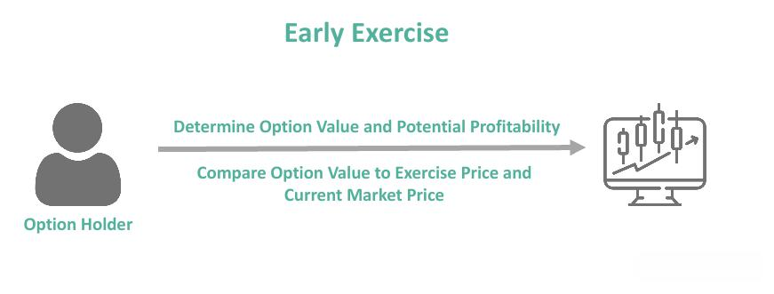

Options trading represents a sophisticated and potentially rewarding component of the investing landscape, demanding a clear understanding of its mechanics and nuances. Central to this discussion are OEX options, derived from the Standard & Poor's 100 index and symbolized by OEX. These options bear a unique set of characteristics that differentiate them from other financial instruments.

OEX options are particularly noteworthy due to their American-style nature, which permits holders to exercise the option prior to its expiration date. This flexibility introduces a layer of complexity that traders must consider, particularly when addressing risks such as early exercise. Unlike many equity options that necessitate the physical transfer of stocks upon execution, OEX options are cash-settled. This characteristic implies that the difference between the strike price and market price at expiry is paid in cash, eliminating the need for physical stock transactions. Understanding these fundamental aspects is crucial for navigating the risks associated with early exercise, as well as for devising robust strategies that may involve algorithmic trading techniques.



Algorithmic trading, leveraging sophisticated algorithms and data, plays a pivotal role in refining trading strategies by optimizing decision-making processes in real time. This often includes determining the optimal timing for exercising options to maximize returns or mitigate potential losses. By integrating these advanced strategies, traders aim to enhance their ability to manage the inherent risks of options trading effectively.

Before delving deeper into these advanced topics, it is essential to establish a firm foundation in the basics of options trading, alongside the specific attributes and considerations that characterize OEX options. This understanding serves as an entry point into more complex strategies, including dealing with early exercise risks and the application of algorithmic trading in the options market.

## Table of Contents

## Understanding OEX Options

OEX options, formally recognized as the Standard & Poor's 100 index options, are a prominent financial instrument within options trading markets, denoted by the ticker symbol OEX. These options hold a distinctive position due to their American-style nature, which allows for exercise at any point prior to expiration. This feature offers greater flexibility compared to European-style options, which can only be exercised at maturity.

Another primary characteristic of OEX options is their cash-settlement process. Unlike traditional equity options that typically result in the physical transfer of the underlying asset, OEX options settle in cash. This means that upon exercising an option, the holder receives a cash payment equivalent to the difference between the option's strike price and the market value of the Standard & Poor's 100 index at expiration, provided the option is in the money. This cash-settlement feature minimizes logistical complexities and transaction costs associated with physical delivery.

The formula used to calculate the cash settlement for a call option can be expressed as:

$$
\text{Cash Settlement} = \max(0, S - K)
$$

where $S$ represents the index level at expiration, and $K$ is the strike price of the option. For a put option, the formula is:

$$
\text{Cash Settlement} = \max(0, K - S)
$$

Due to their cash-settled and American-style nature, OEX options are frequently utilized by traders for hedging and speculative purposes, providing a mechanism to capitalize on movements of the S&P 100 index without the need for managing individual equities. This broadens the strategic utility of OEX options in various market scenarios, encouraging their continued appeal among both institutional and individual investors. 

In summary, OEX options offer investors flexibility and a cash-settlement feature, differentiating them from other equity options and enhancing their attractiveness as investment tools in options trading.

## The Risk of Early Exercise

Early exercise of American-style options, such as the OEX, presents unique challenges that can catch traders off guard. Unlike European-style options, which can only be exercised at expiration, American-style options allow exercise at any point before expiration. This flexibility introduces risks, particularly because of the cash settlement nature of OEX options. 

When a trader exercises an OEX option early, the option is settled in cash rather than the physical transfer of the underlying asset. This differs from equity options, where shares of stock may be exchanged. The cash settlement means the financial outcome is determined based on the difference between the strike price and the market price of the index, creating a scenario where the trader must be prepared to handle significant fluctuations in cash positions.

Such potential for early exercise can have substantial impacts on a trader's market positions and overall exposure. If traders are not prepared, they may face unanticipated [liquidity](/wiki/liquidity-risk-premium) issues or substantial financial commitments, heightening the risk of adverse financial impacts. This unpredictability is primarily due to factors such as dividend announcements or [interest rate](/wiki/interest-rate-trading-strategies) changes, which often motivate early exercise. For example, if an underlying stock is expected to pay a dividend, holding an option might no longer be as attractive, prompting early exercise.

Understanding these mechanics is essential for effective risk management in options trading. Traders must anticipate possible early exercises and incorporate them into their risk management strategies. This includes maintaining sufficient liquidity to cover unexpected cash settlements and adjusting positions to accommodate the changes in exposure caused by early exercises.

Traders can employ various tools and strategies to manage these risks. Python-based analytics can be utilized to predict the likelihood of early exercise. For example, by using historical data and current market variables, traders can develop models to evaluate when early exercise might be advantageous. Such predictive modeling could involve calculating the expected value of holding an option versus exercising it early, taking into account dividends and interest rates:

```python
def early_exercise_value(option_price, dividend, interest_rate, days_to_expiration):
    holding_value = option_price * ((1 + interest_rate) ** (days_to_expiration/365))
    early_value = option_price + dividend
    return early_value - holding_value

# Example calculation
option_price = 100  # Current option price
dividend = 2        # Expected dividend
interest_rate = 0.05  # Interest rate (5%)
days_to_expiration = 30  # Days until expiration

advantage = early_exercise_value(option_price, dividend, interest_rate, days_to_expiration)
print("Early exercise advantage:", advantage)
```

This code calculates the financial advantage or disadvantage of early exercising compared to holding until expiration, considering dividends and interest rates. Such tools enable traders to make informed decisions, hedging against the potential risks that come with early exercise in OEX options trading.

## Algorithmic Trading in Options Markets

Algorithmic trading in options markets plays an integral role in optimizing trading strategies through the utilization of advanced algorithms and data-driven analysis. By automating the decision-making process, algorithms provide traders with the capability to execute timely and efficient trades, reducing human error and enhancing strategy precision.

In options trading, one of the most critical functions of [algorithmic trading](/wiki/algorithmic-trading) is determining the optimal timing for exercising options. This is particularly important for American-style options, which can be exercised at any point before expiration, offering significant flexibility but also complexity in decision-making. Algorithms analyze a wide array of market data in real time, enabling traders to make informed decisions about when to exercise options to maximize profit or minimize loss.

Sophisticated strategies employed in algorithmic trading include delta-based strategies, neural networks, and risk management algorithms. Delta refers to the ratio comparing the change in the price of the underlying asset to the corresponding change in the price of the option. By using delta-based strategies, algorithms can hedge positions effectively by maintaining a delta-neutral stance. This means adjusting the options portfolio to ensure that its delta remains close to zero, thereby minimizing the impact of price changes in the underlying asset.

Neural networks, a form of [machine learning](/wiki/machine-learning), are also employed to predict market movements and option pricing by analyzing historical data patterns. These networks can uncover complex nonlinear relationships in large datasets, enabling more accurate predictions and efficient trading strategies.

Risk management algorithms help traders to assess and mitigate potential risks associated with options trading. These algorithms evaluate multiple risk factors such as [volatility](/wiki/volatility-trading-strategies), interest rates, and liquidity, providing traders with comprehensive risk assessments that guide strategic decisions. By continuously monitoring market conditions, these algorithms can suggest real-time adjustments to trading strategies, enhancing protection against adverse market moves.

Overall, the incorporation of algorithmic trading in options markets enhances decision-making accuracy and trading efficiency. As computational technology advances, the reliance on algorithms for managing and executing trading strategies is likely to increase, offering both opportunities and challenges in the complex landscape of options trading.

## Case Studies: Real-world Applications

In the landscape of options trading, early exercise of OEX options can be an intricate maneuver, often influenced by diverse market dynamics and investor objectives. Case studies reveal how both institutional and retail investors tackle the complexities associated with early exercise, highlighting varied strategies and implications.

Institutional investors frequently engage in dividend [arbitrage](/wiki/arbitrage), a strategy that capitalizes on discrepancies in dividend declarations and option valuations. By purchasing deep in-the-money call options before a stock goes ex-dividend, investors exercise the options early to acquire the underlying shares and capture the dividend. This exercise is driven by the need to optimize returns and exploit potential tax efficiencies afforded by the timing of dividend receipts. The decision to employ dividend arbitrage often hinges on calculating the implied dividend rate versus the cost of early exercise, a calculus where algorithmic trading systems offer substantial advantages. These systems rapidly assess market conditions, volatility, and other parameters to strategically decide when an early exercise is beneficial.

For retail investors, early exercise poses a different set of challenges, primarily due to limited resources and access to research infrastructure. However, advances in technology enable these investors to leverage algorithmically guided decision alerts. These alerts can synthesize market data, option greeks, and other relevant indicators to advise on optimal exercise timings. For instance, an algorithm may suggest early exercise when the time value of an option is minimal relative to the anticipated dividend payout, or when market volatility suggests heightened risk of adverse price movements.

An example Python script for evaluating potential early exercise based on dividend parameters might look like this:

```python
def should_exercise_early(option_price, dividend_yield, interest_rate, time_to_expiry):
    # Calculate the expected gain from early exercise
    intrinsic_value_gain = dividend_yield * option_price
    holding_cost = interest_rate * option_price * time_to_expiry

    # Determine if the gain outweighs the cost
    if intrinsic_value_gain > holding_cost:
        return True
    return False

# Example usage
option_price = 50  # Current price of the option
dividend_yield = 0.02  # Expected dividend yield
interest_rate = 0.01  # Current risk-free interest rate
time_to_expiry = 0.5  # Time in years until option expiry

should_exercise = should_exercise_early(option_price, dividend_yield, interest_rate, time_to_expiry)
print("Exercise early:", should_exercise)
```

This script evaluates whether the dividend yield justifies an early exercise decision compared to the holding costs represented by interest rates and time to expiry. Retail investors can incorporate such algorithms into brokerage platforms or third-party applications, gaining a strategic edge in the market.

In conclusion, case studies of real-world applications underscore the diversity in handling early exercise. Institutional players focus on strategies such as dividend arbitrage, utilizing advanced algorithms to enhance precision and profitability. Meanwhile, retail investors can navigate these intricacies with algorithmic tools, aligning their tactics with prevailing market conditions to optimize outcomes effectively.

## Mitigating the Risks of Early Exercise

Mitigating the risks associated with early exercise when trading OEX options involves employing several strategic approaches. One effective strategy is selecting European-style options over American-style OEX options. European options eliminate the possibility of early exercise, as they can only be exercised at expiration. This characteristic provides traders with a more predictable risk profile and removes the uncertainty of unexpected exercises. 

Another approach to managing early exercise risk is the use of algorithmic trading strategies. By leveraging advanced computational algorithms, traders can make real-time adjustments based on current market conditions and projected data trends. These algorithms can assess factors such as volatility, interest rates, and the current stock index value to assist traders in making informed decisions about their positions. A common method involves using delta-hedging strategies that automatically adjust the portfolio's delta to maintain a neutral position. The delta ($\Delta$) represents the rate of change of the option's price relative to the underlying asset's price. Here's a simple Python example to illustrate a delta-hedging calculation:

```python
def calculate_delta(option_price, stock_price, change_in_stock_price):
    return (option_price(new) - option_price(old)) / change_in_stock_price

option_price_new = 10.5
option_price_old = 10.0
change_in_stock_price = 1.0

delta = calculate_delta(option_price_new, option_price_old, change_in_stock_price)
print(f'The Delta is: {delta}')
```

Continuous education is imperative for traders dealing in options markets. Staying up-to-date with the latest advancements in algorithmic strategies and understanding the evolving guidelines for trading can provide a competitive edge. Many educational resources, from formal courses to in-depth market reports, are available for traders seeking to enhance their understanding of both algorithmic trading and options strategies. By combining theoretical knowledge with practical tools and techniques such as algorithmic trading, traders can better mitigate the inherent risks associated with early exercise and optimize their trading performance.

## Conclusion

OEX options trading offers a blend of challenges and prospects, notably due to the early exercise risk inherent in their American-style structure. This characteristic distinguishes them from European-style options and requires traders to exercise meticulous risk management and strategic foresight. The early exercise feature can lead to unforeseen market exposure and necessitates a keen understanding of market dynamics to utilize effectively.

Integrating algorithmic trading strategies into OEX options trading can significantly enhance the management of these risks and optimize trading outcomes. Algorithms enable traders to process real-time data, thereby making informed decisions regarding the optimal exercise timing. These programs utilize advanced strategies, such as delta-based approaches and [neural network](/wiki/neural-network) models, to provide a robust framework for trading decisions. Furthermore, the continuous evolution of algorithmic trading tools offers traders additional options to hedge risks and maximize returns.

To thrive in the dynamic options markets, traders must adeptly balance theoretical knowledge with practical application. While understanding the underlying principles of options trading is crucial, the practical deployment of algorithms can bridge the gap between knowledge and actionable trading strategies. Continuous learning and adaptation to the latest technological advancements are imperative for maintaining a competitive edge.

Ultimately, the success in options trading, especially with instruments like OEX options that involve early exercise risks, hinges on a dual approach: mastery of theoretical concepts complemented by sophisticated, well-executed trading strategies. This approach ensures that traders not only manage risks effectively but also leverage opportunities for enhanced profitability in an ever-evolving financial landscape.

## References & Further Reading

[1]: Hull, J. C. (2021). ["Options, Futures, and Other Derivatives,"](https://elibrary.pearson.de/book/99.150005/9781292410623) 10th Edition. Pearson Education.

[2]: Cox, J. C., & Rubinstein, M. (1985). ["Options Markets."](https://drive.google.com/file/d/0B156xe8jOD8kWnh1SlRDeFJyZFU/view?usp=drive_web&resourcekey=0-L6eSzE0QUCK412wYmYSUug) Prentice-Hall.

[3]: Black, F., & Scholes, M. (1973). ["The Pricing of Options and Corporate Liabilities."](https://www.cs.princeton.edu/courses/archive/fall09/cos323/papers/black_scholes73.pdf) Journal of Political Economy, 81(3), 637-654.

[4]: Lopez de Prado, M. (2018). ["Advances in Financial Machine Learning."](https://www.amazon.com/Advances-Financial-Machine-Learning-Marcos/dp/1119482089) Wiley.

[5]: Chan, E. (2008). ["Quantitative Trading: How to Build Your Own Algorithmic Trading Business."](https://github.com/ftvision/quant_trading_echan_book) Wiley.

[6]: Jansen, S. (2020). ["Machine Learning for Algorithmic Trading."](https://github.com/stefan-jansen/machine-learning-for-trading) Packt Publishing.

[7]: Aronson, D. R. (2006). ["Evidence-Based Technical Analysis: Applying the Scientific Method and Statistical Inference to Trading Signals."](https://onlinelibrary.wiley.com/doi/book/10.1002/9781118268315) Wiley.