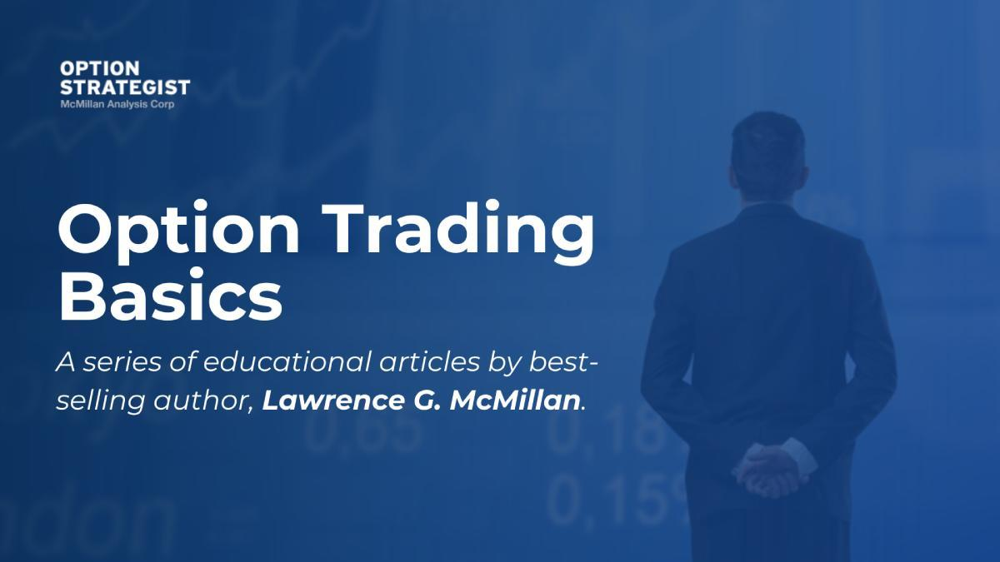

## Table of Contents

## What are OEX options and how do they differ from other options?

OEX options are a type of stock option that specifically tracks the Standard & Poor's 100 Index (S&P 100). This index includes 100 major companies in the U.S., making OEX options a way for investors to bet on the overall performance of these big companies. Unlike options on individual stocks, OEX options give you exposure to a broad market segment, which can be less risky than betting on a single company.

One key difference between OEX options and other options is how they are settled. Most stock options are settled by delivering the actual shares of stock if the option is exercised. However, OEX options are settled in cash. This means that if you exercise an OEX option, you receive or pay the difference between the option's strike price and the current value of the S&P 100 in cash, rather than receiving stock. This cash settlement feature can make OEX options more convenient for some investors, as it avoids the need to handle physical shares.

## What does 'early exercise' mean in the context of options trading?

Early exercise in options trading means that the owner of an option decides to use their right to buy or sell the underlying asset before the option's expiration date. This is different from waiting until the last day of the option's life to make a decision. People might choose to exercise early if it makes financial sense, like if they can get a good deal or if they want to lock in profits before the market changes.

In the case of American-style options, which can be exercised at any time up to expiration, early exercise is possible. However, it's less common because usually, it's more profitable to sell the option itself rather than exercising it early. For example, if you have a call option and the stock pays a dividend, you might exercise early to get that dividend. But most of the time, traders will just sell their options on the open market to capture any remaining value.

## Why might someone consider early exercise of an OEX option?

Someone might consider early exercise of an OEX option if they think it will save them money or help them make more money. Since OEX options are settled in cash, exercising early could be a good idea if the value of the S&P 100 is very different from the strike price of the option. For example, if someone has a call option and the S&P 100 goes way up, they might want to exercise early to lock in the profit before the market changes.

However, early exercise of OEX options is not very common. Most traders find it better to sell their options on the open market instead of exercising them. This is because selling the option can often get them more money than exercising it early. But in some rare cases, like if there's a big event coming up that could change the market a lot, someone might choose to exercise their OEX option early to be safe.

## What are the basic risks associated with early exercise of OEX options?

One big risk of early exercise of OEX options is that you might lose out on more money. If you exercise your option early, you give up any chance for the option to become more valuable before it expires. If the S&P 100 keeps going up after you exercise your call option, or keeps going down after you exercise your put option, you could have made more money by waiting.

Another risk is that you might miss out on other opportunities. When you exercise an OEX option, you have to pay the full amount to buy or sell the S&P 100 value right away. This can tie up a lot of your money that you could have used for other investments. Plus, if the market changes right after you exercise, you might wish you had kept your money free to use somewhere else.

Finally, there's the risk of not understanding the full value of your option. OEX options have time value, which means they can be worth more than just the difference between the strike price and the S&P 100 value. If you exercise early, you might not get this extra value, which you could have gotten by selling the option instead of exercising it.

## How can early exercise impact the financial outcome of an OEX option trade?

Early exercise of an OEX option can change how much money you make or lose. If you exercise early, you lock in the difference between the S&P 100 value and your option's strike price right away. But if the S&P 100 keeps moving in your favor after you exercise, you miss out on extra profits you could have made if you had waited until the option expired. For example, if you have a call option and the S&P 100 goes up a lot more after you exercise, you could have made more money by holding onto the option.

Also, exercising an OEX option early means you use up your money right away. You have to pay for the full value of the S&P 100 when you exercise, which can tie up cash that you might need for other investments. If the market changes right after you exercise, you might regret not keeping your money free to use elsewhere. Plus, OEX options have something called time value, which can make them worth more than just the difference between the strike price and the S&P 100 value. By exercising early, you might not get this extra value that you could have gotten by selling the option instead.

## What are the tax implications of early exercising OEX options?

When you exercise an OEX option early, you have to think about taxes. If you exercise a call option early and get cash, that money is usually treated as ordinary income. This means you'll pay taxes on it at your regular income tax rate, which could be higher than the rate for long-term capital gains. If you had waited and sold the option instead of exercising it, you might have paid a lower tax rate on any profits.

On the other hand, if you exercise a put option early and have to pay cash, you might be able to claim a loss on your taxes. This loss could help lower your taxable income for the year. But remember, tax rules can be tricky, and they can change. It's always a good idea to talk to a tax professional to understand how early exercising OEX options could affect your taxes.

## How does the timing of dividends affect the decision to early exercise OEX options?

Dividends don't directly affect the decision to early exercise OEX options because OEX options are based on the S&P 100 index, not individual stocks. The S&P 100 index itself doesn't pay dividends. Instead, it's adjusted for the dividends paid by the companies in the index. This means that the value of the index, and thus the value of OEX options, goes up when dividends are paid, but you don't get the dividends directly.

Because of this, the timing of dividends isn't something you need to worry about when deciding whether to early exercise OEX options. You should focus more on the overall movement of the S&P 100 and whether exercising early will lock in a good profit or save you from a big loss. If the S&P 100 moves a lot in your favor after you exercise, you might wish you had waited, but dividends won't change your decision.

## What role does the option's intrinsic value play in deciding to exercise early?

The intrinsic value of an OEX option is the difference between the S&P 100's current value and the option's strike price. If you have a call option and the S&P 100 is higher than the strike price, the option has intrinsic value. If you have a put option and the S&P 100 is lower than the strike price, it also has intrinsic value. When you exercise an option early, you get this intrinsic value in cash right away.

But, you might not want to exercise early just because there's intrinsic value. Options also have time value, which is the extra amount someone might pay for the option because it could become more valuable before it expires. If you exercise early, you miss out on this time value. So, you should only exercise early if the intrinsic value you get now is more important to you than the chance of getting more money later.

## How does the volatility of the underlying index influence the risk of early exercise?

The [volatility](/wiki/volatility-trading-strategies) of the S&P 100, which is the index that OEX options are based on, can make early exercise riskier. Volatility means how much the index goes up and down. If the S&P 100 is very volatile, it might go up a lot after you exercise your option early, and you could miss out on making more money. On the other hand, if it goes down a lot, you might be glad you exercised early to lock in your profit. But because it's hard to predict which way the market will move, high volatility makes it riskier to exercise early.

When the S&P 100 is less volatile, it doesn't move around as much, so the risk of missing out on big gains or losses is smaller. In this case, exercising early might seem less risky because you're not as worried about the index making a big jump. Still, you have to think about the time value of the option. Even if the index isn't moving much, selling the option instead of exercising it early might still be a better choice because you could get more money from its time value.

## What advanced strategies can mitigate the risks of early exercise in OEX options?

One advanced strategy to reduce the risks of early exercise with OEX options is to use a strategy called "rolling." Instead of exercising your option early, you can sell your current option and use the money to buy a new option with a later expiration date. This way, you can keep your position in the market without locking in your gains or losses too soon. Rolling can help you take advantage of any remaining time value in your option and give you more time to see how the S&P 100 moves.

Another strategy is to use a "collar" strategy. This involves buying a put option to protect against big drops in the S&P 100, while also selling a call option to help pay for the put. If you're thinking about exercising your OEX call option early, a collar can help you keep some protection against the market going down while still giving you a chance to make more money if the market goes up. This strategy can make early exercise less risky by balancing potential gains and losses.

Using these strategies can help you manage the risks of early exercise better. They let you stay flexible and keep your options open, which is important when dealing with the unpredictable movements of the S&P 100. Always remember, though, that no strategy can completely remove risk, so it's important to understand the market and your own risk tolerance before making any moves.

## How do market conditions and interest rates affect the decision to early exercise OEX options?

Market conditions can make a big difference when you're thinking about exercising your OEX options early. If the market is going up fast, you might want to wait instead of exercising early because the option could become more valuable. But if the market looks like it might go down soon, you might want to exercise early to lock in your profit before it's too late. Also, if the market is really unpredictable and moving a lot, it's riskier to exercise early because you could miss out on big changes in the S&P 100.

Interest rates can also affect your decision. When interest rates are high, it can be more costly to hold onto your option until it expires because you could be [earning](/wiki/earning-announcement) more money from interest if you had the cash now. This might make you more likely to exercise early to get your money sooner. But if interest rates are low, it doesn't hurt as much to wait, so you might choose to hold onto your option and see if it goes up in value before deciding to exercise.

## What are the long-term effects on a trading portfolio from frequently early exercising OEX options?

If you often exercise your OEX options early, it can change your trading portfolio in big ways over time. You might miss out on extra money because you're not waiting for the option to become more valuable before it expires. This can make your overall profits smaller than they could have been. Also, exercising early means you're using up your cash right away, which can limit how much money you have to put into other investments. Over time, this can slow down the growth of your portfolio because you're not spreading your money around as much as you could.

Another thing to think about is how exercising early can affect your taxes. When you exercise an OEX option and get cash, you usually have to pay taxes on that money at your regular income tax rate. If you had sold the option instead, you might have paid a lower tax rate on any profits. Over many years, this difference in tax rates can add up and take a bigger bite out of your overall returns. So, exercising early often can mean less money in your pocket in the long run, both because of missed opportunities and higher taxes.

## What are OEX Options and how can they be understood?

OEX options, formally recognized as the Standard & Poor's 100 index options, are a prominent financial instrument within options trading markets, denoted by the ticker symbol OEX. These options hold a distinctive position due to their American-style nature, which allows for exercise at any point prior to expiration. This feature offers greater flexibility compared to European-style options, which can only be exercised at maturity.

Another primary characteristic of OEX options is their cash-settlement process. Unlike traditional equity options that typically result in the physical transfer of the underlying asset, OEX options settle in cash. This means that upon exercising an option, the holder receives a cash payment equivalent to the difference between the option's strike price and the market value of the Standard & Poor's 100 index at expiration, provided the option is in the money. This cash-settlement feature minimizes logistical complexities and transaction costs associated with physical delivery.

The formula used to calculate the cash settlement for a call option can be expressed as:

$$
\text{Cash Settlement} = \max(0, S - K)
$$

where $S$ represents the index level at expiration, and $K$ is the strike price of the option. For a put option, the formula is:

$$
\text{Cash Settlement} = \max(0, K - S)
$$

Due to their cash-settled and American-style nature, OEX options are frequently utilized by traders for hedging and speculative purposes, providing a mechanism to capitalize on movements of the S&P 100 index without the need for managing individual equities. This broadens the strategic utility of OEX options in various market scenarios, encouraging their continued appeal among both institutional and individual investors. 

In summary, OEX options offer investors flexibility and a cash-settlement feature, differentiating them from other equity options and enhancing their attractiveness as investment tools in options trading.

## References & Further Reading

[1]: Hull, J. C. (2021). ["Options, Futures, and Other Derivatives,"](https://elibrary.pearson.de/book/99.150005/9781292410623) 10th Edition. Pearson Education.

[2]: Cox, J. C., & Rubinstein, M. (1985). ["Options Markets."](https://drive.google.com/file/d/0B156xe8jOD8kWnh1SlRDeFJyZFU/view?usp=drive_web&resourcekey=0-L6eSzE0QUCK412wYmYSUug) Prentice-Hall.

[3]: Black, F., & Scholes, M. (1973). ["The Pricing of Options and Corporate Liabilities."](https://www.cs.princeton.edu/courses/archive/fall09/cos323/papers/black_scholes73.pdf) Journal of Political Economy, 81(3), 637-654.

[4]: Lopez de Prado, M. (2018). ["Advances in Financial Machine Learning."](https://www.amazon.com/Advances-Financial-Machine-Learning-Marcos/dp/1119482089) Wiley.

[5]: Chan, E. (2008). ["Quantitative Trading: How to Build Your Own Algorithmic Trading Business."](https://github.com/ftvision/quant_trading_echan_book) Wiley.

[6]: Jansen, S. (2020). ["Machine Learning for Algorithmic Trading."](https://github.com/stefan-jansen/machine-learning-for-trading) Packt Publishing.

[7]: Aronson, D. R. (2006). ["Evidence-Based Technical Analysis: Applying the Scientific Method and Statistical Inference to Trading Signals."](https://onlinelibrary.wiley.com/doi/book/10.1002/9781118268315) Wiley.