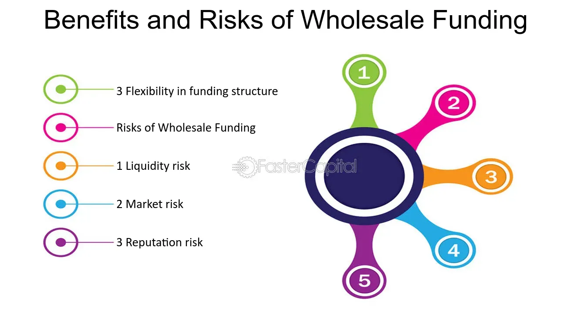

## Table of Contents

## What is wholesale funding?

Wholesale funding is when banks and financial institutions get money from big investors instead of regular people. These big investors can be other banks, companies, or even the government. The money is usually given in large amounts and can be used by the bank to lend to others or to run their daily operations.

This type of funding is different from retail funding, where banks get money from everyday people through savings and checking accounts. Wholesale funding can be riskier because it often comes with higher interest rates and the money can be taken away quickly if the big investors lose trust in the bank. But it's also important because it helps banks have enough money to keep doing business.

## How does wholesale funding differ from retail funding?

Wholesale funding and retail funding are two ways banks get money, but they come from different places. Wholesale funding is when banks get money from big investors like other banks, companies, or the government. These investors give large amounts of money to the bank, which the bank can then use to lend to others or to keep its operations going. On the other hand, retail funding is when banks get money from regular people. This happens when people put their money into savings accounts, checking accounts, or buy certificates of deposit at the bank.

The main difference between the two is where the money comes from and how much is given at one time. With wholesale funding, the amounts are usually much bigger because they come from big investors. But this can be riskier for the bank because these investors might want their money back quickly if they lose trust in the bank. Retail funding, on the other hand, comes in smaller amounts from many different people, which can be more stable because it's less likely that all those people will want their money back at the same time. But it can take longer for a bank to gather enough money this way.

## What are the common sources of wholesale funding for banks and financial institutions?

Banks and financial institutions often get wholesale funding from other big banks. This is called interbank lending. They borrow money from each other to make sure they have enough cash to run their daily operations or to lend to their customers. Another common source is the money market, where banks can borrow from investors who have a lot of money to lend out for short periods of time. These investors could be big companies or even other financial institutions looking to earn some interest on their extra cash.

Another source of wholesale funding is issuing bonds. Banks can create and sell bonds to investors, promising to pay them back with interest over time. This gives the bank a big chunk of money upfront that they can use however they need. Lastly, banks might also get wholesale funding from the central bank, like the Federal Reserve in the United States. The central bank can lend money to banks to help them meet their needs, especially during tough economic times.

## What are the basic risks associated with wholesale funding?

Wholesale funding can be riskier for banks because it often comes with higher interest rates. When banks borrow money from big investors, they have to pay back more than they borrowed, which can eat into their profits. Also, the money from wholesale funding can be taken away quickly. If the big investors lose trust in the bank or if the economy takes a bad turn, these investors might want their money back right away. This can leave the bank in a tight spot, struggling to find enough cash to give back to the investors.

Another risk is that wholesale funding can be less stable than retail funding. With retail funding, banks get money from lots of different people, and it's less likely that all those people will want their money back at the same time. But with wholesale funding, the money comes from fewer, bigger sources. If even one of these big investors pulls out their money, it can cause big problems for the bank. This makes it harder for the bank to plan for the future and can lead to financial trouble if they're not careful.

## How can liquidity risk impact institutions relying on wholesale funding?

Liquidity risk can be a big problem for banks that use a lot of wholesale funding. This kind of risk happens when a bank can't get enough cash quickly to meet its needs. When banks rely on big investors for their money, those investors can take their money back fast if they get worried about the bank or if the economy is doing badly. This can leave the bank in a tough spot because they might not have enough cash on hand to give back to the investors right away.

If a bank can't meet its cash needs, it might have to sell off some of its assets quickly, which can mean selling them for less than they're worth. This can hurt the bank's finances and make it harder for them to keep doing business. In the worst cases, if a lot of investors pull their money out at the same time, it could even lead to the bank failing. So, banks that use a lot of wholesale funding need to be really careful about managing their [liquidity](/wiki/liquidity-risk-premium) risk to make sure they always have enough cash to handle any sudden changes.

## What role does the maturity mismatch play in the risks of wholesale funding?

Maturity mismatch happens when a bank uses short-term wholesale funding to make long-term loans or investments. This can be risky because the bank might have to pay back the short-term money before the long-term investments start making money back. If the big investors want their money back quickly, the bank might not have enough cash on hand to give it to them. This can cause a lot of stress for the bank and might force them to sell off their long-term investments at a loss just to get the cash they need.

This problem got worse during the 2008 financial crisis. Many banks were using short-term wholesale funding to buy long-term assets like mortgage-backed securities. When the housing market crashed, the value of these securities went down, and at the same time, investors started pulling their money out of the banks. The banks couldn't sell their long-term assets for enough money to pay back the investors, which led to a lot of banks failing or needing government help. So, maturity mismatch can make the risks of wholesale funding even bigger, especially during tough economic times.

## Can you explain how interest rate fluctuations affect wholesale funding?

Interest rate changes can really shake things up for banks that use wholesale funding. When interest rates go up, it means the bank has to pay more to borrow money from big investors. This can cut into the bank's profits because they have to give back more money than before. If the bank has a lot of short-term wholesale funding, it might need to borrow more often, and each time it does, the cost could be higher because of the rising rates. This can make it harder for the bank to plan its finances and could lead to money troubles if the rates keep going up.

On the flip side, when interest rates go down, it can be good for the bank because borrowing money becomes cheaper. But there's a catch. If the bank is using wholesale funding to make long-term loans or investments, those might not be [earning](/wiki/earning-announcement) as much as before because the rates they're getting on those loans or investments might also go down. So, while it's cheaper to borrow, the bank might not be making as much money on what it's doing with that borrowed money. This can mess up the bank's plans if they were counting on making a certain amount of money from their investments.

## What are some historical examples of failures due to wholesale funding?

One big example of a failure due to wholesale funding was during the 2008 financial crisis. A lot of banks, like Lehman Brothers, were using short-term wholesale funding to buy long-term assets like mortgage-backed securities. When the housing market crashed, the value of these securities went down a lot. At the same time, investors got scared and started pulling their money out of the banks. Lehman Brothers couldn't sell their long-term assets for enough money to pay back the investors, and they ended up going bankrupt. This was a huge problem because it showed how risky it can be to rely too much on wholesale funding.

Another example is the failure of Northern Rock, a British bank, in 2007. Northern Rock was using a lot of short-term wholesale funding to grow quickly. But when the global credit markets started to get tight, investors got worried and wanted their money back. Northern Rock didn't have enough cash on hand to give it back to them, and they couldn't borrow more money from other places. This led to a big run on the bank, where a lot of people tried to take their money out at the same time. In the end, the British government had to step in and take over the bank to stop it from failing completely.

## How do regulatory frameworks address the risks of wholesale funding?

Governments and financial watchdogs have set up rules to make sure banks don't get into too much trouble with wholesale funding. One big rule is that banks have to keep a certain amount of money on hand, called liquidity requirements. This means they need to have enough cash to pay back their investors even if things go bad. Another rule is about how much risk banks can take. Regulators check how much of a bank's money comes from wholesale funding and make sure it's not too much. If it is, they might tell the bank to use less of it or to have more cash ready to go.

These rules help keep banks safe and stop them from failing like some did during the 2008 financial crisis. For example, after that crisis, a lot of countries made their rules stricter. They started doing stress tests, which are like practice runs to see if a bank can handle a bad situation. If a bank doesn't pass these tests, it has to fix its problems before it can get into more trouble. By keeping a close eye on banks and making them follow these rules, regulators hope to stop big problems before they start and keep the whole financial system running smoothly.

## What strategies can financial institutions implement to mitigate the risks of wholesale funding?

Financial institutions can take several steps to lower the risks that come with using wholesale funding. One good way is to mix up where they get their money from. Instead of relying too much on big investors, they can also get money from regular people through savings and checking accounts. This can make their money supply more stable because it's less likely that all those people will want their money back at the same time. Another strategy is to keep a good amount of cash on hand, called a liquidity buffer. This way, if big investors suddenly want their money back, the bank has enough cash to give it to them without having to sell off other things quickly.

Another important thing banks can do is to match the time they borrow money for with the time they lend it out. If they borrow money for a short time, they should try to use it for short-term loans or investments too. This can help avoid the problem of maturity mismatch, where they have to pay back short-term money before their long-term investments start making money back. Banks can also use stress tests to see how they would handle a bad situation. By running these tests, they can find out where their weak spots are and fix them before they cause big problems.

## How does the reliance on wholesale funding affect the overall stability of the financial system?

When banks rely a lot on wholesale funding, it can make the whole financial system less stable. Wholesale funding comes from big investors like other banks or companies, and these investors can take their money back quickly if they get worried about the bank or if the economy is doing badly. If a lot of banks are using this kind of funding and the investors all want their money back at the same time, it can cause a big problem. The banks might not have enough cash to give back to the investors, which can lead to banks failing and can spread panic through the whole financial system.

To keep the financial system stable, it's important for banks to not depend too much on wholesale funding. They should mix it up by also getting money from regular people through savings and checking accounts. This can make their money supply more stable because it's less likely that all those people will want their money back at the same time. Also, rules set by governments and financial watchdogs help by making sure banks have enough cash on hand and don't take too many risks. By following these rules and using different ways to get money, banks can help keep the financial system strong and avoid big problems.

## What advanced metrics and models are used to assess and manage the risks of wholesale funding?

Banks use special tools and numbers to keep an eye on the risks of using wholesale funding. One important tool is called the Liquidity Coverage Ratio (LCR). This tool helps banks figure out if they have enough cash on hand to handle a bad situation where a lot of investors want their money back at the same time. Another tool is the Net Stable Funding Ratio (NSFR), which looks at how well a bank's long-term money needs match up with its long-term sources of money. These tools help banks make sure they're not too dependent on short-term wholesale funding, which can be risky.

Banks also use something called stress testing to see how they would do if things went really wrong. In these tests, banks pretend that the economy is in a bad spot and see if they would still have enough money to keep going. This helps them find weak spots and fix them before they cause big problems. By using these tools and tests, banks can better understand and manage the risks that come with wholesale funding, making sure they're ready for whatever might happen.

## How does the interplay of wholesale funding and algorithmic trading affect risk management?

In modern banking, wholesale funding and [algorithmic trading](/wiki/algorithmic-trading) represent two pivotal elements that, when intertwined, can significantly elevate financial risk. The core idea in managing this interplay revolves around ensuring that returns from algorithmic trading consistently outweigh the borrowing costs associated with wholesale funding.

Wholesale funding involves banks borrowing from institutional entities or financial markets, which can offer significant scalability and flexibility. However, these sources often come with higher costs and are more sensitive to market [volatility](/wiki/volatility-trading-strategies) compared to traditional deposit-based funding. On the other hand, algorithmic trading employs sophisticated algorithms to execute trades at high speed and [volume](/wiki/volume-trading-strategy), potentially leading to substantial profits. However, it also introduces risks such as operational failures or erroneous trading activities, which could result in financial losses.

The challenge lies in maintaining a delicate balance where the cost of funds from wholesale markets is lower than the yields generated by trading activities. Mathematically, this can be represented as:

$$
\text{Net Profit} = \text{Trading Yield} - \text{Cost of Wholesale Funding}
$$

Where:
- $\text{Trading Yield}$ is the return generated by algorithmic trading.
- $\text{Cost of Wholesale Funding}$ refers to the interest and associated costs of borrowing from wholesale markets.

Banks must ensure effective risk management practices to maintain this balance. It involves not only monitoring the market conditions to optimize funding costs but also integrating robust algorithms to maximize trading efficiency and profits. The use of quantitative techniques such as Value at Risk (VaR) and stress testing can aid in evaluating the potential impact of market fluctuations on the funding costs and trading performance.

Moreover, aligning these activities with the institution's overall risk appetite is crucial. Banks should establish well-defined risk limits and continuously monitor their compliance to avoid excessive risk exposure. The introduction of stringent internal controls and regular audits can help detect anomalies early and mitigate potential risks.

Ultimately, the successful integration of wholesale funding and algorithmic trading within a bank's risk management framework is contingent on the deployment of advanced technologies and strategic oversight. By leveraging real-time data analytics and [machine learning](/wiki/machine-learning), banks can refine their predictive models to enhance decision-making processes, ensuring that they remain nimble in the face of dynamic financial markets.

## How can we mitigate the risks involved?

Mitigating risks in banking, particularly those associated with wholesale funding and algorithmic trading, necessitates a comprehensive approach integrating robust risk management frameworks. Banks must implement strategies like stress testing, scenario analysis, and continuous risk monitoring to identify, assess, and address potential vulnerabilities.

**Stress Testing and Scenario Analysis**

Stress testing is a critical component of risk management whereby banks simulate adverse financial scenarios to evaluate the resilience of their operations. This process helps in understanding how extreme conditions might impact their capital and liquidity positions. Scenario analysis complements stress testing by considering a broader range of potential future events, including low-probability but high-impact scenarios.

For example, a bank might model the effects of sudden [interest rate](/wiki/interest-rate-trading-strategies) hikes or market corrections on its portfolio. By identifying potential weaknesses through this comprehensive testing, banks can develop contingency plans and strengthen their risk buffers.

**Regulatory Frameworks: Basel III**

The Basel III framework, established by the Basel Committee on Banking Supervision, plays a pivotal role in bolstering financial stability. By introducing rigorous capital and liquidity standards, Basel III aims to reduce systemic risks in the banking sector. Key components of Basel III include:

- **Capital Requirements**: Banks are required to maintain a higher minimum capital ratio, improving their ability to absorb losses.
$$
  \text{Capital Adequacy Ratio (CAR)} = \frac{\text{Tier 1 Capital} + \text{Tier 2 Capital}}{\text{Risk-Weighted Assets}} \geq 12\%

$$

- **Liquidity Measures**: The Liquidity Coverage Ratio (LCR) and Net Stable Funding Ratio (NSFR) ensure that banks possess a sufficient buffer of high-quality liquid assets to survive short-term liquidity disruptions and maintain a stable funding profile over the longer term.

These regulations compel banks to maintain stronger financial health, thus enhancing their capacity to withstand financial shocks.

**Technological Advancements**

Technology, particularly advancements in [artificial intelligence](/wiki/ai-artificial-intelligence) (AI) and machine learning (ML), offers powerful tools for risk mitigation. These technologies enable banks to perform sophisticated risk assessments and real-time data analysis, enhancing their ability to predict and respond to emerging threats.

AI and ML algorithms can process vast amounts of data to identify patterns and anomalies indicative of potential risks. For instance, ML models can be trained to detect unusual trading activities or deviations in market behavior, allowing for timely intervention.

Python, a popular programming language, equips financial institutions with robust libraries for risk modeling. Below is an example of simple linear regression in Python, used to predict market risks based on historical data:

```python
import numpy as np
from sklearn.linear_model import LinearRegression

# Example data
market_data = np.array([[1, 2], [2, 3], [3, 4], [4, 5]])  # Format: [feature, target]
X = market_data[:, 0].reshape(-1, 1)  # Features
y = market_data[:, 1]  # Target

# Linear regression model
model = LinearRegression()
model.fit(X, y)

# Predicting market risk
predicted_risks = model.predict(np.array([[5], [6]]))
print(predicted_risks)
```

In conclusion, effective risk mitigation in banking requires a multi-faceted approach combining strategic regulatory adherence, advanced technological integration, and rigorous risk management practices. These measures collectively help sustain financial system stability and safeguard institutions against potential market volatilities.

## References & Further Reading

[1]: Adrian, T., & Shin, H. S. (2010). ["Liquidity and Leverage."](https://www.sciencedirect.com/science/article/abs/pii/S1042957308000764) Journal of Financial Intermediation, 19(3), 418-437.

[2]: Brunnermeier, M. K., & Pedersen, L. H. (2009). ["Market Liquidity and Funding Liquidity."](https://www.princeton.edu/~markus/research/papers/liquidity.pdf) The Review of Financial Studies, 22(6), 2201-2238.

[3]: Aldridge, I. (2013). ["High-Frequency Trading: A Practical Guide to Algorithmic Strategies and Trading Systems."](https://www.wiley.com/en-us/High+Frequency+Trading%3A+A+Practical+Guide+to+Algorithmic+Strategies+and+Trading+Systems%2C+2nd+Edition-p-9781118343500) Wiley Trading.

[4]: Hull, J. (2018). ["Risk Management and Financial Institutions"](https://books.google.com/books/about/Risk_Management_and_Financial_Institutio.html?id=1J1QDwAAQBAJ) (5th ed.). Wiley.

[5]: Duffie, D. (2010). ["The Failure Mechanics of Dealer Banks."](https://www.darrellduffie.com/uploads/1/4/8/0/148007615/duffiefailuremechanicsdealerbanks2010__1_.pdf) Journal of Economic Perspectives, 24(1), 51-72.

[6]: Basel Committee on Banking Supervision. (2011). ["Basel III: A global regulatory framework for more resilient banks and banking systems."](https://www.bis.org/publ/bcbs189.htm) Bank for International Settlements.

[7]: Bundesbank, Deutsche. (2013). ["The ESRB's liquidity and funding risk task force: an interim report on the channels through which national banking sectors might be affected by a potential dislocation of asset and funding markets."](https://www.bundesbank.de/resource/blob/810480/471beb9bef2e2a7fc3edf04e340b9b62/mL/0-wechselkursstatistik-data.pdf) Discussion Paper Series.