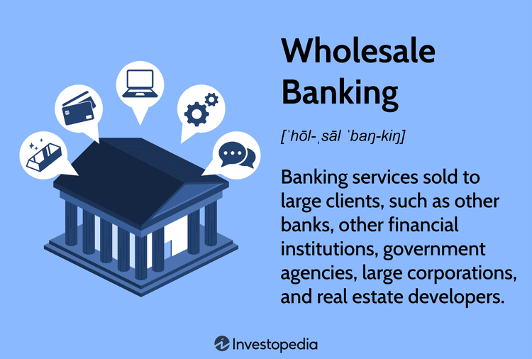

Financial risk management is a fundamental aspect of banking, particularly in the context of wholesale funding and algorithmic trading. These elements have become integral to modern banking operations, offering both opportunities and challenges to financial institutions.

Wholesale funding is a strategy employed by banks to raise capital from institutional investors or other financial institutions rather than relying solely on customer deposits. This approach enables banks to access large sums of money quickly, providing the liquidity needed to meet financial obligations and support various lending activities. However, wholesale funding comes with significant risks, especially in volatile market conditions. These risks include increased exposure to market fluctuations and the potential for higher funding costs, which can strain a bank's financial stability.



Algorithmic trading, on the other hand, has transformed trading operations across the financial markets. By utilizing computer algorithms to execute trades at high speeds and volumes, banks and other financial entities can achieve greater efficiency and liquidity. The algorithms, which are based on pre-defined criteria and complex models, enable rapid decision-making and transaction execution. Despite these advantages, algorithmic trading introduces its own set of risks. The speed and complexity of transactions can lead to market manipulation, increased volatility, and system failures, resulting in widespread financial disruptions.

This article aims to provide insights into how banks navigate these financial risks, strategically utilize wholesale funding, and integrate algorithmic trading within their operations. By understanding the interplay between these elements, financial institutions can better position themselves to manage potential risks while capitalizing on the opportunities presented by these innovative financial strategies.

## Table of Contents

## Understanding Financial Risk in Banking

Financial risk in banking is a critical concept that pertains to the potential for banks to incur losses due to various uncertainties inherent in the financial system. This risk manifests in multiple forms, primarily including credit risk, market risk, and liquidity risk. Each of these risk categories poses unique challenges and requires specific management strategies to ensure the stability and profitability of banking institutions.

Credit risk arises from the possibility that borrowers or counterparties will fail to meet their obligations according to agreed terms. This type of risk is typically managed through rigorous credit evaluation processes, portfolio diversification to spread potential losses across different assets, and the use of credit derivatives. Credit derivatives, such as credit default swaps (CDS), allow banks to transfer the credit exposure of fixed income products between parties, thereby mitigating potential defaults.

Market risk refers to the risk of losses in on- and off-balance sheet positions arising from movements in market prices. Banks face market risk through their trading activities, foreign exchange positions, and [interest rate](/wiki/interest-rate-trading-strategies) exposures. To manage market risk, banks employ hedging strategies, such as options and swaps, which can offset potential losses by securing prices or rates against adverse movements. Financial derivatives are critical tools in this domain, providing banks the ability to manage exposures across different market parameters.

Liquidity risk, on the other hand, involves the risk that a bank will be unable to meet its financial obligations as they come due without incurring unacceptable losses. This can occur due to an imbalance in cash inflows and outflows, or inability to liquidate assets quickly. Banks manage [liquidity](/wiki/liquidity-risk-premium) risk by maintaining ample high-quality liquid assets and employing maturity gap analysis to align the maturities of assets and liabilities.

Effective management of financial risk is vital for maintaining the financial stability of banks and protecting the interests of stakeholders such as depositors, investors, and regulators. A bank's risk management framework often incorporates advanced analytics and modeling techniques to predict and prepare for potential risks. Technologies such as [machine learning](/wiki/machine-learning) and [artificial intelligence](/wiki/ai-artificial-intelligence) are increasingly being used to enhance predictive models and provide real-time data analysis, improving a bank’s ability to respond to financial risks proactively.

A robust risk management strategy not only safeguards banks from potential financial disruptions but also optimizes their capital allocation, enabling them to operate efficiently in an often volatile and dynamic financial landscape. Thus, understanding and managing financial risk is essential not only for regulatory compliance but also for sustaining competitive advantage and ensuring long-term success in banking.

## The Role of Wholesale Funding in Banking

Wholesale funding constitutes a vital financial strategy for banks, allowing them to access capital markets rather than solely depending on core customer deposits. This approach enables banks to fulfill their liquidity requirements more flexibly, aligning their funding sources with broader financial strategies and objectives.

Wholesale funding typically involves raising funds from institutional investors or other financial entities. The instruments used in this process include federal funds, repurchase agreements, brokered deposits, and debt issuances. These tools provide banks with the scalability required to manage large-scale financial operations, thereby supporting expanded credit offerings and other banking services.

However, the reliance on wholesale funding also brings inherent risks. Unlike stable core deposits, wholesale funding can expose banks to market volatilities. Changes in interest rates and market conditions can lead to significant cost variations, making this a potentially expensive form of financing. Furthermore, the short-term nature of many wholesale funding instruments can lead to increased liquidity risk, especially during periods of financial instability.

For instance, brokered deposits, while offering a ready source of large funds, often come with fluctuating rates that reflect broader market conditions. This means that banks are at a higher risk of facing increased costs during economic downturns, when funding becomes scarcer and more expensive. Moreover, reliance on market-based funding can result in tighter conditions during financial crises, potentially leading to problems in capital adequacy and solvency.

Overall, while wholesale funding offers banks the opportunity to enhance their financial flexibility and scale operations efficiently, it also necessitates rigorous risk assessment and management strategies. Balancing the benefits of this funding approach with its potential pitfalls is essential for maintaining bank stability and ensuring ongoing operational success.

## Algorithmic Trading and its Impact

Algorithmic trading, often abbreviated as algo-trading, utilizes sophisticated computer programs to execute trades at high speeds and volumes. These trades are initiated according to pre-set criteria, using complex mathematical models. The automation of trading processes has significantly impacted the financial markets by enhancing efficiency and liquidity. By leveraging algorithms, traders can exploit minute price differences across various markets, conduct [arbitrage](/wiki/arbitrage), or adjust their portfolios almost instantaneously in response to market conditions.

The transformative impact of [algorithmic trading](/wiki/algorithmic-trading) extends across multiple dimensions. Primarily, the automation of trade execution reduces the time between decision-making and implementation. This increased speed is a crucial [factor](/wiki/factor-investing) in executing large volumes of trades that would be otherwise impractical for human traders. Furthermore, algorithmic trading contributes to improved market liquidity by providing continuous buy and sell signals, thus reducing bid-ask spreads and making markets more accessible for various participants.

Despite its advantages, algorithmic trading carries inherent risks. One such risk is market manipulation, where the speed and anonymity associated with automated trades can be exploited for unfair competitive advantage. Techniques like spoofing, where traders place false orders to manipulate stock prices for short-term gains, have become challenging to detect and regulate effectively. The high-frequency nature of algorithmic trading can also contribute to increased market [volatility](/wiki/volatility-trading-strategies), as algorithms may react simultaneously to market signals, leading to sudden price swings. 

System failures constitute another critical risk factor. The complexity of algorithms means that errors or bugs in trading programs can result in significant financial loss in a brief period. An example of such risk is the "flash crash" scenario, where swift and profound market price movements occur due to erroneous or unintended algorithmic trades. Additionally, the dependency on technology heightens the vulnerability to cybersecurity threats, where unauthorized access could disrupt trading operations or manipulate market data.

Regulatory frameworks and technological advancements endure as central mechanisms in mitigating these risks. Market regulators have implemented rules to detect and prevent manipulative activities, while ongoing advancements in technology, such as real-time monitoring and machine learning, aim to improve algorithmic systems' checks and balances. However, executing an algorithmic trading strategy remains a delicate balance of leveraging computational power while maintaining robust risk management practices.

## Interplay of Wholesale Funding and Algorithmic Trading in Risk Management

In modern banking, wholesale funding and algorithmic trading represent two pivotal elements that, when intertwined, can significantly elevate financial risk. The core idea in managing this interplay revolves around ensuring that returns from algorithmic trading consistently outweigh the borrowing costs associated with wholesale funding.

Wholesale funding involves banks borrowing from institutional entities or financial markets, which can offer significant scalability and flexibility. However, these sources often come with higher costs and are more sensitive to market volatility compared to traditional deposit-based funding. On the other hand, algorithmic trading employs sophisticated algorithms to execute trades at high speed and [volume](/wiki/volume-trading-strategy), potentially leading to substantial profits. However, it also introduces risks such as operational failures or erroneous trading activities, which could result in financial losses.

The challenge lies in maintaining a delicate balance where the cost of funds from wholesale markets is lower than the yields generated by trading activities. Mathematically, this can be represented as:

$$
\text{Net Profit} = \text{Trading Yield} - \text{Cost of Wholesale Funding}
$$

Where:
- $\text{Trading Yield}$ is the return generated by algorithmic trading.
- $\text{Cost of Wholesale Funding}$ refers to the interest and associated costs of borrowing from wholesale markets.

Banks must ensure effective risk management practices to maintain this balance. It involves not only monitoring the market conditions to optimize funding costs but also integrating robust algorithms to maximize trading efficiency and profits. The use of quantitative techniques such as Value at Risk (VaR) and stress testing can aid in evaluating the potential impact of market fluctuations on the funding costs and trading performance.

Moreover, aligning these activities with the institution's overall risk appetite is crucial. Banks should establish well-defined risk limits and continuously monitor their compliance to avoid excessive risk exposure. The introduction of stringent internal controls and regular audits can help detect anomalies early and mitigate potential risks.

Ultimately, the successful integration of wholesale funding and algorithmic trading within a bank's risk management framework is contingent on the deployment of advanced technologies and strategic oversight. By leveraging real-time data analytics and machine learning, banks can refine their predictive models to enhance decision-making processes, ensuring that they remain nimble in the face of dynamic financial markets.

## Mitigating the Risks Involved

Mitigating risks in banking, particularly those associated with wholesale funding and algorithmic trading, necessitates a comprehensive approach integrating robust risk management frameworks. Banks must implement strategies like stress testing, scenario analysis, and continuous risk monitoring to identify, assess, and address potential vulnerabilities.

**Stress Testing and Scenario Analysis**

Stress testing is a critical component of risk management whereby banks simulate adverse financial scenarios to evaluate the resilience of their operations. This process helps in understanding how extreme conditions might impact their capital and liquidity positions. Scenario analysis complements stress testing by considering a broader range of potential future events, including low-probability but high-impact scenarios.

For example, a bank might model the effects of sudden interest rate hikes or market corrections on its portfolio. By identifying potential weaknesses through this comprehensive testing, banks can develop contingency plans and strengthen their risk buffers.

**Regulatory Frameworks: Basel III**

The Basel III framework, established by the Basel Committee on Banking Supervision, plays a pivotal role in bolstering financial stability. By introducing rigorous capital and liquidity standards, Basel III aims to reduce systemic risks in the banking sector. Key components of Basel III include:

- **Capital Requirements**: Banks are required to maintain a higher minimum capital ratio, improving their ability to absorb losses.
$$
  \text{Capital Adequacy Ratio (CAR)} = \frac{\text{Tier 1 Capital} + \text{Tier 2 Capital}}{\text{Risk-Weighted Assets}} \geq 12\%

$$

- **Liquidity Measures**: The Liquidity Coverage Ratio (LCR) and Net Stable Funding Ratio (NSFR) ensure that banks possess a sufficient buffer of high-quality liquid assets to survive short-term liquidity disruptions and maintain a stable funding profile over the longer term.

These regulations compel banks to maintain stronger financial health, thus enhancing their capacity to withstand financial shocks.

**Technological Advancements**

Technology, particularly advancements in artificial intelligence (AI) and machine learning (ML), offers powerful tools for risk mitigation. These technologies enable banks to perform sophisticated risk assessments and real-time data analysis, enhancing their ability to predict and respond to emerging threats.

AI and ML algorithms can process vast amounts of data to identify patterns and anomalies indicative of potential risks. For instance, ML models can be trained to detect unusual trading activities or deviations in market behavior, allowing for timely intervention.

Python, a popular programming language, equips financial institutions with robust libraries for risk modeling. Below is an example of simple linear regression in Python, used to predict market risks based on historical data:

```python
import numpy as np
from sklearn.linear_model import LinearRegression

# Example data
market_data = np.array([[1, 2], [2, 3], [3, 4], [4, 5]])  # Format: [feature, target]
X = market_data[:, 0].reshape(-1, 1)  # Features
y = market_data[:, 1]  # Target

# Linear regression model
model = LinearRegression()
model.fit(X, y)

# Predicting market risk
predicted_risks = model.predict(np.array([[5], [6]]))
print(predicted_risks)
```

In conclusion, effective risk mitigation in banking requires a multi-faceted approach combining strategic regulatory adherence, advanced technological integration, and rigorous risk management practices. These measures collectively help sustain financial system stability and safeguard institutions against potential market volatilities.

## Conclusion

Effectively managing financial risk within banking, especially concerning wholesale funding and algorithmic trading, involves striking a strategic balance between risk and reward. This requires banks to continuously evolve and innovate their risk management practices to keep pace with ever-changing financial landscapes. As financial innovations grow in complexity, it becomes imperative for banks to adopt a proactive approach to identify and mitigate potential risks, ensuring the protection of their financial stability.

Banks must develop adaptable risk management frameworks that account for both traditional and emerging risks. Such frameworks might incorporate advanced technologies, including artificial intelligence and machine learning, to enhance predictive capabilities and enable real-time risk assessment. By doing so, banks not only bolster their defenses against unexpected financial disruptions but also enhance decision-making processes, which can lead to improved operational efficiency and profitability.

The dynamic nature of wholesale funding and algorithmic trading necessitates stringent monitoring and control mechanisms. Constant vigilance is required to ensure that these tools do not inadvertently introduce vulnerabilities into the financial system. Additionally, compliance with regulatory standards, such as those imposed by Basel III, is crucial in maintaining robust capital reserves and liquidity coverage, further fortifying banks against systemic risks.

In conclusion, a proactive and innovative approach to risk management serves as a fundamental pillar for banks, not only to prevent potential financial crises but also to maintain long-term profitability and operational resilience. By continuously refining their strategies and utilizing cutting-edge technology, banks can navigate the complexities of modern financial systems with greater confidence and stability.

## References & Further Reading

[1]: Adrian, T., & Shin, H. S. (2010). ["Liquidity and Leverage."](https://www.sciencedirect.com/science/article/abs/pii/S1042957308000764) Journal of Financial Intermediation, 19(3), 418-437.

[2]: Brunnermeier, M. K., & Pedersen, L. H. (2009). ["Market Liquidity and Funding Liquidity."](https://www.princeton.edu/~markus/research/papers/liquidity.pdf) The Review of Financial Studies, 22(6), 2201-2238.

[3]: Aldridge, I. (2013). ["High-Frequency Trading: A Practical Guide to Algorithmic Strategies and Trading Systems."](https://www.wiley.com/en-us/High+Frequency+Trading%3A+A+Practical+Guide+to+Algorithmic+Strategies+and+Trading+Systems%2C+2nd+Edition-p-9781118343500) Wiley Trading.

[4]: Hull, J. (2018). ["Risk Management and Financial Institutions"](https://books.google.com/books/about/Risk_Management_and_Financial_Institutio.html?id=1J1QDwAAQBAJ) (5th ed.). Wiley.

[5]: Duffie, D. (2010). ["The Failure Mechanics of Dealer Banks."](https://www.darrellduffie.com/uploads/1/4/8/0/148007615/duffiefailuremechanicsdealerbanks2010__1_.pdf) Journal of Economic Perspectives, 24(1), 51-72.

[6]: Basel Committee on Banking Supervision. (2011). ["Basel III: A global regulatory framework for more resilient banks and banking systems."](https://www.bis.org/publ/bcbs189.htm) Bank for International Settlements.

[7]: Bundesbank, Deutsche. (2013). ["The ESRB's liquidity and funding risk task force: an interim report on the channels through which national banking sectors might be affected by a potential dislocation of asset and funding markets."](https://www.bundesbank.de/resource/blob/810480/471beb9bef2e2a7fc3edf04e340b9b62/mL/0-wechselkursstatistik-data.pdf) Discussion Paper Series.